# خواننده تلگرام

<!-- TOP_NAV START -->

<a href="https://github.com/saeidSE/aio-downloader/blob/main/telegram/content/archive_1.md" style="display:inline-block; padding:6px 12px; margin:0 4px; background-color:#2ea44f; color:white; text-decoration:none; border-radius:4px; font-weight:bold;">صفحه بعد</a>

<!-- TOP_NAV END -->

<!-- MSG START -->

---
📅 بروزرسانی: 1405/02/28 09:47
---

## VahidOOnLine — post 240742

  

♦️ خاویر باردم، هنرپیشه اسپانیایی هوادار فلسطینیان در حاشیه جشنوار کن در پاسخ به خبرنگاران که از او درباره زیر سوال بردن مردانگی و نمایش خانواده‌ها بدون پدر در فیلم‌های به نمایش درآمده در جشنواره امسال سوال کردند گفت که خشونت علیه زنان نتیجه «مردانگی مسموم» است. او همچنین مدعی شد که رفتار دونالد ترامپ، رئیس‌جمهوری آمریکا، ولادیمیر پوتین، رئیس‌جمهوری روسیه و بنیامین نتانیاهو، نخست‌وزیر اسرائیل پیش از حد مردانه یا به تعبیر او دچار «رفتار مسموم مردانه» است.
‌🇸🇦 Indypersian

🤖 @VahidOOnLine

## VahidOOnLine — post 240741

♦️ پلیس ازبکستان روز یکشنبه ۲۷ اردیبهشت از کشف نزدیک به نیم تن مواد مخدر در مرز این کشور با افغانستان خبر داد.

براساس گزارش پلیس مرزی ازبکستان، این محموله شامل ۵۹۳ کیلوگرم حشیش و سه کیلوگرم تریاک به‌شکل ماهرانه‌ای در یک بیل مکانیکی که در یک تریکی در حال عبور از مرز افغانستان بود، کشف و ضبط شد.

به گفته مقام‌های مرزبانی و اداره گمرک ازبکستان، ماموران امنیتی در زمان بازرسی محموله تریلی، به تجهیزات «غیرضروری» این ابزار سنگین مشکوک شدند و پس از آن با استفاده از بازرسی با اشعه ایکس، توانستند بسته‌های جاسازی شده مواد مخدر در بدنه آن را کشف کنند.

این خبر در حالی منتشر می‌شود که از زمان بازگشت طالبان به قدرت در افغانستان، کشت خشخاش و تولید مواد مخدر در این کشور به‌شدت کاهش یافته است.
‌🇸🇦 Indypersian

🤖 @VahidOOnLine

## VahidOOnLine — post 240740

  <a href="telegram/content/VahidOOnLine_240740_1779085021.mp4" target="_blank">🎬 Download video</a>

‌🏁 🇬🇧 ManotoTV

🤖 @VahidOOnLine

## VahidOOnLine — post 240739

  <a href="telegram/content/VahidOOnLine_240739_1779085021.mp4" target="_blank">🎬 Download video</a>

دونالد ترامپ تصویری بدون توضیح در شبکه اجتماعی خود منتشر کرده است که در آن، پرچم آمریکا سراسر خاورمیانه و کشورهای اطراف ایران را پوشانده و پیکان‌هایی به‌سوی داخل ایران کشیده شده‌اند.

ترامپ ساعاتی پیش از انتشار این تصویر گفته بود که زمان برای ایران رو به پایان است.
‌🏁 🇬🇧 ManotoTV

🤖 @VahidOOnLine

## VahidOOnLine — post 240738

  

ناصر عتباتی، رییس کل دادگستری آذربایجان غربی، از توقیف اموال ۱۲۹ نفر در این استان به اتهام «اقدامات ضدامنیتی و همکاری با کشورهای متخاصم» خبر داد. او تاکید کرد قوه قضاییه به این روند توقیف اموال «با قدرت» ادامه خواهد داد.
‌🏁 🇬🇧 IranintlTV

🤖 @VahidOOnLine

## VahidOOnLine — post 240737

  

محسن رضایی، مشاور نظامی مجتبی خامنه‌ای، گفت: «آمریکا پس از شکست سختی که از جمهوری اسلامی خورد، در حال سقوط است.» او به ارتش ایالات‌متحده هشدار داد: «قبل از اینکه دریای عمان به گورستانی برای ناوهای شما تبدیل شود، خودتان عقب بکشید.»
محسن رضایی گفت: «یکی از سه ناو آمریکایی که از دریای عمان وارد خلیج فارس شده بود، با موشک‌های ما آسیب دید، اما آمریکا صدایش را درنمی‌آورد.»
او تاکید کرد: تنگه هرمز برای تجارت باز است، اما برای لشکرکشی و ناامنی بسته خواهد بود.

‌🏁 🇬🇧 IranintlTV

🤖 @VahidOOnLine

## VahidOOnLine — post 240736

♦️خبرگزاری رویترز بامداد دوشنبه ۲۸ اردیبهشت با انتشار ویدیویی گزارش داد یک هواپیمای آب‌نشین متعلق به دوران جنگ جهانی دوم پس از بروز نقص فنی، در یکی از خیابان‌های شهر فینیکس در ایالت آریزونا فرود اضطراری انجام داد.
این ویدیو که با دوربین نصب‌شده روی بال هواپیما ضبط شده، لحظه کاهش ارتفاع و فرود سخت هواپیما را نشان می‌دهد. بر اساس این گزارش، پس از شنیده شدن صدایی از موتور، دود وارد کابین خلبان شد و خلبان پس از جست‌وجو برای یافتن محل مناسب، یک خیابان خلوت را برای فرود انتخاب کرد.
رویترز گزارش داد هر سه سرنشین هواپیما سالم نجات پیدا کردند و تحقیقات هیئت ملی ایمنی حمل‌ونقل آمریکا درباره علت حادثه ادامه دارد.
‌🇸🇦 Indypersian

🤖 @VahidOOnLine

## VahidOOnLine — post 240735

  

♦️به گزارش العربیه، کشورهای حوزه خلیج فارس درنظر دارند پیش‌نویس یک قطعنامه‌ درباره آزادی کشتیرانی در تنگه هرمز و حفاظت از گذرگاه‌های آبی بین‌المللی را بار دیگر به شورای امنیت ارائه کنند و روسیه و چین را متقاعد کنند از حق «وتو» استفاده نکرده و پیشنهاد تصویب شود. این پیش‌نویس از ایران می‌خواهد حمله به کشتی‌ها را متوقف کند. عبدالعزیز العویشق، معاون دبیرکل شورای همکاری خلیج فارس در امور سیاسی و مذاکرات به العربیه گفت: «ایران با استفاده از تنگه هرمز به‌عنوان ابزار فشار در مذاکرات با آمریکا اشتباه بزرگی مرتکب شد، چرا که این اقدام ناقض قوانین بین‌المللی است.» او افزود: «کشورهای حوزه خلیج فارس پیش از جنگ ارتباطات خود را با ایران حفظ کرده بودند و امیدوار بودیم پایه‌ای جدید برای روابط شکل بگیرد، اما حملات ایران علیه کشورهای خلیج فارس، که چند برابر عملیاتش علیه اسرائیل بود، باعث شده تهران در پی نقض تفاهم‌ها اکنون با بار سنگینی برای بازسازی پل اعتمادروبه‌رو شود.» العویشق همزمان ابراز امیدواری کرد در آینده توافقی با ایران حاصل شود که برنامه هسته‌ای، موشک‌های بالستیک و دخالت‌های منطقه‌ای ایران را در بر بگیرد. او گفت: «جغرافیا ما را ناگزیر می‌کند که چه بخواهیم چه نخواهیم، با ایران تعامل داشته باشیم.» به نوشته العربیه، حملات ایران علیه کشورهای خلیج فارس و بستن تنگه هرمز تغییر قابل توجهی در چارچوب همکاری مشترک این کشورها ایجاد کرده است. کشورهای شورای همکاری اکنون تلاش‌های مشترک خود را برای تقویت همگرایی اقتصادی و توسعه‌ای، گسترش گزینه‌های دفاعی در چارچوب تقویت فرماندهی نظامی مشترک، تقویت توافق دفاع مشترک، ارتقای سطح امنیتی و اطلاعاتی و ادامه فعالیت برای دستیابی به سامانه دفاع هوایی مشترک افزایش داده‌اند. این کشورها همچنین در نظر دارند یک سامانه هشدار زودهنگام برای مقابله با تهدیدها ایجاد کنند.
‌🇸🇦 Indypersian

🤖 @VahidOOnLine

## VahidOOnLine — post 240734

  

مارک کارنی، نخست‌وزیر کانادا، در ایکس نوشت کشورش در همراهی با آژانس بین‌المللی انرژی اتمی حمله‌های پهپادی به نیروگاه هسته‌ای براکه در امارات متحده عربی را محکوم می‌کند و در کنار دوستان خود در امارات متحده عربی می‌ایستد.
کارنی با هشدار درباره اینکه هدف قرار دادن تاسیسات هسته‌ای صلح‌آمیز خطرات جدی برای جان انسان‌ها و محیط زیست به همراه دارد، بر ضرورت فوری خویشتنداری و کاهش تنش در منطقه تاکید کرد.

‌🏁 🇬🇧 IranintlTV

🤖 @VahidOOnLine

## VahidOOnLine — post 240733

♦️اردلان الیاسین‌فر، که در برنامه «به وقت ایران» صداوسیما به‌عنوان «پژوهشگر حوزه تکنولوژی و هوش مصنوعی» معرفی شده است، یکشنبه‌شب ۲۷ اردیبهشت‌ماه از ایجاد اختلال و بحران در مدار پایینی زمین به‌عنوان راهی برای مقابله با آمریکا و آسیب به ماهواره‌هایی مانند استارلینک سخن گفت.

او مدعی شد آمریکا با در اختیار داشتن ماهواره‌های مستقر در مدار LEO، امکان «اقدام پیش‌دستانه» و رصد تحرکات در نقاط مختلف جهان را دارد و افزود ایجاد بحران و زباله‌های فضایی در این مدار می‌تواند به ماهواره‌های مستقر در آن آسیب وارد کند.

در این برنامه، مجری نیز احتمال هدف قرار گرفتن ماهواره‌های مرتبط با جنگ را مطرح کرد و الیاسین‌فر گفت وقوع یک بحران در مدار پایین زمین می‌تواند زنجیره‌ای از مشکلات و اختلال‌های فضایی ایجاد کند.
‌🇸🇦 Indypersian

🤖 @VahidOOnLine

## VahidOOnLine — post 240732

  <a href="telegram/content/VahidOOnLine_240732_1779085024.mp4" target="_blank">🎬 Download video</a>

♦️به دنبال برگزاری دادگاه برای صادق ساعدی‌نیا، مدیر کافه‌های زنجیره‌ای ساعدی‌نیا که در جریان انقلاب ملی در کنار مردم ایران ایستاد، دادستان فهرستی از اتهامات ادعایی برای او را قرائت کرد که در آن «تعطیل کردن کافه‌های خودش» هم یک جرم عنوان شده است. حکومت ایران همه اموال ساعدی‌نیا را نیز توقیف کرده است.
‌🇸🇦 Indypersian

🤖 @VahidOOnLine

---
📅 بروزرسانی: 1405/02/28 05:23
---

## VahidOOnLine — post 240731

  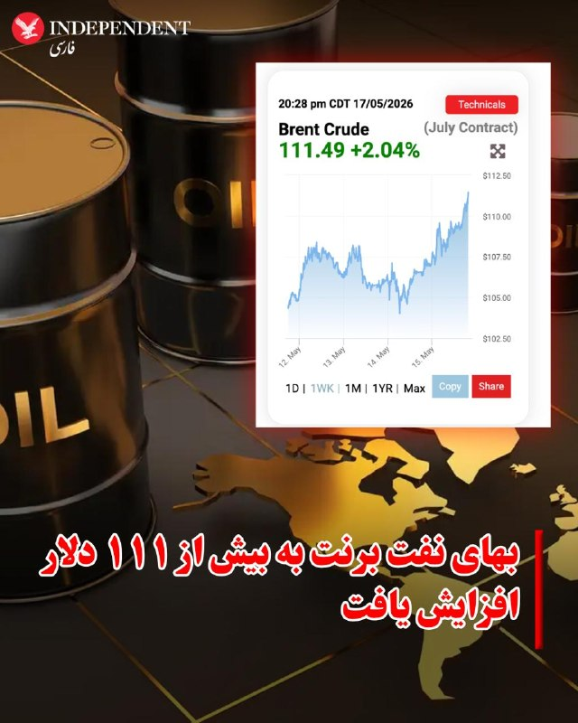

♦️بامداد دوشنبه، همزمان با بازگشایی بازارها و ساعاتی پس از گزارش رهگیری حمله پهپادی بر فراز عربستان سعودی، بهای هر بشکه نفت برنت با حدود یک دلار افزایش به ۱۱۱ دلار و ۴۹ سنت رسید. بهای نفت آمریکا (وست تگزاس) نیز با ۱ دلار و ۲۲ سنت به ۱۰۶ دلار و ۶۴ سنت رسیده است.
‌🇸🇦 Indypersian

🤖 @VahidOOnLine

## VahidOOnLine — post 240730

  

آنیتا آناند، ‌وزیر خارجه کانادا، اقدام جمهوری اسلامی در هدف قرار دادن تاسیسات انرژی هسته‌ای صلح‌آمیز را غیرقابل قبول دانست و بر همبستگی کشورش با امارات متحده عربی در ارتباط با حملات پهپادی به نیروگاه هسته‌ای براکه در این کشور تاکید کرد.
او نوشت: «قطعنامه‌های آژانس بین‌المللی انرژی اتمی و قوانین بین‌المللی هر دو تاکید می‌کنند که هدف قرار دادن تأسیسات انرژی هسته‌ای صلح‌آمیز غیرقابل قبول است.»
آناند اشاره کرد که در تماس با همتای خود در امارات متحده عربی حمایت کامل خود را از این کشور ابراز داشته است، و نوشت: «کانادا از تحقیقات کامل در مورد این حملات حمایت می‌کند و از جامعه بین‌المللی می‌خواهد که آنها را به طور مشابه محکوم کند.»

‌🏁 🇬🇧 IranintlTV

🤖 @VahidOOnLine

## VahidOOnLine — post 240729

  

قیمت نفت برنت در آغاز معاملات روز دوشنبه با ۱.۲ درصد افزایش به ۱۱۰.۶۳ دلار در هر بشکه و قیمت نفت خام آمریکا با یک درصد افزایش به ۱۰۶.۴۲ دلار در هر بشکه رسید. به گزارش رویترز حملات پهپادی جدید در خلیج فارس، قیمت نفت و بازدهی اوراق قرضه را افزایش داد.
رویترز با اشاره به حملات پهپادی به امارات متحده عربی و عربستان سعودی همراه با هشدار رییس‌جمهوری آمریکا به جمهوری اسلامی و مسدود ماندن تنگه هرمز نوشت تحلیلگران کپیتال اکونومیکس هشدار دادند: «ادامه مسدود ماندن تنگه هرمز به سرعت به تحلیل رفتن ذخایر جهانی نفت منجر خواهد شد. وضعیت ذخایر می‌تواند تا پایان ژوئن سال جاری به سطح بحرانی برسد و زمینه‌ساز افزایش قیمت برنت به ۱۳۰ تا ۱۴۰ دلار در هر بشکه، اگر نه بیشتر، شود.»

‌🏁 🇬🇧 IranintlTV

🤖 @VahidOOnLine

## VahidOOnLine — post 240728

  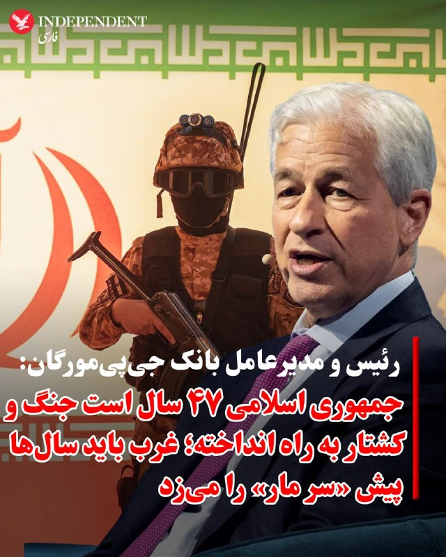

♦️جیمی دایمن، رئیس و مدیرعامل بانک جی‌پی‌مورگان چیس، در گفتگو با فرانسین لاکوا در برنامه «بلومبرگ اوپن اینترست» با اشاره به جنگ آمریکا و اسرائیل با جمهوری اسلامی گفت از شنیدن این ادعا که تهران تهدید فوری نبوده، خشمگین می‌شود.

دایمن گفت: «آن‌ها ۴۷ سال است که تجاوز، کشتار و قتل انجام می‌دهند.» او افزود جهان غرب نباید اجازه می‌داد جنگ‌های نیابتی ادامه پیدا کند و «باید سال‌ها پیش سر مار را می‌زد.»

رئیس جی‌پی‌مورگان با اشاره به ادامه بحران خاورمیانه گفت اکنون ریسک بیشتری وجود دارد، اما شاید فرصت بیشتری هم برای صلح ایجاد شده باشد، زیرا «مردم خواهان صلح هستند.»
‌🇸🇦 Indypersian

🤖 @VahidOOnLine

## VahidOOnLine — post 240727

  

اسماعیل کوثری، عضو کمیسیون امنیت ملی و سیاست خارجی مجلس، گفت: «اگر امارات متحده عربی به همکاری با آمریکا و اسرائیل علیه ما ادامه دهد، با شدت بیشتری با آنها برخورد خواهیم کرد.»
کوثری اضافه کرد: «امارات متحده عربی به خودی خود عددی نیست و تنها به پشتوانه آمریکا و اسرائیل توانسته است توطئه‌هایی را علیه جمهوری اسلامی رقم بزند.»
عضو کمیسیون امنیت ملی و سیاست خارجی مجلس گفت: «این‌ها همسایگان ما هستند، همیشه رعایت حال آن‌ها را کرده‌ایم و می‌خواهیم آن‌ها را از دامن اسرائیل نجات دهیم.»

‌🏁 🇬🇧 IranintlTV

🤖 @VahidOOnLine

## VahidOOnLine — post 240726

  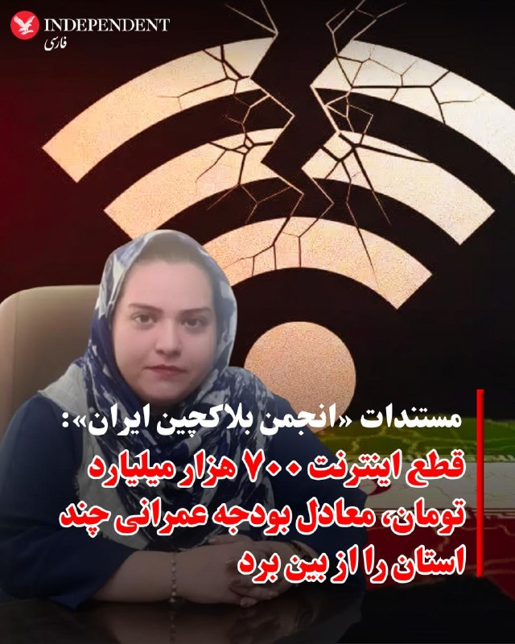

♦️سایت آوش در گفتگو با مهکامه شریف‌زاده، رئیس هیات مدیره «انجمن بلاکچین ایران» گزارش داده است که خسارت قطع اینترنت خطی نیست و صعودی است و با این وضعیت راه‌‌سودجویی و کلاهبرداری از تجارت‌ها هم هموار‌تر شده است. به گزارش آوش، مستندات انجمن بلاکچین ایران فاش می‌کند که چگونه رقمی نزدیک به ۷۰۰ هزار میلیارد تومان سرمایه ملی در غبار اختلالات سیستماتیک ناپدید شد. آوش می‌نویسد، در حالی که جهان بر لبه خیره‌کننده انقلاب هوش مصنوعی، وب ۳ و اقتصادهای غیرمتمرکز ایستاده است، اقتصاد دیجیتال ایران تاریک‌ترین دوران خود را سپری می‌کند.طبق برآوردهای کارشناسی در طی ۷۴ روز اختلال کمرشکن و قطعی‌های پراکنده اما هدفمند، رقمی معادل بودجه عمرانی چندین استان بزرگ کشور به سادگی دود شده و به هوا رفته است.خسارت ۷۰۰ هزار میلیارد تومانی تنها یک عدد نیست؛ این عدد یعنی نابودی فرصت‌های شغلی برای بیش از ۲ میلیون جوان متخصص که در حوزه‌های برنامه‌نویسی، بازاریابی دیجیتال و بلاکچین فعالیت می‌کردند. گزارش انجمن بلاکچین به صراحت بیان می‌کند که اینترنت یک اکوسیستم زنده است و یک لوله‌کشی خصوصی نیست. نمی‌توان به فروشنده و تولیدکننده اینترنت با پهنای باند آزاد داد، اما خریدار و مصرف‌کننده را در پشت سد فیلترینگ و کندی عمدی نگه داشت.گزارش نشان می‌دهد که گردش مالی بازار سیاه وی‌پی‌ان (فیلترشکن) در سال ۱۴۰۵ به ارقام نجومی رسیده و بودجه خانواده‌های ایرانی به جای صرف شدن در آموزش، سلامت یا کالاهای اساسی به جیب سوداگرانی می‌رود که فیلترشکن‌های بی‌کیفیت و ناامن می‌فروشند.استفاده همگانی از فیلترشکن‌ها امنیت ملی داده‌ها را به صفر رسانده است. وقتی میلیون‌ها کاربر از درگاه‌های غیررسمی برای دور زدن محدودیت‌ها استفاده می‌کنند، عملا تمام داده‌های حساس بانکی و شخصی خود را در معرض شنود و سرقت قرار می‌دهند. گزارش تاب‌آوری هشدار می‌دهد که این وضعیت، ایران را به بهشت هکرها و کلاهبرداران اینترنتی تبدیل کرده است. این گزارش هشدار می‌دهد که در صورت ادامه روند فعلی، با تبدیل شدن ایران به یک جزیره دیجیتال متروکه و قطع کامل پیوند با اقتصاد جهانی، اقتصاد دیجیتال به یک فعالیت زیرزمینی و غیررسمی تبدیل خواهد شد. این گزارش همچنین می‌گوید که حتی اگر اصلاحات قطره‌چکانی برای باز کردن مقعطی برخی پلتفرم‌ها برای فرونشاندن خشم عمومی انجام شود هم، بدون تغییر در زیرساخت‌های قانونی، فقط زوال به تاخیر می‌اندازد.
‌🇸🇦 Indypersian

🤖 @VahidOOnLine

## VahidOOnLine — post 240725

  

♦️به گزارش سایت فوتبالی، طبق قانون، فیفا به ازای هر بازیکنی که نامش در فهرست نهایی جام جهانی باشد، به باشگاهش مبلغی می‌پردازد. این در حالی است که باشگاه‌های بزرگ فوتبال ایران عمدتا در اختیار نهادهای حکومتی، شبه‌دولتی یا شرکت‌های وابسته به حکومت و سپاه هستند.
براساس این گزارش، البته هنوز فهرست تیم ملی ایران نهایی نشده و با خط خوردن چند بازیکن دیگر، درآمد باشگاه‌های آنها کمتر خواهد شد اما با در نظر گرفتن فهرست فعلی، می‌توان علی الحساب درآمد باشگاه‌ها را محاسبه کرد. با اعلام فیفا، این نهاد از یک هفته مانده به شروع جام جهانی، یعنی از ۱۵ خرداد، برای هر بازیکنی که نامش در فهرست نهایی تیم ملی کشورش قرار بگیرد، به ازای هر روز ۱۱ هزار دلار در نظر می‌گیرد.
به گزارش سایت فوتبالی: با این فرض محتمل که تیم ایران از گروه خود صعود نخواهد کرد، حضور این تیم در جام جانی در تاریخ ۶ تیر به پایان خواهد رسید. و هر یک از بازیکنان در این ۲۳ روز ۲۵۳ هزار دلار درآمد خواهند داشت.
فوتبالی می‌افزاید: در حال حاضر پرسپولیس تحت مالکیت شرکت فولاد مبارکه اصفهان که روابط نزدیکی با سپاه دارد، با پیام نیازمند، حسین کنعانی، میلاد محمدی، امیرحسین محمودی و علی علیپور پنج بازیکن در اردوی تیم دارد و با این بازیکنان، در پایان مرحله گروهی جام جهانی یک میلیون و ۲۵۰ هزار دلار درآمد خواهد داشت. از سوی دیگر اوستون اورونوف، الکسیس گندوز و ایگور سرگیف هم با حضور در فهرست تیم‌های ملی ازبکستان و الجزایر، می‌توانند تقریبا ۷۶۰ هزار دلار دیگر برای پرسپولیس درآمدزایی کنند که به این ترتیب درآمد پرسپولیس در پایان مرحله گروهی جام جهانی به حدود دو میلیون دلار خواهد رسید.
فوتبالی درباره باشگاه استقلال که تحت مالکیت «هلدینگ خلیج فارس» است که به دلیل روابط با سپاه پاسداران در فهرست تحریم‌های آمریکا قرار دارد، می‌نویسد: این تیم صالح حردانی، روزبه چشمی و امیرمحمد رزاقی‌نیا را در فهرست تیم ملی دارد اما داکنز نازون در فهرست تیم ملی هائیتی و رستم آشورماتوف و جلال‌الدین ماشاریپوف در فهرست تیم ملی ازبکستان هم هستند که تعداد ملی‌پوشان این تیم را به عدد شش می‌رسانند. با این حساب، استقلال در پایان مرحله گروهی جام جهانی بیشتر از یک و نیم میلیون دلار درآمد خواهد داشت.
تراکتور با چهار بازیکن ایرانی به نام‌های علیرضا بیرانوند، شجاع خلیل‌زاده، امیرحسین حسین‌زاده و مهدی ترابی و اودیل خامکروبکوف را در تیم ملی ازبکستان دارد. مجموع درآمد این پنج بازیکن برای تراکتور تا پایان مرحله گروهی حدود یک میلیون و ۲۵۰ هزار دلار خواهد بود.
سپاهان اصفهان در تیم ملی سیدحسین حسین‌زاده، احسان حاج‌صفی، امید نورافکن و آریا یوسفی را دارد که این تیم را صاحب درآمدی حدود یک میلیون دلاری خواهد کرد.
‌🇸🇦 Indypersian

🤖 @VahidOOnLine

## VahidOOnLine — post 240716

تاریخ ایران، فقط از جنگ‌ها و حکومت‌ها نوشته نشده؛
از خانه‌هایی هم ساخته شده که ناگهان عزادار شدند، از مادرانی که در سردخانه‌ها دنبال نشانی فرزندشان گشتند و از جوانانی که میان رویاهای ساده زندگی، با گلوله متوقف شدند.<
جاویدنامان انقلاب ملی ایرانیان:
مرتضی جهانبخش ورانلو، پوریا پرمون کلاردهی، محمدفواد صفائی، حسین رادی، هنگامه آرا، متین قربانی، محمدحسین فتح‌الله‌زاده رازلیقی و محمدامین خلاصه شعار.<
نام‌هایی که هرکدام بخشی از زخمی هستند که بر حافظه این سرزمین مانده؛ زخمی به بلندای تاریخ ایران.<
#جاویدنامان_انقلاب_ملی_ایرانیان
‌🏁 🇬🇧 IranintlTV

🤖 @VahidOOnLine

## VahidOOnLine — post 240715

  <a href="telegram/content/VahidOOnLine_240715_1779069199.mp4" target="_blank">🎬 Download video</a>

♦️در پی واژگون شدن اتوبوس حامل کارکنان مجتمع گاز پارس جنوبی صبح یکشنبه ۲۷ اردیبهشت‌ماه در جاده عسلویه ـ سیراف، شش نفر کشته و ۲۰ نفر دیگر مجروح شدند. ابراهیم عباسی، سخنگوی مجتمع گاز پارس جنوبی، به ایسنا گفت این اتوبوس در حال سفر به کرمانشاه بوده که دچار سانحه و واژگون شده است.

سخنگوی مجتمع گاز پارس جنوبی اعلام کرد آمار قربانیان و مجروحان قطعی است و حال یکی از مصدومان وخیم گزارش شده است.
‌🇸🇦 Indypersian

🤖 @VahidOOnLine

## VahidOOnLine — post 240714

  

♦️مارکو روبیو، وزیر خارجه آمریکا در مصاحبه با ان‌بی‌سی در پاسخ به مجری که از او درباره بازگشت «پروژه آزادی» (هدایت امن کشتی‌ها از تنگه هرمز از سوی ارتش آمریکا) و از سرگیری کارزار نظامی پرسید گفت: «ما پروژه آزادی را به درخواست پاکستان متوقف کردیم.» روبیو افزود: پاکستان به ما گفت اگر پروژه آزادی را متوقف کنید، ما فکر می‌کنیم که می‌توانیم به توافق برسیم.» او گفت که ما پذیرفتیم و رئیس‌جمهور هم دیپلماسی را ترجیح می‌دهد. با این حال روبیو گفت ما در حال خارج کردن ناوشکن‌ها از تنگه هرمز بودیم که دیدید رژیم ایران آنها را هدف قرار داد.
‌🇸🇦 Indypersian

🤖 @VahidOOnLine

## VahidOOnLine — post 240713

  

♦️بنیامین نتانیاهو، نخست‌وزیر اسرائیل، شامگاه یکشنبه با دونالد ترامپ، رئیس‌جمهوری آمریکا، گفت‌وگو کرد؛ همزمان گزارش‌هایی منتشر شده که احتمال دارد درگیری با جمهوری اسلامی طی هفته جاری از سر گرفته شود. یک مقام اسرائیلی به «وای‌نت» گفت مسئله حمله به مواضع رژیم ایران همچنان حل‌نشده باقی مانده و رئیس‌جمهوری آمریکا هنوز باید تصمیم نهایی را بگیرد.
این مقام افزود: «او باید شخصا با این تصمیم به جمع‌بندی برسد و اگر تصمیم به ازسرگیری درگیری بگیرد، احتمالا از اسرائیل خواسته خواهد شد که مشارکت کند.»
فاکس‌نیوز پیش‌تر در روز یکشنبه گزارش داده بود که «احتمال ازسرگیری درگیری با ایران در حال افزایش است؛ موضوعی که ناشی از ناامیدی ترامپ از تاکتیک‌های ایران و امتناع تهران از پذیرش خواسته او برای کنار گذاشتن جاه‌طلبی‌های هسته‌ای است.»
بر اساس گفته مقام‌های اطلاعاتی فعال در خاورمیانه که با این شبکه گفت‌وگو کردند، «ارزیابی غالب در ایران این است که ترامپ ممکن است بار دیگر به اقدام نظامی روی آورد و تهران اکنون عمدا راهبردی مبتنی بر فریب و تعلل را دنبال می‌کند تا با خرید زمان، هرگونه بازگشت احتمالی به درگیری را پیچیده‌تر کند.»
این مقام‌های اطلاعاتی گفتند به باور آن‌ها، حکومت ایران تصور می‌کند می‌تواند روند تحولات را کند کرده و بحران را دست‌کم دو هفته دیگر طولانی کند؛ اقدامی که از نظر سیاسی و عملیاتی، ازسرگیری کارزار نظامی را برای ترامپ دشوارتر خواهد کرد.
ترامپ روز شنبه تصویری تولیدشده با هوش مصنوعی را در شبکه اجتماعی «تروث سوشال» منتشر کرد که زیر آن نوشته شده بود: «آرامش پیش از طوفان.» این پست پس از آن منتشر شد که روزنامه نیویورک‌تایمز گزارش داد آمریکا و اسرائیل از زمان توافق آتش‌بس در ماه گذشته تاکنون، شدیدترین سطح آماده‌سازی خود را برای ازسرگیری حملات علیه رژیم ایران آغاز کرده‌اند.
بر اساس این گزارش، مشاوران ارشد ترامپ طرح‌هایی را برای بازگشت به حملات نظامی تدوین کرده‌اند.
همزمان با انتشار گزارش‌ها درباره احتمال ازسرگیری درگیری‌ها، وزیر کشور پاکستان که اخیرا نقش میانجی را بین رزیم ایران و آمریکا ایفا می‌کند، روز شنبه در تهران با مسعود پزشکیان، رئیس‌جمهوری اسلامی ایران، دیدار کرد.
‌🇸🇦 Indypersian

🤖 @VahidOOnLine

---
📅 بروزرسانی: 1405/02/28 03:15
---

## VahidOOnLine — post 240712

♦️پیت هگست، وزیر جنگ آمریکا، شنبه از ملوانان و خدمه ناو هواپیمابر آمریکایی «یو‌اس‌اس جرالد آر فورد» پس از پایان ماموریتی ۳۳۱ روزه در ایالات متحده استقبال کرد و گفت این ناوگروه در ماموریتی «تاریخی» برای جلوگیری از دستیابی ایران به سلاح هسته‌ای نقش داشته است.

هگست در سخنرانی خود خطاب به خدمه ناوگروه رزمی ۱۲ و ناوشکن «یو‌اس‌اس ماهان» گفت: «به خاورمیانه رفتید تا بخشی از ماموریت جلوگیری از دستیابی ایران به سلاح هسته‌ای باشید؛ ماموریتی تاریخی که آن را به پایان خواهیم رساند.»

او با اشاره به طولانی بودن این ماموریت دریایی گفت خدمه ناو در این مدت مسافتی معادل سه بار دور کره زمین را طی کردند و در اروپا، کارائیب و خاورمیانه حضور داشتند.

وزیر جنگ آمریکا همچنین از خانواده‌های ملوانان قدردانی کرد و گفت خدمه ناوگروه «قدرت آمریکا را به شکلی تاریخی» به نمایش گذاشتند.

هگست در پایان این مراسم، نشان «استناد افتخار ریاست‌جمهوری» را از طرف دونالد ترامپ به ناوگروه رزمی «جرالد آر فورد» و ناوشکن «یو‌اس‌اس ماهان» اعطا کرد.
‌🇸🇦 Indypersian

🤖 @VahidOOnLine

## VahidOOnLine — post 240711

  

♦️دونالد ترامپ، رئیس‌جمهوری آمریکا، بامداد دوشنبه ۲۸ اردیبهشت‌ماه، چند تصویر و گرافیک با مضمون قدرت نظامی و فشار آمریکا علیه جمهوری اسلامی منتشر کرد.

در یکی از این تصاویر، یک پهپاد آمریکایی در حال هدف قرار دادن دو قایق با پرچم جمهوری اسلامی دیده می‌شود و روی آن نوشته شده است: «خدانگهدار! قایق‌های مثلا تندرو!»

ترامپ همچنین روی پس زمینه‌ای با پرچم آمریکا، نقشه ایران و کشورهای منطقه را منتشر کرد که در آن فلش هایی از کشورهای اطراف ایران به سمت ایران نشانه می رود.
ترامپ عصر یکشنبه ۲۷ اردیبهشت‌ماه در گفتگو با آکسیوس به تهران هشدار داده بود: «اگر پیشنهاد بهتری ارائه نکنند، آمریکا ایران را بسیار شدیدتر از قبل هدف قرار خواهد داد.»

او در ادامه تاکید کرد: «ساعت در حال تیک‌تاک است؛ بهتر است خیلی سریع حرکت کنند، وگرنه چیزی برایشان باقی نخواهد ماند.»
‌🇸🇦 Indypersian

🤖 @VahidOOnLine

## VahidOOnLine — post 240710

  

رسانه‌های جمهوری اسلامی پیامی منتسب به اسماعیل قاآنی، فرمانده نیروی قدس سپاه، را درباره کشته شدن عزالدین الحداد، فرمانده شاخه نظامی حماس، منتشر کردند. در این پیام آمده است که کشته شدن چنین چهره‌هایی «الهام‌بخش مجاهدان جوان فلسطینی» برای «نابودی» اسرائیل خواهد بود.
‌🏁 🇬🇧 IranintlTV

🤖 @VahidOOnLine

---
📅 بروزرسانی: 1405/02/28 02:09
---

## VahidOOnLine — post 240709

  <a href="telegram/content/VahidOOnLine_240709_1779057588.mp4" target="_blank">🎬 Download video</a>

ولودیمیر زلنسکی، رییس‌جمهوری اوکراین، یکشنبه ۲۷ اردیبهشت، با انتشار ویدیویی در ایکس از حمله گسترده پهپادی اوکراین به مناطقی در مسکو، در فاصله بیش از ۵۰۰ کیلومتری از مرزهای اوکراین خبر داد.
مقام‌های روسیه گفتند دست‌کم سه نفر کشته شدند.
پیش‌تر، زلنسکی پس از آن‌که روسیه در روزهای ۲۳ و ۲۴ اردیبهشت سنگین‌ترین حمله پهپادی و موشکی خود به کی‌یف را از آغاز جنگ انجام داد، وعده تلافی داده بود.
‌🏁 🇬🇧 IranintlTV

🤖 @VahidOOnLine

## VahidOOnLine — post 240708

♦️۲۸ اردیبهشت در تقویم رسمی ایران به نام روز بزرگداشت حکیم عمر خیام نیشابوری ثبت شده است؛ شاعر، ریاضی‌دان، ستاره‌شناس و فیلسوف برجسته ایرانی که از او به‌عنوان یکی از تاثیرگذارترین دانشمندان سده‌های میانی یاد می‌شود. خیام با تدوین گاه‌شماری جلالی و آثار علمی و ادبی خود، جایگاهی ماندگار در تاریخ علم و فرهنگ ایران و جهان به دست آورده است.

در انتهای بلوار خیام در جنوب شرقی نیشابور، باغی سرسبز قرار دارد که در قلب آن، اندیشمندی از تبار ستاره‌شناسان، شاعران و ریاضی‌دانان برجسته جهان در خاک آرمیده است. آرامگاه خیام نه‌تنها از مهم‌ترین نمادهای فرهنگی و گردشگری نیشابور محسوب می‌شود، بلکه جلوه‌ای از شکوه اندیشه، معماری و هنر است؛ بنایی که هوشنگ سیحون، معمار برجسته و نامدار، با الهام از رازورمز هستی، سروده‌های خیام و دانش ستاره‌شناسی و ریاضی او، چنان خلق کرد که پژواک سه بعد وجودی این نابغه ایرانی باشد.
آرامگاه خیام روز دوازدهم فروردین ۱۳۴۲ در مراسمی با حضور محمدرضاشاه و ⁧ شهبانو‌ فرح‌پهلوی ⁩ افتتاح شد و در سال ۱۳۵۴ در فهرست میراث ملی ایران به ثبت رسید.
‌🇸🇦 Indypersian

🤖 @VahidOOnLine

## VahidOOnLine — post 240707

  

‌ترامپ به فاصله چند دقیقه‌ چندین تصویر مرتبط با ایران را در تروث‌سوشال بازنشر کرد. ترامپ همچنین یک تصویر جدید از پرچم آمریکا را منتشر کرد که در پس‌زمینه آن نقشه خاورمیانه به مرکزیت ایران قرار دارد و از همه کشورهای همسایه فِلِش‌هایی به سمت ایران نشان داده شده است.
او همچنین چند تصویر و پویانما را بازنشر کرد که ناوها و پهپادهای آمریکایی را در حال هدف قرار دادن پهپادها و قایق‌های تندرو جمهوری اسلامی نشان می‌دهد.
ترامپ در یک پست نموداری را نیز بازنشر کرد که مدت‌زمان جنگ‌های مختلف آمریکا را نمایش می‌دهد. در این نمودار جنگ کنونی ایران با ۶ هفته به عنوان کوتاه‌مدت‌ترین و جنگ افغانستان با ۵۴۳ هفته به عنوان بلندمدت‌ترین جنگ نمایش داده شده است.
رییس‌جمهوری آمریکا همچنین دو تصویر مقایسه‌ای را بازنشر کرد که ناوگان کشتی‌های نظامی جمهوری اسلامی را در حال حرکت روی آب در زمان ریاست‌جمهوری اوباما و همین ناوگان را غرق شده در کف دریا در زمان دولت ترامپ نشان می‌دهد.

‌🏁 🇬🇧 IranintlTV

🤖 @VahidOOnLine

---
📅 بروزرسانی: 1405/02/28 01:10
---

## VahidOOnLine — post 240706

  <a href="telegram/content/VahidOOnLine_240706_1779054051.mp4" target="_blank">🎬 Download video</a>

♦️دو فروند جنگنده ای‌ای-۱۸جی گرولر نیروی دریایی آمریکا روز یکشنبه در جریان نمایش هوایی «گان‌فایتر اسکایز» در پایگاه نیروی هوایی مانتین هوم در ایالت آیداهو در میانه آسمان با یکدیگر برخورد کردند، اما هر چهار عضو خدمه با موفقیت از هواپیماها خارج شدند.

آملیا اومایام، سخنگوی نیروهای هوایی نیروی دریایی آمریکا در ناوگان اقیانوس آرام، به فاکس‌نیوز گفت این دو هواپیما متعلق به اسکادران حمله الکترونیک ۱۲۹ مستقر در ویدبی آیلند ایالت واشنگتن بودند.

ویدیوهای منتشرشده در شبکه‌های اجتماعی لحظه برخورد دو جنگنده در آسمان و باز شدن چهار چتر نجات را نشان می‌دهد. سپس هواپیماها سقوط کردند و پس از برخورد با زمین منفجر شدند.

پایگاه «مانتین هوم گان‌فایترز» اعلام کرد نیروهای امدادی در محل حضور دارند و تحقیقات درباره علت حادثه آغاز شده است.
‌🇸🇦 Indypersian

🤖 @VahidOOnLine

## VahidOOnLine — post 240705

  <a href="telegram/content/VahidOOnLine_240705_1779054053.mp4" target="_blank">🎬 Download video</a>

‌
نیس | فرانسه؛ گردهمایی ایرانیان ـ گزارشگر یکشنبه ۲۷ اردیبهشت
‌🏁 🇬🇧 ManotoTV

🤖 @VahidOOnLine

## VahidOOnLine — post 240704

  

♦️سی‌ان‌ان بامداد دوشنبه ۲۸ اردیبهشت‌ماه به نقل از یک منبع آگاه گزارش داد دونالد ترامپ، رئیس‌جمهوری آمریکا، روز شنبه با اعضای ارشد تیم امنیت ملی خود دیدار کرده تا درباره مسیر پیش‌رو در جنگ ایران گفتگو کند. ترامپ هم‌زمان هشدار داد جمهوری اسلامی «بهتر است خیلی سریع اقدام کند، وگرنه چیزی از آن باقی نخواهد ماند.»

ترامپ روز یکشنبه در شبکه تروث سوشال نوشت: «برای ایران، ساعت در حال گذر است و بهتر است خیلی سریع اقدام کنند، وگرنه چیزی از آن‌ها باقی نخواهد ماند. زمان حیاتی است!»

به گفته این منبع، جی‌دی ونس، معاون رئیس‌جمهوری آمریکا، مارکو روبیو، وزیر خارجه، جان رتکلیف، رئیس سازمان سیا، و استیو ویتکاف، فرستاده ویژه آمریکا، در نشست برگزارشده در باشگاه گلف ترامپ در ویرجینیا حضور داشتند. این نشست چند ساعت پس از بازگشت ترامپ از سفرش به چین برگزار شد؛ کشوری که روابط نزدیکی با جمهوری اسلامی دارد.

سی‌ان‌ان گزارش داد ترامپ از روند مذاکرات دیپلماتیک با تهران و ادامه بسته ماندن تنگه هرمز ناراضی است و این موضوع را عاملی برای افزایش فشار بر بازار جهانی انرژی می‌داند. بر اساس این گزارش، دولت ترامپ در جریان سفر به پکن تصمیم‌گیری درباره گام بعدی در قبال جمهوری اسلامی را به بعد از دیدار ترامپ و شی جین‌پینگ موکول کرده بود.

این شبکه همچنین گزارش داد ترامپ در روزهای اخیر با جدیت بیشتری گزینه ازسرگیری عملیات گسترده نظامی علیه جمهوری اسلامی را بررسی کرده است؛ اقدامی که هدف آن وادار کردن تهران به پذیرش مصالحه برای پایان جنگ عنوان شده است.

منابع آگاه به سی‌ان‌ان گفتند پنتاگون مجموعه‌ای از طرح‌های حمله نظامی، از جمله حملات هدفمند به تاسیسات انرژی و زیرساختی ایران، را آماده کرده است تا در صورت تصمیم ترامپ اجرا شوند.

در همین حال، رسانه‌های جمهوری اسلامی گزارش دادند محسن نقوی، وزیر کشور پاکستان، روز یکشنبه با مقام‌های ارشد جمهوری اسلامی از جمله مسعود پزشکیان دیدار کرده است. پاکستان در هفته‌های اخیر نقش میانجی اصلی در گفتگوهای صلح میان آمریکا و جمهوری اسلامی را ایفا کرده است.
‌🇸🇦 Indypersian

🤖 @VahidOOnLine

## VahidOOnLine — post 240703

  <a href="telegram/content/VahidOOnLine_240703_1779054055.mp4" target="_blank">🎬 Download video</a>

با امضای فرمانده منطقه مرکزی ارتش اسرائیل، قانون مجازات اعدام برای فلسطینیان متهم به حملات تروریستی و مرگبار در کرانه باختری از شامگاه یکشنبه اجرایی شد.

بر اساس این قانون، دادگاه‌های نظامی اسرائیل موظف‌اند برای متهمانی که حملاتشان منجر به کشته شدن افراد شده، حکم اعدام صادر کنند؛ مگر آنکه «شرایط ویژه» برای صدور حبس ابد وجود داشته باشد.

این قانون تنها شامل فلسطینیان در دادگاه‌های نظامی می‌شود و شهروندان اسرائیلی را در بر نمی‌گیرد.

ایتمار بن‌گویر، وزیر امنیت ملی اسرائیل، نیز اجرای این قانون را تحقق وعده انتخاباتی حزب راست‌گرای «عوتسما یهودیت» توصیف کرد.

اسرائیل کاتز، وزیر دفاع اسرائیل، گفت: «تروریست‌هایی که یهودیان را می‌کشند، دیگر در زندان با شرایط مناسب نخواهند نشست و سنگین‌ترین بها را خواهند پرداخت.»
‌🏁 🇬🇧 ManotoTV

🤖 @VahidOOnLine

## VahidOOnLine — post 240702

  <a href="telegram/content/VahidOOnLine_240702_1779054055.mp4" target="_blank">🎬 Download video</a>

‌
وزارت دفاع عربستان سعودی اعلام کرد سه پهپاد که صبح یکشنبه از حریم هوایی عراق وارد فضای این کشور شده بودند، رهگیری و منهدم شدند.

عربستان در بیانیه‌ای تاکید کرد حق پاسخ‌گویی را برای خود محفوظ می‌داند و برای مقابله با هرگونه تعرض به حاکمیت و امنیت خود، اقدامات عملیاتی لازم را انجام خواهد داد.
‌🏁 🇬🇧 ManotoTV

🤖 @VahidOOnLine

---
📅 بروزرسانی: 1405/02/28 00:04
---

## VahidOOnLine — post 240701

  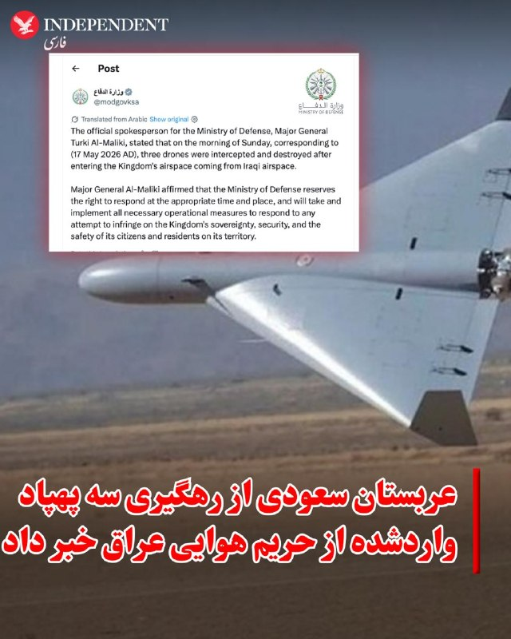

♦️ترکی المالکی، سخنگوی رسمی وزارت دفاع عربستان سعودی، یکشنبه ۲۷ اردیبهشت‌ماه اعلام کرد سه پهپاد پس از ورود به حریم هوایی این کشور از سمت حریم هوایی عراق رهگیری و منهدم شدند.

سرلشکر ترکی المالکی تاکید کرد وزارت دفاع عربستان سعودی حق پاسخ‌گویی را در زمان و مکان مناسب برای خود محفوظ می‌داند و تمامی اقدامات عملیاتی لازم را برای مقابله با هرگونه تلاش جهت نقض حاکمیت، امنیت و سلامت شهروندان و ساکنان این کشور انجام خواهد داد.

وزارت دفاع عربستان سعودی افزود این کشور برای مقابله با هرگونه تلاش جهت نقض حاکمیت و امنیت خود، اقدامات عملیاتی لازم را اتخاذ خواهد کرد.
‌🇸🇦 Indypersian

🤖 @VahidOOnLine

## VahidOOnLine — post 240700

  

عربستان سعودی اعلام کرد روز یک‌شنبه سه پهپاد را که از حریم هوایی عراق وارد شده بودند، رهگیری کرده است.

وزارت دفاع عربستان سعودی تأکید کرد این کشور برای مقابله با هرگونه تلاش برای نقض حاکمیت و امنیت خود، اقدامات عملیاتی لازم را انجام خواهد داد و حق پاسخ‌گویی را «در زمان و مکان مناسب» برای خود محفوظ می‌داند.
‌🏁 🇬🇧 IranintlTV

🤖 @VahidOOnLine

## VahidOOnLine — post 240699

  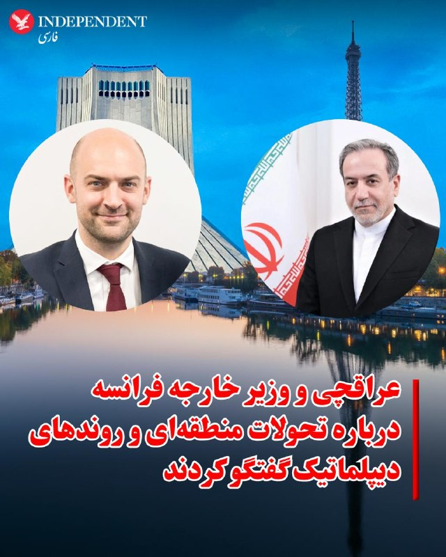

♦️رسانه‌های جمهوری اسلامی، یکشنبه ۲۷ اردیبهشت‌ماه گزارش دادند که عباس عراقچی، وزیر خارجه جمهوری اسلامی، و ژان نوئل بارو، وزیر خارجه فرانسه، در یک گفتگوی تلفنی درباره موضوعات دوجانبه، آخرین تحولات منطقه‌ای و روندهای جاری دیپلماتیک رایزنی و تبادل نظر کردند.

بر اساس این گزارش‌ها، دو طرف در این تماس تلفنی درباره تحولات منطقه و روندهای دیپلماتیک جاری گفتگو کردند، اما جزئیات بیشتری از محورهای این رایزنی منتشر نشده است.
‌🇸🇦 Indypersian

🤖 @VahidOOnLine

## VahidOOnLine — post 240698

  

سخنگوی فرماندهی مرکزی آمریکا در گفت‌وگو با العربیه اعلام کرد جمهوری اسلامی تهدیدی آشکار برای امنیت جهانی و ثبات منطقه‌ای است و توانایی آن در شلیک موشک و پهپاد به‌شدت کاهش یافته است. او افزود آمریکا همراه با متحدانش برای تقویت سامانه‌های پدافند هوایی همکاری کرده است.

سخنگوی سنتکام گفت جمهوری اسلامی در طول جنگ موشک‌های خود را از مناطق پرجمعیت پرتاب کرده است.

او همچنین تاکید کرد آمریکا تمام تلاش‌های جمهوری اسلامی برای ورود و خروج تجهیزات را زیر نظر دارد و با اعمال محاصره دریایی، با استفاده تهران از تنگه هرمز به‌عنوان ابزار تهدید آزادی کشتیرانی مقابله می‌کند. به گفته او، انتقال تسلیحات به متحدان جمهوری اسلامی متوقف شده و نیروهای آمریکا برای هرگونه طرح اضطراری آمادگی کامل دارند.
‌🏁 🇬🇧 IranintlTV

🤖 @VahidOOnLine

## VahidOOnLine — post 240697

  <a href="telegram/content/VahidOOnLine_240697_1779050042.mp4" target="_blank">🎬 Download video</a>

♦️مسعود پزشکیان، رئیس‌جمهوری ایران، روز یکشنبه در دیدار با محسن نقوی، وزیر کشور پاکستان، از نقش اسلام‌آباد در تثبیت آتش‌بس قدردانی کرد و ابراز امیدواری کرد تلاش‌های پاکستان به تقویت صلح و ثبات در منطقه کمک کند.

پزشکیان در این دیدار تاکید کرد ایران خواهان روابطی صمیمانه و پایدار با کشورهای اسلامی منطقه است و اتحاد کشورهای اسلامی می‌تواند زمینه مداخله قدرت‌های فرامنطقه‌ای را کاهش دهد.

به گزارش ایرنا، محسن نقوی نیز گفت ایران و پاکستان اکنون بیش از گذشته به یکدیگر نزدیک شده‌اند و روابط برادرانه دو کشور باید بیش از پیش گسترش یابد.

این دیدار در حالی انجام شد که پاکستان در هفته‌های اخیر در روند تلاش‌های دیپلماتیک و میانجی‌گری منطقه‌ای برای کاهش تنش‌ها و تثبیت آتش‌بس نقش فعالی ایفا کرده است.
‌🇸🇦 Indypersian

🤖 @VahidOOnLine

## VahidOOnLine — post 240695

  

احمدرضا رادان، فرمانده نیروی انتظامی، اعلام کرد که این نیرو ۶ هزار و ۵۰۰ نفر شهروند را از ابتدای جنگ بازداشت کرده است.

رادان این افراد را «وطن‌فروشان و جواسیس» نامید؛ اتهام‌هایی که وکلای دادگستری و نهادهای حقوق بشری می‌گویند جمهوری اسلامی برای سرکوب مردم از آنها استفاده می‌کند.

‌فرمانده فراجا همچنین گفت که بازداشت‌ها در ارتباط با اعتراضات دی ماه همچنان ادامه دارد.
‌🏁 🇬🇧 IranintlTV

🤖 @VahidOOnLine

---
📅 بروزرسانی: 1405/02/27 23:10
---

## VahidOOnLine — post 240694

  <a href="telegram/content/VahidOOnLine_240694_1779046839.mp4" target="_blank">🎬 Download video</a>

♦️هزاران کاتولیک روز یکشنبه در تپه‌های جنگلی شمال لهستان در یکی از منحصربه‌فردترین آیین‌های مذهبی این کشور شرکت کردند؛ مراسمی سالانه که در آن شرکت‌کنندگان آثار مذهبی مقدس را هنگام حرکت، حمل و حتی با حرکات موزون و آیینی به نمایش می‌گذارند.
به گزارش رویترز، این آثار مذهبی که «فرترون» نام دارند، تصاویری از قدیسان، شهدا و صحنه‌هایی از کتاب مقدس را در خود جای داده‌اند و وزن برخی از آنها به حدود ۱۲۰ کیلوگرم می‌رسد.
این سنت که به «رقص فرترون» یا «تعظیم فرترون‌ها» معروف است، ریشه‌ای دیرینه در شمال لهستان دارد و یکی از بخش‌های اصلی زیارت سالانه در محوطه مذهبی کالواریای ویهرووو به شمار می‌رود.
زائران برخی از این آثار را کیلومترها بر دوش می‌کشند و پیاده از شهرهای مختلف منطقه به محل برگزاری مراسم می‌روند.
برای بسیاری از زائران، از جمله افراد سالمند، این مراسم چندروزه یکی از مهم‌ترین رویدادهای مذهبی و فرهنگی سال به شمار می‌رود.
‌🇸🇦 Indypersian

🤖 @VahidOOnLine

## VahidOOnLine — post 240693

  <a href="telegram/content/VahidOOnLine_240693_1779046842.mp4" target="_blank">🎬 Download video</a>

♦️عبدالله حاجی‌صادقی، نماینده مجتبی خامنه‌ای در سپاه پاسداران، روز یکشنبه در گفتگو با رسانه‌های داخلی اعلام کرد مذاکرات با آمریکا «تحت اشراف کامل مسئولان عالی‌رتبه» و با تایید «رهبری» در حال انجام است.
حاجی‌صادقی افزود: «رهبری شجاع، بصیر، حکیم، مسلط و با قدرت فرماندهی داریم که مردم را به زیبایی رهبری می‌کند.»
‌🇸🇦 Indypersian

🤖 @VahidOOnLine

## VahidOOnLine — post 240692

  <a href="telegram/content/VahidOOnLine_240692_1779046844.mp4" target="_blank">🎬 Download video</a>

♦️شبکه خبری العربیه، روز یکشنبه تصاویری از کمک‌رسانی یدک‌کش‌های عربستان سعودی به دریانوردان و شناورهای گرفتار در آب‌های خلیج فارس را منتشر کرد.
به گزارش العربیه، یدک‌کش‌های عربستان سعودی، با ارائه پشتیبانی فنی، لجستیکی و خدمات تعمیر و نگهداری، کشتی‌های متوقف شده در آب‌های جنوبی ایران را امدادرسانی می‌کنند.
تامین نیازهای سوختی کشتی‌ها و همچنین ارائه کمک‌های بشردوستانه، از جمله انتقال دریانوردانی که نیازمند دریافت خدمات درمانی هستند یا قصد بازگشت به کشورهایشان را دارند، از دیگر اقدامات این یدک‌کش‌های سعودی توصیف شده است.
‌🇸🇦 Indypersian

🤖 @VahidOOnLine

## VahidOOnLine — post 240691

  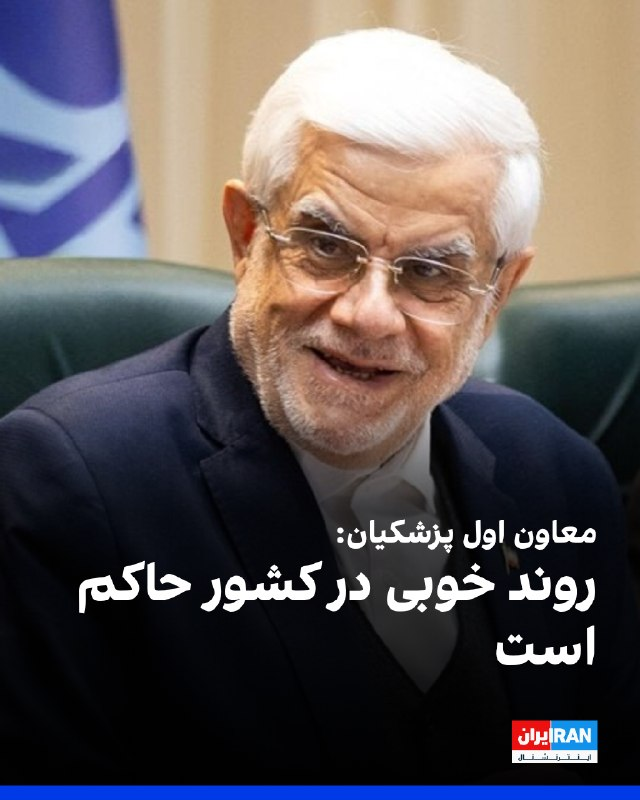

محمدرضا عارف، معاون اول پزشکیان، گفت: «تسهیل ازدواج جوانان بخشی از راهبردهای نظام است.»
او افزود: «موضوع جوانان، ازدواج و فرزندآوری در برنامه پنج‌ساله دولت لحاظ شده و با توجه به روند خوبی که در کشور حاکم است و پیروزی‌هایی که به دست می‌آوریم، در تلاشیم مشکلات اقتصادی را کاهش دهیم.»
‌🏁 🇬🇧 IranintlTV

🤖 @VahidOOnLine

## VahidOOnLine — post 240690

  <a href="telegram/content/VahidOOnLine_240690_1779046846.mp4" target="_blank">🎬 Download video</a>

روز شنبه ۲۶ اردیبهشت، جمعی از ایرانیان ساکنِ ونکوور کانادا، در حمایت از مردم ایران و شاهزاده رضا پهلوی تجمع برگزار کردند. شرکت‌کنندگان «خواستار تغییر رژیم ایران» و «اقدام فوری» در حمایت از مردم ایران شدند.
‌🏁 🇬🇧 IranintlTV

🤖 @VahidOOnLine

## VahidOOnLine — post 240689

  

انور قرقاش مشاور دیپلماتیک رییس امارات متحده عربی در شبکه اجتماعی ایکس نوشت: «هدف قرار دادن تروریستی نیروگاه هسته‌ای پاک براکه، چه از سوی عامل اصلی و چه از طریق یکی از عوامل نیابتی آن، یک تشدید تنش خطرناک و صحنه‌ای تاریک است که تمامی قوانین و عرف‌های بین‌المللی را نقض می‌کند، در حالی که بی‌توجهی جنایتکارانه‌ به جان غیرنظامیان در امارات متحده عربی و پیرامون آن است.»

قرقاش ادامه داد: «این تشدید تنش ممنوع، بار دیگر ماهیت چالش‌هایی را که منطقه در مواجهه با نیروهای شر، هرج‌ومرج و خرابکاری با آنها روبه‌رو است، تایید می‌کند.»

او افزود: «هیچ‌کس نخواهد توانست بازوی امارات را بپیچاند، و هیچ‌کس موفق نخواهد شد چشم‌انداز، موفقیت و پیام الهام‌بخش آن به مردم منطقه در زمینه امنیت، ثبات، توسعه و شکوفایی را تضعیف کند.»
‌🏁 🇬🇧 IranintlTV

🤖 @VahidOOnLine

## VahidOOnLine — post 240688

  

‌🇸🇦 Indypersian

🤖 @VahidOOnLine

## VahidOOnLine — post 240687

  

وزارت خارجه عربستان سعودی حمله پهپادی به نیروگاه هسته‌ای براکه در امارات متحده عربی را محکوم کرد.

همزمان وزارت خارجه بحرین اعلام کرد که این کشور حمله «تروریستی» به نیروگاه هسته‌ای براکه را به‌شدت محکوم می‌کند و بر همبستگی کشورش با امارات متحده عربی تاکید کرد.
‌🏁 🇬🇧 IranintlTV

🤖 @VahidOOnLine

## VahidOOnLine — post 240686

  <a href="telegram/content/VahidOOnLine_240686_1779046851.mp4" target="_blank">🎬 Download video</a>

«صدای فاطمه سپهری باشیم» ـ گزارشگر
‌🏁 🇬🇧 ManotoTV

🤖 @VahidOOnLine

## VahidOOnLine — post 240685

  <a href="telegram/content/VahidOOnLine_240685_1779046852.mp4" target="_blank">🎬 Download video</a>

باراک راوید، خبرنگار آکسیوس گزارش داد دو مقام آمریکایی اعلام کردند دونالد ترامپ قرار است روز سه‌شنبه نشستی در اتاق وضعیت کاخ سفید با تیم ارشد امنیت ملی خود برگزار کند تا گزینه‌های اقدام نظامی را بررسی کند.
‌🏁 🇬🇧 ManotoTV

🤖 @VahidOOnLine

## VahidOOnLine — post 240684

  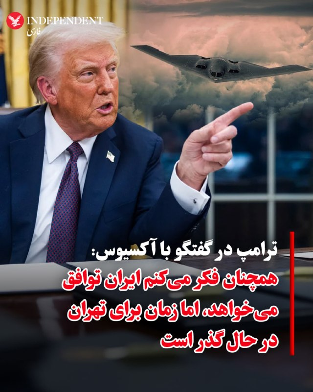

♦️دونالد ترامپ، رئیس‌جمهوری آمریکا، عصر یکشنبه ۲۷ اردیبهشت ماه،‌ در گفتگو با اکسیوس گفت همچنان معتقد است ایران به دنبال توافق است و او در انتظار دریافت پیشنهاد تازه‌ای از سوی تهران است؛ پیشنهادی که به گفته او امیدوار است «بهتر از پیشنهاد قبلی» باشد.
ترامپ گفت: «ما خواهان توافق هستیم. آنها هنوز در جایگاهی که ما می‌خواهیم نیستند. یا باید به آن نقطه برسند یا ضربه سختی خواهند خورد و آنها چنین چیزی را نمی‌خواهند.»
او همچنین به تهران هشدار داد: «اگر پیشنهاد بهتری ارائه نکنند، آمریکا ایران را بسیار شدیدتر از قبل هدف قرار خواهد داد.» ترامپ در پایان تاکید کرد: «ساعت در حال تیک‌تاک است؛ بهتر است خیلی سریع حرکت کنند، وگرنه چیزی برایشان باقی نخواهد ماند.»
آکسیوس پیشتر به نقل از دو مقام آمریکایی گزارش کرد ترامپ قرار است روز سه‌شنبه با تیم ارشد امنیت ملی خود در اتاق وضعیت کاخ سفید جلسه‌ای برای بررسی گزینه‌های اقدام نظامی علیه ایران برگزار کند.
‌🇸🇦 Indypersian

🤖 @VahidOOnLine

---
📅 بروزرسانی: 1405/02/27 21:45
---

## VahidOOnLine — post 240683

  

عبدالله حاجی‌صادقی، نماینده مجتبی خامنه‌ای در سپاه پاسداران، گفت: مذاکرات ما تحت اشراف مسئولان و با تایید «رهبری» پیش می‌رود. او با تاکید بر اینکه «اتحاد مقدس از هر چیزی مهم‌تر است»، افزود نباید اجازه داد این اتحاد آسیب ببیند.

حاجی‌صادقی همچنین گفت: «رهبری شجاع، بصیر، حکیم، مسلط و با قدرت فرماندهی داریم که مردم را به زیبایی رهبری می‌کند.»
‌🏁 🇬🇧 IranintlTV

🤖 @VahidOOnLine

## VahidOOnLine — post 240682

  <a href="telegram/content/VahidOOnLine_240682_1779041710.mp4" target="_blank">🎬 Download video</a>

‌
بارسلون | اسپانیا؛ گردهمایی ایرانیان ـ گزارشگر ۲۷ اردیبهشت
‌🏁 🇬🇧 ManotoTV

🤖 @VahidOOnLine

## VahidOOnLine — post 240679

  <a href="telegram/content/VahidOOnLine_240679_1779041711.mp4" target="_blank">🎬 Download video</a>

‌
گوگوش، خواننده سرشناس ایرانی، با انتشار تصاویری در صفحه اینستاگرام خود اعلام کرد «نشان افتخار جزیره الیس» را دریافت کرده است؛ نشانی که به افرادی اهدا می‌شود که در جامعه آمریکا تاثیرگذار بوده‌اند و در عین حال هویت و ریشه‌های فرهنگی خود را حفظ کرده‌اند.

او در پیام خود نوشت: «خواستم از این فرصت استفاده کنم تا نام ایران و مردم شریف ایران را یادآوری کنم.»

گوگوش همچنین این نشان را به مردم ایران تقدیم کرد و نوشت: «این نشان را با عشق و احترام به مردم ایران تقدیم می‌کنم؛ به مردمی که سال‌ها با رنج، صبوری، امید و سربلندی زندگی کرده‌اند و با وجود همه سختی‌ها، همچنان ایستاده‌اند.»

این خواننده پیشکسوت در ادامه برای ایران و جهان آرزوی «صلح، آرامش و روزهایی روشن‌تر» کرد و در پایان به سخنی از سعدی اشاره کرد.
‌🏁 🇬🇧 ManotoTV

🤖 @VahidOOnLine

## VahidOOnLine — post 240678

  

دونالد ترامپ در گفت‌وگو با شبکه ۱۳ اسرائیل پس از تهدید دوباره جمهوری اسلامی گفت: «فکر می‌کنم مقام‌های تهران باید از من بترسند و مراقب باشند.»

او همچنین در گفت‌وگو با کانال ۱۲ اسرائیل گفت همچنان معتقد است ایران خواهان دستیابی به توافق است و انتظار دارد تهران در روزهای آینده پیشنهاد تازه‌ای ارائه کند.
ترامپ از تعیین ضرب‌الاجل برای مذاکرات خودداری کرد، اما هشدار داد در صورت برآورده نشدن خواسته‌های آمریکا درباره برنامه هسته‌ای ایران، اقدام نظامی شدیدتری در پیش خواهد بود.
‌🏁 🇬🇧 IranintlTV

🤖 @VahidOOnLine

## VahidOOnLine — post 240677

  

دونالد ترامپ در گفت‌وگو با شبکه ۱۳ اسرائیل پس از تهدید دوباره جمهوری اسلامی گفت: «فکر می‌کنم مقام‌های تهران باید از من بترسند و مراقب باشند.»

او همچنین در گفت‌وگو با کانال ۱۲ اسرائیل گفت همچنان معتقد است ایران خواهان دستیابی به توافق است و انتظار دارد تهران در روزهای آینده پیشنهاد تازه‌ای ارائه کند.
ترامپ از تعیین ضرب‌الاجل برای مذاکرات خودداری کرد، اما هشدار داد در صورت برآورده نشدن خواسته‌های آمریکا درباره برنامه هسته‌ای ایران، اقدام نظامی شدیدتری در پیش خواهد بود.
‌🏁 🇬🇧 IranintlTV

🤖 @VahidOOnLine

## VahidOOnLine — post 240676

  

دونالد ترامپ در گفت‌وگو با شبکه ۱۳ اسرائیل پس از تهدید دوباره جمهوری اسلامی گفت: «فکر می‌کنم مقام‌های تهران باید از من بترسند و مراقب باشند.»

او همچنین در گفت‌وگو با کانال ۱۲ اسرائیل گفت همچنان معتقد است ایران خواهان دستیابی به توافق است و انتظار دارد تهران در روزهای آینده پیشنهاد تازه‌ای ارائه کند.
ترامپ از تعیین ضرب‌الاجل برای مذاکرات خودداری کرد، اما هشدار داد در صورت برآورده نشدن خواسته‌های آمریکا درباره برنامه هسته‌ای ایران، اقدام نظامی شدیدتری در پیش خواهد بود.
‌🏁 🇬🇧 IranintlTV

🤖 @VahidOOnLine

## VahidOOnLine — post 240675

  <a href="telegram/content/VahidOOnLine_240675_1779041714.mp4" target="_blank">🎬 Download video</a>

ویدیوی دریافتی نشان می‌دهد روز شنبه ۲۶ اردیبهشت، جمعی از ایرانیان ساکن شهر رجاینا در ساسکاچوانِ کانادا، همراه با اجرای پرفورمنسی علیه اعدام‌های جمهوری اسلامی و قطعی اینترنت در ایران، تجمع اعتراضی برگزار کردند.
‌🏁 🇬🇧 IranintlTV

🤖 @VahidOOnLine

## VahidOOnLine — post 240674

  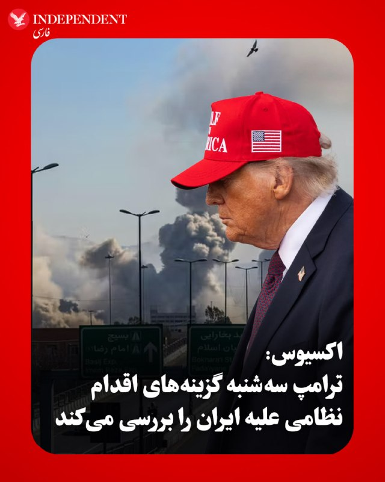

♦️دونالد ترامپ، رئیس‌جمهوری آمریکا، عصر یکشنبه در گفتگویی تلفنی با اکسیوس بار دیگر به ایران هشدار داد و گفت: «زمان برای ایران در حال گذر است.» او افزود اگر جمهوری اسلامی پیشنهاد بهتری برای توافق ارائه نکند، «بسیار شدیدتر هدف حمله قرار خواهد گرفت.»
به گزارش آکسیوس، ترامپ این اظهارات را در شرایطی مطرح کرده که مقام‌های آمریکایی می‌گویند او همچنان خواهان دستیابی به توافقی برای پایان دادن به جنگ است، اما مخالفت ایران با بخش قابل توجهی از خواسته‌های واشنگتن و خودداری از ارائه امتیازهای معنادار در برنامه هسته‌ای، گزینه نظامی را بار دیگر روی میز قرار داده است.
دو مقام آمریکایی  به اکسیوس گفته‌اند ترامپ قرار است برای بررسی گزینه‌های نظامی علیه ایران، روز سه‌شنبه با تیم ارشد امنیت ملی خود نشستی در اتاق وضعیت کاخ سفید برگزار کند.
‌🇸🇦 Indypersian

🤖 @VahidOOnLine

## VahidOOnLine — post 240673

  

♦️وزارت امور خارجه امارات متحده عربی، روز یکشنبه در بیانیه‌ای حمله پهپادی به محوطه اطراف نیروگاه انرژی هسته‌ای براکه در منطقه الظفره را به‌شدت محکوم و آن را یک «حمله تروریستی و خائنانه» توصیف کرد.

در این بیانیه آمده است یک پهپاد که از سمت مرزهای غربی وارد حریم هوایی امارات شده بود، یک ژنراتور برق را در خارج از محدوده داخلی نیروگاه هدف قرار داده است. مقام‌های اماراتی اعلام کردند این حادثه هیچ تلفات جانی یا تأثیری بر سطح ایمنی پرتویی نیروگاه بر جای نگذاشته است.

وزارت خارجه امارات این حمله را «تنش‌زایی خطرناک»، اقدامی غیرقابل قبول و «تهدیدی مستقیم برای امنیت کشور» توصیف کرد و تاکید کرد هدف قرار دادن نیروگاه‌های هسته‌ای صلح‌آمیز، نقض آشکار قوانین بین‌المللی، منشور سازمان ملل و حقوق بین‌الملل بشردوستانه است.
در این بیانیه همچنین با اشاره به اصول و قطعنامه‌های آژانس بین‌المللی انرژی اتمی، بر ضرورت حفاظت از تاسیسات هسته‌ای صلح‌آمیز و مصون ماندن آنها از تهدیدهای نظامی تاکید شده است.
‌🇸🇦 Indypersian

🤖 @VahidOOnLine

## VahidOOnLine — post 240672

  <a href="telegram/content/VahidOOnLine_240672_1779041717.mp4" target="_blank">🎬 Download video</a>

انور قرقاش، مشاور رئیس‌ دولت امارات، حمله به نیروگاه هسته‌ای این کشور را «اقدامی تروریستی» توصیف کرد و گفت این حمله «چه از سوی عامل اصلی و چه از طریق یکی از نیروهای نیابتی‌اش» یک «تشدید خطرناک» و نقض قوانین و عرف‌های بین‌المللی است.

قرقاش در پیامی در ایکس نوشت این حمله «با بی‌اعتنایی مجرمانه به جان غیرنظامیان در امارات و مناطق اطراف آن» انجام شده است.

او افزود: «هیچ‌کس نمی‌تواند امارات را تحت فشار قرار دهد و در تضعیف چشم‌انداز، موفقیت و پیام الهام‌بخش آن برای امنیت، ثبات، توسعه و رفاه در منطقه موفق نخواهد شد.»

امارات تاکنون مسئول این حمله را معرفی نکرده است. وزارت دفاع امارات پیش‌تر اعلام کرده بود پهپادها از «مرز غربی» وارد این کشور شده‌اند.
‌🏁 🇬🇧 ManotoTV

🤖 @VahidOOnLine

## VahidOOnLine — post 240671

سخنرانی پدر جاویدنام سام افشاری در گردهمایی مونیخ - گزارشگر ۲۶ اردیبهشت
‌🏁 🇬🇧 ManotoTV

🤖 @VahidOOnLine

## VahidOOnLine — post 240670

  

ابراهیم رضایی سخنگوی کمیسیون امنیت ملی مجلس، گفت: «آمریکا یا باید شرایط جمهوری اسلامی را بپذیرد و تسلیم دیپلمات‌های ما شود و یا اینکه از موضع قدرت با او مذاکره می‌کنیم و باید تسلیم موشک‌های ما شود.»
او افزود: «تاریخ تنگه هرمز را باید به قبل و بعد از کشته‌شدن علی خامنه‌ای تقسیم کرد.»
‌🏁 🇬🇧 IranintlTV

🤖 @VahidOOnLine

---
📅 بروزرسانی: 1405/02/27 20:47
---

## VahidOOnLine — post 240669

  <a href="telegram/content/VahidOOnLine_240669_1779038241.mp4" target="_blank">🎬 Download video</a>

‌‌
دونالد ترامپ در پیامی در شبکه‌ اجتماعی خود نوشت:
«برای ایران، ساعت در حال گذر است و بهتر است خیلی سریع حرکت کنند، وگرنه چیزی از آن‌ها باقی نخواهد ماند. وقت تنگ است.»
‌🏁 🇬🇧 ManotoTV

🤖 @VahidOOnLine

## VahidOOnLine — post 240668

  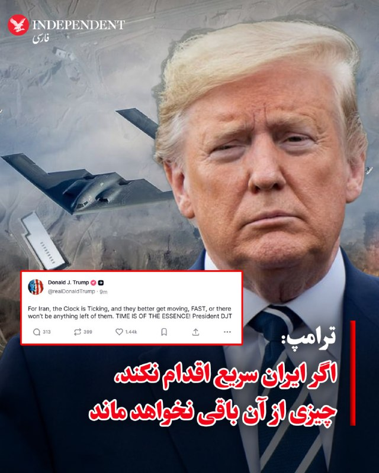

♦️دونالد ترامپ، رئیس‌جمهوری آمریکا، روز یکشنبه با انتشار پیامی در شبکه اجتماعی تروث سوشال، به ایران هشدار داد زمان برای تصمیم‌گیری رو به پایان است و رهبران جمهوری اسلامی باید هرچه سریع‌تر اقدام کنند.
ترامپ در این پیام نوشت: «برای ایران، ساعت در حال تیک‌تاک است و بهتر است خیلی سریع حرکت کنند، وگرنه چیزی از آنها باقی نخواهد ماند. زمان حیاتی است!»
طی روزهای اخیر گزارش‌هایی درباره احتمال ازسرگیری اقدام نظامی علیه ایران و افزایش تنش‌ها میان تهران، واشنگتن و تل‌آویو منتشر شده است.
‌🇸🇦 Indypersian

🤖 @VahidOOnLine

## VahidOOnLine — post 240667

  

دونالد ترامپ در شبکه تروث سوشال نوشت که زمان برای ایران به‌سرعت در حال سپری شدن است و بهتر است آن‌ها هرچه زودتر اقدام کنند در غیر این صورت «چیزی از آن‌ها باقی نخواهد ماند». ترامپ تاکید کرد: «زمان بسیار حیاتی است.»
‌🏁 🇬🇧 IranintlTV

🤖 @VahidOOnLine

## VahidOOnLine — post 240666

  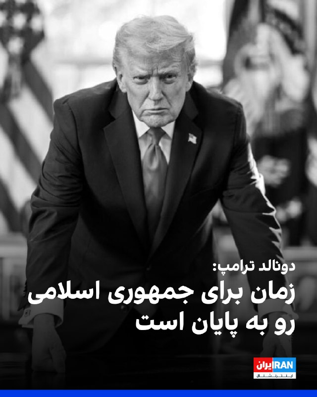

دونالد ترامپ در شبکه تروث سوشال نوشت که زمان برای ایران به‌سرعت در حال سپری شدن است و بهتر است آن‌ها هرچه زودتر اقدام کنند در غیر این صورت «چیزی از آن‌ها باقی نخواهد ماند». ترامپ تاکید کرد: «زمان بسیار حیاتی است.»
‌🏁 🇬🇧 IranintlTV

🤖 @VahidOOnLine

## VahidOOnLine — post 240665

  <a href="telegram/content/VahidOOnLine_240665_1779038244.mp4" target="_blank">🎬 Download video</a>

‌
بنیامین نتانیاهو، نخست‌وزیر اسرائیل، و دونالد ترامپ، رئیس‌جمهوری آمریکا، روز یکشنبه درباره سفر رئیس‌جمهوری آمریکا به چین گفت‌وگو کردند.

دو طرف همچنین درباره تحولات مربوط به ایران رایزنی کردند.

نتانیاهو پیش‌تر گفته بود که شامگاه یکشنبه با ترامپ صحبت خواهد کرد. او گفت:
«چشم‌های ما همچنین کاملاً به ایران باز است. امروز، همان‌طور که هر چند روز یک‌بار انجام می‌دهم، با دوست‌مان رئیس‌جمهور ترامپ صحبت خواهم کرد. قطعاً برداشت‌های او را از سفرش به چین و شاید مسائل دیگری خواهم شنید. قطعاً احتمالات زیادی وجود دارد؛ ما برای هر سناریویی آماده‌ایم.»
‌🏁 🇬🇧 ManotoTV

🤖 @VahidOOnLine

## VahidOOnLine — post 240664

  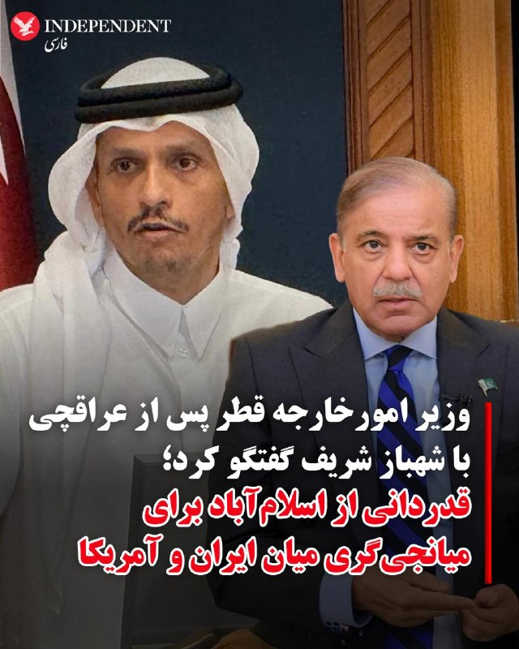

♦️دفتر نخست‌وزیر قطر اعلام کرد شیخ محمد بن عبدالرحمن آل‌ثانی، نخست‌وزیر و وزیر امور خارجه این کشور، روز یکشنبه در تماس تلفنی با شهباز شریف، نخست‌وزیر پاکستان، درباره روابط دوجانبه، تحولات منطقه و تلاش‌های میانجی‌گرانه اسلام‌آباد گفتگو کرده است.
دو طرف در این تماس همچنین آخرین تحولات منطقه و تلاش‌های پاکستان برای کاهش تنش‌ها با هدف تقویت امنیت و ثبات منطقه را بررسی کردند.
شیخ محمد بن عبدالرحمن در این گفتگو از تلاش‌های پاکستان و سایر طرف‌های دخیل در روند میانجی‌گری که به برقراری آتش‌بس میان ایالات متحده و جمهوری اسلامی ایران منجر شد، قدردانی کرد.
بر اساس بیانیه دفتر نخست‌وزیر قطر، شیخ محمد بن عبدالرحمن آل‌ثانی همچنین بر حمایت کامل دوحه از تلاش‌های میانجی‌گرانه پاکستان برای پایان دادن به بحران از راه‌های مسالمت‌آمیز تاکید کرد و گفت همه طرف‌ها باید با این تلاش‌ها همراه شوند تا زمینه برای پیشرفت مذاکرات و دستیابی به توافقی جامع و صلحی پایدار در منطقه فراهم شود.
وزیر امورخارجه قطر پیش از این تماس، با عباس عراقچی، وزیر امور خارجه ایران گفتگو کرده بود.
‌🇸🇦 Indypersian

🤖 @VahidOOnLine

## VahidOOnLine — post 240663

  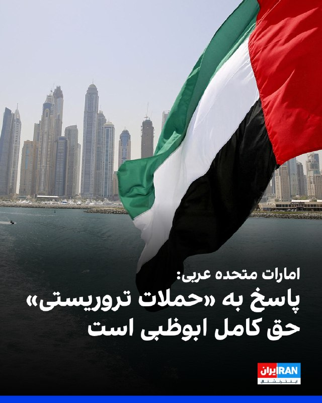

عبدالله بن زاید آل‌نهیان، وزیر خارجه امارات متحده عربی پس از حمله پهپادی به نیروگاه هسته‌ای این کشور، تلفنی با رافائل گروسی، مدیرکل آژانس بین‌المللی انرژی اتمی گفت‌وگو کرده است.

به گزارش خبرگزاری دولتی امارات متحده عربی، وزیر خارجه این کشور تاکید کرد که ابوظبی حق کامل دارد به چنین «حملات تروریستی» پاسخ دهد.
‌🏁 🇬🇧 IranintlTV

🤖 @VahidOOnLine

## VahidOOnLine — post 240662

♦️هزاران نفر در توکیو برای شرکت در جشنواره سالانه «سانجا ماتسوری» گرد هم آمدند. رویدادی که از معدود مناسبت‌ها در ژاپن به شمار می‌رود که در آن خالکوبی‌های سنتی موسوم به «ایرزومی» به‌طور علنی در معرض دید عموم قرار می‌گیرد.
خالکوبی‌های سنتی در ژاپن موضوعی بحث‌برانگیز محسوب می‌شوند، زیرا از گذشته با گروه‌های تبهکاری موسوم به یاکوزا و دنیای زیرزمینی این کشور پیوند خورده‌اند.
جشنواره سانجا ماتسوری هر سال در توکیو برگزار می‌شود و در کنار آیین‌های مذهبی و سنتی، فرصتی کم‌سابقه برای نمایش هنر خالکوبی سنتی ژاپنی در فضای عمومی فراهم می‌کند.
‌🇸🇦 Indypersian

🤖 @VahidOOnLine

## VahidOOnLine — post 240661

  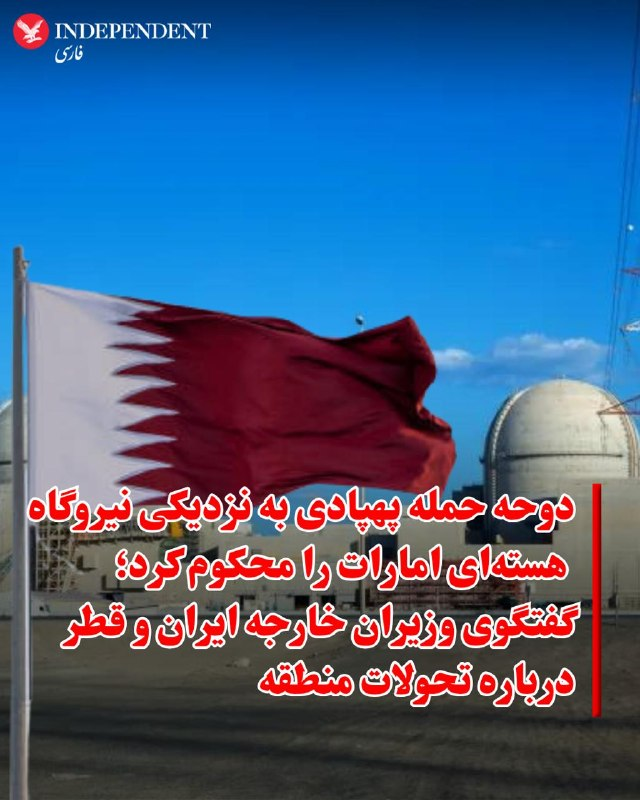

♦️وزارت امور خارجه قطر حمله پهپادی در نزدیکی نیروگاه انرژی هسته‌ای براکه در امارات متحده عربی را محکوم و آن را اقدامی «بی‌ملاحظه» و «نقض آشکار قوانین بین‌المللی» توصیف کرد. دوحه همچنین این حمله را «تهدیدی جدی برای امنیت و ثبات منطقه» دانست.

وزارت خارجه قطر در بیانیه‌ای هشدار داد حمله به زیرساخت‌های حیاتی و اماکن غیرنظامی از «خطوط قرمز» عبور کرده و خواستار جلوگیری از تشدید تنش‌ها شد. این وزارتخانه همچنین بر ضرورت کاهش تنش و جلوگیری از پیامدهای «حملات غیرقابل توجیه» تاکید کرد و بار دیگر حمایت کامل خود را از امارات و اقدامات این کشور برای حفاظت از حاکمیت، امنیت و تاسیسات حیاتی‌اش اعلام کرد.

همزمان، عباس عراقچی، وزیر امور خارجه جمهوری اسلامی ایران، در تماس تلفنی با شیخ محمد بن عبدالرحمن آل ثانی، نخست‌وزیر و وزیر خارجه قطر، درباره آخرین تحولات منطقه گفتگو و تبادل نظر کرد.

وزارت امور خارجه ایران اعلام کرد دو طرف در این تماس دیدگاه‌های خود را درباره تحولات جاری منطقه بررسی کردند، اما جزئیات بیشتری از محورهای گفت‌وگو منتشر نشده است.
‌🇸🇦 Indypersian

🤖 @VahidOOnLine

## VahidOOnLine — post 240660

  

♦️دفتر بنیامین نتانیاهو، نخست‌وزیر اسرائیل، اعلام کرد او روز یکشنبه و دقایقی پیش از برگزاری نشست امنیتی، در تماس تلفنی با دونالد ترامپ، درباره جنگ با ایران گفتگو کرده است.

به گزارش تایمز اسرائیل، این تماس در شرایطی که گزارش‌ها درباره آمادگی آمریکا و اسرائیل برای ازسرگیری جنگ با ایران منتشر شده است.

بر اساس گزارش رسانه‌های اسرائیلی، دو طرف در این تماس درباره احتمال ازسرگیری جنگ با ایران و همچنین سفر اخیر ترامپ به چین گفتگو کرده‌اند.
‌🇸🇦 Indypersian

🤖 @VahidOOnLine

## VahidOOnLine — post 240659

  <a href="telegram/content/VahidOOnLine_240659_1779038249.mp4" target="_blank">🎬 Download video</a>

بهار صحرائیان، وکیل دادگستری و عضو کانون وکلای استان فارس، به زندان عادل‌آباد شیراز منتقل شد.

بر اساس گزارش‌های منتشر شده خانم صحرائیان روز یکشنبه ۲۷ اردیبهشت در دادسرای شیراز از بابت اتهام‌های «اجتماع و تبانی به قصد اقدام علیه امنیت ملی»، «فعالیت تبلیغی علیه نظام» و «نشر اکاذیب» مورد تفهیم اتهام قرار گرفت.

این وکیل دادگستری روز شنبه ۲۶ اردیبهشت، حین انجام وظیفه در دادگاه انقلاب شیراز بازداشت شده بود.
‌🏁 🇬🇧 ManotoTV

🤖 @VahidOOnLine

## VahidOOnLine — post 240658

  <a href="telegram/content/VahidOOnLine_240658_1779038250.mp4" target="_blank">🎬 Download video</a>

لندن | بریتانیا؛ کنار دیوار جاویدنامان ـ گزارشگر یکشنبه ۲۷ اردیبهشت
‌🏁 🇬🇧 ManotoTV

🤖 @VahidOOnLine

## VahidOOnLine — post 240657

  

اکسیوس به نقل از یک مقام اسرائیلی گزارش داد دونالد ترامپ در تماس تلفنی با بنیامین نتانیاهو درباره ایران گفت‌وگو کرده است.
همچنین شبکه کان اسرائیل گزارش داد گفت‌وگوی تلفنی ترامپ و نتانیاهو بیش از نیم ساعت طول کشیده است.
بر اساس این گزارش، دو طرف درباره احتمال ازسرگیری درگیری با ایران گفت‌وگو کردند و ترامپ همچنین نتانیاهو را در جریان جزئیات سفر اخیر خود به چین قرار داده است.
‌🏁 🇬🇧 IranintlTV

🤖 @VahidOOnLine

## VahidOOnLine — post 240656

⭕️ صدو‌سی‌امین سال ترور قبله عالم، ناصرالدین شاه قاجار و تاثیر آن بر وقایع سیاسی ایران

♦️دوازدهم اردیبهشت‌ماه ۱۲۷۵ خورشیدی، هنگامی که ناصرالدین‌شاه قاجار به مناسبت پنجاهمین سال سلطنتش راهی حرم عبدالعظیم در شهر ری شد و برخلاف روال همیشگی، از ملازمان خود خواست اجازه دهند مردم برای دیدار به او نزدیک شوند، شاید هرگز تصور نمی‌کرد که این سفر، واپسین سفر زندگی‌اش باشد و همان روز و در همان مکان، به دست میرزا رضای کرمانی کشته شود.
اکنون ۱۳۰ سال از ترور ناصرالدین‌شاه می‌گذرد؛ رویدادی که تاریخ معاصر ایران را، از منظر حذف فیزیکی عالی‌ترین مقام حکومت، به پیش و پس از خود تقسیم کرد.
میرزا رضای کرمانی که از مریدان سید جمال‌الدین اسدآبادی بود و سال‌هایی از عمر خود را در زندان گذرانده بود، در آن روز در میان زائران کمین کرد. هنگامی که شاه از کالسکه پیاده شد و به سوی صحن حرم گام برداشت، خود را به او رساند و از فاصله‌ای نزدیک گلوله‌ای به سینه او شلیک کرد.
ناصرالدین‌شاه در همان لحظه نقش بر زمین شد. ندیمان و محافظان شاهی که غافلگیر شده بودند، بلافاصله میرزا رضا را دستگیر کردند.

📌لینک پخش پادکست
‌🇸🇦 Indypersian

🤖 @VahidOOnLine

## VahidOOnLine — post 240655

  <a href="telegram/content/VahidOOnLine_240655_1779038253.mp4" target="_blank">🎬 Download video</a>

♦️صدا و سیمای جمهوری اسلامی تصاویری از برگزاری دوره‌های آموزش کار با اسلحه برای زنان و مردان در مساجد نقاط مختلف کشور پخش کرده است.
در تصاویر منتشرشده از سوی شبکه خبر جمهوری اسلامی ایران، زنان و مردان در محیط‌های مسجدی در حال شرکت در آموزش‌های دفاعی دیده می‌شوند. این گزارش همچنین شامل اظهارنظر برخی شرکت‌کنندگان درباره این برنامه‌ها است.
جزئیات بیشتری درباره محل دقیق برگزاری این آموزش‌ها، تعداد شرکت‌کنندگان یا هدف رسمی این دوره‌ها منتشر نشده است.
روز شنبه تفنگ دست گرفتن مجری‌های تلویزیون در ایران، خبرساز شده بود.
‌🇸🇦 Indypersian

🤖 @VahidOOnLine

## VahidOOnLine — post 240654

  <a href="telegram/content/VahidOOnLine_240654_1779038255.mp4" target="_blank">🎬 Download video</a>

‌
«صدای فاطمه سپهری باشیم» ـ گزارشگر
‌🏁 🇬🇧 ManotoTV

🤖 @VahidOOnLine

## VahidOOnLine — post 240653

  <a href="telegram/content/VahidOOnLine_240653_1779038256.mp4" target="_blank">🎬 Download video</a>

مجارستان؛ گردهمایی ایرانیان _ گزارشگر یکشنبه ۲۷ اردیبهشت
‌🏁 🇬🇧 ManotoTV

🤖 @VahidOOnLine

---
📅 بروزرسانی: 1405/02/27 19:33
---

## VahidOOnLine — post 240652

  <a href="telegram/content/VahidOOnLine_240652_1779033813.mp4" target="_blank">🎬 Download video</a>

‌
وین | اتریش؛ گردهمایی ایرانیان _ گزارشگر یکشنبه ۲۷ اردیبهشت
‌🏁 🇬🇧 ManotoTV

🤖 @VahidOOnLine

## VahidOOnLine — post 240651

  

مسعود پزشکیان در پیامی در شبکه اجتماعی ایکس به مناسبت روز جهانی ارتباطات نوشت: «در روزهای جنگ، فرزندان ما در ارتباطات و فناوری اطلاعات شبانه‌روز ایستادند تا ارتباطات کشور پایدار بماند.»
او همچنین دسترسی باکیفیت و پایدار مردم به خدمات دیجیتال را «بخشی از آرامش، پیشرفت و حق زندگی شایسته مردم» ایران دانست.
‌🏁 🇬🇧 IranintlTV

🤖 @VahidOOnLine

## VahidOOnLine — post 240650

  <a href="telegram/content/VahidOOnLine_240650_1779033815.mp4" target="_blank">🎬 Download video</a>

بازار تهران؛ ۲۷ اردیبهشت ـ گزارشگر
‌🏁 🇬🇧 ManotoTV

🤖 @VahidOOnLine

## VahidOOnLine — post 240649

  <a href="telegram/content/VahidOOnLine_240649_1779033817.mp4" target="_blank">🎬 Download video</a>

‌
پورتو | پرتغال؛ گردهمایی ایرانیان ـ گزارشگر یکشنبه ۲۷ اردیبهشت
‌🏁 🇬🇧 ManotoTV

🤖 @VahidOOnLine

## VahidOOnLine — post 240648

  

♦️گوگوش، خواننده نامدار ایرانی، در پیامی در اینستاگرام اعلام کرد مدال افتخار سال ۲۰۲۶ «جزیره الیس» را دریافت کرده و این جایزه را با «عشق و احترام» به مردم ایران تقدیم می‌کند.

او نوشت: «دیشب افتخار داشتم نشان افتخار جزیره الیس را دریافت کنم؛ نشانی که به افرادی اهدا می‌شود که در جامعه آمریکا تأثیرگذار بوده‌اند و در عین حال ریشه‌ها و هویت فرهنگی خود را حفظ کرده‌اند.»

«نشان افتخار جزیره الیس» یکی از شناخته‌شده‌ترین جوایز مدنی آمریکا است که از سال ۱۹۸۶ به افرادی از حوزه‌های هنر، فرهنگ، سیاست، علم، تجارت و فعالیت‌های اجتماعی اعطا می‌شود؛ افرادی که علاوه بر نقش‌آفرینی در جامعه آمریکا، بر حفظ پیشینه و هویت فرهنگی خود نیز تأکید داشته‌اند. این جایزه در جزیره الیس نیویورک، نماد ورود میلیون‌ها مهاجر به آمریکا، اهدا می‌شود.

از چهره‌های شناخته‌شده‌ای که در سال‌های مختلف این نشان را دریافت کرده‌اند می‌توان به رونالد ریگان، ریچارد نیکسون، رزا پارکس، فرانک سیناترا، گلوریا استفان، ملاله یوسف‌زی و دونالد ترامپ اشاره کرد.
‌🇸🇦 Indypersian

🤖 @VahidOOnLine

## VahidOOnLine — post 240647

  

گوگوش، خواننده سرشناس ایرانی، «نشان افتخار جزیره آلیس» را دریافت کرد؛ «این نشان به افرادی اهدا می‌شود که در جامعه آمریکا تأثیرگذار بوده‌اند و در عین حال ریشه‌ها و هویت فرهنگی خود را حفظ کرده‌اند.»

گوگوش با انتشار تصویری از مراسم اهدای این نشان در صفحه اینستاگرام خود نوشت: «این نشان را با عشق و احترام به مردم ایران تقدیم می‌کنم؛ به مردمی که سال‌ها با رنج، صبوری، امید و سربلندی زندگی کرده‌اند و با وجود همه سختی‌ها، همچنان ایستاده‌اند.»
‌🏁 🇬🇧 IranintlTV

🤖 @VahidOOnLine

## VahidOOnLine — post 240646

  <a href="telegram/content/VahidOOnLine_240646_1779033819.mp4" target="_blank">🎬 Download video</a>

پاریس | فرانسه؛ گردهمایی ایرانیان ـ گزارشگر یکشنبه ۲۷ اردیبهشت
‌🏁 🇬🇧 ManotoTV

🤖 @VahidOOnLine

## VahidOOnLine — post 240645

  

لیندسی گراهام، سناتور جمهوری‌خواه آمریکا در گفت‌وگو با شبکه ان‌بی‌سی خواستار اقدام نظامی بیشتر آمریکا علیه جمهوری اسلامی شد.
او افزود: وضعیت فعلی به همه ما آسیب می‌زند، هرچه تنگه هرمز بیشتر بسته بماند و ما بیشتر دنبال توافقی برویم که هیچ‌وقت حاصل نمی‌شود. جمهوری اسلامی قوی‌تر می‌شود.

سناتور گراهام افزود: «تا این لحظه، هیچ چیزی نشان نمی‌دهد افرادی که اکنون در قدرت هستند، از نظر اهداف رژیم برای تروریسم جهانی، نابودی اسرائیل و حمله به ما تفاوتی کرده باشند.»

او اضافه کرد: «آنچه رئیس‌جمهور ترامپ از نظر نظامی انجام داده فوق‌العاده بوده، اما هنوز اهداف بیشتری وجود دارد و کارهای بیشتری هست که می‌توانیم برای ضربه زدن به ایران انجام دهیم.»
‌🏁 🇬🇧 IranintlTV

🤖 @VahidOOnLine

## VahidOOnLine — post 240644

  <a href="telegram/content/VahidOOnLine_240644_1779033821.mp4" target="_blank">🎬 Download video</a>

♦️در ادامه برنامه‌های هفتادونهمین دوره جشنواره فیلم کن، روز یکشنبه ۲۷ اردیبهشت، پگاه آهنگرانی به همراه مادرش، منیژه حکمت، کارگردان و تهیه‌کننده باسابقه، و سایر عوامل بین‌المللی مستند «تمرین‌هایی برای یک انقلاب»، مقابل دوربین عکاسان رسانه‌های جهان رفتند. حضور مشترک این مادر و دختر سینماگر ایرانی، توجه رسانه‌های فرانسوی را به خود جلب کرد.
این فیلم که به عنوان محصول مشترک فرانسه و آلمان و با حمایت نهادهای فرهنگی اروپایی ساخته شده، در بخش «نمایش‌های ویژه» به نمایش درآمد. مستند از طریق پنج پرتره از چهره‌های کلیدی طبقه روشنفکر و مبارز، نشان می‌دهد که چگونه مفهوم «مقاومت» از نسل‌های پیشین به جنبش‌های اخیر منتقل شده است.
به گزارش رسانه‌های معتبر سینمایی، منتقدان این اثر را یکی از سیاسی‌ترین و در عین حال شخصی‌ترین مستندهای امسال توصیف کرده‌اند که با ترکیب هوشمندانه آرشیوهای خانگی ممنوعه و تصاویر اعتراضات خیابانی، نوعی «سند تاریخی ملموس» از ایستادگی جامعه ایران خلق کرده است.
‌🇸🇦 Indypersian

🤖 @VahidOOnLine

## VahidOOnLine — post 240643

  

♦️محمدباقر قالیباف، رئیس مجلس شورای اسلامی، روز یکشنبه ۲۷ اردیبهشت با محسن نقوی، وزیر کشور پاکستان دیدار کرد.

به گزارش رسانه‌های داخلی ایران، قالیباف در این دیدار گفت برخی دولت‌های منطقه تصور می‌کردند حضور آمریکا برای آنها امنیت به همراه دارد، اما «حوادث اخیر نشان داد این حضور نه تنها امنیت‌زا نیست بلکه زمینه ناامنی را هم فراهم می‌کند.»

رئیس مجلس شورای اسلامی همچنین بر اهمیت همکاری و روابط میان کشورهای منطقه تاکید کرد.

به گزارش فارس، محسن نقوی، وزیر کشور پاکستان نیز در این دیدار با اشاره به مذاکرات اسلام‌آباد خطاب به قالیباف گفت: «شاهد ایستادگی شما در مذاکرات اسلام‌آباد بر منافع ملی ایران و در عین حال تلاش برای حل و فصل مشکلات بودیم.»

نقوی در جریان سفر دو روزه پیش‌بینی نشده به تهران، با مقام‌های مختلف جمهوری اسلامی، از جمله وزیر کشور، رئیس جمهوری و رئیس مجلس ایران دیدار کرد.
‌🇸🇦 Indypersian

🤖 @VahidOOnLine

## VahidOOnLine — post 240642

  

مستند کوتاه «هنر مقاومت» به تهیه‌کنندگی ایران اینترنشنال و کارگردانی مهران عباسیان در فستیوال فیلم خانه سینمای سوئد موفق به دریافت جایزه بهترین مستند کوتاه و بهترین کارگردانی شد.
این فیلم داستان دو هنرمند ایرانی را روایت می‌کند که هنر را به زبان اعتراض، امید و مقاومت در برابر محدودیت‌ها تبدیل کرده‌اند.
‌🏁 🇬🇧 IranintlTV

🤖 @VahidOOnLine

## VahidOOnLine — post 240641

  <a href="telegram/content/VahidOOnLine_240641_1779033823.mp4" target="_blank">🎬 Download video</a>

‌
پراگ | چک؛ گردهمایی ایرانیان ـ گزارشگر شنبه ۲۶ اردیبهشت
‌🏁 🇬🇧 ManotoTV

🤖 @VahidOOnLine

## VahidOOnLine — post 240640

  <a href="telegram/content/VahidOOnLine_240640_1779033825.mp4" target="_blank">🎬 Download video</a>

وزارت دفاع امارات متحده عربی اعلام کرد سه پهپاد از مرزهای غربی وارد این کشور شدند که دو فروند رهگیری شد و پهپاد سوم به یک ژنراتور خارج از محدوده داخلی نیروگاه هسته‌ای براکه در منطقه الظفره برخورد کرد و باعث آتش‌سوزی شد.

وزارت دفاع امارات اعلام کرد تحقیقات برای مشخص شدن منبع این حملات ادامه دارد و نتایج آن بعداً اعلام خواهد شد.
‌🏁 🇬🇧 ManotoTV

🤖 @VahidOOnLine

## VahidOOnLine — post 240639

  <a href="telegram/content/VahidOOnLine_240639_1779033825.mp4" target="_blank">🎬 Download video</a>

‌
«من صدای فاطمه سپهری هستم» ـ گزارشگر
‌🏁 🇬🇧 ManotoTV

🤖 @VahidOOnLine

## VahidOOnLine — post 240638

  <a href="telegram/content/VahidOOnLine_240638_1779033827.mp4" target="_blank">🎬 Download video</a>

تجمع ایرانیان ساکن بروکسل، یکشنبه ۲۷ اردیبهشت
‌🏁 🇬🇧 ManotoTV

🤖 @VahidOOnLine

---
📅 بروزرسانی: 1405/02/27 18:28
---

## VahidOOnLine — post 240637

  

♦️وزارت دفاع امارات متحده عربی در بیانیه‌ای اعلام کرد سامانه‌های پدافند هوایی این کشور روز یکشنبه ۲۷ اردیبهشت ماه سه پهپاد را که از سمت مرزهای غربی وارد حریم امارات شده بودند، رهگیری کردند.

بر اساس این بیانیه، دو پهپاد با موفقیت رهگیری و منهدم شدند، اما پهپاد سوم به یک ژنراتور برق در خارج از محدوده داخلی نیروگاه هسته‌ای براکه در منطقه الظفره برخورد کرد.

وزارت دفاع امارات اعلام کرد تحقیقات برای شناسایی منشا این حملات آغاز شده و جزئیات بیشتر پس از تکمیل بررسی‌ها منتشر خواهد شد.

این وزارتخانه همچنین تاکید کرد نیروهای مسلح امارات در آمادگی کامل قرار دارند و با هرگونه اقدام علیه امنیت کشور «قاطعانه» برخورد خواهند کرد؛ اقدامی که به گفته مقام‌های اماراتی با هدف حفظ حاکمیت، امنیت، ثبات و منافع ملی این کشور انجام می‌شود.
‌🇸🇦 Indypersian

🤖 @VahidOOnLine

## VahidOOnLine — post 240636

  

♦️روزنامه نیویورک‌تایمز روز یکشنبه ۲۷ اردیبهشت منتشر در گزارشی فاش کرد ارتش اسرائیل در جریان تقابل نظامی اخیر با جمهوری اسلامی ایران، دو پایگاه نظامی مخفی در عمق خاک عراق ایجاد و از آنها برای پشتیبانی عملیات خود استفاده کرده است.
پیش‌تر وال‌استریت ژورنال گزارش داده بود اسرائیل یک پایگاه مخفی را در بیابان‌های غرب عراق برای استفاده در جنگی که از فوریه آغاز شده بود، ایجاد کرده است. اما اکنون مقام‌های عراقی در گفت‌وگو با نیویورک‌تایمز جزئیات تازه‌ای ارائه کرده و از وجود پایگاه مخفی دومی نیز خبر داده‌اند.
نیویورک‌تایمز به نقل از یک مقام منطقه‌ای گزارش داد ساخت پایگاه نخست در اواخر سال ۲۰۲۴ آغاز شد و این مرکز مشخصا برای پشتیبانی از حمله ژوئن ۲۰۲۵ اسرائیل به ایران مورد استفاده قرار گرفت. به نوشته این روزنامه، این پایگاه اکنون غیرفعال است. با این حال، پایگاه دوم برای مدیریت عملیات‌های مرتبط با جنگ اخیر ایجاد شده، اما موقعیت دقیق و وضعیت کنونی آن همچنان مشخص نیست.
بر اساس این گزارش، اسرائیل این پایگاه‌ها را با دو هدف اصلی ایجاد کرده است: کاهش زمان پرواز جنگنده‌ها برای انجام حملات در عمق خاک ایران و ایجاد یک مرکز عملیاتی پیشرفته برای پشتیبانی از نیروی هوایی. نیویورک‌تایمز نوشت این پایگاه‌ها همچنین محل استقرار نیروهای ویژه و تیم‌های امداد و نجات اسرائیلی بوده‌اند تا در صورت سقوط احتمالی جنگنده‌ها، عملیات نجات خلبانان را اجرا کنند.
این روزنامه همچنین گزارش داد واشنگتن دست‌کم از وجود یکی از این پایگاه‌های مخفی در خاک عراق اطلاع داشته است.
به نوشته نیویورک‌تایمز، حضور این پایگاه‌ها پس از آن مورد توجه قرار گرفت که برخی ساکنان محلی متوجه تحرکات مشکوک شدند. در همین ارتباط، چوپانی محلی به نام «عوض الشمری» پس از برخورد تصادفی با یکی از این مراکز، هدف هلیکوپترها قرار گرفت و کشته شد.
این گزارش می‌افزاید اطلاعات ارائه‌شده از الشمری پیش از مرگ، ارتش عراق را به اعزام یک تیم شناسایی به منطقه واداشت. با این حال، این گروه با آتش نیروهای اسرائیلی روبه‌رو شد؛ درگیری‌ای که به کشته و زخمی شدن سه سرباز عراقی و عقب‌نشینی آنها انجامید.
‌🇸🇦 Indypersian

🤖 @VahidOOnLine

## VahidOOnLine — post 240635

  

فرماندهی مرکزی ایالات متحده، سنتکام، اعلام کرد از زمان آغاز محاصره دریایی بنادر و سواحل جنوبی ایران، ۸۱ کشتی تجاری مجبور به تغییر مسیر شده‌اند و چهار شناور دیگر نیز پس از هدف قرار گرفتن، از کار افتاده‌اند تا اجرای این محاصره تضمین شود.
‌🏁 🇬🇧 IranintlTV

🤖 @VahidOOnLine

## VahidOOnLine — post 240634

  

ارتش اسرائیل اعلام کرد بها برود، از فرماندهان ستاد عملیات حماس، در حمله هوایی کشته شده است.
به گفته ارتش، او در هفته‌های اخیر در برنامه‌ریزی حملات علیه نیروهای اسرائیلی و غیرنظامیان نقش داشته و تهدیدی فوری محسوب می‌شده است.
ارتش اسرائیل تأکید کرد این حمله با مهمات دقیق انجام شده و نیروهای فرماندهی جنوبی مطابق آتش‌بس مستقر هستند.
‌🏁 🇬🇧 IranintlTV

🤖 @VahidOOnLine

## VahidOOnLine — post 240633

  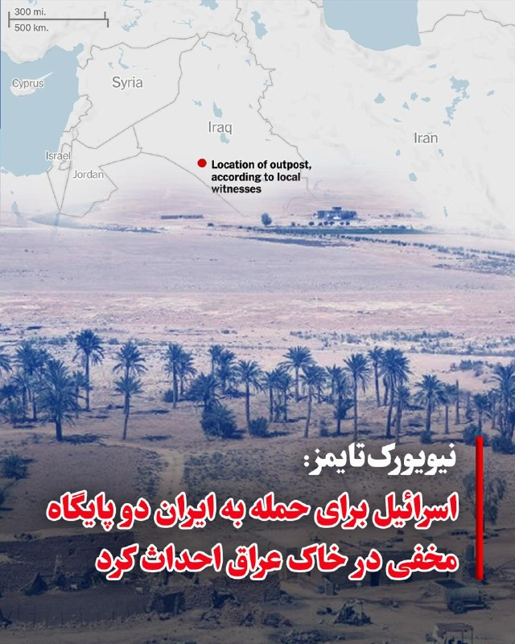

♦️روزنامه نیویورک‌تایمز روز یکشنبه ۲۷ اردیبهشت منتشر در گزارشی فاش کرد ارتش اسرائیل در جریان تقابل نظامی اخیر با جمهوری اسلامی ایران، دو پایگاه نظامی مخفی در عمق خاک عراق ایجاد و از آنها برای پشتیبانی عملیات خود استفاده کرده است.
پیش‌تر وال‌استریت ژورنال گزارش داده بود اسرائیل یک پایگاه مخفی را در بیابان‌های غرب عراق برای استفاده در جنگی که از فوریه آغاز شده بود، ایجاد کرده است. اما اکنون مقام‌های عراقی در گفت‌وگو با نیویورک‌تایمز جزئیات تازه‌ای ارائه کرده و از وجود پایگاه مخفی دومی نیز خبر داده‌اند.
نیویورک‌تایمز به نقل از یک مقام منطقه‌ای گزارش داد ساخت پایگاه نخست در اواخر سال ۲۰۲۴ آغاز شد و این مرکز مشخصا برای پشتیبانی از حمله ژوئن ۲۰۲۵ اسرائیل به ایران مورد استفاده قرار گرفت. به نوشته این روزنامه، این پایگاه اکنون غیرفعال است. با این حال، پایگاه دوم برای مدیریت عملیات‌های مرتبط با جنگ اخیر ایجاد شده، اما موقعیت دقیق و وضعیت کنونی آن همچنان مشخص نیست.
بر اساس این گزارش، اسرائیل این پایگاه‌ها را با دو هدف اصلی ایجاد کرده است: کاهش زمان پرواز جنگنده‌ها برای انجام حملات در عمق خاک ایران و ایجاد یک مرکز عملیاتی پیشرفته برای پشتیبانی از نیروی هوایی. نیویورک‌تایمز نوشت این پایگاه‌ها همچنین محل استقرار نیروهای ویژه و تیم‌های امداد و نجات اسرائیلی بوده‌اند تا در صورت سقوط احتمالی جنگنده‌ها، عملیات نجات خلبانان را اجرا کنند.
این روزنامه همچنین گزارش داد واشنگتن دست‌کم از وجود یکی از این پایگاه‌های مخفی در خاک عراق اطلاع داشته است.
به نوشته نیویورک‌تایمز، حضور این پایگاه‌ها پس از آن مورد توجه قرار گرفت که برخی ساکنان محلی متوجه تحرکات مشکوک شدند. در همین ارتباط، چوپانی محلی به نام «عوض الشمری» پس از برخورد تصادفی با یکی از این مراکز، هدف هلیکوپترها قرار گرفت و کشته شد.
این گزارش می‌افزاید اطلاعات ارائه‌شده از الشمری پیش از مرگ، ارتش عراق را به اعزام یک تیم شناسایی به منطقه واداشت. با این حال، این گروه با آتش نیروهای اسرائیلی روبه‌رو شد؛ درگیری‌ای که به کشته و زخمی شدن سه سرباز عراقی و عقب‌نشینی آنها انجامید.
‌🇸🇦 Indypersian

🤖 @VahidOOnLine

## VahidOOnLine — post 240632

  

♦️وزارت امور خارجه کره جنوبی اعلام کرد چو هیون، وزیر امور خارجه این کشور، روز یکشنبه در تماس تلفنی با عباس عراقچی، وزیر امور خارجه جمهوری اسلامی ایران، درباره آخرین تحولات منطقه‌ای، امنیت کشتی‌های کره‌ای و آزادی دریانوردی در تنگه هرمز گفتگو کرده است.
بر اساس اعلام وزارت خارجه کره جنوبی، وزیر خارجه این کشور در این تماس خواستار رفع ابهام و توضیح تهران درباره هدف قرار گرفتن یک کشتی کره‌ای در تنگه هرمز شده است.
 وزارت امور خارجه جمهوری اسلامی ایران نیز اعلام کرد چو هیون و عراقچی در این گفتگوی تلفنی درباره آخرین تحولات منطقه رایزنی کرده‌اند.
وزارت خارجه کره‌جنوبی روز یکشنبه اعلام کرده بود که کشتی باری متعلق به این کشور که روز ۱۴ اردیبهشت در تنگه هرمز دچار حادثه شده بود، هدف حمله «هواگردهای ناشناس» قرار گرفته است. مقام‌های امنیتی این کشور می‌گویند بررسی‌های سئول نشان می‌دهد که به احتمال بسیار زیاد جمهوری اسلامی ایران مسئول حمله به کشتی باری این کشور در تنگه هرمز بوده است.
‌🇸🇦 Indypersian

🤖 @VahidOOnLine

## VahidOOnLine — post 240631

  

♦️شبکه خبری فاکس نیوز، روز یکشنبه ۲۷ اردیبهشت ماه در گزارشی اعلام کرد، دونالد ترامپ، رئیس جمهور آمریکا که به تازگی از سفر چین بازگشته است، در حال بررسی از سرگیری اقدام نظامی علیه ایران است و روز یکشنبه با بنیامین نتانیاهو، نخست وزیر اسرائیل گفتگو خواهد کرد.
نتانیاهو صبح یکشنبه با اعلام آنکه «مانند هر چند روز یکبار» با ترامپ تماس خواهد گرفت، گفت: «مطمئنا بخش‌هایی از سفر او به چین و شاید موارد دیگر را خواهم شنید. احتمالات زیادی وجود دارد و ما برای هر سناریویی آماده‌ایم.»
تماس تلفنی با نتانیاهو در حالی صورت می‌گیرد که فاکس نیوز با استناد به ارزیابی‌های اطلاعاتی منطقه‌ای درباره ایران گزارش داد که ممکن است به دلیل ناامیدی ترامپ از تهران و «رد درخواست او برای دست کشیدن از آرمان‌های تسلیحات هسته‌ای»، حملات نظامی از سر گرفته شود.
دو مقام اطلاعاتی منطقه‌ای به فاکس نیوز گفتند: «ارزیابی غالب در داخل ایران این است که رئیس جمهوری ترامپ ممکن است به شروع مجدد اقدام نظامی متوسل شود و تهران اکنون عمدا راهبرد «فریب و تأخیر» را دنبال می‌کند، با این امید که خرید زمان، هرگونه بازگشت احتمالی به جنگ را پیچیده کند.»
‌🇸🇦 Indypersian

🤖 @VahidOOnLine

---
📅 بروزرسانی: 1405/02/27 17:24
---

## VahidOOnLine — post 240630

  

اردن حمله پهپادی به ابوظبی را که به وقوع آتش‌سوزی در خارج از محدوده داخلی نیروگاه هسته‌ای براکه منجر شد، به‌شدت محکوم کرد و آن را نقض آشکار حاکمیت امارات متحده عربی، تهدیدی علیه امنیت و ثبات این کشور و نیز نقض صریح قوانین بین‌المللی و منشور سازمان ملل متحد دانست.

وزارت خارجه اردن در بیانیه‌ای با اعلام همبستگی کامل با امارات متحده عربی تاکید کرد که اَمان در کنار ابوظبی و تمامی اقداماتی که برای حفظ امنیت، حاکمیت و سلامت شهروندان و ساکنان خود انجام دهد، خواهد ایستاد.
‌🏁 🇬🇧 IranintlTV

🤖 @VahidOOnLine

## VahidOOnLine — post 240629

  

♦️مسعود پزشکیان، رئیس‌جمهوری ایران، روز یکشنبه در دیدار با محسن نقوی، وزیر کشور پاکستان، از نقش اسلام‌آباد در تثبیت آتش‌بس قدردانی و ابراز امیدواری کرد تلاش‌های پاکستان به تقویت صلح و ثبات در منطقه کمک کند.
رئیس‌جمهوری ایران در این دیدار تاکید کرد «ایران خواهان روابطی صمیمانه و پایدار با کشورهای اسلامی منطقه است» و افزود اتحاد کشورهای اسلامی می‌تواند زمینه «مداخله قدرت‌های فرامنطقه‌ای» را کاهش دهد.
به گزارش خبرگزاری ایرنا، محسن نقوی، وزیر کشور پاکستان، نیز با اشاره به روابط تهران و اسلام‌آباد گفت ایران و پاکستان اکنون بیش از گذشته به یکدیگر نزدیک شده‌اند و روابط برادرانه دو کشور باید بیش از پیش گسترش یابد.
این دیدار در شرایطی انجام شده که پاکستان در هفته‌های اخیر در روند تلاش‌های دیپلماتیک و میانجی‌گری منطقه‌ای برای کاهش تنش‌ها و تثبیت آتش‌بس نقش فعالی ایفا کرده است.
‌🇸🇦 Indypersian

🤖 @VahidOOnLine

## VahidOOnLine — post 240628

  

اکسیوس گزارش داد که کوبا بیش از ۳۰۰ پهپاد نظامی خریداری کرده و اخیرا نیز گفت‌وگو درباره استفاده از آنها برای حمله به پایگاه آمریکا در خلیج گوانتانامو، شناورهای نظامی آمریکا و احتمالا شهر کی‌وست در ایالت فلوریدا، در حدود ۱۴۵ کیلومتری شمال هاوانا، را آغاز کرده است.

یک مقام ارشد آمریکایی به اکسیوس گفت این اطلاعات که می‌تواند دلیلی برای اقدام نظامی آمریکا شود، نشان می‌دهد دولت ترامپ تا چه اندازه کوبا را، به دلیل تحولات جنگ پهپادی و حضور مستشاران نظامی جمهوری اسلامی در هاوانا، تهدید تلقی می‌کند.

این مقام آمریکایی گفت: «وقتی به این نوع فناوری‌ها که تا این اندازه نزدیک هستند فکر می‌کنیم، و همچنین به طیفی از بازیگران خطرناک از گروه‌های تروریستی گرفته تا کارتل‌های مواد مخدر، مستشاران جمهوری اسلامی و روس‌ها، موضوع نگران‌کننده می‌شود.»
‌🏁 🇬🇧 IranintlTV

🤖 @VahidOOnLine

## VahidOOnLine — post 240627

روایت شما از بحران اقتصادی در آتش‌بس- یکشنبه ۲۷ اردیبهشت‌ماه🗣

🔹واقعا دیگه هیچ امیدی ندارم. سه ماهه به‌خاطر قطعی اینترنت بیکار موندیم. پهنای باند این‌قدر کمه که نه فیلترشکن جواب داده و نه اینترنت‌پرو.

🔹من مدرس آنلاین زبان بودم. الان دو ماه گذشته و حتی یک کلاس هم نتونستم برگزار کنم. از پس‌اندازم فقط دو میلیون تومان مونده و نمی‌تونم کار هم پیدا کنم.

🔹منم مثل خیلی از هم‌وطنان بیکار شدم و برای ادامه زندگی، با قسط و قرض یه کامیون خریدم. اما سوخت کامیون خیلی کمه و ناچارم یک لیتر گازوئیل رو ۵۰ تا ۷۵ هزار تومان بخرم که اصلاً مقرون‌به‌صرفه نیست. از یه طرف از بیکاری دارم دیوونه میشم و از طرف دیگه شرمنده زن و بچه شدم.

🔹اسنپ سوار شدم، کنارم روپوش پزشکی و چند تا کتاب دیدم. راننده جوان گفت که دانشجو هست و اوقات بین کلاس و بیمارستان اسنپ کار می‌کند.

🔹دلم می‌خواد خون گریه کنم. سه ماه هست که بیکارم. پانزده روز دیگه باید خونه ۵۰ متری استیجاری‌ رو تحویل بدم، در حالی که اجاره و ودیعه سر به فلک کشیده و من فقط صد میلیون تومان پول ودیعه بیشتر ندارم.

🔹من و همسرم تریدر هستیم و اول زندگی مشترکمونه. از جنگ ۱۲ روزه تا الان همش از جیب، اجاره و هزینه‌هامون رو دادیم. اما دیگه نمی‌دونیم باید چکار کنیم. امیدوارم این همه سختی و مشکلات نتیجه‌اش برگشت پهلوی باشه.

🔹۱۰ تیکه فیله‌مرغ، ۴ تیکه بوقلمون و یک شانه تخم‌مرغ شد شش میلیون و ۳۰۰ هزار تومان. واقعا باورنکردنیه.

🔹 دانشجو علوم پزشکی تهران هستم. متاسفانه هیچ دسترسی به اینترنت آزاد و بین‌الملل برای دانشجویان در نظر گرفته نشده. مقالات، پروژه‌ها و پایان‌نامه‌های ما به‌خاطر نداشتن دسترسی به چیزی که حق طبیعی هر انسانی است، ناتمام مونده.
‌🏁 🇬🇧 IranintlTV

🤖 @VahidOOnLine

## VahidOOnLine — post 240626

♦️حمیدرضا حاجی‌بابایی، نایب رئیس مجلس شورای اسلامی در برنامه‌ای تلویزیونی کشورهای منطقه را تهدید کرد در صورت وارد شدن آسیب به زیرساخت‌ها یا صادرات نفت ایران، تهران کاری می‌کند که مدت قابل توجهی هیچ کشور دنیا به نفت منطقه دسترسی نداشته باشد.

او گفت: «اگر قرار باشد به نفت ما آسیب برسد، ما کاری می‌کنیم که دیگر آمریکا حداقل تا یک مدت قابل‌توجهی از این منطقه نفتی گیرش نیاید، یعنی دنیا نفتی گیرش نیاید. من یک نکته می‌خواهم بگویم، آمریکا مخصوصا ترامپ، امکان ندارد کاری را که بتواند انجام دهد و به نفع‌شان باشد، انجام ندهد. اگر کسی غیر از این فکر کند، یا ساده‌لوح است یا ممکن است اشکال در نوع فکر کردنش باشد.»
این تهدیدها در حالی مطرح می‌شود که جمهوری اسلامی در ماه‌های اخیر بارها تاسیسات نفتی در کشورهای منطقه را هدف حملات موشکی و پهپادی قرار داده است.
‌🇸🇦 Indypersian

🤖 @VahidOOnLine

## VahidOOnLine — post 240625

  <a href="telegram/content/VahidOOnLine_240625_1779026055.mp4" target="_blank">🎬 Download video</a>

راهپیمایی ایرانیان ساکن گوتنبرگ سوئد، یکشنبه ۲۷ اردیبهشت
‌🏁 🇬🇧 ManotoTV

🤖 @VahidOOnLine

## VahidOOnLine — post 240624

♦️تیم فوتبال زنان نائگوهیانگ اف‌سی کره شمالی روز یکشنبه برای حضور در مرحله نیمه‌نهایی لیگ قهرمانان زنان آسیا وارد کره جنوبی شد، سفری که نخستین حضور ورزشکاران کره شمالی در کره جنوبی طی هشت سال گذشته محسوب می‌شود.
هیات اعزامی این تیم شامل ۲۷ بازیکن و ۱۲ عضو کادر فنی است و پیش از دیدار روز چهارشنبه برابر تیم زنان سوون اف‌سی وارد کره جنوبی شده است. وزارت اتحاد کره جنوبی اعلام کرد این سفر بر اساس قوانین تبادل میان دو کره مجوز گرفته است و در صورت حذف تیم کره شمالی اعضای آن در اولین فرصت به کشورشان بازخواهند گشت.
به گزارش خبرگزاری یونهاپ کره جنوبی، استقبال عمومی از این مسابقه چشمگیر بوده و تمامی ۷ هزار و ۸۷ بلیت عرضه‌شده برای عموم در کمتر از یک روز به فروش رسیده است.
این سفر در حالی انجام می‌شود که روابط دو کره طی سال‌های اخیر با تنش‌های فزاینده همراه بوده است. پیونگ‌یانگ اخیرا کره جنوبی را «خصمانه‌ترین کشور» توصیف کرده و ایده اتحاد دو کره را رد کرده است. در مقابل، لی جائه‌میونگ، رئیس‌جمهوری کره جنوبی، خواهان بهبود روابط شده است.
‌🇸🇦 Indypersian

🤖 @VahidOOnLine

## VahidOOnLine — post 240623

  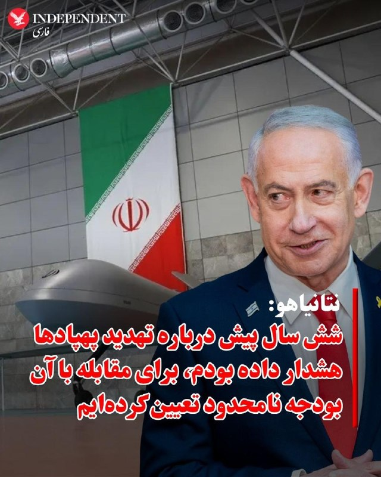

♦️بنیامین نتانیاهو، نخست‌وزیر اسرائیل، روز یکشنبه در نشست هفتگی کابینه این کشور گفت شش سال پیش درباره تهدید پهپادها هشدار داده بود، اما اکنون با پیشرفت این فناوری و افزایش تهدیدها، اسرائیل در حال اجرای اقدامات تازه‌ای برای مقابله با آن است.

نتانیاهو گفت: «شش سال پیش در جلسه کابینه درباره تهدید پهپادها هشدار دادم.» او افزود در آن زمان این تهدید را بیشتر ابزاری برای ترور افراد می‌دانست، اما به گفته او تحولات سال‌های اخیر، به‌ویژه جنگ اوکراین، نشان داد پهپادها می‌توانند به عاملی تعیین‌کننده در میدان‌های نبرد تبدیل شوند.
نخست‌وزیر اسرائیل همچنین با اشاره به عملکرد نهادهای امنیتی این کشور گفت ارتش و وزارت دفاع طی سال‌های گذشته «صدها و شاید هزاران» تلاش برای حمله به نیروهای اسرائیلی با پهپادها و هواپیماهای بدون سرنشین را خنثی کرده‌اند.

او تاکید کرد: «آنها موفق شده‌اند و هر بار که تهدید جدیدی ایجاد می‌شود، آن را خنثی می‌کنند.»

نتانیاهو در ادامه از تشکیل یک تیم ویژه برای مقابله با تهدید پهپادهای فیبر نوری حزب‌الله خبر داد و گفت این گروه طی دو هفته گذشته سه نشست برگزار کرده است.
‌🇸🇦 Indypersian

🤖 @VahidOOnLine

## VahidOOnLine — post 240622

ولی‌الله بیاتی، عضو کمیسیون امور داخلی مجلس، به ایسنا گفت: «مذاکرات باید ادامه پیدا کند، اما در عین حال دست ما روی ماشه است و آمادگی کامل برای ادامه نبرد وجود دارد.»
بیاتی گفت: «وضعیت «نه صلح نه جنگ» خیلی از کارها را در کشور معطل نگه می دارد. این وضعیت آسیب زیادی وارد می‌کند.»
‌🏁 🇬🇧 IranintlTV

🤖 @VahidOOnLine

## VahidOOnLine — post 240621

  

♦️سفارت پاکستان در تهران اعلام کرد محسن نقوی، وزیر کشور پاکستان که روز گذشته وارد تهران شده بود، نزدیک به سه ساعت در نهاد ریاست‌جمهوری حضور داشته و با مسعود پزشکیان دیداری خصوصی برگزار کرده است.
به گقته سفارت پاکستان، این دیدار حدود ۹۰ دقیقه طول کشیده و اسکندر مومنی، وزیر کشور جمهوری اسلامی ایران و عباس عراقچی، وزیر امور خارجه نیز در این جلسه حضور داشتند.
محسن نقوی روز شنبه در سفری اعلام‌نشده وارد تهران شده بود و منابع خبری از احتمال گفتگوهای او با مقام‌های ایرانی درباره تحولات منطقه و مسائل دوجانبه خبر داده بودند.
‌🇸🇦 Indypersian

🤖 @VahidOOnLine

## VahidOOnLine — post 240620

  

♦️آژانس بین‌المللی انرژی اتمی (IAEA) روز یکشنبه ۲۷ اردیبهشت ماه، نسبت به حمله پهپادی در نزدیکی نیروگاه هسته‌ای براکه امارات متحده عربی که به وقوع آتش‌سوزی منجر شد، «نگرانی شدید» خود را ابراز کرد، اما اعلام کرد سطح تشعشعات در این منطقه همچنان در وضعیت عادی قرار دارد.
آژانس در پیامی در شبکه اجتماعی اکس اعلام کرد رافائل گروسی، مدیرکل این نهاد، درباره این حادثه ابراز نگرانی کرده و گفته است: «فعالیت‌های نظامی که ایمنی هسته‌ای را تهدید می‌کند، غیرقابل قبول است.»
آژانس بین‌المللی انرژی اتمی همچنین اعلام کرد مقام‌های امارات این نهاد را در جریان گذاشته‌اند که سطح تشعشعات در نیروگاه هسته‌ای براکه طبیعی است و هیچ موردی از مصدومیت گزارش نشده است.
دفتر رسانه‌ای ابوظبی روز یکشنبه اعلام کرد از آتش‌سوزی ناشی از حمله پهپادی به یک ژنراتور برق در خارج از محیط داخلی نیروگاه هسته‌ای براکه در منطقه الظفره خبر داد.
‌🇸🇦 Indypersian

🤖 @VahidOOnLine

## VahidOOnLine — post 240619

  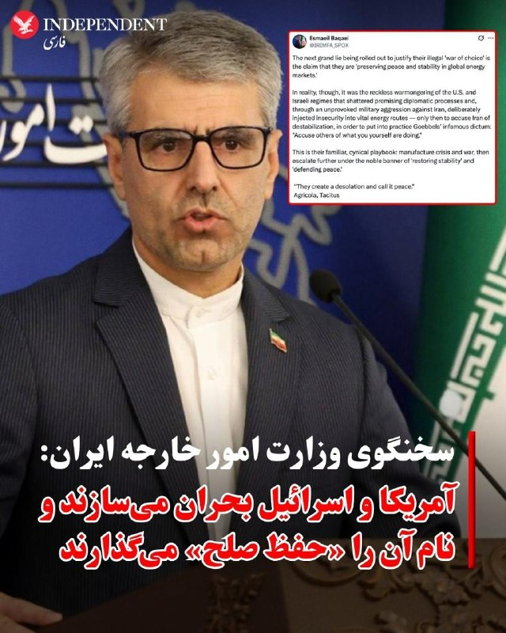

♦️اسماعیل بقایی، سخنگوی وزارت امور خارجه جمهوری اسلامی ایران، روز یکشنبه در پیامی در شبکه اجتماعی اکس، آمریکا و اسرائیل را متهم کرد که برای توجیه «جنگ انتخابی» و غیرقانونی، روایت «حفظ صلح و ثبات در بازارهای جهانی انرژی» را مطرح می‌کنند.

بقایی نوشت «سیاست‌های جنگ‌طلبانه و بی‌ملاحظه آمریکا و اسرائیل» روندهای دیپلماتیک را از بین برده است. بقایی آمریکا و اسرائیل را به تحمیل ناامنی در به مسیرهای حیاتی انرژی متهم کرد و مدعی شد واشنگتن و تل‌آویو ایران را به بی‌ثبات‌سازی متهم می‌کنند.

سخنگوی وزارت امور خارجه جمهوری اسلامی ایران این رویکرد را «الگوی همیشگی» آمریکا و اسرائیل توصیف کرد و نوشت: «آن‌ها بحران و جنگ ایجاد می‌کنند و سپس با شعار بازگرداندن ثبات و دفاع از صلح، مسیر تشدید تنش را در پیش می‌گیرند.»

او در پایان با نقل‌قولی تاریخی از کتاب آگریکولا اثر تاسیتوس (مورخ مشهور رومی) نوشت: «آن‌ها ویرانی می‌آفرینند و نامش را صلح می‌گذارند.»
‌🇸🇦 Indypersian

🤖 @VahidOOnLine

## VahidOOnLine — post 240618

  

♦️علیرضا یوسفی، ملی‌پوش دسته ۱۱۰+ کیلوگرم وزنه‌برداری ایران، در مسابقات قهرمانی آسیا در هند با ثبت عملکردی درخشان موفق شد رکورد دوضرب جهان را بشکند و سه مدال ارزشمند برای ایران به دست آورد.
یوسفی روز یکشنبه در شهر گاندی‌نگر هند، در رقابت با وزنه‌برداران مطرحی از کره‌جنوبی، بحرین، چین‌تایپه، ازبکستان و امارات روی تخته رفت و در پایان با کسب مدال طلای دوضرب، نقره مجموع و برنز یک‌ضرب، یکی از بهترین نتایج کاروان ایران را ثبت کرد.
این وزنه‌بردار ایرانی در حرکت سوم دوضرب موفق شد وزنه ۲۶۱ کیلوگرمی را مهار کند و ضمن کسب مدال طلا، رکورد جدید جهان را در این حرکت به نام خود ثبت کند. او پیش‌تر در حرکت دوم برای مهار همین وزنه ناموفق بود اما در سومین تلاش خود توانست این رکورد تاریخی را به ثبت برساند.
یوسفی در بخش یک‌ضرب ابتدا وزنه ۱۷۷ کیلوگرمی و سپس ۱۸۴ کیلوگرمی را با موفقیت بالای سر برد، اما در مهار وزنه ۱۸۹ کیلوگرمی ناکام ماند و به مدال برنز رسید.
او در دوضرب نیز ابتدا وزنه ۲۴۸ کیلوگرمی را مهار کرد و سپس در سومین حرکت، وزنه ۲۶۱ کیلوگرمی را بالای سر برد تا رکورد جهان را جابه‌جا کند.
‌🇸🇦 Indypersian

🤖 @VahidOOnLine

## VahidOOnLine — post 240617

  

♦️خبرگزاری فارس با انتشار متنی مدعی شد جزئیاتی از پاسخ آمریکا به پیشنهادهای ایران در جریان مذاکرات به دست آورده است؛ گزارشی که در آن از پنج شرط اصلی واشنگتن برای توافق با تهران سخن گفته شده است.
براساس شنیده‌های فارس، شروط اعلام‌شده از سوی آمریکا شامل موارد زیر است:
«عدم پرداخت هرگونه غرامت و خسارت از سوی آمریکا»، «خروج و تحویل ۴۰۰ کیلوگرم اورانیوم از ایران به آمریکا»، «فعال ماندن تنها یک مجموعه از تاسیسات هسته‌ای ایران»، «عدم پرداخت حتی ۲۵ درصد از دارایی‌های بلوکه‌شده ایران» و «منوط‌شدن توقف جنگ در همه ساحتها به انجام مذاکره».
این گزارش تاکید می‌کند که حتی در صورت تحقق این شروط از سوی ایران، تهدید «تجاوز» آمریکا و اسرائیل همچنان پابرجا خواهد بود.
به گفته فارس، در مقابل، ایران انجام هرگونه مذاکره را منوط به تحقق پنج پیش‌شرط اعتمادساز دانسته است: «پایان جنگ در همه جبهه‌ها به‌ویژه لبنان»، «رفع تحریم‌های ضدایرانی»، «آزادسازی پول‌های بلوکه‌شده ایران»، «جبران خسارات ناشی از جنگ» و «پذیرش حق حاکمیت ایران بر تنگه هرمز».
‌🇸🇦 Indypersian

🤖 @VahidOOnLine

---
📅 بروزرسانی: 1405/02/27 15:31
---

## VahidOOnLine — post 240616

ویدیوهای رسیده به ایران‌اینترنشنال نشان می‌دهد مراسم تولد ایلیا قدسی، جاویدنام ۱۷ ساله کشته‌شده در شامگاه ۱۸ دی، بر سر مزارش برگزار شده است. مادر این نوجوان جان‌باخته با سخنرانی در این مراسم خطاب به پسرش گفت: «تو قدم بزرگی برای ما برداشتی. راهت را ادامه خواهیم داد.»
‌🏁 🇬🇧 IranintlTV

🤖 @VahidOOnLine

## VahidOOnLine — post 240615

  <a href="telegram/content/VahidOOnLine_240615_1779019304.mp4" target="_blank">🎬 Download video</a>

تجمع ایرانیان لیسبون پرتغال مقابل کاخ ریاست‌جمهوری، یکشنبه ۲۷ اردیبهشت
‌🏁 🇬🇧 ManotoTV

🤖 @VahidOOnLine

## VahidOOnLine — post 240614

  

آژانس بین‌المللی انرژی اتمی اعلام کرد امارات متحده عربی به این نهاد اطلاع داده سطح پرتو در نیروگاه هسته‌ای براکه پس از حمله پهپادی به نزدیکی آن، در سطح عادی باقی مانده و هیچ مصدومی گزارش نشده است. دفتر رسانه‌ای ابوظبی روز یکشنبه از حمله پهپادی به این نیروگاه خبر داده بود.
‌🏁 🇬🇧 IranintlTV

🤖 @VahidOOnLine

## VahidOOnLine — post 240613

  

سازمان حقوق بشر ایران اعلام کرد دستگاه قضایی جمهوری اسلامی «فعالانه» از وکلای تسخیری برای تسهیل و تسریع سیستماتیک اعدام معترضان بازداشت‌شده بهره می‌گیرد. این سازمان افزود این وکلا با خودداری از برقراری ارتباط با خانواده متهمان آنان را از روند دادرسی بی‌اطلاع نگه می‌دارند.
به نوشته این سازمان، مستندات نشان می‌دهد وکلای تسخیری بلافاصله پس از صدور حکم، با ثبت درخواست تجدیدنظر، موکلان خود را از مهلت قانونی محروم می‌کنند و با ایجاد موانع عامدانه در مسیر دسترسی به وکلای مستقل، زمینه اجرای سریع احکام اعدام را فراهم می‌سازند.
این سازمان نوشت بازداشت‌شدگان اعتراضات بدون دفاع موثر می‌مانند؛ وکلای تسخیری اعترافات اجباری و ادعاهای شکنجه را به چالش نمی‌کشند و مدارک تبرئه‌کننده ارائه نمی‌دهند. در نتیجه دادگاه‌ها بر اساس شواهد بدون اعتراض حکم اعدام صادر و دیوان عالی کشور نیز احکام را بدون بررسی حقوقی واقعی تایید می‌کند.
این سازمان هشدار داد این اقدامات نقض سیستماتیک دادرسی عادلانه است و اعدام‌ها را براساس حقوق بین‌الملل در زمره اعدام‌های خودسرانه قرار می‌دهد.
‌🏁 🇬🇧 IranintlTV

🤖 @VahidOOnLine

## VahidOOnLine — post 240612

🗣روایت شما از زندگی در آتش‌بس- یکشنبه ۲۷ اردیبهشت‌ماه

🔹باورم نمیشه در قرن ۲۱، یک کشور نزدیک به ۳ ماهه بدون اینترنت مونده و برای هیچ سازمان بین‌المللی هم اهمیت نداره.

🔹دانش‌آموز هستم. نمی‌دانم باید امتحان‌ها رو چیکار کنم. یک اینترنت ملی داریم که اون هم کار نمی‌کند تا بتونیم درس بخونیم. یک دل‌خوشی داشتم، اون هم اینترنت بود که از ما گرفتن.

🔹دانشگاه آزاد بندرعباس برای خدماتی که ارائه نشده و کلاس‌هایی که نصفه‌ و نیمه تشکیل شده، شهریه کامل می‌گیرد.

🔹شورای‌عالی انقلاب فرهنگی هر روز یه حرفی می‌زنه. الان ما کلاس یازدهمی‌ها و کنکوری‌ها بلاتکلیف موندیم که امتحان نهایی چی می‌شه. جمهوری اسلامی علاوه بر اقتصاد و امنیت، فضای آموزش رو هم به نابودی کشونده.

🔹من یازدهم ریاضی‌ام، میگن از حواشی آموزشی فاصله بگیرید و تمرکزتون رو بگذارید روی درس. چطوری آخه وقتی کل کشور شده حاشیه؟ ما مثل بچه‌ شما در مدرسه‌ای با شهریه ۵۰۰ میلیون تومانی درس نمی‌خونیم.
‌🏁 🇬🇧 IranintlTV

🤖 @VahidOOnLine

## VahidOOnLine — post 240611

  

بنیامین نتانیاهو، نخست‌وزیر اسرائیل، گفت: «امروز با دوستمان، رییس‌جمهور ترامپ گفت‌وگو خواهم کرد. مطمئنا برداشت‌های او از سفرش به چین و شاید مسائل دیگر را خواهم شنید. قطعا احتمالات زیادی وجود دارد و ما برای هر سناریویی آماده‌ایم.» نتانیاهو افزود: «چشمان ما به ایران دوخته شده است.»
‌🏁 🇬🇧 IranintlTV

🤖 @VahidOOnLine

## VahidOOnLine — post 240610

  <a href="telegram/content/VahidOOnLine_240610_1779019307.mp4" target="_blank">🎬 Download video</a>

مقام‌های ابوظبی اعلام کردند در پی حمله پهپادی، یک ژنراتور برق خارج از محدوده داخلی نیروگاه هسته‌ای براکه در منطقه الظفره دچار آتش‌سوزی شد.

بر اساس این اعلام، حادثه آسیب جانی نداشت و هیچ اثری بر سطح ایمنی پرتوی نیروگاه برجای نگذاشت. مقام‌ها گفته‌اند همه اقدامات احتیاطی لازم انجام شده و جزئیات بیشتر در صورت دریافت اطلاعات تازه اعلام خواهد شد.

سازمان فدرال مقررات هسته‌ای امارات نیز تاکید کرد آتش‌سوزی بر ایمنی نیروگاه یا آمادگی سامانه‌های حیاتی آن اثری نداشته و همه واحدهای نیروگاه به‌طور عادی در حال فعالیت‌اند.
‌🏁 🇬🇧 ManotoTV

🤖 @VahidOOnLine

## VahidOOnLine — post 240609

  <a href="telegram/content/VahidOOnLine_240609_1779019308.mp4" target="_blank">🎬 Download video</a>

روزنامه بریتانیایی تلگراف گفته است برخی افراد نزدیک به دونالد ترامپ، رئیس‌جمهوری آمریکا، پیشنهاد کرده‌اند امارات متحده عربی جزیره لاوان در خلیج فارس را تصرف کند.

بر اساس این ادعا، یک مقام ارشد امنیتی پیشین در دولت ترامپ به تلگراف گفت هدف از چنین پیشنهادی، افزایش نقش امارات در رویارویی با ایران بدون اعزام نیروهای زمینی آمریکا است.

این گزارش پس از آن منتشر می‌شود که وال‌استریت ژورنال از حملات پنهانی امارات به اهدافی در ایران خبر داد. به گزارش رویترز به نقل از این روزنامه، یکی از این حملات در اوایل آوریل پالایشگاهی در جزیره لاوان را هدف قرار داده بود، ادعایی که امارات آن را علنا تایید نکرده است.
‌🏁 🇬🇧 ManotoTV

🤖 @VahidOOnLine

## VahidOOnLine — post 240608

  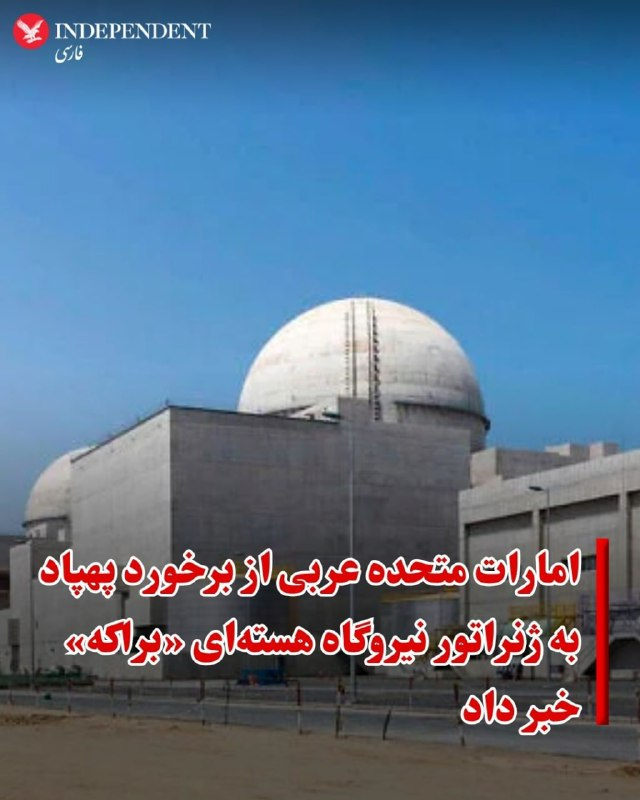

♦️امارات متحده عربی می‌گوید ژنراتور نیروگاه هسته‌ای براکه هدف یک پهپاد قرار گرفته است اما هیچ آسیبی ندیده و سطح تشعشعات رادیواکتیو تغییری نکرده است.

دفتر رسانه‌ای ابوظبی روز یکشنبه اعلام کرد که مقامات اماراتی به آتش‌سوزی ناشی از حمله پهپادی به یک ژنراتور برق در خارج از محیط داخلی نیروگاه هسته‌ای براکه در منطقه الظفره واکنش نشان دادند.

بنابر اعلام مقام‌های اماراتی هیچ آسیبی گزارش نشده، سطح ایمنی رادیولوژیکی تحت تأثیر قرار نگرفته و سازمان فدرال تنظیم مقررات هسته‌ای تأیید می‌کند که سیستم‌های ضروری نیروگاه به طور عادی کار می‌کنند.

جزئیاتی در خصوص اینکه این پهپاد از کجا به سمت نیروگاه هسته‌ای امارات پرتاب شده منتشر نشده است.
‌🇸🇦 Indypersian

🤖 @VahidOOnLine

## VahidOOnLine — post 240607

  

خبرگزاری ایلنا گزارش داد که تعداد ۱۳۸ نفر از کارمندان و کارگران شرکت ملی مس از زیر مجموعه‌های هلدینگ ایمیدرو، سازمان توسعه و نوسازی معادن و صنایع معدنی ایران، تعدیل شده‌اند.

یکی از کارمندان اخراجی این شرکت به ایلنا گفت: «در ۲۴ اسفندماه ۱۴۰۴، تنها ۵ روز مانده به پایان سال، ۱۳۸ پرسنل متخصص با یک نامه و پیامک تحت عنوان «عدم تمدید قرارداد به دلیل نداشتن پروژه جدید» از کار بیکار شدند.»

کارمند دیگری گفته است: «تعدیل‌ها بدون استعلام از مسئولان فنی برای نگهداری یا عدم نگهداری نیروها صادر شده است. در واقع تقریبا تمام نیروهای با سابقه مجموعه اخراج شدند.»
‌🏁 🇬🇧 IranintlTV

🤖 @VahidOOnLine

---
📅 بروزرسانی: 1405/02/27 14:22
---

## VahidOOnLine — post 240606

  

دفتر رسانه‌ای ابوظبی اعلام کرد که در پی حمله پهپادی به محوطه نیروگاه هسته‌ای براکه در الظفره، ژنراتور برق در خارج از محوطه داخلی نیروگاه دچار آتش‌سوزی شده است. این نهاد افزود که این حادثه آسیب جانی نداشته است.
‌🏁 🇬🇧 IranintlTV

🤖 @VahidOOnLine

## VahidOOnLine — post 240605

  

دفتر رسانه‌ای ابوظبی اعلام کرد که در پی حمله پهپادی به محوطه نیروگاه هسته‌ای براکه در الظفره، ژنراتور برق در خارج از محوطه داخلی نیروگاه دچار آتش‌سوزی شده است. این نهاد افزود که این حادثه آسیب جانی نداشته است.
‌🏁 🇬🇧 IranintlTV

🤖 @VahidOOnLine

## VahidOOnLine — post 240604

  

♦️خبرگزاری فارس، نزدیک به سپاه پاسداران، روز یک‌شنبه ۲۷ اردیبهشت گزارش داد که محمدباقر قالیباف، رئیس مجلس شورای اسلامی به عنوان نماینده ویژه ایران در امور چین تعیین شده است.

فارس بدون توضیح دیگری نوشته است:‌ «پیشتر علی لاریجانی و عبدالرضا رحمانی‌ فضلی چنین مسئولیتی را برعهده داشتند.»

اعلام تعیین قالیباف، عضو سابق سپاه پاسداران به عنوان نماینده ویژه در امور چین دو روز پس از دیدار رسمی دونالد ترامپ، رئیس جمهوری آمریکا از کشور چین صورت گرفته است.

دونالد ترامپ، رئیس‌جمهوری آمریکا، روز جمعه اعلام کرد شی جین‌پینگ، رئیس‌جمهوری چین، «قویا» معتقد است که ایران نباید به سلاح هسته‌ای دست پیدا کند. او همچنین افزود که همتای چینی‌اش خواهان بازگشایی تنگه هرمز است.

محمدباقر قالیباف، رئیس مجلس شورای اسلامی پیشتر به عنوان مذاکره کننده ارشد جمهوری اسلامی با آمریکا در مذاکرات پاکستان حاضر شده بود.
‌🇸🇦 Indypersian

🤖 @VahidOOnLine

## VahidOOnLine — post 240603

  

حمیدرضا حاجی‌بابایی، نایب‌رییس مجلس، گفت: «اگر قرار شد نفت ما را بزنند، باید نفت منطقه را بزنیم. چه آن‌که ادعای دوستی می‌کند، چه آن‌که دشمنی می‌کند.»

او گفت: «به نفت ما آسیب برسد، کاری می‌کنیم که آمریکا و تمام جهان تا مدت قابل توجهی از این منطقه نفت به دست نیاورد. اگر انرژی ما را بزنند، باید انرژی منطقه را بزنیم.»
‌🏁 🇬🇧 IranintlTV

🤖 @VahidOOnLine

## VahidOOnLine — post 240602

  

♦️امیر قلعه‌نویی، سرمربی تیم ملی فوتبال ایران روز شنبه ۲۶ اردیبهشت لیست ۳۰ نفره خود برای جام جهانی ۲۰۲۶ را اعلام کرد و گفت: «خدا را گواه می‌گیرم در انتخاب بازیکنان چیزی جز معیارهای فنی موضوع دیگری دخیل نبوده و من تنها بر اساس این معیار ٣٠ بازیکن را انتخاب کردم.»

این درحالیست که در این لیست، نام سردار آزمون،‌ مهاجم شناخته شده ایرانی دیده نمی‌شود. آزمون پس از موضع‌گیری‌های اخیرش در مخالفت با جمهوری اسلامی، ‌از تیم ملی خط خورد.

این اسامی در حالی اعلام شده است که هنوز تکلیف ویزای تیم ملی مشخص نیست.

دروازه‌بان‌ها: علیرضا بیرانوند، حسین حسینی، پیام نیازمند، محمد خلیفه،
مدافعان: احسان حاج صفی، میلاد محمدی، امید نورافکن، شجاع خلیل زاده، علی نعمتی، حسین کنعانی، دانیال ایری، رامین رضاییان، صالح حردانی
هافبک‌ها: سامان قدوس، روزبه چشمی، امیرمحمد رزاق نیا، سعید عزت‌اللهی، محمد قربانی،علیرضا جهانبخش، آریا یوسفی، محمد محبی، مهدی قائدی، مهدی ترابی
مهاجمان: مهدی طارمی، هادی حبیبی‌نژاد، امیرحسین حسین‌زاده، امیرحسین محمودی، دنیس درگاهی، کسری طاهری و علی علیپور
بازیکنان دعوت شده به اردوی تیم ملی در ترکیه هستند.
‌🇸🇦 Indypersian

🤖 @VahidOOnLine

## VahidOOnLine — post 240601

  <a href="telegram/content/VahidOOnLine_240601_1779015173.mp4" target="_blank">🎬 Download video</a>

اعتراض به سانسور، قطعی اینترنت، سرکوب و حبس معترضان در تجمع ایرانیان قبرس جنوبی، شنبه ۲۶ اردیبهشت
‌🏁 🇬🇧 ManotoTV

🤖 @VahidOOnLine

## VahidOOnLine — post 240600

  

♦️خبرگزاری میزان، رسانه قوه قضاییه جمهوری اسلامی، روز یکشنبه ۲۷ اردیبهشت از برگزاری نخستین جلسه دادگاه رسیدگی به اتهامات صادق ساعدی‌نیا، مدیرعامل مجموعه «املاک و صنایع غذایی ساعدی‌نیا» در دادگاه انقلاب قم خبر داد.
بنا بر اعلام قوه قضائیه، ساعدی‌نیا با اتهاماتی از جمله «فعالیت تبلیغی یا رسانه‌ای برخلاف امنیت کشور»، «اقدام عملیاتی در راستای فراخوان‌های گروه‌های معاند برای برهم زدن امنیت کشور» و «فعالیت تبلیغی علیه نظام» به دلیل حمایت از اعتصاب‌ها و اعتراضات دی‌ماه روبه‌رو است.
«انتشار استوری»، «فعالیت در فضای مجازی»، «حضور در تجمعات اعتراضی»، «تعطیل کردن کافه‌ها و مغازه‌ها» و تشویق برخی کارکنانش به حضور در اعتراضات از مصادیق اتهامات مطرح‌شده علیه صادق ساعدی‌نیا عنوان شده است.
‌🇸🇦 Indypersian

🤖 @VahidOOnLine

---
📅 بروزرسانی: 1405/02/27 12:57
---

## VahidOOnLine — post 240599

♦️ویدیوهای منتشرشده در شبکه‌های اجتماعی که گفته می‌شود مربوط به جزیره مارو (شیدور) و مناطق اطراف جزیره لاوان است، آلودگی گسترده نفتی در آب‌ها و سواحل خلیج فارس را در روز جمعه ۲۵ اردیبهشت نشان می‌دهد. در این تصاویر، لکه‌های وسیع نفتی، تغییر رنگ آب دریا و آلودگی شدید نوار ساحلی قابل مشاهده است.
خبرگزاری رویترز نیز با استناد به تصاویر ماهواره‌ای ثبت‌شده از وقوع یک نشت نفتی گسترده در نزدیکی جزیره خارگ، مهم‌ترین پایانه صادرات نفت ایران، خبر داده است. بر اساس این گزارش، لکه نفتی مشاهده‌شده در تصاویر ماهواره‌های کوپرنیک، منطقه‌ای حدود ۴۵ تا ۹۵ کیلومتر مربع را در غرب جزیره خارگ پوشش داده است.
فعالان محیط زیست و کاربران شبکه‌های اجتماعی، وضعیت جزیره مارو (شیدور) معروف به «مالدیو ایران» را «فاجعه‌بار» توصیف کرده‌اند. برخی گزارش‌ها علت این آلودگی را حملات انجام‌شده به تاسیسات نفتی جزیره لاوان در فروردین‌ماه عنوان می‌کنند.
در برخی ویدیوهای منتشرشده، علاوه بر آب‌های آلوده، تصاویری از دود و انفجار در جزیره نیز دیده می‌شود. گفته می‌شود این حملات توسط امارات متحده عربی انجام شده است.
‌🇸🇦 Indypersian

🤖 @VahidOOnLine

## VahidOOnLine — post 240598

  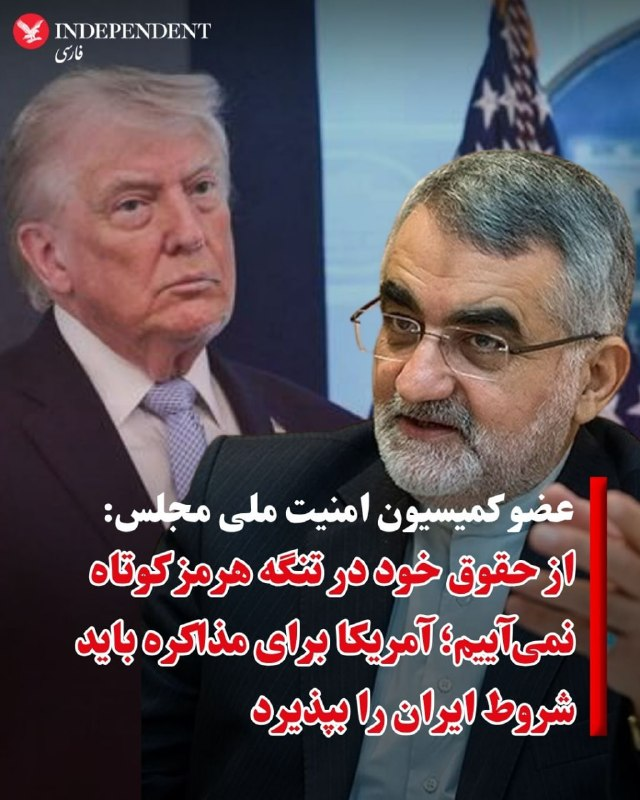

♦️علاءالدین بروجردی، عضو کمیسیون امنیت ملی مجلس روز یکشنبه درباره مذاکرات با آمریکا گفت:  جمهوری اسلامی ایران از حقوق خود در تنگه هرمز و همچنین مسائل هسته‌ای کوتاه نمی‌آید.

بروجردی  با بیان اینکه مذاکره بدون پذیرش شروط ایران بی‌معناست، گفت: «طرف مقابل باید بپذیرد که جمهوری اسلامی حاکم بر تنگه هرمز است. بدانند که موضوع هسته‌ای هیچ ارتباطی با آمریکا ندارد و به هیچ‌وجه حاضر نیستیم از آن کوتاه بیاییم.»

این عضو کمیسیون امنیت ملی مجلس درباره شروط جمهوری اسلامی برای حضور در مذاکرات، گفت: «آنها باید بپذیرند که هرگونه توافق در مذاکرات احتمالی آینده، توافق با کل جبهه مقاومت اعم از لبنان، عراق و یمن خواهد بود. اگر این قواعد را قبول نداشته باشند، ورود به مذاکره بی‌فایده خواهد بود.»

علاءالدین بروجردی همچنین تاکید کرد که «آنها باید بپذیرند اموال بلوکه‌شده آزاد شود و تحریم‌ها برداشته شوند. پذیرش این شروط الزامی است.»

این اظهارات در حالی مطرح شده است که دونالد ترامپ، روز شنبه ۲۶ اردیبهشت به جمهوری اسلامی هشدار داد که اگر به‌زودی بر سر یک توافق صلح موافقت نکند، «دوران بسیار سختی» را پیش رو خواهد داشت.
‌🇸🇦 Indypersian

🤖 @VahidOOnLine

## VahidOOnLine — post 240597

  

خبرگزاری میزان، رسانه قوه قضاییه جمهوری اسلامی، از برگزاری نخستین جلسه دادگاه رسیدگی به اتهامات صادق ساعدی‌نیا، مدیرعامل مجموعه «املاک و صنایع ساعدی‌نیا» و از حامیان اعتصاب‌ها و اعتراضات دی‌ماه، در دادگاه انقلاب قم خبر داد.
طبق این گزارش، ساعدی‌نیا با اتهاماتی از جمله «فعالیت تبلیغی یا رسانه‌ای برخلاف امنیت کشور»، «اقدام عملیاتی در راستای فراخوان‌های گروه‌های معاند برای برهم زدن امنیت کشور» و «فعالیت تبلیغی علیه نظام» روبه‌رو است.
انتشار استوری، فعالیت در فضای مجازی، حضور در تجمعات اعتراضی، تعطیل کردن کافه‌ها و مغازه‌های متعلق به خود و تشویق برخی کارکنانش به حضور در اعتراضات از مصادیق اتهامات مطرح‌شده علیه او عنوان شده است.
نماینده دادستان، مواردی مانند فعالیت‌های ساعدی‌نیا در فضای مجازی، تهیه کلیپی از یکی از کارکنانش با نوشته «جاوید شاه» روی دست، ایجاد و مدیریت گروه واتساپی کارکنان کافه‌ها، انتشار پیام صوتی درباره خاموش کردن گوشی برای جلوگیری از ردیابی، حضور برخی کارکنان در اعتراضات و برنامه‌ریزی برای تعطیلی کافه‌ها و کارخانه‌ها همزمان با فراخوان‌های اعتراضی را از مصادیق اتهامات مطرح‌شده علیه او عنوان کرد.
‌🏁 🇬🇧 IranintlTV

🤖 @VahidOOnLine

## VahidOOnLine — post 240596

  

ابوالفضل شکارچی، سخنگوی ارشد نیروهای مسلح جمهوری اسلامی، گفت که دونالد ترامپ باید بداند در صورت عملی شدن تهدیدها و حمله مجدد به جمهوری اسلامی، دارایی‌ها و ارتش آمریکا با «سناریوهای جدید، هجومی، غافلگیرکننده و طوفانی» روبه‌رو خواهند شد و در «باتلاق خودساخته‌» فرو خواهند رفت.
‌🏁 🇬🇧 IranintlTV

🤖 @VahidOOnLine

## VahidOOnLine — post 240595

  <a href="telegram/content/VahidOOnLine_240595_1779010025.mp4" target="_blank">🎬 Download video</a>

‌🏁 🇬🇧 ManotoTV

🤖 @VahidOOnLine

## VahidOOnLine — post 240594

🗣روایت شما از زندگی در آتش‌بس- یکشنبه۲۷ اردیبهشت ۱۴۰۵

🔹چیزی به اسم ساعت مرگ شنیدین؟ ساعتی که همه‌چیز، از جمله انگیزه از بین میره. برای من، اون روزی بود که مجبور شدم به خاطر شرایط تحمیل‌شده، ۶ نفر از ۱۴ نفر از نیروهام رو تعدیل کنم.

🔹هنوز نتونستم میوه این فصل رو به دلیل قیمت‌های وحشتناک گرون برای خانواده بخرم؛ توت‌فرنگی، گوجه‌سبز و زردآلو.

🔹قبل از جنگ می‌خواستم یه هارد بخرم، ۵۰ میلیون تومان بود و الان شده ۱۶۰ میلیون تومان.

🔹نان سنگک ساده شده ۱۷ هزار تومان، کنجدی هم شده ۲۵ هزار تومان. نانوایی‌ها یه ترفند زدن؛ یک نون بزرگ‌تر با کنجد زیاد درست کردن به قیمت ۸۰ هزار تومان می‌فروشن. کسانی که حوصله صف ندارن، مجبورن همون نون گرون رو بخرن.

🔹من خانم هستم و آتلیه عروسی داشتم. شغل ما همیشه زیر سایه تهدید شدید اماکن بوده و اجازه گذاشتن نمونه‌ کار نداشتیم. الان با این گرونی و قطعی اینترنت کلا نابود شدیم، چون هیچ عروسی برگزار نمی‌شه.

🔹من تریدرم و از وقتی اینترنت قطع شده، درآمد ندارم. چند سال زحمت کشیدم اما تریدینگ‌ویو، ابزار کارم باز نمی‌شه. برای ترید نیاز به اینترنت پایدار و آرامش دارم که هیچ‌کدوم نیست.

🔹در بلوچستان هر ۲۰ لیتر بنزین آزاد، بین یک میلیون و ۳۰۰ هزار تومان تا یک میلیون و ۵۰۰ هزار تومان هست؛ یعنی حدودا لیتری ۶۰ تا ۷۰ هزار تومان.

🔹دارم خونه می‌سازم و هر لحظه قیمت‌ها بیشتر می‌شه. کل هزینه ساختن تا قبل از عید یک میلیارد و نیم بود اما الان کابینت جنس معمولی شده یک میلیارد تومان.
‌🏁 🇬🇧 IranintlTV

🤖 @VahidOOnLine

## VahidOOnLine — post 240593

  

♦️کمیته آزادی آکادمیک وابسته به انجمن ایران‌پژوهی (AIS) با انتشار بیانیه‌ای رسمی خطاب به مقام‌های ارشد سازمان ملل، اتحادیه اروپا و ایالات متحده، نسبت به آنچه «هدف قرار گرفتن سیستماتیک دانشگاه‌ها، مدارس و مراکز پژوهشی ایران» در جریان جنگ اخیر خوانده، هشدار داد.
در این بیانیه که برای مقام‌هایی از جمله ولکر تورک، کمیسر عالی حقوق بشر سازمان ملل، آدری آزولای، مدیرکل یونسکو و مارکو روبیو، وزیر خارجه آمریکا ارسال شده، آمده است که مراکز آموزشی و پژوهشی ایران به «خط مقدم جنگ» تبدیل شده‌اند و حمله به آن‌ها نقض آشکار قوانین بشردوستانه بین‌المللی و کنوانسیون ژنو محسوب می‌شود.
بر اساس آمار ارائه‌شده در این گزارش، تنها در فاصله اسفند ۱۴۰۴ تا فروردین ۱۴۰۵، بیش از ۲۱ دانشگاه در ایران هدف حملات قرار گرفته‌اند و ۱۵۴ ساختمان و مرکز دانشگاهی آسیب دیده یا تخریب شده‌اند.
‌🇸🇦 Indypersian

🤖 @VahidOOnLine

## VahidOOnLine — post 240592

  

علاءالدین بروجردی، عضو کمیسیون امنیت ملی مجلس، درباره مذاکرات با آمریکا، گفت: «طرف مقابل باید بپذیرد که جمهوری اسلامی حاکم بر تنگه هرمز است. بدانند که موضوع هسته‌ای هیچ ارتباطی با آمریکا ندارد و به هیچ‌وجه حاضر نیستیم از آن کوتاه بیاییم.»

بروجردی درباره شروط جمهوری اسلامی برای حضور در مذاکرات، گفت: «آنها باید بپذیرند که هرگونه توافق در مذاکرات احتمالی آینده، توافق با کل جبهه مقاومت اعم از لبنان، عراق و یمن خواهد بود. اگر این قواعد را قبول نداشته باشند، ورود به مذاکره بی‌فایده خواهد بود.»

عضو کمیسیون امنیت ملی گفت: «آنها باید بپذیرند که اموال بلوکه‌شده آزاد شود. همچنین باید تحریم‌ها برداشته شوند. پذیرش این شروط الزامی است.»
‌🏁 🇬🇧 IranintlTV

🤖 @VahidOOnLine

## VahidOOnLine — post 240591

  

علاءالدین بروجردی، عضو کمیسیون امنیت ملی مجلس، درباره مذاکرات با آمریکا، گفت: «طرف مقابل باید بپذیرد که جمهوری اسلامی حاکم بر تنگه هرمز است. بدانند که موضوع هسته‌ای هیچ ارتباطی با آمریکا ندارد و به هیچ‌وجه حاضر نیستیم از آن کوتاه بیاییم.»

بروجردی درباره شروط جمهوری اسلامی برای حضور در مذاکرات، گفت: «آنها باید بپذیرند که هرگونه توافق در مذاکرات احتمالی آینده، توافق با کل جبهه مقاومت اعم از لبنان، عراق و یمن خواهد بود. اگر این قواعد را قبول نداشته باشند، ورود به مذاکره بی‌فایده خواهد بود.»

عضو کمیسیون امنیت ملی گفت: «آنها باید بپذیرند که اموال بلوکه‌شده آزاد شود. همچنین باید تحریم‌ها برداشته شوند. پذیرش این شروط الزامی است.»
‌🏁 🇬🇧 IranintlTV

🤖 @VahidOOnLine

## VahidOOnLine — post 240590

♦️از کوچه‌باغ‌های کاشان تا دامنه‌های میمند فارس، عطر دل‌انگیز گل محمدی در هوا می‌پیچد و روح آدم را تازه می‌کند. فصل اردیبهشت و خرداد، فصل عاشقی طبیعت با انسان است، فصلی که سنت هزارساله گلاب‌گیری دوباره جان می‌گیرد و دیگ‌های مسی، روایتگر یکی از اصیل‌ترین آیین‌های ایرانی می‌شوند.
باستان‌شناسان معتقدند ایرانیان از حدود هفت هزار سال پیش گل سرخ یا همان گل محمدی را پرورش می‌دادند و بیش از هزار سال است که هنر گلاب‌گیری در ایران جریان دارد.
امروز شهرهایی مانند کاشان، نیاسر، قمصر، میمند فارس، لاله‌زار کرمان، سمنان و مناطق مختلف دیگر، میزبان جشنواره‌های گل و گلاب هستند.
صبح زود، پیش از طلوع کامل خورشید، گل‌چین‌ها با دستانی پر از عطر، گل‌های تازه را جمع می‌کنند تا عطر و کیفیت گل‌ها حفظ شود. سپس گل‌ها داخل دیگ‌های بزرگ مسی ریخته می‌شوند و با حرارت آرام، بخار خوشبوی گل محمدی تبدیل به گلاب ناب ایرانی می‌شود.
در تقویم ملی ایران نیز روز ۲۰ اردیبهشت به نام «روز گل محمدی و گلاب» ثبت شده است، روزی برای پاسداشت عطری که قرن‌هاست در حافظه ایران مانده است.
‌🇸🇦 Indypersian

🤖 @VahidOOnLine

## VahidOOnLine — post 240589

  

فارس، خبرگزاری وابسته به سپاه پاسداران، گزارش داد که محمدباقر قالیباف، رییس مجلس شورای اسلامی، نماینده ویژه جمهوری اسلامی در امور چین شد. پیش‌تر علی لاریجانی با حکم علی خامنه‌ای و پس از آن عبدالرضا رحمانی‌فضلی با حکم مسعود پزشکیان این سمت را در اختیار داشتند.
‌🏁 🇬🇧 IranintlTV

🤖 @VahidOOnLine

## VahidOOnLine — post 240588

  <a href="telegram/content/VahidOOnLine_240588_1779010028.mp4" target="_blank">🎬 Download video</a>

گردهمایی ایرانیان ملبورن استرالیا، یکشنبه ۲۷ اردیبهشت
‌🏁 🇬🇧 ManotoTV

🤖 @VahidOOnLine

## VahidOOnLine — post 240587

  <a href="telegram/content/VahidOOnLine_240587_1779010029.mp4" target="_blank">🎬 Download video</a>

تجمع ایرانیان ساکن اورلاندو فلوریدا، آمریکا
۲۶ اردیبهشت
‌🏁 🇬🇧 ManotoTV

🤖 @VahidOOnLine

## VahidOOnLine — post 240586

  <a href="telegram/content/VahidOOnLine_240586_1779010031.mp4" target="_blank">🎬 Download video</a>

ویدیوهای رسیده به ایران‌اینترنشنال نشان می‌دهند ایرانیان مقیم فرانسه و ایتالیا روز شنبه ۲۶ اردیبهشت علیه جمهوری اسلامی و قطع اینترنت ایران در شهرهای بوردو و تورین تجمع کردند.
‌🏁 🇬🇧 IranintlTV

🤖 @VahidOOnLine

## VahidOOnLine — post 240585

  

♦️بری روزن، گروگان پیشین آمریکایی در ایران، روز یکشنبه ۲۷ اردیبهشت نسبت به افزایش «سریع و نگران‌کننده» اعدام‌ها در ایران هشدار داد.

او در شبکه اجتماعی ایکس نوشت: «همزمان با آتش‌بس ایالات متحده و ایران، افزایش سریع و نگران‌کننده اعدام‌ها توسط ایران، نشان‌دهنده یک استراتژی حساب‌شده برای سرکوب هرگونه مخالفت است.»

بری روزن با اشاره به گزارش‌ها درباره افزایش اعدام‌ها در ایران نوشت: «گروه‌های حقوق بشری تأکید می‌کنند که این افزایش در اعدام‌ها در مقطعی حساس رخ می‌دهد؛ زمانی که ممکن است توجه بین‌المللی در خلال آتش‌بس رو به کاهش باشد.»

او اضافه کرد: «مرکز حقوق بشر در ایران تأکید می‌کند که این سرکوب وحشیانه، به‌ویژه در زندان‌ها و دادگاه‌ها، در حال تشدید است.»

گروگان پیشین آمریکایی در ایران به نقل از نیویورک تایمز نوشت «به نظر می‌رسد سرعت صدور احکام و اعدام‌ها در دو ماه گذشته افزایش یافته است و مقامات در تلاشند تا ایرانیان را از بازگشت به خیابان‌ها بترسانند.»

جمهوری اسلامی در هفته‌های اخیر و همزمان با قطعی سراسری اینترنت، روند سرکوب‌ها و به ویژه اعدام‌ها را سرعت داده است.
‌🇸🇦 Indypersian

🤖 @VahidOOnLine

## VahidOOnLine — post 240584

  

بر اساس گزارش نت‌بلاکس، نهاد پایش وضعیت اینترنت در جهان، قطع سراسری اینترنت در ایران وارد هفتادونهمین روز خود در دوازدهمین هفته شده است: «این اقدام گسترده سانسور، ماهیت مشارکت مدنی را دگرگون کرده و کنترل اطلاعات به ابزاری برای تقلیل شهروندان عادی به ناظران تحولات تبدیل شده است.»
‌🏁 🇬🇧 IranintlTV

🤖 @VahidOOnLine

---
📅 بروزرسانی: 1405/02/27 11:16
---

## VahidOOnLine — post 240583

  <a href="telegram/content/VahidOOnLine_240583_1779003992.mp4" target="_blank">🎬 Download video</a>

بر اساس ویدیوهای ارسال‌شده‌ به ایران‌اینترنشنال، ایرانیان مقیم کانادا شنبه ۲۶ اردیبهشت علیه جمهوری اسلامی و قطع اینترنت ایران در مونترال تجمع کردند و شعار «مرگ بر جمهوری اسلامی» سردادند.
‌🏁 🇬🇧 IranintlTV

🤖 @VahidOOnLine

## VahidOOnLine — post 240582

  

فرمانده پلیس راه سیراف عسلویه اعلام کرد که در پی واژگونی اتوبوس در محور عسلویه به کنگان، هشت نفر در محل حادثه جان خود را از دست دادند. کارشناسان پلیس راه علت این واژگونی را نقص فنی در سیستم ترمز تشخیص داده‌اند.
‌🏁 🇬🇧 IranintlTV

🤖 @VahidOOnLine

## VahidOOnLine — post 240581

  

♦️فیلم «تمرین‌هایی برای یک انقلاب» ساخته پگاه آهنگرانی، در بخش «نمایش‌های ویژه» هفتادونهمین دوره جشنواره کن به نمایش درآمد و با استقبال تماشاگران روبه‌رو شد.
پگاه آهنگرانی، بازیگر و مستندساز ایرانی، روز شنبه ۲۶ اردیبهشت در مراسم نمایش فیلم تازه‌اش، این اثر را به مادرانی تقدیم کرد که فرزندان خود را در راه مبارزه برای آزادی از دست داده‌اند.
او پس از حضور روی صحنه همراه با عوامل فیلم، از روزهای بسیار دشوار مردم ایران سخن گفت؛ روزهایی که به گفته او «بدون اینترنت، با خبرهای روزانه اعدام‌ها در جمهوری اسلامی و زیر سایه سنگین جنگ» سپری می‌شود.

فیلم «تمرین‌هایی برای یک انقلاب» روایتی شخصی از زندگی و تجربه‌های پگاه آهنگرانی است؛ روایتی که از خلال پنج پرتره از بستگان و استادان او، مفهوم مقاومت را به تصویر می‌کشد.

در این مستند از آرشیوهای شخصی، ویدئوهای خانگی، تصاویر اعتراضات خیابانی، روزنامه‌ها و صداهای ضبط‌شده استفاده شده تا بیش از ۴۰ سال از تاریخ معاصر ایران بازخوانی شود.
‌🇸🇦 Indypersian

🤖 @VahidOOnLine

## VahidOOnLine — post 240580

  <a href="telegram/content/VahidOOnLine_240580_1779003996.mp4" target="_blank">🎬 Download video</a>

ویدیوهای رسیده به ایران‌اینترنشنال نشان می‌دهند ایرانیان مقیم مجارستان و دانمارک روز شنبه ۲۶ اردیبهشت علیه جمهوری اسلامی و قطع اینترنت در ایران در شهرهای بوداپست و آرهوس تجمع کردند.
‌🏁 🇬🇧 IranintlTV

🤖 @VahidOOnLine

## VahidOOnLine — post 240579

  <a href="telegram/content/VahidOOnLine_240579_1779003998.mp4" target="_blank">🎬 Download video</a>

تجمع ایرانیان ایسلند، ۲۶ اردیبهشت
ایسلند از کم‌جمعیت‌ترین کشورهای اروپاست و جامعه ایرانی کوچکی دارد.
‌🏁 🇬🇧 ManotoTV

🤖 @VahidOOnLine

## VahidOOnLine — post 240578

  

♦️دولت بریتانیا روز یکشنبه در اقدام جدید خود علیه شبکه‌های مالی وابسته به جمهوری اسلامی، اعضای یک خانواده پنج‌نفره و دو صرافی مرتبط با آن‌ها را به اتهام تسهیل فعالیت‌های مخفی مالی و پول‌شویی میلیاردها دلار برای تهران، هدف تحریم‌های سخت‌گیرانه قرار داد.
وزارت امور خارجه بریتانیا اعلام کرد که پنج تن از اعضای خانواده «زرین‌قلم» به نام‌های منصور، ناصر، فضل‌الله، پوریا و فرهاد زرین‌قلم را به همراه دو شرکت خدمات ارزی «صرافی برلیان» و «صرافی جی‌سی‌ام» (GCM) به فهرست تحریم‌های خود اضافه کرده است.
بر اساس بیانیه مقامات لندن، این افراد و نهادها متهم هستند که از طریق ایجاد یک شبکه گسترده از «شرکت‌های پوششی» در امارات متحده عربی و هنگ‌کنگ، به عنوان بازوی شبکه پنهان یا «بانکداری سایه‌ای» جمهوری اسلامی عمل کرده و از این طریق اقدامات بی‌ثبات‌کننده و تروریستی پناه گرفته تحت حمایت تهران را تامین مالی کرده‌اند. پیش از این، دولت ایالات متحده نیز سه تن از اعضای این خانواده را به اتهام پول‌شویی میلیاردها دلار برای ایران تحریم کرده بود.
‌🇸🇦 Indypersian

🤖 @VahidOOnLine

## VahidOOnLine — post 240577

  

ابراهیم رضایی، نماینده مجلس و سخنگوی کمیسیون امنیت ملی، در شبکه اجتماعی ایکس نوشت: «ممکن است بازگشت به جنگ آسیب‌هایی داشته باشد اما حتما دشمن بیشتر متضرر می‌شود، خیلی بیشتر.»
‌🏁 🇬🇧 IranintlTV

🤖 @VahidOOnLine

## VahidOOnLine — post 240576

  <a href="telegram/content/VahidOOnLine_240576_1779004002.mp4" target="_blank">🎬 Download video</a>

ویدیوهای رسیده به ایران‌اینترنشنال نشان می‌دهند ایرانیان مقیم کانادا روز شنبه ۲۶ اردیبهشت علیه جمهوری اسلامی در اتاوا تجمع کردند و شعار «جاوید شاه» سردادند.
‌🏁 🇬🇧 IranintlTV

🤖 @VahidOOnLine

## VahidOOnLine — post 240575

  

♦️مهدی تاج،‌ رئیس فدراسیون فوتبال جمهوری اسلامی روز یکشنبه ۲۷ اردیبهشت پس از دیدار با مقامات فیفا در استانبول مذاکرات را «مثبت» دانست و گفت: «خوشحالم که آنها به تمام ۱۰ نکته‌ای که ایران مطرح کرده بود گوش دادند و برای هر یک از آنها راه‌حل ارائه کردند.»
تاج ابراز امیدواری کرد که تیم ملی ایران بتواند بدون هیچ مشکلی به جام جهانی برود و «نتایج بسیار خوبی کسب کند.»
پیشتر ماتیاس گرافستروم، دبیرکل فیفا درباره نشست با مهدی تاج گفته بود «نشست بسیار خوبی با فدراسیون فوتبال ایران داشتیم. فکر می‌کنم بسیار نزدیک با یکدیگر همکاری می‌کنیم و مشتاقانه منتظر استقبال از آن‌ها در جام جهانی ۲۰۲۶ در آمریکا، کانادا و مکزیک هستیم.»
دبیرکل فیفا در عین حال از ارائه جزئیات در مورد وضعیت ویزا برای بازیکنان تیم ملی ایران خودداری کرد.
مهدی تاج، رئیس فدراسیون فوتبال روز پنجشنبه اعلام کرد که هنوز هیچ ویزایی برای حضور تیم ملی در رقابت‌های جام جهانی در ایالات متحده صادر نشده است.
‌🇸🇦 Indypersian

🤖 @VahidOOnLine

## VahidOOnLine — post 240574

  <a href="telegram/content/VahidOOnLine_240574_1779004005.mp4" target="_blank">🎬 Download video</a>

بریتانیا پنج عضو خانواده زرین‌قلم را به اتهام ارتباط با شبکه مالی پنهان جمهوری اسلامی تحریم کرده است. فرهاد زرین‌قلم، مهندس بریتانیایی ایرانی‌تبار، همراه با فضل‌الله، منصور، ناصر و پوریا زرین‌قلم در فهرست تازه تحریم‌های لندن قرار گرفته‌اند.

بر اساس اعلام وزارت خارجه بریتانیا، این افراد و دو صرافی مرتبط با آنان، «صرافی برلیان» و «جی‌سی‌ام اکسچنج»، به ارائه خدمات مالی برای افرادی و نهادهایی متهم شده‌اند که فعالیت‌هایشان با بی‌ثبات‌سازی بریتانیا یا دیگر کشورها ارتباط داشته است. لندن این افراد را با ممنوعیت سفر، توقیف دارایی و ممنوعیت مدیریت شرکت‌ها روبه‌رو کرده است.

آسوشیتدپرس نیز نوشت مقام‌های بریتانیا این تحریم‌ها را بخشی از مقابله با «فعالیت‌های خصمانه مرتبط با ایران» دانسته‌اند و گفته‌اند شبکه‌های مالی پنهان برای دور زدن تحریم‌ها و انتقال میلیاردها دلار به سود بخش‌های نفتی و نظامی جمهوری اسلامی به‌کار رفته‌اند.
‌🏁 🇬🇧 ManotoTV

🤖 @VahidOOnLine

## VahidOOnLine — post 240573

  <a href="telegram/content/VahidOOnLine_240573_1779004005.mp4" target="_blank">🎬 Download video</a>

راهپیمایی ایرانیان سان‌فرانسیسکو، ۲۶ اردیبهشت
‌🏁 🇬🇧 ManotoTV

🤖 @VahidOOnLine

## VahidOOnLine — post 240572

  <a href="telegram/content/VahidOOnLine_240572_1779004007.mp4" target="_blank">🎬 Download video</a>

راهپیمایی ایرانیان ساکن ونکوور کانادا، ۲۶ اردیبهشت
‌🏁 🇬🇧 ManotoTV

🤖 @VahidOOnLine

## VahidOOnLine — post 240571

  <a href="telegram/content/VahidOOnLine_240571_1779004009.mp4" target="_blank">🎬 Download video</a>

بلغارستان برای نخستین بار برنده مسابقه آواز یوروویژن شد. دارا، خواننده بلغاری، با ترانه «بنگارنگا» در فینال هفتادمین دوره این مسابقه در وین اتریش، ۵۱۶ امتیاز گرفت و مقام نخست را به دست آورد.

بر اساس اعلام وب‌سایت رسمی یوروویژن، بلغارستان هم در رای هیات‌های داوری و هم در رای مردمی اول شد. اسرائیل در جایگاه دوم و رومانی در جایگاه سوم قرار گرفتند.
‌🏁 🇬🇧 ManotoTV

🤖 @VahidOOnLine

## VahidOOnLine — post 240570

  <a href="telegram/content/VahidOOnLine_240570_1779004009.mp4" target="_blank">🎬 Download video</a>

دولت بریتانیا اعلام کرد سامانه‌ای تازه و کم‌هزینه برای مقابله با پهپادها را روی جنگنده‌های تایفون نیروی هوایی سلطنتی در خاورمیانه مستقر کرده است.

این سامانه که «سلاح کشتار دقیق پیشرفته» نام دارد، راکت‌های غیرهدایتی را با کیت هدایت لیزری به مهمات دقیق تبدیل می‌کند و به گفته وزارت دفاع بریتانیا، امکان انهدام اهداف را با هزینه‌ای بسیار کمتر از موشک‌های رایج فراهم می‌سازد.

وزارت دفاع بریتانیا اعلام کرد این سامانه با همکاری شرکت‌های بی‌ای‌ئی سیستمز و کینتیک، در کمتر از دو ماه از مرحله آزمایش به استقرار عملیاتی رسیده است. رسانه‌های دفاعی نیز گزارش داده‌اند جنگنده‌های تایفون بریتانیا در خاورمیانه اکنون برای ماموریت‌های مقابله با پهپاد به این سامانه مجهز شده‌اند.
‌🏁 🇬🇧 ManotoTV

🤖 @VahidOOnLine

## VahidOOnLine — post 240569

  

محمدصالح جوکار، رییس کمیسیون امور داخلی مجلس، با اشاره به حاضر نشدن جمهوری اسلامی در دور دوم مذاکره با آمریکا در پاکستان، گفت: «در این مدت پیشنهاداتی از سوی آمریکا مطرح شده اما جمهوری اسلامی همچنان بر همان بندهای اولیه تاکید دارد. شروط ده‌گانه خامنه‌ای خط قرمز هر مذاکره‌ای است.»

جوکار درباره جزئیات این شرط‌ها، گفت: «این ۱۰ شرط شامل عبور کنترل شده از تنگه هرمز با هماهنگی نیروهای مسلح جمهوری اسلامی، پایان جنگ علیه همه اجزای محور مقاومت، بیرون رفتن نیروهای رزمی آمریکا از تمامی پایگاه‌های منطقه، پرداخت کامل خسارت، رفع همه تحریم‌ها، پذیرش حق غنی‌سازی و آزاد شدن کلیه اموال و دارایی‌های بلوکه شده در خارج از کشور است.»
‌🏁 🇬🇧 IranintlTV

🤖 @VahidOOnLine

## VahidOOnLine — post 240568

  

عباس عراقچی، وزیر امور خارجه جمهوری اسلامی، در کانال تلگرامی خود اعلام کرد که کتاب «قدرت مذاکره» او به چاپ پنجم رسیده و در چاپ جدید این کتاب، بخش جدیدی با عنوان «دیپلماسی زیر آتش» درباره روند «مذاکرات غیرمستقیم با آمریکا در جنگ ۱۲ روزه» به آن افزوده شده است.
‌🏁 🇬🇧 IranintlTV

🤖 @VahidOOnLine

## VahidOOnLine — post 240567

  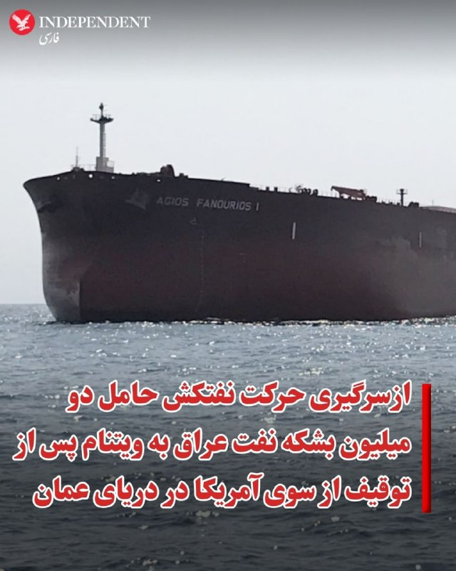

‌♦️بلومبرگ روز یکشنبه ۲۷ اردیبهشت گزارش داد که یک نفت‌کش غول‌پیکر حامل دو میلیون بشکه نفت خام عراق که پس از متوقف شدن توسط نیروهای نظامی ایالات متحده، برای روزها در دریای عمان سرگردان و متوقف بود، حرکت خود را به سمت مقصد نهایی یعنی کشور ویتنام از سر گرفت.
این نفت‌کش بزرگ پس از چند روز بلاتکلیفی و پهلو گرفتن اجباری در آب‌های دریای عمان، سرانجام اجازه یافت تا مسیر دریایی خود را به سمت شرق آسیا ادامه دهد. هنوز جزئیات بیشتری درباره دلایل توقف چندروزه این شناور توسط نیروهای آمریکایی و شرایط رفع توقف آن منتشر نشده است.
عراق یکی از بزرگ‌ترین صادرکنندگان نفت در سازمان اوپک است و بخش عمده‌ای از محموله‌های نفتی این کشور از طریق آب‌های خلیج فارس و دریای عمان به بازارهای آسیایی ارسال می‌شود.
نفتکش«آگیوس فانوریوس ۱» (Agios Fanourios I) که تحت پرچم کشور مالت حرکت می‌کند، پس از بارگیری نفت خام بصره در عراق، از تنگه هرمز عبور کرد اما به دلیل نزدیک شدن به خطوط تحت کنترل نیروهای آمریکایی، توسط فرماندهی مرکزی آمریکا متوقف و مجبور به چرخش به سمت دریای عمان شده بود.
‌🇸🇦 Indypersian

🤖 @VahidOOnLine

## VahidOOnLine — post 240566

  

عبدالغفور امان‌زاده، عضو کمیسیون کشاورزی مجلس، با اعلام افزایش ۲۰ هزار تومانی قیمت گندم، گفت: «نگرانی اصلی کشاورزان بابت پرداخت مطالبات و پول گندم است. از آغاز فصل برداشت تا امروز حدود ۴۵ روز می‌گذرد اما متاسفانه دیناری بابت این مسئله به کشاورزان پرداخت نشده است.»
‌🏁 🇬🇧 IranintlTV

🤖 @VahidOOnLine

## VahidOOnLine — post 240565

  <a href="telegram/content/VahidOOnLine_240565_1779004014.mp4" target="_blank">🎬 Download video</a>

⭕️ صدو‌سی‌امین سال ترور قبله عالم، ناصرالدین شاه قاجار و تاثیر آن بر وقایع سیاسی ایران

♦️دوازدهم اردیبهشت‌ماه ۱۲۷۵ خورشیدی، هنگامی که ناصرالدین‌شاه قاجار به مناسبت پنجاهمین سال سلطنتش راهی حرم عبدالعظیم در شهر ری شد و برخلاف روال همیشگی، از ملازمان خود خواست اجازه دهند مردم برای دیدار به او نزدیک شوند، شاید هرگز تصور نمی‌کرد که این سفر، واپسین سفر زندگی‌اش باشد و همان روز و در همان مکان، به دست میرزا رضای کرمانی کشته شود.
اکنون ۱۳۰ سال از ترور ناصرالدین‌شاه می‌گذرد؛ رویدادی که تاریخ معاصر ایران را، از منظر حذف فیزیکی عالی‌ترین مقام حکومت، به پیش و پس از خود تقسیم کرد.
میرزا رضای کرمانی که از مریدان سید جمال‌الدین اسدآبادی بود و سال‌هایی از عمر خود را در زندان گذرانده بود، در آن روز در میان زائران کمین کرد. هنگامی که شاه از کالسکه پیاده شد و به سوی صحن حرم گام برداشت، خود را به او رساند و از فاصله‌ای نزدیک گلوله‌ای به سینه او شلیک کرد.
ناصرالدین‌شاه در همان لحظه نقش بر زمین شد. ندیمان و محافظان شاهی که غافلگیر شده بودند، بلافاصله میرزا رضا را دستگیر کردند.

📌لینک پخش پادکست
‌🇸🇦 Indypersian

🤖 @VahidOOnLine

---
📅 بروزرسانی: 1405/02/27 08:42
---

## VahidOOnLine — post 240564

  

فرماندهی مرزبانی استان بوشهر اعلام کرد یکشنبه عملیات انفجار و حریق کنترل‌شده برای امحای مواد و ضایعات بمب در محدوده باشی، بین شهرستان‌های تنگستان و دشتی، انجام می‌شود. این عملیات از ساعت ۸ تا ۱۷ برگزار می‌شود.
‌🏁 🇬🇧 IranintlTV

🤖 @VahidOOnLine

## VahidOOnLine — post 240563

  

‌♦️وزارت دفاع بریتانیا از استقرار یک سلاح کم‌هزینه ضدپهپاد جدید در خاورمیانه برای رهگیری پهپادهای ایرانی خبر داد. بنا بر اعلام این وزارتخانه جت‌های تایفون نیروی هوایی سلطنتی بریتانیا به سیستم سلاح پیشرفته کشتار دقیق «ای‌پی‌کی‌دابلیو‌اس» مجهز می‌شوند که با استفاده از هدف‌گیری لیزری، موشک‌های غیرهدایتی را به سلاح‌های دقیق و کم‌هزینه تبدیل می‌کند که قادر به سرنگونی پهپادها و دیگر تهدیدها هستند.
وزارت دفاع بریتانیا گفت این سامانه را در همکاری سریع با صنایع نظامی ظرف چند ماه از مرحله آزمایش به مرحله استقرار رسانده است و با این اقدام شهروندان بریتانیایی و شرکای منطقه‌ای از حفاظت بیشتری در برابر حملات پهپادی برخوردار خواهند شد.
‌🇸🇦 Indypersian

🤖 @VahidOOnLine

## VahidOOnLine — post 240562

  

ریک اسکات، سناتور جمهوری‌خواه آمریکایی، به فاکس‌نیوز گفت جمهوری اسلامی با وجود جنگ اخیر همچنان به دنبال کشتن آمریکایی‌ها، بازسازی تسلیحات خود و نابودی اسرائیل است.
او همچنین گفت تهران همچنان از حماس، حزب‌الله و حوثی‌ها حمایت می‌کند و در عین حال از رویکرد ترامپ در قبال ایران در تنگه هرمز تمجید کرد.

‌🏁 🇬🇧 IranintlTV

🤖 @VahidOOnLine

## VahidOOnLine — post 240561

  

♦️به گزارش خبرگزاری رویترز، دولت دونالد ترامپ روز شنبه با تمدید نکردن معافیت‌های تحریمی خرید نفت دریاپایه روسیه، اجازه داد این مجوز قانونی منقضی شود. این معافیت یک‌ماهه پیش از این با هدف جبران کمبود عرضه نفت و کنترل قیمت‌های جهانی پس از انسداد تنگه هرمز توسط جمهوری اسلامی، به کشورهایی مانند هند اعطا شده بود. اسکات بسنت، وزیر خزانه‌داری آمریکا، پیش‌تر اعلام کرده بود که این مجوز عمومی را برای خرید نفت ذخیره‌شده روسیه در نفت‌کش‌ها تمدید نخواهد کرد.
لغو این معافیت در حالی صورت می‌گیرد که فشارها بر کاخ سفید افزایش یافته است؛ به طوری که دو سناتور دموکرات، جین شاهین و الیزابت وارن، روز جمعه از دولت ترامپ خواسته بودند به دلیل تامین مالی جنگ روسیه در اوکراین و عدم تاثیر آن بر کاهش هزینه‌های سوخت شهروندان آمریکایی، این معافیت را ملغی کند. هند که بزرگترین خریدار نفت دریاپایه روسیه است، در پی معافیت‌های قبلی، خریدهای خود را در ماه‌های آوریل و مه به اوج رسانده بود.
‌🇸🇦 Indypersian

🤖 @VahidOOnLine

## VahidOOnLine — post 240560

  

بری روزن، گروگان پیشین سفارت آمریکا در ایران، در ایکس نوشت جمهوری‌اسلامی در جریان درگیری با ایالات‌متحده، برای سرکوب مخالفت‌ها بر شمار اعدام‌ها افزوده است و مقام‌های ایرانی از اعدام‌ها و احکام قضایی برای ارعاب معترضان احتمالی استفاده می‌کنند.
‌🏁 🇬🇧 IranintlTV

🤖 @VahidOOnLine

## VahidOOnLine — post 240559

  <a href="telegram/content/VahidOOnLine_240559_1778994734.mp4" target="_blank">🎬 Download video</a>

♦️ویدیوهای رسیده به ایندیپندنت فارسی نشان می‌دهد ایرانیان واشنگتن‌دی‌سی روز شنبه ۲۶ اردیبهشت، هم‌زمان با ایرانیان در دیگر کشورهای جهان، با تشکیل زنجیره انسانی روی «پل کلید» تجمع اعتراضی برگزار کردند.
شرکت‌کنندگان در این تجمع با اهتزاز پرچم‌های شیر‌‌و‌خورشید و حمل پلاکاردهایی خواستار آزادی زندانیان سیاسی، توقف احکام اعدام و پایان محدودیت‌ها و قطعی اینترنت در ایران شدند.
‌🇸🇦 Indypersian

🤖 @VahidOOnLine

## VahidOOnLine — post 240558

♦️دونالد ترامپ با انتشار تصاویری در صفحه اینستاگرام خود از سفرش به چین، به پیشینه روابط دیرینه میان دو کشور اشاره کرد و گفت: «رابطه میان مردم آمریکا و چین به زمان تاسیس آمریکا بازمی‌گردد و شهروندان ما از همان ابتدا احترام متقابل عمیقی برای یکدیگر قائل بوده‌اند.» او این پیوند تجاری و احترام‌آمیز ۲۵۰ ساله را پایه‌ای برای آینده‌ای دانست که به نفع هر دو ملت خواهد بود.
او در ادامه این ویدیو با اشاره به ویژگی‌های فرهنگی و انسانی مشترک میان دو جامعه افزود: «مردم آمریکا و چین اشتراکات زیادی دارند؛ ما برای کار سخت، شجاعت و موفقیت ارزش قائلیم و به خانواده‌ها و کشورهای خود عشق می‌ورزیم.»
‌🇸🇦 Indypersian

🤖 @VahidOOnLine

---
📅 بروزرسانی: 1405/02/27 04:56
---

## VahidOOnLine — post 240557

  

♦️به گزارش خبرگزاری رویترز، شنبه شب ۲۶ اردیبهشت در جریان فینال مسابقات آوازی یوروویژن ۲۰۲۶ که در سالن «وینر اشتادهاله» شهر وین، پایتخت اتریش برگزار شد، کشور بلغارستان برای اولین‌بار در تاریخ این مسابقات، به مقام قهرمانی دست یافت.
«دارینا نیکولایوا یوتووا» معروف به «دارا»، نماینده بلغارستان، با اجرای ترانه «بنگارنگا» (Bangaranga) موفق شد پس از شمارش و تایید مجموع آرای داوران ملی و سبد رای تماشاگران، بالاتر از نماینده اسرائیل که به مقام دوم رسید، جام قهرمانی یوروویژن را بالای سر ببرد.
‌🇸🇦 Indypersian

🤖 @VahidOOnLine

## VahidOOnLine — post 240556

  

دولت بریتانیا از استقرار یک سلاح کم‌هزینه ضدپهپاد جدید در خاورمیانه خبر داد. سامانه ای‌پی‌کی‌دابلیو‌اس که روی جنگنده‌های تایفون نصب می‌شود، با استفاده از هدف‌گیری لیزری، موشک‌های غیرهدایتی را به سلاح‌های دقیق و کم‌هزینه تبدیل می‌کند که قادر به سرنگونی پهپادها و دیگر تهدیدها هستند.
وزارت دفاع بریتانیا گفت این سامانه را در همکاری سریع با صنایع نظامی ظرف چند ماه از مرحله آزمایش به مرحله استقرار رسانده است و با این اقدام شهروندان بریتانیایی و شرکای منطقه‌ای از حفاظت بیشتری در برابر حملات پهپادی برخوردار خواهند شد.

‌🏁 🇬🇧 IranintlTV

🤖 @VahidOOnLine

## VahidOOnLine — post 240555

♦️گلشیفته فراهانی و امانوئل مکرون، رییس جمهوری فرانسه، در روزهای اخیر به سوژه تازه طنزپردازان ایرانی در شبکه‌های اجتماعی تبدیل شده‌اند؛ ماجرایی که پس از انتشار اظهارات فلوریان تردیف، خبرنگار روزنامه پاری‌مچ و نویسنده کتاب «یک زوج "تقریبا" کامل» دوباره مورد توجه قرار گرفت.
فلوریان تردیف روز چهارشنبه در مصاحبه با رادیو RTL فرانسه، در پاسخ به پرسشی درباره تنش معروف میان این زوج در جریان سفر سال گذشته به شرق آسیا (در پرواز پاریس-سنگاپور)، تایید کرد که بریجیت یکی از پیام‌های گلشیفته فراهانی را در تلفن همراه امانوئل دیده بود. او در پاسخ به اصرار خبرنگار برای تایید نام این بازیگر گفت: «همان موقع هم شرایط در پاریس پیچیده بود؛ آقای رییس جمهوری چند ماهی رابطه افلاطونی با گلشیفته فراهانی، هنرپیشه ۴۲ ساله، داشت.»
این اتفاق در هواپیما منجر به جدال لفظی شدید و صحنه‌ای دراماتیک شد که در نهایت با سیلی خوردن مکرون از بریجیت همراه بود.
هم‌زمان کاربران ایرانی در فضای مجازی که به مهارت بالا در طنزپردازی مشهورند، این بار مکرون، بریجیت و گلشیفته فراهانی را مایه شوخی قرار داده‌اند.
‌🇸🇦 Indypersian

🤖 @VahidOOnLine

## VahidOOnLine — post 240546

ایران، فقط خیابان‌هایی نیست که در آن گلوله شلیک شد؛
خانه‌هایی هم هست که هنوز صدای آخرین خداحافظی را فراموش نکرده‌اند. جوانانی که هرکدام شغلی، رویا، خانواده و آینده‌ای داشتند، در روزهایی کشته شدند که خواستن آزادی هزینه جان داشت.<
جاویدنامان انقلاب ملی ایرانیان:
علیرضا باقری منجیلی، سمانه عبدی، سجاد صمدی نوقابی، فرهاد امانی، محمدرضا منصوری، علیرضا صحت‌بخش پیله‌رودی، محمدمعین چابک (خسروی) و صدرا سلطانی
نام‌هایی که از حافظه این سرزمین پاک نمی‌شوند؛ چون پشت هر نام، زندگی ناتمامی مانده که می‌توانست ادامه پیدا کند.<
#جاویدنامان_انقلاب_ملی_ایرانیان
‌🏁 🇬🇧 IranintlTV

🤖 @VahidOOnLine

---
📅 بروزرسانی: 1405/02/27 02:58
---

## VahidOOnLine — post 240545

  

بلغارستان روز شنبه برای نخستین بار برنده مسابقه آواز یوروویژن شد. ترانه «بانگارنگا» با اجرای دارا، پس از شمارش امتیازهای رای مردمی و هیات‌های داوری ملی در رتبه اول قرار گرفت و اسرائیل نیز دوم شد.
پنج کشور فینال یوروویژن را در اعتراض به جنگ غزه تحریم کرده بودند.

‌🏁 🇬🇧 IranintlTV

🤖 @VahidOOnLine

## VahidOOnLine — post 240544

  <a href="telegram/content/VahidOOnLine_240544_1778974130.mp4" target="_blank">🎬 Download video</a>

♦️به گزارش روزنامه اسرائیل هیوم، شنبه ۲۶ اردیبهشت صدای انفجاری مهیب در نزدیکی شهر بیت‌شمش اسرائیل همزمان با تنش‌ها با جمهوری اسلامی ایران شنیده شد و باعث نگرانی ساکنان منطقه شد.
بر اساس این گزارش، شرکت دولتی «تومر» که در زمینه تولید موتورهای موشکی فعالیت می‌کند، مسئول این انفجار بوده و اعلام کرده است این عملیات از قبل برنامه‌ریزی و با هماهنگی مقام‌ها انجام شده بود.
شهرداری بیت‌شمش اعلام کرد هیچ اطلاع قبلی درباره این انفجار از سوی شرکت یا نهادهای امنیتی دریافت نکرده بود. با این حال، سازمان آتش‌نشانی اسرائیل تأیید کرده که تنها به مرکز فرماندهی آن‌ها اطلاع داده شده بود.
‌🇸🇦 Indypersian

🤖 @VahidOOnLine

## VahidOOnLine — post 240543

  <a href="telegram/content/VahidOOnLine_240543_1778974132.mp4" target="_blank">🎬 Download video</a>

ویدیوهای دریافتی نشان می‌دهد جمعی از ایرانیان ساکن نیویورک، شنبه ۲۶ اردیبهشت، در حمایت از مردم ایران و شاهزاده رضا پهلوی در منهتن تجمع و راهپیمایی برگزار کردند. آن‌ها با فریاد «اینترنت برای ایران» و اجرای پرفورمنسی علیه اعدام‌های جمهوری اسلامی، توجه جامعه جهانی را به وضعیت ایران جلب کردند.
‌🏁 🇬🇧 IranintlTV

🤖 @VahidOOnLine

## VahidOOnLine — post 240542

  <a href="telegram/content/VahidOOnLine_240542_1778974133.mp4" target="_blank">🎬 Download video</a>

‌
دونالد ترامپ، رئیس‌جمهوری آمریکا، تصویری تولیدشده با هوش مصنوعی را در شبکه اجتماعی تروث‌سوشال منتشر کرد که روی آن نوشته شده بود: «این آرامش پیش از طوفان بود.»

در این تصویر، ترامپ در میان ناوهای جنگی و هوایی طوفانی دیده می‌شود؛ پستی که در بحبوحه افزایش تنش‌ها با جمهوری اسلامی و گمانه‌زنی‌ها درباره احتمال ازسرگیری حملات آمریکا و اسرائیل به ایران منتشر شده است.
‌🏁 🇬🇧 ManotoTV

🤖 @VahidOOnLine

---
📅 بروزرسانی: 1405/02/27 01:55
---

## VahidOOnLine — post 240541

  <a href="telegram/content/VahidOOnLine_240541_1778970353.mp4" target="_blank">🎬 Download video</a>

هند و امارات متحده عربی در جریان سفر نارندرا مودی، نخست‌وزیر هند، به ابوظبی، چند توافق‌نامه در حوزه‌های دفاعی، انرژی و حمل‌ونقل دریایی امضا کردند.

بر اساس این توافق‌ها، دو کشور همکاری در زمینه امنیت دریایی، دفاع سایبری، فناوری‌های پیشرفته، تبادل اطلاعات و صنایع دفاعی را گسترش خواهند داد.

در بخش انرژی نیز توافقی درباره ذخایر راهبردی نفت و ذخیره‌سازی نفت خام هند در فجیره امضا شده است.

این دیدار در حالی انجام شد که امارات پیش‌تر جمهوری اسلامی را به حمله پهپادی و موشکی به فجیره متهم کرده بود؛ حمله‌ای که به آتش‌سوزی در یک پالایشگاه و زخمی شدن سه کارگر هندی منجر شد.

نارندرا مودی در دیدار با محمد بن زاید، رئیس امارات، حملات به امارات را محکوم کرد و دو طرف بر گسترش روابط اقتصادی و امنیتی تاکید کردند.
‌🏁 🇬🇧 ManotoTV

🤖 @VahidOOnLine

## VahidOOnLine — post 240540

  <a href="telegram/content/VahidOOnLine_240540_1778970354.mp4" target="_blank">🎬 Download video</a>

دونالد ترامپ، رییس‌جمهوری آمریکا، روز شنبه ۲۶ اردیبهشت، در شبکه اجتماعی تروث سوشال انیمیشنی منتشر کرد که در آن به یک ناو جنگی آمریکا دستور می‌دهد به هواپیمایی با پرچم جمهوری اسلامی شلیک کند و می‌گوید: «بسیار خب، آن را در دیدرس داریم. آتش!»
‌🏁 🇬🇧 IranintlTV

🤖 @VahidOOnLine

## VahidOOnLine — post 240539

  

میخائیل اولیانوف، نماینده روسیه در سازمان‌های بین‌المللی با اشاره به قریب‌الوقوع بودن ازسرگیری احتمالی حملات علیه جمهوری اسلامی در ایکس نوشت: «اگر این موضوع درست باشد، به این معناست که آمریکا و اسرائیل از اشتباهات راهبردی گذشته خود درس نمی‌گیرند.»
‌🏁 🇬🇧 IranintlTV

🤖 @VahidOOnLine

## VahidOOnLine — post 240538

  

♦️دونالد ترامپ، رئیس‌جمهوری آمریکا، با انتشار یک طرح گرافیکی در حساب کاربری خود در شبکه اجتماعی تروث سوشال نوشت: «این آرامش پیش از طوفان بود.»
در این تصویر گرافیکی، ترامپ به همراه یک فرمانده نظامی آمریکایی بر روی عرشه یک ناو جنگی در میان دریایی مواج ایستاده است؛ در حالی که یک شناور دیگر در محاصره ناوهای جنگی ایالات متحده قرار دارد.
‌🇸🇦 Indypersian

🤖 @VahidOOnLine

---
📅 بروزرسانی: 1405/02/27 00:59
---

## VahidOOnLine — post 240537

  

♦️محمدباقر قالیباف، رئیس مجلس شورای اسلامی،با انتشار پیامی در شبکه اجتماعی اکس نوشت که جهان در آستانه نظمی جدید قرار دارد
قالیباف با استناد به سخنان شی جین‌پینگ، رئیس‌جمهوری چین، مبنی بر این‌که «تحولات بی‌سابقه در یک قرن گذشته در حال شتاب گرفتن است»، تاکید کرد که مقاومت ۷۰ روزه ملت ایران این روند تحول را سرعت بخشیده است. رئیس مجلس شورای اسلامی در پایان پیام خود خاطرنشان کرد که آینده جهان به «جنوب جهانی» تعلق دارد.
‌🇸🇦 Indypersian

🤖 @VahidOOnLine

## VahidOOnLine — post 240536

  

♦️کانال تلگرامی وابسته به سپاه از راه‌اندازی سامانه بیمه ایرانی «هرمز سیف» برای محموله‌های دریایی تنگه هرمز خبر داد
سپاه پاسداران با انتشار مطلبی اعلام کرد تارنمای «هرمز سیف» (Hormuz Safe) فعالیت خود را برای ارائه بیمه به محموله‌های دریایی عبوری از تنگه هرمز آغاز کرده است.
بر اساس توضیحات منتشرشده،، این سامانه بیمه‌نامه‌هایی سریع و با قابلیت تایید رمزنگاری‌شده برای محموله‌هایی که از خلیج فارس، تنگه هرمز و آبراه‌های اطراف آن عبور می‌کنند صادر می‌کند. همچنین طبق اطلاعات منتشرشده، تسویه و پرداخت هزینه‌های این بیمه با استفاده از ارز دیجیتال انجام خواهد شد.
پیش از این نیز مجلس طرح‌هایی را برای دریافت عوارض از کشتی‌های عبوری مطرح کرده بود؛ موضوعی که با اعتراض گسترده جامعه جهانی و بحث‌های حقوقی فراوان همراه شد. اما اکنون با ایجاد پیگیری طرح غیرنظامی مانند «بیمه هرمز»، به دنبال جایگزینی برای اخذ عوارض است.
‌🇸🇦 Indypersian

🤖 @VahidOOnLine

## VahidOOnLine — post 240535

  <a href="telegram/content/VahidOOnLine_240535_1778966979.mp4" target="_blank">🎬 Download video</a>

‌
دولت دونالد ترامپ معافیت تحریمی خرید نفت دریایی روسیه را که پس از جنگ آمریکا و اسرائیل با جمهوری اسلامی و بسته شدن تنگه هرمز صادر شده بود، تمدید نکرد.

این معافیت به کشورهایی از جمله هند اجازه می‌داد به خرید نفت روسیه ادامه دهند و برای یک ماه تمدید شده بود، اما روز شنبه به پایان رسید.

اسکات بسنت، وزیر خزانه‌داری آمریکا، پیش‌تر گفته بود این مجوز تمدید نخواهد شد. تا عصر شنبه نیز هیچ تمدیدی در وب‌سایت وزارت خزانه‌داری آمریکا منتشر نشد.
‌🏁 🇬🇧 ManotoTV

🤖 @VahidOOnLine

---
📅 بروزرسانی: 1405/02/27 00:00
---

## VahidOOnLine — post 240534

  

دونالد ترامپ، رییس‌جمهوری آمریکا، طرحی گرافیکی در تروث سوشال منتشر کرد که در آن روی یک ناو در دریایی مواج ایستاده و شناوری با پرچم جمهوری اسلامی در محاصره ناوهای آمریکایی قرار دارد و در آن نوشته شده است: «این آرامش پیش از طوفان بود.»
‌🏁 🇬🇧 IranintlTV

🤖 @VahidOOnLine

## VahidOOnLine — post 240533

  

شاهزاده رضا پهلوی در نشست آینده تکنولوژی در ایران گفت که مردم ایران به چیزی جز تغییر کامل نظام رضایت نخواهند داد: «آن‌ها ۴۰ هزار کشته نداده‌اند که در نهایت به توافق اتمی برسند.»

شاهزاده رضا پهلوی افزود: «اتکای مخالفان نظام نباید به نیروی خارجی باشد و باید فرض را بر این گذاشت که کمکی دریافت نمی‌شود اما در صورت دریافت حمایت خارجی روند دستیابی به اهداف آسان‌تر خواهد شد.»
‌🏁 🇬🇧 IranintlTV

🤖 @VahidOOnLine

## VahidOOnLine — post 240532

  <a href="telegram/content/VahidOOnLine_240532_1778963446.mp4" target="_blank">🎬 Download video</a>

ناصر رفیعی، سخنران مذهبی دفتر علی خامنه‌ای، رهبر کشته‌شده جمهوری اسلامی، به نقل از غلامعلی حداد عادل، پدرزن مجتبی خامنه‌ای، گفت اعضای خانواده علی خامنه‌ای پیش از عملیات مرگبار نهم اسفند در مجتمع رهبری باقی ماندند، زیرا مقامات «اطمینان داده بودند» که با نزدیک شدن توافق در مذاکرات، هیچ اقدام نظامی صورت نخواهد گرفت.
رفیعی در این فایل صوتی به نقل از حداد عادل می‌گوید که این اتفاق به‌ این دلیل افتاد که شرایط عادی در بیت بود و «خامنه‌ای خود را در معرض قرار داده بود.»
‌🏁 🇬🇧 IranintlTV

🤖 @VahidOOnLine

---
📅 بروزرسانی: 1405/02/26 23:07
---

## VahidOOnLine — post 240531

  

شاهزاده رضا پهلوی در نشست آینده تکنولوژی در ایران، خطاب به کشورهای جهان گفت: «جمهوری اسلامی ثابت کرده غیرقابل اعتماد است و افزود اگر به دنبال یک شریک واقعی هستید به مردم ایران نگاه کنید.»

شاهزاده رضا پهلوی افزود: «باید این درک مشترک در سطح جهانی شکل بگیرد که با وجود جمهوری اسلامی هیچ کشوری نمی‌تواند احساس امنیت و آرامش پایدار داشته باشد.»

او گفت: «جامعه جهانی باید از مردم ایران برای تغییر حکومت حمایت کند. این اقدام نه‌تنها به سود مردم ایران بلکه به نفع خود کشورهای حامی نیز خواهد بود.»
‌🏁 🇬🇧 IranintlTV

🤖 @VahidOOnLine

## VahidOOnLine — post 240530

  

شاهزاده رضا پهلوی در نشست آینده تکنولوژی در ایران، گفت: «ایران می‌تواند به کشوری مانند کره جنوبی تبدیل شود، اما به دلیل وضعیت سیاسی کنونی به سمت الگویی شبیه کره شمالی سوق داده شده است.» شاهزاده رضا پهلوی افزود: «جمهوری اسلامی در ذات خود قابل تغییر نیست.»
‌🏁 🇬🇧 IranintlTV

🤖 @VahidOOnLine

## VahidOOnLine — post 240529

  

♦️ مسعود پزشکیان روز شنبه ۲۶ اردیبهشت با انتشار تصویری از سرو ابرکوه در شبکه اجتماعی ایکس نوشت: «مسن‌ترین موجود زنده آسیا، درخت سرو کهنسال ابرکوه با قدمتی دست‌کم ۴۵۰۰ ساله، در سرزمینی ریشه دوانده است که حتی در آن دوران نیز به نام ایران شناخته می‌شد.» به نظر می‌رسد که پزشکیان با این پیام که اشاره به قدمت تمدن ایران دارد، قصد دارد ایران را با کشورهای تازه تاسیس منطقه یا ایالات متحده مقایسه کند.

با این‌وجود، اشاره پزشکیان به قدمت سرو ابرکوه، به‌ویژه با بحران آب و خطراتی که در سال‌های اخیر این درخت کهن را تهدید کرده و از سوی مقام‌های جمهوری اسلامی نادیده گرفته شده، با انتقاد کاربران مواجه شد.

سرو ابرکوه، قدیمی‌ترین درخت آسیا و پس از کاج متوشلخ در ایالت کالیفرنیای آمریکا، دومین درخت کهنسال جهان است.
‌🇸🇦 Indypersian

🤖 @VahidOOnLine

## VahidOOnLine — post 240528

  <a href="telegram/content/VahidOOnLine_240528_1778960250.mp4" target="_blank">🎬 Download video</a>

‌
دونالد ترامپ، رئیس‌جمهوری آمریکا، در گفت‌وگو با شبکه فرانسوی بی‌اف‌ام گفت در صورت نرسیدن به توافق، ایران با «دوران بسیار سختی» روبه‌رو خواهد شد.

ترامپ افزود هنوز مشخص نیست توافقی به‌زودی حاصل می‌شود یا نه، اما تاکید کرد «بهتر است ایران توافق کند.»
‌🏁 🇬🇧 ManotoTV

🤖 @VahidOOnLine

## VahidOOnLine — post 240527

  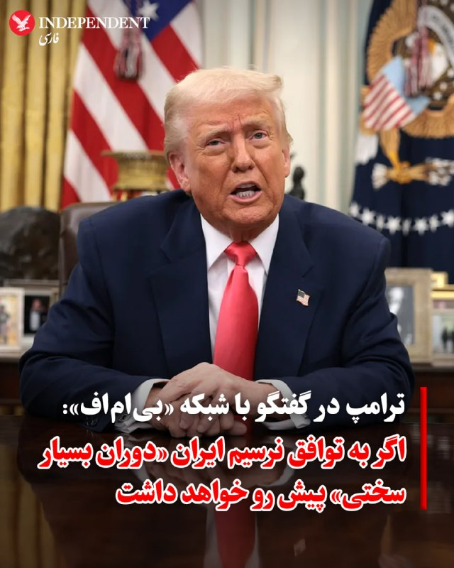

♦️ دونالد ترامپ، رئیس‌جمهوری آمریکا، روز شنبه ۲۶ اردیبهشت به جمهوری اسلامی هشدار داد که اگر به‌زودی بر سر یک توافق صلح موافقت نکند، «دوران بسیار سختی» را پیش رو خواهد داشت.

ترامپ در یک مصاحبه تلفنی با شبکه تلویزیونی «بی‌اف‌ام» فرانسه (BFMTV) گفت: «به نفع آن‌هاست که به یک توافق دست پیدا کنند.»

ترامپ پیش از این اعلام کرده بود که آخرین پیشنهاد تهران برای شروع مذاکرات را «بعد از خواندن اولین جمله» دور انداخته است. ترامپ بر توقف کامل غنی‌سازی، خروج اورانیوم با غنای بالا از خاک ایران و بازگشت وضعیت تنگه هرمز به شرایط پیش از جنگ تاکید دارد؛ خواسته‌هایی که تاکنون در پیشنهادات متقابل جمهوری اسلامی برآورده نشده‌اند.
‌🇸🇦 Indypersian

🤖 @VahidOOnLine

## VahidOOnLine — post 240526

  

همزمان با انتشار گزارش‌ها از احتمال از سرگیری حملات آمریکا و اسرائیل علیه جمهوری اسلامی، دونالد ترامپ، رییس‌جمهوری آمریکا، انیمیشنی در تروث سوشال منتشر کرد که در آن به ناو آمریکایی دستور شلیک به هدفی با پرچم جمهوری اسلامی را داده و می‌گوید: «در فهرست اهداف‌مان قرار دارد، آتش!»
‌🏁 🇬🇧 IranintlTV

🤖 @VahidOOnLine

---
📅 بروزرسانی: 1405/02/26 21:45
---

## VahidOOnLine — post 240525

  <a href="telegram/content/VahidOOnLine_240525_1778955343.mp4" target="_blank">🎬 Download video</a>

خبرگزرای‌های داخل کشور از وقوع زمین‌لرزه‌ ۴.۵ ریشتری در گلوگاه مازندران خبر دادند.
‌🏁 🇬🇧 ManotoTV

🤖 @VahidOOnLine

## VahidOOnLine — post 240524

  <a href="telegram/content/VahidOOnLine_240524_1778955344.mp4" target="_blank">🎬 Download video</a>

نیویورک‌تایمز گزارش داد مقام‌های ارشد دولت دونالد ترامپ طرح‌هایی برای ازسرگیری حملات نظامی آمریکا به جمهوری اسلامی آماده کرده‌اند؛ حملاتی که در صورت تصمیم نهایی ترامپ، می‌تواند از اوایل هفته آینده آغاز شود.

بر اساس این گزارش، پنتاگون در حال آماده‌سازی دوباره عملیاتی موسوم به «خشم حماسی» است؛ عملیاتی که پس از اعلام آتش‌بس متوقف شده بود. مقام‌های آمریکایی می‌گویند گزینه‌های روی میز شامل حملات گسترده‌تر به اهداف نظامی و زیرساختی جمهوری اسلامی و حتی اعزام نیروهای ویژه برای دستیابی به مواد هسته‌ای مدفون در سایت اصفهان است.

این گزارش می‌افزاید چند صد نیروی ویژه آمریکایی از ماه مارس در خاورمیانه مستقر شده‌اند تا در صورت صدور دستور، در عملیات زمینی احتمالی مشارکت کنند. مقام‌های نظامی آمریکا هشدار داده‌اند چنین عملیاتی می‌تواند با تلفات سنگین همراه باشد.

همزمان شبکه ۱۳ اسرائیل گزارش داد ارتش این کشور در حال ادامه آماده‌سازی‌ها برای احتمال ازسرگیری جنگ با جمهوری اسلامی است و اسرائیل در وضعیت آماده‌باش بالا قرار دارد.

بر اساس این گزارش، ارتش اسرائیل خود را برای سناریوی حملات روزانه ده‌ها موشک از سوی جمهوری اسلامی در روزهای نخست درگیری احتمالی آماده می‌کند.

این گزارش می‌افزاید طرح‌های احتمالی اسرائیل شامل هدف قرار دادن زیرساخت‌ها، تاسیسات انرژی و نیروگاه‌هاست و نیروی هوایی اسرائیل همچنین ممکن است در حملات مشترک، عملیات ترور علیه چهره‌های ارشد را دنبال کند.
‌🏁 🇬🇧 ManotoTV

🤖 @VahidOOnLine

## VahidOOnLine — post 240523

  

♦️ داده‌های نظارت بر بنادر سازمان جهانی پول نشان می‌دهد که از زمان آغاز جنگ آمریکا و اسرائیل علیه جمهوری اسلامی، میزان تردد شناورها در تنگه هرمز با سقوطی چشمگیر مواجه شده و با وجود برقراری آتش‌بس نیز تغییر چندانی احساس نشده است. این داده‌ها نشان می‌دهد که در بازه زمانی نهم اسفند تا ۱۹ فروردین، تنها حدود ۲۸۳ کشتی از این آبراه حیاتی عبور کرده‌اند که میانگین روزانه آن را به کمتر از هفت می‌رساند؛ رقمی که فاصله فاحشی با تردد روزانه نزدیک به ۱۰۰ کشتی در دوران پیش از جنگ دارد.

نمودار روند این سقوط را به خوبی نشان می‌دهد: پس از حمله آمریکا و اسرائیل به ایران در نهم اسفند، حمله به چهار تانکر در ۱۰ اسفند و اعلام بستن تنگه هرمز توسط سپاه پاسداران در ۱۱ اسفند، ترافیک دریایی ناگهان متوقف شد.

حتی در دوره آتش‌بس این شاهراه انرژی همچنان در رکود کامل به سر می‌برد. در این میان، بیشترین سهم کاهش تردد مربوط به نفت‌کش‌ها (نمودار قرمز) و کشتی‌های کانتینری (نمودار سرمه‌ای) بوده است که نشان‌دهنده ضربه سنگین این بحران به زنجیره تامین انرژی و تجارت جهانی است.
‌🇸🇦 Indypersian

🤖 @VahidOOnLine

## VahidOOnLine — post 240522

  <a href="telegram/content/VahidOOnLine_240522_1778955346.mp4" target="_blank">🎬 Download video</a>

ایرانیان آلمان روز شنبه همزمان با سایر کشورها در حمایت از انقلاب ملی علیه جمهوری اسلامی در شهر کاسل تجمع کردند.
‌🏁 🇬🇧 IranintlTV

🤖 @VahidOOnLine

## VahidOOnLine — post 240521

  

کانال ۱۳ اسرائیل گزارش داد که ارزیابی‌ها در ارتش اسرائیل حاکی از آن است که ترامپ در بازگشت از چین، دستور حمله به جمهوری اسلامی را صادر می‌کند تا برای سومین بار در کمتر از یک سال، تهران را غافلگیر کند. بر اساس این گزارش، کشتن مقام‌های ارشد جمهوری اسلامی، از اهداف حمله خواهد بود.

کانال ۱۳ نوشت: «هدف این است که به حکومت ایران ضربه وارد شود و جمهوری اسلامی از موضع ضعف به میز مذاکرات بازگردانده شود. طبق طرح‌ها، حمله برنامه‌ریزی‌شده شامل هدف قرار دادن زیرساخت‌های حاکمیتی، اهداف انرژی و نیروگاه‌ها خواهد بود.»

در ادامه این گزارش آمده است: «برآورد می‌شود که نیروی هوایی در این حمله مشترک تلاش کند مقام‌های ارشد حکومت ایران را هدف قرار بدهد. ارتش اسرائیل امیدوار است جنگ تنها چند روز ادامه داشته باشد.»
‌🏁 🇬🇧 IranintlTV

🤖 @VahidOOnLine

## VahidOOnLine — post 240520

  

♦️ روزنامه تلگراف روز شنبه ۲۶ اردیبهشت، گزارش داد مقامات دولت دونالد ترامپ در حال تشویق امارات متحده عربی هستند تا به شکل جدی‌تری وارد جنگ با ایران شده و کنترل یکی از جزایر ایرانی در خلیج فارس را به دست بگیرد.
 
یک مقام امنیتی ارشد و سابق در دولت ترامپ به تلگراف گفت که برخی از نزدیکان رئیس‌جمهوری آمریکا پیشنهاد کرده‌اند امارات جزیره لاوان را تصرف کند؛ جزیره‌ای که گزارش شده در اوایل آوریل هدف حملات هوایی مخفیانه امارات قرار گرفته است. این مقام آمریکایی گفت: «بروید و آن‌ها را بگیرید! با این کار به جای نیروهای آمریکایی، چکمه‌های سربازان اماراتی روی زمین خواهد بود.»
 
ترغیب آمریکا به مداخله بیشتر امارات در جنگ با ایران، هم‌زمان با افشای تحکیم روابط ابوظبی و اسرائیل صورت می‌گیرد. به گفته تحلیلگران، حملات موشکی سنگین جمهوری اسلامی به امارات در حال شتاب بخشیدن به بازآرایی ژئوپلیتیک خاورمیانه است.
 
گزارش‌ها حاکی است امارات در اوایل آوریل به اهدافی در ایران از جمله جزیره لاوان حمله کرده و اسرائیل نیز سامانه‌های «گنبد آهنین» را در اختیار این کشور قرار داده است.
‌🇸🇦 Indypersian

🤖 @VahidOOnLine

## VahidOOnLine — post 240519

  

♦️زمین‌لرزه‌ای به بزرگی ۴.۵ روز شنبه ۲۶ اردیبهشت شهر گلوگاه در استان مازندران را لرزاند.
به گزارش صداوسیما، کانون این زمین‌لرزه در عمق ۱۰ کیلومتری زمین ثبت شده است. تاکنون گزارشی از خسارات جانی یا مالی این حادثه منتشر نشده و بررسی‌ها در این زمینه ادامه دارد.
‌🇸🇦 Indypersian

🤖 @VahidOOnLine

## VahidOOnLine — post 240518

  <a href="telegram/content/VahidOOnLine_240518_1778955349.mp4" target="_blank">🎬 Download video</a>

ویدیوهای رسیده به ایران‌اینترنشنال نشان می‌دهند ایرانیان مقیم آلمان روز جمعه ۲۶ اردیبهشت علیه جمهوری اسلامی در شهر هامبورگ راهپیمایی کردند و شعار «شرم بر این سه فاسد، ملا چپی مجاهد» سردادند.
‌🏁 🇬🇧 IranintlTV

🤖 @VahidOOnLine

---
📅 بروزرسانی: 1405/02/26 20:47
---

## VahidOOnLine — post 240517

  <a href="telegram/content/VahidOOnLine_240517_1778951862.mp4" target="_blank">🎬 Download video</a>

ستاد فرماندهی آمریکا در آفریقا (AFRICOM)، با انتشار ویدیویی در ایکس، از عملیات شامگاه جمعه ۲۵ اردیبهشت خبر داد که به کشته شدن شمار زیادی از جنگجویان داعش در شمال شرقی نیجریه منجر شد.
پیش‌تر، ترامپ در تروث‌سوشال اعلام کرده بود ابو بلال المینوکی، نفر دوم داعش در جهان، در این عملیات کشته شده است.
‌🏁 🇬🇧 IranintlTV

🤖 @VahidOOnLine

## VahidOOnLine — post 240516

  <a href="telegram/content/VahidOOnLine_240516_1778951863.mp4" target="_blank">🎬 Download video</a>

اشتوتگارت، تجمع در حمایت از مردم ایران، ۲۶ اردیبهشت
‌🏁 🇬🇧 ManotoTV

🤖 @VahidOOnLine

## VahidOOnLine — post 240515

  <a href="telegram/content/VahidOOnLine_240515_1778951864.mp4" target="_blank">🎬 Download video</a>

مالمو سوئد، راهپیمایی ایرانیان، ۲۶ اردیبهشت
‌🏁 🇬🇧 ManotoTV

🤖 @VahidOOnLine

## VahidOOnLine — post 240514

  <a href="telegram/content/VahidOOnLine_240514_1778951866.mp4" target="_blank">🎬 Download video</a>

ویدیوهای رسیده به ایران‌اینترنشنال نشان می‌دهند ایرانیان مقیم نروژ روز شنبه ۲۶ اردیبهشت با در دست گرفتن پرچم‌های شیروخورشید علیه جمهوری اسلامی در شهر اسلو راهپیمایی کردند.
‌🏁 🇬🇧 IranintlTV

🤖 @VahidOOnLine

## VahidOOnLine — post 240513

  <a href="telegram/content/VahidOOnLine_240513_1778951868.mp4" target="_blank">🎬 Download video</a>

ایرانیان استرالیا روز شنبه در حمایت از انقلاب ملی علیه جمهوری اسلامی تجمع کرده و ضمن حمل پرچم شیروخورشید ترانه‌های ملی را هم‌خوانی کردند.
‌🏁 🇬🇧 IranintlTV

🤖 @VahidOOnLine

## VahidOOnLine — post 240512

♦️در جریان جشنواره «فانوس نیلوفر» در سئول، پایتخت کره جنوبی، ربات‌های انسان‌نما با لباس راهبان بودایی در مراسمی نمادین شرکت کردند.
این جشنواره که به مناسبت تولد بودا برگزار می‌شود، یکی از مهم‌ترین رویدادهای فرهنگی و مذهبی کره جنوبی به‌شمار می‌رود و هر ساله با نمایش فانوس‌های رنگارنگ و برنامه‌های سنتی همراه است.
حضور ربات‌ها در این مراسم، ترکیبی از سنت و فناوری را به نمایش گذاشت و توجه بازدیدکنندگان و رسانه‌ها را به خود جلب کرد.
‌🇸🇦 Indypersian

🤖 @VahidOOnLine

## VahidOOnLine — post 240511

  

دونالد ترامپ، رییس‌جمهوری ایالات متحده، در گفت‌وگوی تلفنی با آنتوان اولار، خبرنگار بی‌اف‌ام تی‌وی در واشنگتن، گفت که حکومت ایران بهتر است به توافق برسد. او افزود: «اگر این کار را نکنند، دوران بسیار بدی در انتظارشان خواهد بود.»
‌🏁 🇬🇧 IranintlTV

🤖 @VahidOOnLine

## VahidOOnLine — post 240510

  

♦️ کاخ کرملین روز شنبه ۲۶ اردیبهشت، با انتشار بیانیه‌ای اعلام کرد که ولادیمیر پوتین، رئیس‌جمهوری روسیه، در تماسی تلفنی با همتای اماراتی خود، شیخ محمد بن زاید آل نهیان، درباره مناقشات مربوط به ایران گفتگو کرده است.

بر اساس این بیانیه، «هر دو طرف بر اهمیت تداوم فرآیندهای سیاسی و دیپلماتیک با هدف دستیابی به توافق‌های صلح مبتنی بر سازش تأکید کردند.»

پوتین همچنین در این گفتگو از امارات متحده عربی بابت حمایت‌ها و نقش‌آفرینی در موضوعات بشردوستانه مرتبط با جنگ اوکراین قدردانی کرد.
‌🇸🇦 Indypersian

🤖 @VahidOOnLine

## VahidOOnLine — post 240509

♦️در ادامه سفر سید محسن نقوی، وزیر کشور پاکستان به تهران، او با وزیر کشور جمهوری اسلامی دیدار و درباره گسترش همکاری‌های دوجانبه گفتگو کرد.
وزیر کشور جمهوری اسلامی در این دیدار با تاکید بر روابط تاریخی دو کشور گفت مرزهای ایران و پاکستان «مرزهای دوستی، برادری و امنیت» است و دو طرف بر توسعه همکاری‌ها در حوزه‌های سیاسی، اقتصادی، تجاری و امنیتی و همچنین تسهیل تجارت مرزی توافق دارند.
در مقابل، وزیر کشور پاکستان نیز با قدردانی از میزبانی تهران اعلام کرد گفتگوهای مفصلی درباره امنیت مرزها و روابط دوجانبه انجام شده و ابراز امیدواری کرد این مذاکرات به‌زودی به نتایج ملموس منجر شود.
‌🇸🇦 Indypersian

🤖 @VahidOOnLine

## VahidOOnLine — post 240508

  

علی زینی‌وند، سخنگوی وزارت کشور، گفت: «محوریت تصمیم‌گیری در کشور خصوصا در حوزه صلح و جنگ، رهبری است. رهبری هم مسلط، فرمان دستش است و فرماندهی می‌کند. کسی در جایگاه مسئولیت، استاندار، نماینده، تریبون به‌دست، اگر خلاف سیاست‌های راهبری نظام اظهارنظر کند، شایسته نیست.»
‌🏁 🇬🇧 IranintlTV

🤖 @VahidOOnLine

## VahidOOnLine — post 240507

  <a href="telegram/content/VahidOOnLine_240507_1778951871.mp4" target="_blank">🎬 Download video</a>

میلان | ایتالیا؛ گردهمایی ایرانیان ـ گزارشگر ۲۶ اردیبهشت
‌🏁 🇬🇧 ManotoTV

🤖 @VahidOOnLine

## VahidOOnLine — post 240506

  <a href="telegram/content/VahidOOnLine_240506_1778951872.mp4" target="_blank">🎬 Download video</a>

بوردو فرانسه، تجمع هفتگی همراه با تصویر جاویدنامان انقلاب ملی، شنبه ۲۶ اردیبهشت
‌🏁 🇬🇧 ManotoTV

🤖 @VahidOOnLine

## VahidOOnLine — post 240505

  <a href="telegram/content/VahidOOnLine_240505_1778951874.mp4" target="_blank">🎬 Download video</a>

بوداپست | مجارستان؛ گردهمایی ایرانیان ـ گزارشگر ۲۶ اردیبهشت
‌🏁 🇬🇧 ManotoTV

🤖 @VahidOOnLine

## VahidOOnLine — post 240504

  <a href="telegram/content/VahidOOnLine_240504_1778951875.mp4" target="_blank">🎬 Download video</a>

کلن، راهپیمایی ایرانیان، شنبه ۲۶ اردیبهشت
‌🏁 🇬🇧 ManotoTV

🤖 @VahidOOnLine

---
📅 بروزرسانی: 1405/02/26 19:42
---

## VahidOOnLine — post 240503

  <a href="telegram/content/VahidOOnLine_240503_1778947922.mp4" target="_blank">🎬 Download video</a>

‌
گروه تروریستی حماس کشته شدن عزالدین الحداد، فرمانده گردان‌های« قسام» در نوار غزه را تایید کرد.

بر اساس بیانیه حماس عزالدین الحداد شامگاه جمعه «به همراه همسر، دخترش و چند غیرنظامی فلسطینی دیگر» کشته شده است.
‌🏁 🇬🇧 ManotoTV

🤖 @VahidOOnLine

## VahidOOnLine — post 240502

اسلو | نروژ؛ راهپیمایی سکوت ایرانیان ـ گزارشگر شنبه ۲۶ اردیبهشت
‌🏁 🇬🇧 ManotoTV

🤖 @VahidOOnLine

## VahidOOnLine — post 240501

  <a href="telegram/content/VahidOOnLine_240501_1778947923.mp4" target="_blank">🎬 Download video</a>

‌
کپنهاگ | دانمارک؛ گردهمایی ایرانیان - گزارشگر شنبه ۲۶ اردیبهشت
‌🏁 🇬🇧 ManotoTV

🤖 @VahidOOnLine

## VahidOOnLine — post 240500

  

احسان قاضی‌زاده هاشمی، نماینده مجلس، درباره مذاکرات با آمریکا گفت: «قبل از ورود به بحث مذاکرات، باید آمریکا ادبیات ارعاب و تهدید خود را کنار بگذارد. وقتی چنین ادبیاتی وجود دارد، دیگر نمی‌توان آن را مذاکره نامید، بلکه به نوعی ارائه پیشنهادات و دادن سندی برای تسلیم است.»

قاضی‌زاده هاشمی گفت: «باید این ادبیات آمریکایی که شامل ارعاب، تهدید و قلدری است، برطرف شود.»
‌🏁 🇬🇧 IranintlTV

🤖 @VahidOOnLine

## VahidOOnLine — post 240499

  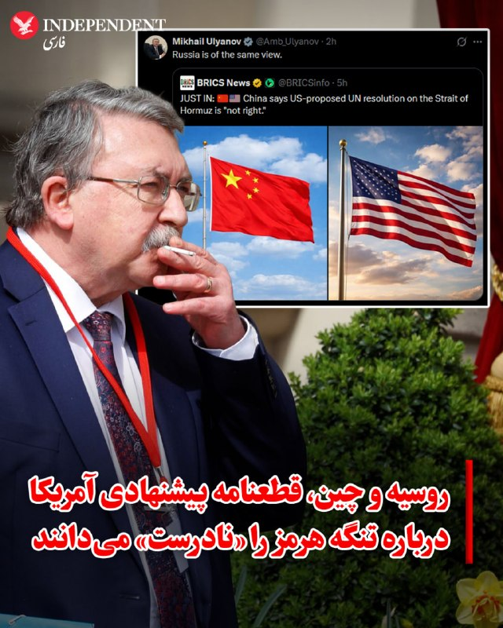

♦️ میخاییل اولیانوف، نماینده روسیه در سازمان ملل متحد در ژنو، با بازنشر خبری درباره مخالفت چین با قطعنامه پیشنهادی مورد حمایت ایالات متحده به شورای امنیت سازمان ملل درباره تنگه هرمز، اعلام کرد که موضع روسیه نیز با چین یکسان است.

وزیر خارجه چین پیش‌تر، قطعنامه پیشنهادی علیه جمهوری اسلامی را «نادرست» خوانده و تاکید کرده بود که حل مسئله تنگه هرمز تنها از راه دستیابی به «آتش‌بس دائم و فراگیر» میان تهران و واشنگتن امکان‌پذیر است و استفاده از زور نمی‌تواند مسئله را حل کند.

مایک والتز، نماینده ایالات متحده در سازمان ملل در نیویورک، روز جمعه ۲۶ اردیبهشت اعلام کرد که این قطعنامه که با حمایت آمریکا و کشورهای حوزه خلیج فارس، به شورای امنیت ارائه شده، تاکنون حمایت ۱۲۰ کشور را به‌دست آورده است. با این‌وجود، مخالفت چین و روسیه که حق وتو دارند، مانع بزرگی برای تصویب قطعنامه پیشنهادی است.
‌🇸🇦 Indypersian

🤖 @VahidOOnLine

## VahidOOnLine — post 240498

  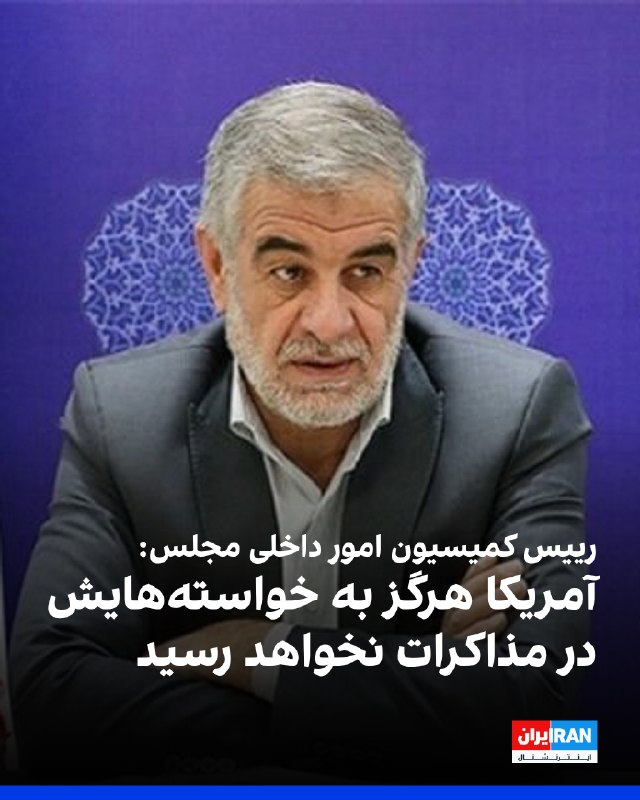

محمدصالح جوکار، رییس کمیسیون امور داخلی مجلس، گفت: «آمریکا به دنبال آن است تا آنچه را که در میدان به دست نیاورده پای میز مذاکره به دست آورد. در این‌باره باید بگویم هرگز آمریکا به خواسته‌های نامشروعش در مذاکرات نخواهد رسید.»

جوکار گفت که آمریکا باید شروط تهران را برای توافق بپذیرد و راهی جز تعظیم در برابر خواسته‌های جمهوری اسلامی ندارد
‌🏁 🇬🇧 IranintlTV

🤖 @VahidOOnLine

## VahidOOnLine — post 240497

♦️در حالی که دونالد ترامپ، رئیس‌جمهوری ایالات متحده سفر خود به پکن را پایان داده و به آمریکا بازگشته است، حاشیه‌های این سفر ادامه دارد. یکی از این موارد، تصاویری از لحظه‌ای که ترامپ، نگاهی به یادداشت‌های شی جین‌پینگ، رئیس‌جمهوری چین می‌اندازد است که دستاویز طنزپردازان شده است. یک شبکه اینترنتی چینی، با انتشار این تصاویر، ترامپ را با عنوان «مامور ۰۰۴۷» که اشاره به اسم رمز جیمز باند، شخصیت مشهور کتاب‌های جاسوسی بریتانیایی دارد، خطاب کرده است.
‌🇸🇦 Indypersian

🤖 @VahidOOnLine

## VahidOOnLine — post 240496

  <a href="telegram/content/VahidOOnLine_240496_1778947927.mp4" target="_blank">🎬 Download video</a>

‌
اشتوتگارت | آلمان؛ گردهمایی ایرانیان - گزارشگر شنبه ۲۶ اردیبهشت
‌🏁 🇬🇧 ManotoTV

🤖 @VahidOOnLine

## VahidOOnLine — post 240495

♦️ پادشاه خودخوانده سوئیس که خود را «شاه یوناس اول» می‌نامد، با وجود جنجال‌های فراوان، همچنان به گسترش نفوذ خود ادامه می‌دهد. یوناس لاووینر، شهروند ۳۱ ساله سوئیسی-مراکشی، در سال ۲۰۱۹ طی مراسمی در کلیسای نایدگ شهر برن تاج‌گذاری کرد و خود را «پادشاه نمادین سوئیس» نامید؛ عنوانی که در کشوری بدون سنت سلطنتی و بدون خانواده سلطنتی رسمی، بحث‌برانگیز بوده است.

لاووینر که در یک شرکت داروسازی نیز مشغول به کار است، طی سال‌های اخیر با استفاده از یک خلا در قوانین سوئیس توانسته حدود ۱۱۷ هزار متر مربع زمین بدون مالک را در نقاط مختلف کشور به نام خود ثبت کند. او اکنون مالک حدود ۱۵۰ قطعه زمین، از جمله ۸۳ جاده، است و می‌گوید روزانه بیش از ۵ هزار نفر از جاده‌های متعلق به او استفاده می‌کنند.

فعالیت‌های او باعث درگیری‌های حقوقی با مقام‌های محلی شده است. در یکی از موارد، او برای واگذاری خیابانی در منطقه گئونزه خواستار پرداخت ۱۵۰ هزار فرانک یا تغییر نام آن به «خیابان لاووینر» شده است؛ پیشنهادی که رد شد و به شکایت قضایی انجامید.
‌🇸🇦 Indypersian

🤖 @VahidOOnLine

---
📅 بروزرسانی: 1405/02/26 18:39
---

## VahidOOnLine — post 240494

♦️پیت هگست، وزیر جنگ ایالات متحده، از خدمه ناو هواپیمابر «یو‌اس‌اس جرالد فورد» پس از بازگشت از یک ماموریت طولانی استقبال کرد.
این ناو پس از بیش از ۳۰۰ روز استقرار در مناطق تحت مسئولیت فرماندهی مرکزی ارتش آمریکا (سنتکام) و فرماندهی ارتش جنوبی (SOUTHCOM)، به پایگاه خود بازگشته است. در این مدت، این ناو در عملیات‌ها و ماموریت‌های مختلف نظامی حضور داشته است.
هگست در این مراسم با قدردانی از عملکرد خدمه، این ماموریت را یکی از طولانی‌ترین و مهم‌ترین استقرارهای دریایی اخیر توصیف کرد.
‌🇸🇦 Indypersian

🤖 @VahidOOnLine

## VahidOOnLine — post 240493

  <a href="telegram/content/VahidOOnLine_240493_1778944193.mp4" target="_blank">🎬 Download video</a>

یک دانش‌آموز در پیام به ایران اینترنشنال با اشاره به مجازی شدن آموزش می‌گوید باید برای مدرسه‌ای که نرفتیم ۱۵۰ میلیون تومان شهریه بدهیم. پیام این دانش‌آموز با هوش مصنوعی بازخوانی شده است.
‌🏁 🇬🇧 IranintlTV

🤖 @VahidOOnLine

## VahidOOnLine — post 240492

  

خبرگزاری آناتولی ترکیه گزارش داد که هاکان فیدان، وزیر خارجه ترکیه، با علی باقری‌کنی، معاون بین‌الملل دبیرخانه شورای عالی امنیت ملی، روز شنبه در استانبول دیدار کرد. این خبرگزاری اعلام کرد جزئیات بیشتری از این دیدار منتشر نشده است.
‌🏁 🇬🇧 IranintlTV

🤖 @VahidOOnLine

## VahidOOnLine — post 240491

  <a href="telegram/content/VahidOOnLine_240491_1778944197.mp4" target="_blank">🎬 Download video</a>

دوسلدورف | آلمان؛ گردهمایی ایرانیان - گزارشگر شنبه ۲۶ اردیبهشت
‌🏁 🇬🇧 ManotoTV

🤖 @VahidOOnLine

## VahidOOnLine — post 240490

  <a href="telegram/content/VahidOOnLine_240490_1778944199.mp4" target="_blank">🎬 Download video</a>

پرث استرالیا، تجمع ایرانیان، شنبه ۲۶ اردیبهشت
‌🏁 🇬🇧 ManotoTV

🤖 @VahidOOnLine

## VahidOOnLine — post 240489

  

العربیه به نقل از منابعی خبر داد که سفر محسن نقوی، وزیر کشور پاکستان، به ایران با هدف رسیدن به چارچوب یک توافق انجام شده است. بر اساس این گزارش، پیشرفت مثبتی درباره تنگه هرمز حاصل شده و درها برای مذاکره درباره موارد باقی‌مانده از جمله موضوع هسته‌ای، باز است
‌🏁 🇬🇧 IranintlTV

🤖 @VahidOOnLine

## VahidOOnLine — post 240488

  

♦️ خبرگزاری صداوسیمای جمهوری اسلامی، روز شنبه ۲۶ اردیبهشت در گزارشی اختصاصی اعلام کرد که «چند کشور اروپایی» به‌دنبال انجام امور اداری و دریافت «تاییدیه» از تهران هستند تا بتوانند شناورهایشان را از تنگه هرمز عبور دهند.

این خبرگزاری با اشاره به گزارش‌ها از عبور موفق نفتکش‌هایی از چین، ژاپن و پاکستان از مسیر تعیین شده از سوی جمهوری اسلامی، تاکید کرد که این عبورها با «اجازه نیروی دریایی ایران» انجام شده است. صداوسیما نام این «کشورهای اروپایی» را اعلام نکرد.
‌🇸🇦 Indypersian

🤖 @VahidOOnLine

## VahidOOnLine — post 240487

  <a href="telegram/content/VahidOOnLine_240487_1778944203.mp4" target="_blank">🎬 Download video</a>

♦️مایک والتز، سفیر ایالات متحده در سازمان ملل، در گفت‌وگو با فاکس‌نیوز تأکید کرد که نقض هنجارهای بین‌المللی در تنگه‌های مهم دریایی قابل پذیرش نیست و کشورها نمی‌توانند در واکنش به درگیری‌ها اقدام به مین‌گذاری یا دریافت عوارض از مسیرهای بین‌المللی کنند.
او با اشاره به تحولات اخیر گفت چین پس از دیدار با رئیس جمهوری، مواضعی اتخاذ کرده که نشان‌دهنده فاصله‌گیری از ایران است. والتز افزود پکن با «عدم دستیابی ایران به سلاح هسته‌ای» و «عدم نظامی‌سازی تنگه هرمز» موافقت کرده است.
 سفیر آمریکا گفت چین همچنین تاکید کرده که تنگه‌هایی مانند هرمز و جبل‌الطارق نباید به‌عنوان ابزار درآمدزایی یا فشار سیاسی مورد استفاده قرار گیرند.
والتز این موضع را «دستاوردی مهم» در چارچوب تحولات دیپلماتیک اخیر توصیف کرد.
‌🇸🇦 Indypersian

🤖 @VahidOOnLine

## VahidOOnLine — post 240486

  <a href="telegram/content/VahidOOnLine_240486_1778944204.mp4" target="_blank">🎬 Download video</a>

دوسلدورف آلمان، تجمع ایرانیان، شنبه ۲۶ اردیبهشت
‌🏁 🇬🇧 ManotoTV

🤖 @VahidOOnLine

## VahidOOnLine — post 240485

  <a href="telegram/content/VahidOOnLine_240485_1778944205.mp4" target="_blank">🎬 Download video</a>

ملبورن، تجمع ایرانیان، ۲۶ اردیبهشت
‌🏁 🇬🇧 ManotoTV

🤖 @VahidOOnLine

## VahidOOnLine — post 240484

  <a href="telegram/content/VahidOOnLine_240484_1778944207.mp4" target="_blank">🎬 Download video</a>

هامبورگ، راهپیمایی ایرانیان و حمایت از زندانیان سیاسی، ۲۶ اردیبهشت
‌🏁 🇬🇧 ManotoTV

🤖 @VahidOOnLine

---
📅 بروزرسانی: 1405/02/26 17:31
---

## VahidOOnLine — post 240483

  

سنتکام، مرکز فرماندهی ایالات متحده، اعلام کرد که از آغاز محاصره سواحل جنوب ایران تا کنون، ۷۸ کشتی تجاری وادار به تغییر مسیر شده‌اند و ۴ کشتی برای تضمین اجرای محاصره از کار افتاده‌اند.

سنتکام با انتشار نمایی از داخل یک بالگرد بر فراز آب‌های منطقه‌ای نزدیک تنگه هرمز، نوشت که این بالگرد ارتش آمریکا کشتی‌های تجاری را در جریان اجرای محاصره دریایی ایران زیر نظر دارد.
‌🏁 🇬🇧 IranintlTV

🤖 @VahidOOnLine

## VahidOOnLine — post 240482

  

ایلا واویه، سخنگوی ارتش اسرائیل برای رسانه‌های عربی، در پیامی نوشت لبنان «میان چنگ ملایان و رشته‌های وابستگی» از یک کشور به گروگان تبدیل شده است.

او نوشت زمانی که جنگ‌ها «با انگشتان ایرانی اداره می‌شود»، مردم لبنان بهای آن را با «ویرانی و خاکستر» می‌پردازند.

واویه همچنین اعلام کرد لبنان به سکویی تبدیل شده و حزب‌الله «رشته‌هایی است که از سوی تهران حرکت داده می‌شود» و نتیجه این وضعیت، به گفته او، «کشوری که سیاه‌پوش می‌شود و بی‌گناهانی که جز آینده‌ای نامعلوم سهمی ندارند» است.

سخنگوی ارتش اسرائیل در پایان پرسید: «لبنان به کجا می‌رود؟ و تا کی؟»
‌🏁 🇬🇧 IranintlTV

🤖 @VahidOOnLine

## VahidOOnLine — post 240481

  <a href="telegram/content/VahidOOnLine_240481_1778940118.mp4" target="_blank">🎬 Download video</a>

ایرانیان سوئیس روز شنبه با تجمع در شهر برن به حمایت از انقلاب ملی و شاهزاده رضا پهلوی پرداختند و شعار «جاوید شاه» سر دادند.
‌🏁 🇬🇧 IranintlTV

🤖 @VahidOOnLine

## VahidOOnLine — post 240480

  <a href="telegram/content/VahidOOnLine_240480_1778940121.mp4" target="_blank">🎬 Download video</a>

در واکنش به نمایش و آموزش کار با سلاح در صداوسیما یک شهروند در پیامی به ایران اینترنشنال این اقدام را نشانه سقوط حکومت خواند و مخاطبی دیگر به حرکت مشابه در لیبی قبل از سقوط حکومت معمر قذافی اشاره کرد.

پیام این مخاطبان با هوش مصنوعی بازخوانی شده است.
‌🏁 🇬🇧 IranintlTV

🤖 @VahidOOnLine

## VahidOOnLine — post 240479

  

♦️ ستاد فرماندهی مرکزی ارتش آمریکا، سنتکام، روز شنبه ۲۶ اردیبهشت، گزارشی از آخرین فعالیت‌های این نیروها در تنگه هرمز و محاصره دریایی بنادر ایران ارائه کرد.

بر اساس این گزارش تا تاریخ ۲۶ اردیبهشت، نیروهای آمریکایی در راستای تضمین پایبندی به این محاصره نظامی، مسیر ۷۸ کشتی تجاری را که به سمت بنادر ایران در حرکت بودند تغییر داده و ۴ کشتی دیگر را نیز به دلیل تلاش برای نقض این خطوط ممنوعه، متوقف و زمین‌گیر کرده‌اند. سنتکام تاکید کرده است که این تدابیر سخت‌گیرانه تنها علیه شناورهای ورودی و خروجی به بنادر ایران اعمال می‌شود.
‌🇸🇦 Indypersian

🤖 @VahidOOnLine

## VahidOOnLine — post 240478

  <a href="telegram/content/VahidOOnLine_240478_1778940124.mp4" target="_blank">🎬 Download video</a>

ایرانیان آلمان روز شنبه همزمان با سایر کشورها در حمایت از انقلاب ملی علیه جمهوری اسلامی در شهر کاسل تجمع کردند.
‌🏁 🇬🇧 IranintlTV

🤖 @VahidOOnLine

## VahidOOnLine — post 240477

  

معاریو گزارش داد که حوثی‌ها ابزارهای مدرن، از جمله دستگاه‌های جی‌پی‌اس را در اختیار دزدان دریایی سومالی قرار داده‌اند که به آنها کمک می‌کند مسیرهای حرکت کشتی‌های تجاری را با دقت بیشتری ردیابی کنند.

پیش‌تر محمد موسی ابوله، معاون رییس اطلاعات پلیس دریایی پونتلند، در ژانویه ۲۰۲۶ گفته بود که نیروهای امنیتی برآورد می‌کنند برخی اعضای این گروه‌ها حتی آموزش‌های نظامی را در یمن گذرانده‌اند.

به گفته او، فناوری جدید برنامه‌ریزی حملات در فاصله‌ای دور از سواحل سومالی را بسیار آسان‌تر کرده است. یک ماه پیش از آن، در دسامبر ۲۰۲۵، نیروهای امنیتی پونتلند یک شناور حامل مواد منفجره و مواد شیمیایی مورد استفاده در ساخت بمب را در نزدیکی سواحل ایل متوقف کردند. در این قایق هفت نفر شامل دو شهروند یمنی و پنج شهروند سومالیایی حضور داشتند.
‌🏁 🇬🇧 IranintlTV

🤖 @VahidOOnLine

## VahidOOnLine — post 240476

♦️ارتش آمریکا با انتشار تصاویری اعلام کرد در پی یک عملیات نظامی در شمال‌شرق نیجریه، مواضع گروه داعش هدف حمله قرار گرفت و چندین عضو ارشد این گروه کشته شدند.
این عملیات یک تجمع مهم از نیروهای داعش را هدف قرار داده و در جریان آن، تعدادی از افراد باارزش بالا از جمله فردی به نام «ابو بلال المینوکی» از بین رفته‌اند.
جزئیات بیشتری درباره زمان دقیق، نحوه اجرای عملیات و تلفات کلی منتشر نشده، اما منابع محلی این حمله را ضربه‌ای قابل‌توجه به فعالیت‌های داعش در این منطقه توصیف کرده‌اند.
‌🇸🇦 Indypersian

🤖 @VahidOOnLine

## VahidOOnLine — post 240475

  <a href="telegram/content/VahidOOnLine_240475_1778940126.mp4" target="_blank">🎬 Download video</a>

سوییس، تجمع مقابل سفارت جمهوری اسلامی، ۲۶ اردیبهشت ۱۴۰۵
‌🏁 🇬🇧 ManotoTV

🤖 @VahidOOnLine

## VahidOOnLine — post 240474

  <a href="telegram/content/VahidOOnLine_240474_1778940128.mp4" target="_blank">🎬 Download video</a>

فرماندهی آفریقای ارتش آمریکا تصاویری از هدف قرار دادن مواضع داعش در نیجریه را منتشر کرده است. آفریکام گفته است عملیات شامگاه گذشته، حضور قابل توجهی از نیروهای داعش را هدف گرفت و به کشته شدن چند فرد مهم این گروه منجر شد.

شمال شرق نیجریه سال‌هاست صحنه فعالیت گروه‌های جهادی، از جمله شاخه غرب آفریقای داعش و بوکوحرام است. مرکز ملی مبارزه با تروریسم آمریکا می‌گوید شاخه غرب آفریقای داعش یکی از بزرگ‌ترین و مرگبارترین شاخه‌های این گروه است و در نیجریه و کشورهای همسایه باعث کشته یا آواره شدن هزاران نفر شده است.
‌🏁 🇬🇧 ManotoTV

🤖 @VahidOOnLine

## VahidOOnLine — post 240473

♦️صداوسیمای جمهوری اسلامی روز شنبه ۲۶ اردیبهشت، با انتشار تصاویری، لحظه توقیف یک نفتکش حامل ۴۵۰هزار بشکه نفت که به گفته خبرنگار، به صورت قاچاق از کشور خارج شده بود را نشان داد. کشور صاحب این نفتکش در گزارش معرفی نشده اما تاکید شده که غیرایرانی بوده است. نفتکش «اوشن کوی» برای جلوگیری از شناسایی شدن، نام خود را روی بدنه مخدوش کرده بود.

یک مقام نیروی دریایی ارتش در گفتگو با صداوسیما اعلام کرد که محموله این نفتکش توقیف شده و با انتقال به یک نفتکش ایرانی، به مخازن بندرعباس بازگردانده می‌شود.

پیش از این اعلام شده بود که کنترل تنگه هرمز به دو بخش شرقی و غربی تقسیم شده و نیروی دریایی سپاه و ارتش، هر کدام مسئولیت یک بخش را به‌عهده دارند.
‌🇸🇦 Indypersian

🤖 @VahidOOnLine

## VahidOOnLine — post 240472

  <a href="telegram/content/VahidOOnLine_240472_1778940129.mp4" target="_blank">🎬 Download video</a>

یک شهروند در پیامی به ایران اینترنشنال با اشاره به بحران معیشتی می‌گوید که سه ماه است مجلس با خاک یکی شده و نباید آن‌ها «حقوق آن‌چنانی»‌ بگیرند. پیام این مخاطب با هوش مصنوعی بازخوانی شده است.
‌🏁 🇬🇧 IranintlTV

🤖 @VahidOOnLine

## VahidOOnLine — post 240471

  <a href="telegram/content/VahidOOnLine_240471_1778940131.mp4" target="_blank">🎬 Download video</a>

ایرانیان فنلاند روز شنبه در حمایت از انقلاب ملی علیه جمهوری اسلامی در هلسینکی تجمع کردند و شعار «تغییر رژیم» سر دادند.
‌🏁 🇬🇧 IranintlTV

🤖 @VahidOOnLine

---
📅 بروزرسانی: 1405/02/26 15:39
---

## VahidOOnLine — post 240470

  <a href="telegram/content/VahidOOnLine_240470_1778933347.mp4" target="_blank">🎬 Download video</a>

«تجمع ایرانیان در سیدنی استرالیا»
‌🏁 🇬🇧 ManotoTV

🤖 @VahidOOnLine

## VahidOOnLine — post 240469

  <a href="telegram/content/VahidOOnLine_240469_1778933348.mp4" target="_blank">🎬 Download video</a>

یک شهروند در پیامی به ایران اینترنشنال درباره بحران سوخت می‌گوید که در مشهد بعد از مراجعه به چند جایگاه نهایتا بعد از یک ساعت انتظار توانست با کارت سه‌هزار تومانی ۱۵ لیتر بزنین بزند. پیام مخاطب با هوش مصنوعی خوانده شده است.
‌🏁 🇬🇧 IranintlTV

🤖 @VahidOOnLine

## VahidOOnLine — post 240468

  

♦️یحیی دهقان‌پور، عکاس برجسته، مدرس باسابقه عکاسی و یکی از چهره‌های تاثیرگذار عکاسی معاصر ایران، روز جمعه ۲۵ اردیبهشت‌ماه در سن ۸۶ سالگی درگذشت.
دهقان‌پور متولد سال ۱۳۱۹ در تهران بود و فعالیت حرفه‌ای و آموزشی او، نقش مهمی در تربیت نسل‌های مختلف عکاسان ایرانی داشت. او تدریس عکاسی را از سال ۱۳۵۷ و همزمان با فعالیت در مدرسه عالی تلویزیون آغاز کرد و طی بیش از سه دهه، در دانشگاه‌ها و مراکز آموزشی مختلف به تدریس این رشته پرداخت.
این عکاس پیشکسوت علاوه بر فعالیت آموزشی، نمایشگاه‌های انفرادی متعددی برگزار کرد و آثارش در نمایشگاه‌های گروهی بسیاری به نمایش درآمد. از ماندگارترین تصاویر او، مجموعه عکس‌های مراسم تشییع پیکر فروغ فرخزاد در گورستان ظهیرالدوله تهران است؛ تصاویری تاریخی که در ۲۵ بهمن ۱۳۴۵ و زمانی که دهقان‌پور تنها ۲۶ سال داشت، با دوربین مدیوم‌فرمت ثبت شدند.
او سال‌ها بعد این مجموعه را در نمایشگاهی با عنوان «آن روز فروغ را در باغچه کاشتند» ارائه کرد؛ مجموعه‌ای که به یکی از روایت‌های تصویری مهم از بدرقه فروغ فرخزاد تبدیل شد.
‌🇸🇦 Indypersian

🤖 @VahidOOnLine

## VahidOOnLine — post 240467

  <a href="telegram/content/VahidOOnLine_240467_1778933351.mp4" target="_blank">🎬 Download video</a>

«تجمع ایرانیان در بریزبن استرالیا»
‌🏁 🇬🇧 ManotoTV

🤖 @VahidOOnLine

## VahidOOnLine — post 240466

  <a href="telegram/content/VahidOOnLine_240466_1778933352.mp4" target="_blank">🎬 Download video</a>

⭕️ دست‌کم ۸ کشته در برخورد مرگبار قطار و اتوبوس در بانکوک

♦️برخورد مرگبار قطار با یک اتوبوس شهری در بانکوک، پایتخت تایلند، دست‌کم ۸ کشته و ۲۵ زخمی برجای گذاشت.
ویدیوهای منتشرشده توسط شاهدان عینی، ستون‌های دود غلیظ را در محل حادثه نشان می‌دهد، جایی که پس از برخورد قطار با وسایل نقلیه، یک اتوبوس عمومی دچار حریق شد و شعله‌های آتش به خودروها و موتورسیکلت‌های اطراف نیز سرایت کرد.
تیم‌های امداد و آتش‌نشانی بلافاصله به محل اعزام شدند و عملیات نجات و انتقال مجروحان را آغاز کردند.
‌🇸🇦 Indypersian

🤖 @VahidOOnLine

## VahidOOnLine — post 240465

ویدیوی رسیده به ایران اینترنشنال نشان می‌دهد ایرانیان روز شنبه در تجمعی که به فراخوان تامی رابینسون،‌ فعال راست‌گرای بریتانیا،‌ در لندن برگزار شده حاضر شده و پرچم شیروخورشید به دست گرفتند.
‌🏁 🇬🇧 IranintlTV

🤖 @VahidOOnLine

## VahidOOnLine — post 240464

  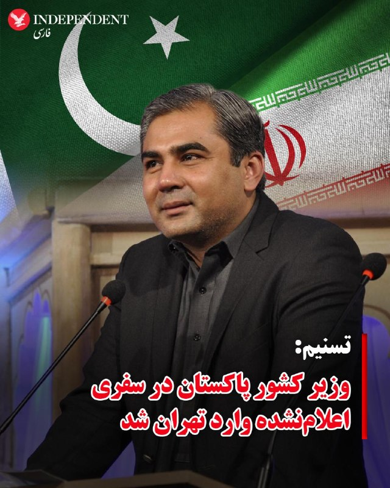

♦️خبرگزاری تسنیم، روز شنبه ۲۶ اردیبهشت ماه، به مقل از منابع آگاه از سفر سید محسن نقوی، وزیر کشور پاکستان به تهران خبر داد.
به گزارش تسنیم، گفته می‌شود وزیر کشور پاکستان طی این سفر از پیش اعلام نشده قرار است با شماری از مقام‌های جمهوری اسلامی، از جمله وزیر کشور، دیدار کند.
‌🇸🇦 Indypersian

🤖 @VahidOOnLine

## VahidOOnLine — post 240463

روایت شما از زندگی در آتش‌بس- شنبه ۲۶ اردیبهشت ۱۴۰۵

🔹 ابوقراضه‌ای به نام کوییک، سال ۱۴۰۱ قیمتش ۱۷۰ میلیون بود، الان شده یک میلیارد و ۲۷۰ میلیون تومان، در حالی که حقوق کارمند سال ۱۴۰۱ پانزده میلیون بود و الان شده ۳۰ میلیون.
🔹 فقط وصل شدم بگم مرگ بر اصل ولایت فقیه. مرگ بر جمهوری اسلامی، لعنت بر تک‌تک عاملان فساد در ایران‌مون. یه گیگ اینترنت خریدیم ۵۰۰ هزار تومان! خسته شدیم، بزنید، اصلاً هم ما راحت شیم هم اینا برن.
🔹 از نیشابور پیام می‌دیم، نظام فاسد با گرون کردن بنزین منتظر باشه دوباره ملت بریزن تو خیابون ریشه‌شون رو بکنن.
🔹 همه‌چیز سرسام‌آور گرون شده، دارو نیست، بنزین رو می‌خوان سه برابر گرون کنن و آزاد رو سه برابر بیشتر بفروشن. ترامپ زودتر تصمیمتو بگیر، کشتی ما رو با قیمت نفت، ما این‌ها رو نمی‌خواهیم، تحت هیچ شرایطی.
🔹 از تهران پیام می‌دم، من یک دانش‌آموز هستم و ما برای مدرسه‌ای که نرفتیم باید ۱۵۰ میلیون برای مدارس غیردولتی که هیچ کاری برامون نکردن شهریه بدیم. به بی‌بی و ترامپ بگین خیلی حواسشون جمع باشه، تغییر رژیم کار سختیه، باید حمایت زیاد بشیم، خسته شدیم به خدا.
‌🏁 🇬🇧 IranintlTV

🤖 @VahidOOnLine

## VahidOOnLine — post 240462

  

ابراهیم عزیزی، رییس کمیسیون امنیت ملی مجلس، با اشاره به طرح مجلس برای تنگه هرمز نوشت که جمهوری اسلامی سازوکاری برای مدیریت ترافیک این آبراه در مسیر تعیین‌شده تهیه کرده است که به‌زودی رونمایی می‌شود. عزیزی نوشت: «این مسیر کماکان برای عاملان پروژه به اصطلاح آزادی بسته خواهد ماند.»

او در ایکس نوشت: «ایران در چارچوب حق حاکمیت ملی و تضمین امنیت تجارت بین‌الملل، سازوکاری حرفه‌ای برای مدیریت ترافیک تنگه هرمز در مسیر تعیین‌شده تهیه کرده است که به‌زودی رونمایی می‌شود.»

او افزود: «در این فرآیند، فقط کشتی‌های تجاری و طرف‌های همکار با ایران از آن بهره‌مند خواهند شد. حقوق لازم در ازای خدمات تخصصی ارائه‌شده، با این سازوکار برای ایران اخذ می‌شود.»
‌🏁 🇬🇧 IranintlTV

🤖 @VahidOOnLine

## VahidOOnLine — post 240461

  <a href="telegram/content/VahidOOnLine_240461_1778933356.mp4" target="_blank">🎬 Download video</a>

ایرانیان استرالیا روز شنبه در حمایت از انقلاب ملی در بریزبن تجمع کرده و بخش‌هایی از پیام شاهزاده رضا پهلوی را پخش کردند.
‌🏁 🇬🇧 IranintlTV

🤖 @VahidOOnLine

## VahidOOnLine — post 240460

  

⭕️ عضو شورای شهر تهران:
در جنگ اخیر، ۱۰ اثر تاریخی تهران کاملا تخریب و ۶۰ اثر دیگر آسیب دیدند

♦️سید احمد علوی، عضو شورای شهر تهران از آسیب دیدن حدود ۶۰ اثر و تخریب کامل ۱۰ اثر تاریخی پایتخت در جریان جنگ چهل روزه آمریکا و اسرائیل علیه جمهوری اسلامی خبر داد.
او گفت برنامه‌ریزی برای بازسازی بناهای تخریب‌شده با همکاری شهرداری مناطق، اداره‌کل میراث فرهنگی استان تهران و همچنین بخش خصوصی در دستور کار قرار گرفته است.
به گفته این عضو شورای شهر، بناهای تخریب‌شده قرار است با همان کاربری پیشین و در محل اصلی خود بازسازی شوند. با این حال هنوز جزئیات دقیقی از نام آثار تخریب‌شده، میزان خسارت‌ها و زمان آغاز پروژه‌های مرمت منتشر نشده است.
‌🇸🇦 Indypersian

🤖 @VahidOOnLine

## VahidOOnLine — post 240459

  

♦️ابراهیم عزیزی، رئیس کمیسیون امنیت ملی مجلس ایران، روز شنبه با انتشار پیامی در شبکه اجتماعی ایکس اعلام کرد تهران سازوکاری «حرفه‌ای» برای مدیریت تردد در تنگه هرمز از طریق یک مسیر تعیین‌شده آماده کرده است که به‌زودی جزئیات آن را اعلام می‌کند.
عزیزی در توضیح این طرح با تکرار دریافت پول در ازای گذر از تنگه هرمز نوشت: «فقط کشتی‌های تجاری و طرف‌های همکاری با ایران از آن بهره‌مند خواهند شد. حقوق لازم در ازایِ خدمات تخصصی ارائه شده، با این سازوکار برای ایران اخذ می‌شود.»
عزیزی در پایان گفت: «این مسیر کماکان برای عاملین پروژهٔ به اصطلاح آزادی بسته خواهد ماند.»
«پروژه آزادی» طرح آمریکا برای اسکورت کشتی‌ها در تنگه هرمز بود که طی آن، جمهوری اسلامی به کشتی‌ها و مناطقی در امارات متحده آتش گشود.
‌🇸🇦 Indypersian

🤖 @VahidOOnLine

---
📅 بروزرسانی: 1405/02/26 14:42
---

## VahidOOnLine — post 240458

  <a href="telegram/content/VahidOOnLine_240458_1778929975.mp4" target="_blank">🎬 Download video</a>

کریس رایت، وزیر انرژی آمریکا گفته است انتظار دارد تنگه هرمز «حداکثر تا مقطعی در تابستان» بازگشایی شود.

رایت همچنین گفت اگر ایران به «گروگان گرفتن اقتصاد جهان» ادامه دهد، ارتش آمریکا می‌تواند برای بازگشایی تنگه هرمز مداخله کند.
‌🏁 🇬🇧 ManotoTV

🤖 @VahidOOnLine

## VahidOOnLine — post 240457

  <a href="telegram/content/VahidOOnLine_240457_1778929976.mp4" target="_blank">🎬 Download video</a>

در برنامه‌های شامگاه گذشته تلویزیون جمهوری اسلامی، بخش‌هایی با محور آموزش کار با سلاح پخش شد.

در این برنامه‌ها، مجریان یا کارشناسان حاضر در استودیو، شیوه گرفتن و استفاده از سلاح را توضیح دادند. پخش چنین محتوایی از تلویزیون حکومتی در شرایطی صورت می‌گیرد که رسانه‌های وابسته به جمهوری اسلامی در هفته‌های اخیر بر ادبیات نظامی، آمادگی دفاعی و بسیج حامیان خود تاکید بیشتری داشته‌اند.
‌🏁 🇬🇧 ManotoTV

🤖 @VahidOOnLine

## VahidOOnLine — post 240456

  <a href="telegram/content/VahidOOnLine_240456_1778929976.mp4" target="_blank">🎬 Download video</a>

‌
«دریک»، رپر، خواننده و بازیگر کانادایی، در یکی از قطعه‌های تازه خود با نام «Don’t Worry» به دختری ایرانی اشاره کرده که فارسی حرف می‌زند. این قطعه در آلبوم تازه او منتشر شده است. در متن ترانه نیز بندی آمده که در آن زن مورد اشاره خود را ایرانی معرفی می‌کند که فارسی حرف می‌‌زند.

دریک با نام کامل «آبری دریک گراهام» زاده تورنتو است و پیش از ورود جدی به موسیقی، با بازی در مجموعه تلویزیونی نوجوانانه «دگراسی، نسل بعدی» شناخته شد. او سپس به یکی از چهره‌های اصلی موسیقی هیپ‌هاپ و پاپ معاصر تبدیل شد و سبک ترکیبی او میان رپ‌خوانی و خوانندگی، جایگاه گسترده‌ای در بازار جهانی موسیقی برایش به همراه آورد.
‌🏁 🇬🇧 ManotoTV

🤖 @VahidOOnLine

## VahidOOnLine — post 240455

  <a href="telegram/content/VahidOOnLine_240455_1778929978.mp4" target="_blank">🎬 Download video</a>

ایرانیان نیوزیلند روز شنبه ۲۶ اردیبهشت‌ماه در حمایت از شاهزاده رضا پهلوی و علیه قطع اینترنت و اعدام‌های جمهوری اسلامی در اوکلند تجمع برگزار کردند.
‌🏁 🇬🇧 IranintlTV

🤖 @VahidOOnLine

## VahidOOnLine — post 240454

  

♦️فرماندهی کل نیروی دفاع بحرین، روز شنبه با انتشار بیانیه‌ای اعلام کرد تمامی یگان‌ها و تسلیحات این کشور در بالاترین سطح آمادگی و آماده‌باش دفاعی قرار دارند.
در این بیانیه آمده است، فرماندهی کل به سطح آمادگی رزمی و هوشیاری نیروهای نظامی این کشور در انجام وظایف خود ابراز افتخار کرده و بر آمادگی آن‌ها برای دفاع از کشور تاکید می‌کند.
نیروی دفاع بحرین همچنین از شهروندان و ساکنان این کشور خواست از نزدیک شدن یا دست زدن به هرگونه اجسام ناشناس یا مشکوک که ممکن است بقایای حملات ایران باشد، خودداری کنند.
در این بیانیه آمده است نیروهای واحد مهندسی میدان سلطنتی بحرین در آمادگی کامل قرار دارند تا برای حفظ امنیت عمومی، این اجسام را به‌صورت ایمن بررسی و خنثی کنند.
‌🇸🇦 Indypersian

🤖 @VahidOOnLine

## VahidOOnLine — post 240453

  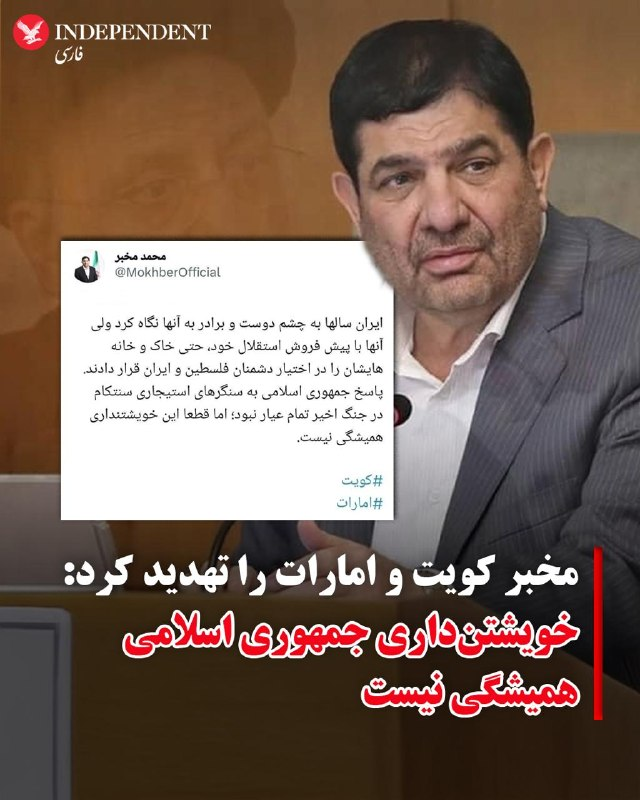

♦️محمد مخبر، مشاور رهبر جمهوری اسلامی، روز شنبه با انتشار متنی در شبکه اجتماعی ایکس با استفاده از هشتگ کویت و امارات نوشت: «ایران سال‌ها به چشم دوست و برادر به آنها نگاه کرد، ولی آنها با پیش‌فروش استقلال خود، حتی خاک و خانه‌هایشان را در اختیار دشمنان فلسطین و ایران قرار دادند.»

مخبر در این پیام با اشاره به حضور نیروهای آمریکایی در کشورهای منطقه، تهدید کرد: «پاسخ جمهوری اسلامی به سنگرهای استیجاری سنتکام در جنگ اخیر تمام‌عیار نبود، اما قطعا این خویشتن‌داری همیشگی نیست.»
‌🇸🇦 Indypersian

🤖 @VahidOOnLine

## VahidOOnLine — post 240452

  <a href="telegram/content/VahidOOnLine_240452_1778929982.mp4" target="_blank">🎬 Download video</a>

ایرانیان استرالیا روز شنبه در حمایت از انقلاب ملی علیه جمهوری اسلامی تجمع کرده و با حمل پرچم شیروخورشید ترانه‌های ملی را هم‌خوانی کردند.
‌🏁 🇬🇧 IranintlTV

🤖 @VahidOOnLine

## VahidOOnLine — post 240451

  

روزنامه معاریو به نقل از منابع آگاه گزارش داد که دولت دونالد ترامپ در روزهای اخیر آمادگی خود را برای دادن «چراغ سبز» به اقدام نظامی در صورت شکست نهایی تلاش‌های دیپلماتیک با جمهوری اسلامی نشان داده است.

بر اساس این گزارش، با وجود این رویکرد، هنوز تصمیم نهایی برای آغاز عملیات نظامی اتخاذ نشده است.

این منابع افزودند که «پنجره دیپلماتیک به سرعت در حال بسته شدن است» و روزهای آینده می‌تواند در تعیین مسیر تحولات سرنوشت‌ساز باشد.
‌🏁 🇬🇧 IranintlTV

🤖 @VahidOOnLine

## VahidOOnLine — post 240450

  <a href="telegram/content/VahidOOnLine_240450_1778929986.mp4" target="_blank">🎬 Download video</a>

مخاطبان ایران اینترنشنال طی روزهای اخیر با ارسال پیام‌هایی درباره سلامت و جان نرگس محمدی، زندانی سیاسی، ابراز نگرانی کرده و از ایرانیان خواستند در خارج از کشور صدای او باشند. پیام مخاطبان با هوش مصنوعی بازخوانی شده است.
‌🏁 🇬🇧 IranintlTV

🤖 @VahidOOnLine

## VahidOOnLine — post 240449

  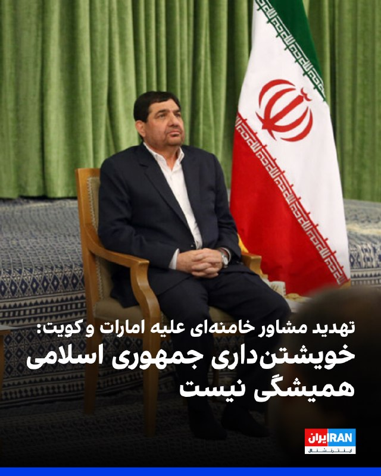

محمد مخبر، مشاور رهبر جمهوری اسلامی، با انتشار مطلبی در ایکس با هشتگ کویت و امارات نوشت: «ایران سال‌ها به چشم دوست و برادر به آنها نگاه کرد، ولی آنها با پیش‌فروش استقلال خود، حتی خاک و خانه‌هایشان را در اختیار دشمنان فلسطین و ایران قرار دادند.»

او تهدید کرد: «پاسخ جمهوری اسلامی به سنگرهای استیجاری سنتکام در جنگ اخیر تمام‌عیار نبود، اما قطعا این خویشتن‌داری همیشگی نیست.»
‌🏁 🇬🇧 IranintlTV

🤖 @VahidOOnLine

## VahidOOnLine — post 240448

  

♦️امارات: خروج از اوپک تصمیمی راهبردی بود، نه سیاسی
وزیر انرژی امارات متحده عربی اعلام کرد تصمیم ابوظبی برای خروج از اوپک و اوپک‌پلاس، اقدامی «حاکمیتی و راهبردی» بوده و انگیزه سیاسی نداشته است.
به گزارش رویترز، مقام‌های اماراتی تاکید کردند این تصمیم بر پایه ارزیابی جامع از سیاست تولید نفت و ظرفیت‌های آینده این کشور اتخاذ شده و نشانه اختلاف با دیگر شرکای اوپک نیست.
وزیر انرژی امارات گفت خروج از اوپک بخشی از راهبرد بلندمدت ابوظبی برای مدیریت مستقل‌تر ظرفیت‌های تولید انرژی و برنامه‌های توسعه آینده است و نباید به‌عنوان نشانه تنش سیاسی در داخل ائتلاف تولیدکنندگان نفت تفسیر شود.
تصمیم امارات در شرایطی اعلام شده که بازار جهانی انرژی همچنان تحت تاثیر جنگ ایران، بحران تنگه هرمز و نوسان شدید قیمت نفت قرار دارد و برخی تحلیلگران، خروج ابوظبی را نشانه تغییرات ساختاری در آینده اوپک و بازار جهانی انرژی می‌دانند.
‌🇸🇦 Indypersian

🤖 @VahidOOnLine

## VahidOOnLine — post 240447

  

فرماندهی کل نیروی دفاعی بحرین اعلام کرد که تمامی سلاح‌ها و یگان‌های این نیرو در بالاترین سطح آمادگی و آماده‌باش دفاعی برای مواجه با حمله احتمالی جمهوری اسلامی قرار دارند. بحرین همچنین از شهروندانش خواست با توجه به پیامدهای این حمله، از نزدیک شدن یا دست زدن به هرگونه شیء ناشناس یا مشکوک که ممکن است از بقایای این حمله باشد، خودداری کنند.

در بیانیه این فرماندهی آمده است که نیروهای آن از آمادگی رزمی پیشرفته و هوشیاری بالا در انجام وظیفه ملی خود برای دفاع از کشور و حفاظت از دستاوردهای آن برخوردارند.
‌🏁 🇬🇧 IranintlTV

🤖 @VahidOOnLine

## VahidOOnLine — post 240446

  <a href="telegram/content/VahidOOnLine_240446_1778929991.mp4" target="_blank">🎬 Download video</a>

⭕️ یخاب آران و بیدگل؛
زیستگاه امن حیات‌وحش کویری ایران

♦️گله‌ای از قوچ‌ و میش‌های وحشی در پناهگاه حیات وحش یخاب ابوزیدآباد در شهرستان آران و بیدگل، در قاب دوربین ثبت شد، منطقه‌ای بکر و کم‌نظیر در حاشیه کویر که یکی از زیستگاه‌های مهم حیات‌وحش ایران به شمار می‌رود.
پناهگاه حیات وحش یخاب با برخورداری از تنوع زیستی ارزشمند، زیستگاه گونه‌هایی همچون قوچ و میش وحشی، جبیر، کاراکال و انواع پرندگان بومی کویر است و به‌دلیل شرایط خاص طبیعی و حفاظت محیط‌زیستی، از مناطق مهم حیات‌وحش در استان اصفهان محسوب می‌شود.
ویدیویی از حضور و حرکت گله قوچ و میش‌های وحشی در این منطقه، جلوه‌ای از حیات طبیعی و زیبایی کم‌نظیر زیستگاه‌های کویری ایران را به نمایش گذاشته است.
‌🇸🇦 Indypersian

🤖 @VahidOOnLine

## t234t7yuhd4efthProject — post 87

سه فیلم خودارضایی جدید با چهره از یه خانوم چادری محجبه که وقتی لخت میشه شورتشو میکشه پایین کصش خیسه خیسه و مشخصه چقدر این زن حشریه😍🇮🇷😈

فیلم سکسشم گذاشتیم خیلی خوبه
@sosmast

## t234t7yuhd4efthProject — post 86

  <a href="telegram/content/t234t7yuhd4efthProject_86_1778929994.mp4" target="_blank">🎬 Download video</a>

سه فیلم خودارضایی جدید با چهره از یه خانوم چادری محجبه که وقتی لخت میشه شورتشو میکشه پایین کصش خیسه خیسه و مشخصه چقدر این زن حشریه😍🇮🇷😈

فیلم سکسشم گذاشتیم خیلی خوبه
@sosmast

## t234t7yuhd4efthProject — post 85

فیلم بمب با چهره یا یه میلف خوشگل و ناز که اخرش که ابشو روش خالی میکنه میگه اوففف عزیزم چه ابی داری🇮🇷😁😍

@sosmast

## t234t7yuhd4efthProject — post 84

3 ویدیو بمبی وطنی که دو تاش از محجبه های خوشگله و یکیش،از تینیجر ۱۸ ساله هست که شیشه شیر رو ساک میزنه و فرو میکنه تو کص خوشگلش😁😍🇮🇷 vip

@sosmast

## t234t7yuhd4efthProject — post 83

  <a href="telegram/content/t234t7yuhd4efthProject_83_1778929996.mp4" target="_blank">🎬 Download video</a>

3 ویدیو بمبی وطنی که دو تاش از محجبه های خوشگله و یکیش،از تینیجر ۱۸ ساله هست که شیشه شیر رو ساک میزنه و فرو میکنه تو کص خوشگلش😁😍🇮🇷 vip

@sosmast

## t234t7yuhd4efthProject — post 82

  <a href="telegram/content/t234t7yuhd4efthProject_82_1778929999.mp4" target="_blank">🎬 Download video</a>

3 ویدیو بمبی وطنی که دو تاش از محجبه های خوشگله و یکیش،از تینیجر ۱۸ ساله هست که شیشه شیر رو ساک میزنه و فرو میکنه تو کص خوشگلش😁😍🇮🇷 vip

@sosmast

## t234t7yuhd4efthProject — post 81

فیلمای جدید بدن نمایی و سکس ساغر جون 😍😁😂 هرچقدر غذا میخوره میره تو کصو کون و ممه هاش 😂چربی خالصانه 😂😍 سینه هاش تو سوتین جا نمیشه😁پسره کیرو میکنه تو کصش و خوب ساغرو میکنه😍

@sosmast

## t234t7yuhd4efthProject — post 80

فیلم خریداری شده یکی از بچه های چنل از دختر ۲۰ ساله شیرازی😁❤️😍 دختره یه لباس تنگ و چسبون پوشیده یواش یواش شروع میکنه به لخت شدن و بدن نمایی میکنه😍😁😂

@sosmast

## t234t7yuhd4efthProject — post 79

درسته قدیمیه ولی عجب کیفیتی داره فیلمشون❤️😍😁 دختره یه لباس توری سکسی پوشیده باسن و هیکلشم چرب و براق شده لباس توریشو پاره میکنه و میزاره لای کص خیس و براقش 😁😂😍ابشم میلیزه تو کص دختره.

@sosmast

## t234t7yuhd4efthProject — post 78

فیلمای جدید بدن نمایی و سکس ساغر جون 😍😁😂 هرچقدر غذا میخوره میره تو کصو کون و ممه هاش 😂چربی خالصانه 😂😍 سینه هاش تو سوتین جا نمیشه😁پسره کیرو میکنه تو کصش و خوب ساغرو میکنه😍

@sosmast

## t234t7yuhd4efthProject — post 77

  <a href="telegram/content/t234t7yuhd4efthProject_77_1778930002.mp4" target="_blank">🎬 Download video</a>

گاییدن دختر خوش هیکل برنزه😍🇮🇷😁 لامصب عجب کص نابیه😋👍

@sosmast

## t234t7yuhd4efthProject — post 76

  <a href="telegram/content/t234t7yuhd4efthProject_76_1778930005.mp4" target="_blank">🎬 Download video</a>

گاییدن دختر خوش هیکل برنزه😍🇮🇷😁 لامصب عجب کص نابیه😋👍

@sosmast

## t234t7yuhd4efthProject — post 75

  <a href="telegram/content/t234t7yuhd4efthProject_75_1778930008.mp4" target="_blank">🎬 Download video</a>

فیلم های اختصاصی بمب از کردن کون زن سفید و سکسیش😍😁🇮🇷 لنگاشو باز کرده شوهرش تف زده به سوراخ کونش و داره کونشو جر میده😍 از نزدیک از سوراخش فیلم میگیره خیلی گشاد شده😋💋👌vip

@sosmast

## t234t7yuhd4efthProject — post 74

  <a href="telegram/content/t234t7yuhd4efthProject_74_1778930010.mp4" target="_blank">🎬 Download video</a>

فیلم های اختصاصی بمب از کردن کون زن سفید و سکسیش😍😁🇮🇷 لنگاشو باز کرده شوهرش تف زده به سوراخ کونش و داره کونشو جر میده😍 از نزدیک از سوراخش فیلم میگیره خیلی گشاد شده😋💋👌vip

@sosmast

---
📅 بروزرسانی: 1405/02/26 13:31
---

## VahidOOnLine — post 240445

  <a href="telegram/content/VahidOOnLine_240445_1778925704.mp4" target="_blank">🎬 Download video</a>

یک شهروند ویدیویی به ایران اینترنشنال فرستاده که بحران در دسترسی به بنزین و تشکیل صف‌های طولانی در بندرعباس در روز شنبه ۲۶ اردیبهشت‌ماه را نشان می‌دهد.
‌🏁 🇬🇧 IranintlTV

🤖 @VahidOOnLine

## VahidOOnLine — post 240444

  

مشاهدات شما از بحران کمبود و گرانی سوخت در استان‌های مختلف ایران چیست؟

روی لینک زیر کلیک کنید و پیام‌های خود از طریق مدیا‌بات برای ما بفرستید.

t.me

پیام‌های شما به صورت زیر‌نویس در تلویزیون و همچنین در بخش‌های مختلف‌ خبری منتشر خواهد شد
‌🏁 🇬🇧 IranintlTV

🤖 @VahidOOnLine

## VahidOOnLine — post 240443

روایت شما از زندگی در آتش‌بس- شنبه ۲۶ اردیبهشت ۱۴۰۵

🔹 من یک معلول ضایعه نخاعی هستم، ۳۳ سال سن دارم. یک ساله بیکار شدم. هر جا می‌رم به خاطر معلولیتم به من کار نمی‌دن. الان هم که به خاطر شرایط جنگ، اکثر شرکت‌ها تعدیل نیرو دارن.
🔹 از ماهشهر، از وضع مردم خون به جگرم، اما حال و روز نیروی انتظامی دیدن داره، کنار خیابون بساط کردن. راستی از پرداختاتون چه خبر؟ ظاهراً ولتون کردن.
🔹 در حالی که سه ماهه وضع معیشتی سخت شده و بیکار شده‌ایم، قبض برق، گاز و آب گرون شده. سه ماهه مجلس هم تقریباً به‌هم ریخته. چرا نمایندگان مجلس باید حقوق آنچنانی بگیرند؟ مفت‌خورا.
🔹 من با هزار بدبختی به اینترنت وصل شدم. خواستم بگم دمِ خارج از کشور گرم که هوای ما رو دارن.
🔹 از بوشهر؛ جایگاه‌های سوخت بنزین ندارند. روزهای سختی با جمهوری اسلامی در راه است ولی ما تا سقوط این وضعیت تحمل می‌کنیم.
🔹 تسمه دینام پژو ۴۰۵ قبل از دی‌ماه ۴۰۰ تومن بود، الان شده یک میلیون و ششصد.
🔹 اولین بار که بعد از قطع نت وصل می‌شم. افزایش قیمت‌ها عجیب و غریب شده. دانش‌آموز و دانشجو بلاتکلیفن. بعضی‌ها هم از فرصت استفاده می‌کنن و دوباره زبان‌شون دراز شده. امیدوارم زودتر حمله بشه تا اینا برگردن سر جاشون. پاینده ایران.
‌🏁 🇬🇧 IranintlTV

🤖 @VahidOOnLine

## VahidOOnLine — post 240442

  

♦️مساجد شمال غزه روز شنبه اعلام کردند فرمانده شاخه نظامی حماس در حملات روز جمعه اسرائیل به این باریکه کشته شده است. ارتش اسرائیل پیش‌تر اعلام کرده بود رهبر شاخه مسلح حماس را در حملات هوایی هدف قرار داده است.
رویترز به نقل از شاهدان عینی گزارش داد مساجد شهر غزه خبر «شهادت» عزالدین الحداد را اعلام کرده‌اند.
با این حال، حماس تاکنون درباره سرنوشت فرمانده شاخه نظامی خود اظهار نظر رسمی نکرده است.
‌🇸🇦 Indypersian

🤖 @VahidOOnLine

## VahidOOnLine — post 240441

اصغر فرهادی،‌ کارگردان و تهیه‌کننده، ۲۵ اردیبهشت در نشست خبری فیلم «داستان‌های موازی» در جشنواره کن در پاسخ به پرسش خبرنگار ایران‌اینترنشنال درباره انقلاب ملی و سرکوب شهروندان گفت: «قتل انسان‌ها برای من قابل پذیرش نیست؛ چه با جنگ، چه اعدام و چه با کشتن معترضان.»

واکنش شماری از مخاطبان ایران‌اینترنشنال نشان می‌دهد که گروهی موضع‌گیری او را ناکافی دانسته‌اند و باور دارند که این فیلم‌ساز ایرانی، «حق مطلب» درباره جاویدنامان انقلاب ملی ایرانیان را ادا نکرده است.

بازخوانی پیام‌ها با هوش مصنوعی انجام گرفته است.
‌🏁 🇬🇧 IranintlTV

🤖 @VahidOOnLine

## VahidOOnLine — post 240440

  

الیاس حضرتی، رییس شورای اطلاع‌رسانی دولت، گفت اگر هدف از قطع یا محدودسازی اینترنت، جلوگیری از دسترسی مردم به برخی سایت‌ها بوده، این هدف نه‌تنها محقق نشده بلکه نتیجه معکوس داشته است. او افزود: «در برخی کشورها نیز محدودیت‌های مقطعی اینترنت اعمال می‌شود، اما این محدودیت‌ها بلافاصله به حالت عادی بازمی‌گردد.»
‌🏁 🇬🇧 IranintlTV

🤖 @VahidOOnLine

## VahidOOnLine — post 240439

  <a href="telegram/content/VahidOOnLine_240439_1778925710.mp4" target="_blank">🎬 Download video</a>

♦️هواداران خشمگین یک باشگاه فوتبال در طرابلس در اعتراض به تصمیم داور، نمای ساختمان و محوطه دفتر دولت وحدت ملی لیبی (GNU) را به آتش کشیدند.
رویترز به نقل از دو شاهد عینی و یک شبکه تلویزیونی محلی گزارش داد، این ناآرامی‌ها شامگاه پنج‌شنبه در پایتخت لیبی آغاز شد. زمانی که هواداران باشگاه الاتحاد طرابلس در اعتراض به تصمیم داور مبنی بر اعلام نشدن یک ضربه پنالتی در دیدار برابر تیم السویحلی مصراته به خیابان‌ها آمدند.
این مسابقه در ورزشگاه شهر ترهونه، حدود ۶۵ کیلومتری جنوب‌شرقی طرابلس برگزار شد. خبرنگار رویترز که در محل حضور داشت گزارش داد بازی در دقیقه ۸۷ و پس از اعتراض بازیکنان و هواداران الاتحاد متوقف شد.
بر اساس این گزارش، شماری از هواداران الاتحاد وارد زمین مسابقه شدند و درگیری‌هایی رخ داد که به آسیب‌دیدگی اموال و زخمی شدن نیروهای حفاظت ورزشگاه انجامید.
‌🇸🇦 Indypersian

🤖 @VahidOOnLine

## VahidOOnLine — post 240438

روایت شما از زندگی در آتش‌بس- شنبه ۲۶ اردیبهشت ۱۴۰۵

🔹 هر پرس استیک توی لاله‌پارک تبریز شده ۱ میلیون و ۶۰۰ هزار تومان، حقوق یک ماه کارگر معادل ۱۵ پرس استیک!
🔹 من به زور و هزار بدبختی وصل شدم. بدبختمون کردن، چیزی برامون نذاشتن. یک روغن شده ۲ میلیون و ۵۰۰، یک مرغ کوچیک شده ۵۰۰ هزار تومن. کل خانواده کار می‌کنن، بازم خرج زندگی درنمیاد. اینا نباید بمونن، تا از کشورمون نرن حال ایران خوب نمی‌شه. من از طرف پدربزرگ و مادربزرگم عذرخواهی می‌کنم که انقلاب کردن و زندگی تو بهشت را تبدیل به جهنم کردن. تنها امیدمون برگشت شاهزاده‌مونه، از طرف یک نسل زد.
🔹 از ایران؛ آقای ترامپ، برای مذاکره با این جانی‌ها فقط یک شرط بگذارید؛ برگزاری رفراندوم برای تعیین نوع حکومت تحت نظر نهادهای بین‌المللی. همه دنیا هم از شما حمایت خواهد کرد.
🔹 من مهندس ساختمان هستم. در صنعت ساختمان به‌قدری افزایش قیمت وجود داشته که بسیاری از کارگاه‌ها تعطیل شده‌اند. فقط کارگاه‌هایی فعال هستند که پیش‌فروش کردند و مجبور به تحویل هستند. با این روند، بیشتر مهندسین به‌زودی بیکار خواهند شد.
🔹 از مشهد؛ برای سوخت‌گیری به ۳ پمپ‌بنزین رفتم. میدان تلویزیون اصلاً سوخت نمی‌داد، در وکیل‌آباد ورودی دانشجو صف طولانی بود و در بلوار پیروزی بعد از یک ساعت انتظار در صف توانستم ۱۵ لیتر با کارت ۳۰۰۰ تومانی بزنم.
🔹 از مشهد. بعد از ۹ اسفند تازه امروز، ۲۶ اردیبهشت، به‌سختی وصل شدم. شرایط ایران خلاصه می‌شود در گرانی، فقر، نبود اینترنت و ناامیدی و افسردگی. لعنت به سیاست که مردم این وسط تاوان می‌دهند. امیدوارم روزی برسد که مردم ایران از ته دل شاد بشن، چون لیاقتشان بیشتر از این‌هاست.
‌🏁 🇬🇧 IranintlTV

🤖 @VahidOOnLine

## VahidOOnLine — post 240437

⭕️ آموزش استفاده از سلاح در صداوسیما؛
مجری به سمت پرچم امارات متحده عربی شلیک کرد

♦️شامگاه جمعه ۲۵ اردیبهشت‌ماه، برخی مجریان زن و مرد صداوسیمای جمهوری اسلامی در برنامه‌های تلویزیونی با در دست داشتن اسلحه ظاهر شدند. در یکی از ویدیوهای منتشرشده، فردی نظامی با پوشاندن صورت خود، نحوه استفاده از سلاح را آموزش می‌دهد و سپس اسلحه را در اختیار مجری برنامه قرار می‌دهد.
مجری برنامه که به‌نظر می‌رسد آشنایی چندانی با کار با اسلحه ندارد، به توضیحات و آموزش‌های فرد نظامی گوش می‌دهد. او سپس برای شلیک، سلاح را به سمت تصویر پرچم امارات متحده عربی که روی نمایشگر استودیو دیده می‌شود نشانه می‌گیرد و اقدام به شلیک می‌کند.
پخش این تصاویر در حالی صورت می‌گیرد که تنش‌ها میان جمهوری اسلامی ایران و ایالات متحده بار دیگر افزایش یافته و گمانه‌زنی‌ها درباره احتمال ورود دو طرف به دور تازه‌ای از تقابل‌های نظامی و امنیتی شدت گرفته است.
‌🇸🇦 Indypersian

🤖 @VahidOOnLine

## VahidOOnLine — post 240436

  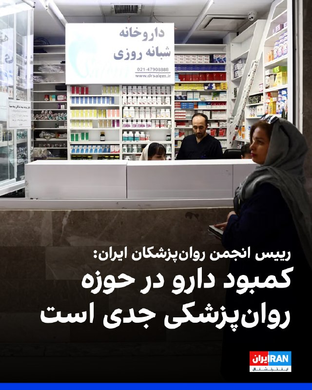

وحید شریعت، رییس انجمن روان‌پزشکان ایران، در مصاحبه با ایلنا گفت: «کمبود دارو در حوزه روان‌پزشکی جدی است و نسبت به شرایط پیش از جنگ، به‌طور قابل توجهی تشدید شده است.»

او افزود: «در ماه‌های اخیر، کمبود قابل توجهی در برخی اقلام دارویی مشاهده شده است که برخی از آن‌ها از پیش از آغاز جنگ تشدید یافته و برخی دیگر کاملا جدید هستند.»

شریعت اختلال در روند تولید، نبود مواد اولیه، محدود شدن توزیع به‌منظور آماده‌سازی بازار برای افزایش قیمت و تلاش برخی افراد برای ذخیره‌سازی دارو به‌دلیل ترس از جنگ را از عوامل اصلی بحران داروهای روان‌پزشکی عنوان کرد.
‌🏁 🇬🇧 IranintlTV

🤖 @VahidOOnLine

## VahidOOnLine — post 240435

  

♦️خبرگزاری‌های روسیه به نقل از سرگئی ریابکوف، معاون وزیر خارجه این کشور، گزارش دادند مسکو و واشنگتن همچنان تماس‌های بسیار نزدیک در سطوح عالی را حفظ کرده‌اند.
ریابکوف روز شنبه گفت احتمال دارد سرگئی لاوروف، وزیر خارجه روسیه، و مارکو روبیو، وزیر خارجه آمریکا، در دوره پیش‌رو تماس‌های بیشتری با یکدیگر داشته باشند.
او با این حال تاکید کرد روند بهبود و پیشرفت روابط میان روسیه و آمریکا «کند و دشوار» است.
مقام‌های رسمی روسیه و آمریکا، روز نهم اردیبهشت ماه از تماس تلفنی یک ساعت و نیمه میان دونالد ترامپ و ولادیمیر پوتین خبر داده بودند.
‌🇸🇦 Indypersian

🤖 @VahidOOnLine

## VahidOOnLine — post 240434

  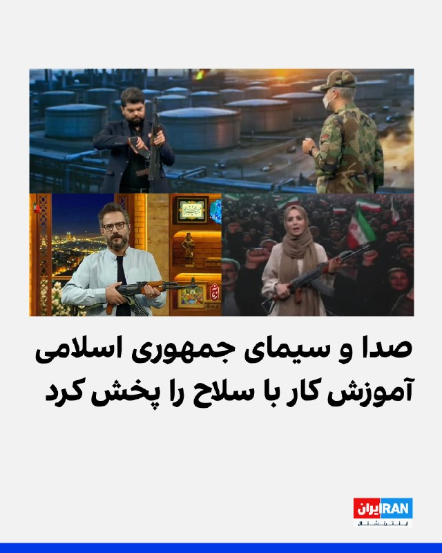

صدا و سیمای جمهوری اسلامی جمعه چند برنامه پخش کرد که در آنها مجریان در بخش‌های استودیویی با در دست داشتن تفنگ ظاهر شدند و کار با سلاح‌های سبک آموزش داده شد. مجریان در این برنامه‌ها اعلام کردند که در صورت لزوم به جنگ خواهند پیوست.

این برنامه‌ها که دست‌کم در سه بخش پخش شد، در رسانه‌های داخلی بازنشر و در شبکه‌های اجتماعی با واکنش‌هایی همراه شد. برخی کاربران شبکه‌های اجتماعی این بخش‌ها را نشانه‌ای از بسیج در شرایط جنگی توصیف کردند.

جکسون هینکل، مفسر سیاسی آمریکایی، در شبکه اجتماعی ایکس نوشت تلویزیون دولتی ایران نحوه استفاده و شلیک با کلاشینکف را به‌عنوان «آمادگی برای تهاجم زمینی آمریکا» نشان می‌دهد.
‌🏁 🇬🇧 IranintlTV

🤖 @VahidOOnLine

## VahidOOnLine — post 240433

  <a href="telegram/content/VahidOOnLine_240433_1778925715.mp4" target="_blank">🎬 Download video</a>

♦️سخنگوی وزارت کشور از فراهم شدن زمینه برای «شنیده شدن اعتراضات مردمی» خبر داد، اظهاراتی که در حالی مطرح می‌شود جمهوری اسلامی دی‌ماه گذشته در جریان انقلاب ملی ایرانیان، دست به یکی از بی‌سابقه‌ترین سرکوب‌های خیابانی زد و هزاران شهروند معترض را هدف گلوله قرار داد.
علی زینی‌وند، سخنگوی وزارت کشور، با اشاره به افزایش فشارهای اقتصادی و نارضایتی عمومی اعلام کرد که «گرانی برخی کالاها قابل انکار نیست» و دولت نیز از شرایط دشوار معیشتی مردم آگاه است. او گفت تمرکز ستاد تنظیم بازار بر کنترل قیمت‌هاست و همزمان موضوعاتی مانند افزایش احتمالی یارانه‌ها، اعطای مهلت در پرداخت اقساط و مالیات و برخی حمایت‌های معیشتی دیگر در دست بررسی قرار دارد.
زینی‌وند همچنین مدعی شد که بسترهایی برای شنیده شدن اعتراضات و مطالبات مردم توسط مسئولان در حال فراهم شدن است؛ این در حالی است که تنها چند ماه پیش، اعتراضات مردمی در شهرهای مختلف ایران با برخوردهای امنیتی گسترده، بازداشت‌های وسیع و تیراندازی مستقیم به معترضان و کشته شدن هزاران معترض مواجه شد.
‌🇸🇦 Indypersian

🤖 @VahidOOnLine

---
📅 بروزرسانی: 1405/02/26 12:00
---

## VahidOOnLine — post 240432

  

حسین شریعتمداری، نماینده رهبر جمهوری اسلامی در روزنامه کیهان، نوشت کشورهای عربستان سعودی، امارات متحده عربی، کویت، قطر، بحرین و اردن در جنگ اخیر «حضور و شرکت مستقیم داشتند» و به همین دلیل، باید «بخشی از اهداف نشاندار» حکومت ایران در انتقام خون علی خامنه‌ای باشند.

او افزود مذاکره با آمریکا و این کشور‌های عربی «بخشی از سازوکار تعریف‌شده نظام» است، اما «جنگ نباید و نمی‌تواند بدون انتقام سخت از قاتلان امام شهیدمان به نقطه پایان برسد».
‌🏁 🇬🇧 IranintlTV

🤖 @VahidOOnLine

## VahidOOnLine — post 240431

  <a href="telegram/content/VahidOOnLine_240431_1778920202.mp4" target="_blank">🎬 Download video</a>

گروه ناظر اینترنتی نت‌بلاکس اعلام کرد خاموشی دیجیتال در ایران اکنون وارد دوازدهمین هفته و هفتادوهشتمین روز خود شده است.
نت‌بلاکس می‌گوید این قطع اینترنت که یک کشور ۹۰ میلیونی را برای مدتی بی‌سابقه تا حد زیادی از دسترسی به اینترنت جهانی محروم کرده، همچنان در حال تضعیف حقوق بشر، اقتصاد و آزادی‌های اساسی در ایران است.
‌🏁 🇬🇧 ManotoTV

🤖 @VahidOOnLine

## VahidOOnLine — post 240430

  

♦️وزیر نفت جدید عراق، روز شنبه ۲۶ اردیهشت ماه اعلام کرد این کشور در اپریل گذشته تنها ۱۰ میلیون بشکه نفت از طریق تنگه هرمز صادر کرده است، رقمی که پیش از آغاز جنگ ایران حدود ۹۳ میلیون بشکه در ماه بود.
باسم محمد، وزیر نفت عراق، روز شنبه در یک نشست خبری گفت بسته شدن تنگه هرمز در پی جنگ ایران باعث کاهش شدید صادرات نفت کشورهای عربستان سعودی، امارات، کویت و عراق شده و همزمان قیمت نفت را به‌طور قابل توجهی افزایش داده است.
او همچنین گفت صادرات نفت خام عراق از طریق خط لوله کرکوک–جیهان از ماه مارس از سر گرفته شده، اقدامی که پس از توافق بغداد و دولت اقلیم کردستان عراق برای آغاز مجدد انتقال نفت انجام شد.
وزیر نفت عراق افزود: «در حال حاضر روزانه ۲۰۰ هزار بشکه از طریق بندر جیهان صادر می‌کنیم و برنامه داریم این رقم را به ۵۰۰ هزار بشکه افزایش دهیم.»
محمد همچنین با اعلام آنکه بغداد تولید پنج میلیون بشکه نفت در روز را هدف‌گذاری کرده است گفت، کشورش قصد دارد با اوپک برای افزایش ظرفیت تولید و صادرات خود همکاری کند.
‌🇸🇦 Indypersian

🤖 @VahidOOnLine

## VahidOOnLine — post 240429

  

نت‌بلاکس اعلام کرد خاموشی دیجیتال در ایران وارد دوازدهمین هفته خود شده و اکنون به هفتاد و هشتمین روز رسیده است؛ وضعیتی که به گفته این نهاد، یک قطعی بی‌سابقه در مقیاس ملی به شمار می‌رود.

بر اساس این گزارش، قطع اینترنت که کشوری با ۹۰ میلیون جمعیت را تا حد زیادی آفلاین کرده، همچنان به تضعیف گسترده حقوق بشر، اقتصاد و آزادی‌های اساسی ادامه می‌دهد.
‌🏁 🇬🇧 IranintlTV

🤖 @VahidOOnLine

## VahidOOnLine — post 240428

  <a href="telegram/content/VahidOOnLine_240428_1778920204.mp4" target="_blank">🎬 Download video</a>

رسانه‌های عراقی گزارش دادند صدای انفجارهایی که روز شنبه در بغداد، پایتخت عراق شنیده شد، ناشی از شلیک گلوله‌های توپخانه به مناسبت تشکیل دولت جدید بوده است.
یک منبع امنیتی به خبرگزاری فرانسه گفت این شلیک‌ها همزمان با آغاز به کار دولت به ریاست نخست‌وزیر جدید عراق، علی الزیدی، انجام شده است.
پیش‌تر برخی رسانه‌ها از شنیده شدن چند انفجار در مرکز بغداد خبر دادند.
‌🏁 🇬🇧 ManotoTV

🤖 @VahidOOnLine

## VahidOOnLine — post 240427

  

♦️رئیس‌جمهوری نیجریه و ارتش این کشور روز شنبه تایید کردند یکی از رهبران ارشد داعش در جریان یک عملیات مشترک با نیروهای آمریکایی در نیجریه کشته شده است.
بولا تینوبو، رئیس‌جمهوری نیجریه، در بیانیه‌ای پس از اعلام اولیه این خبر از سوی دونالد ترامپ گفت: «نیروهای مسلح مصمم نیجریه در همکاری نزدیک با نیروهای مسلح ایالات متحده، عملیاتی جسورانه انجام دادند که ضربه سنگینی به صفوف داعش وارد کرد.»
نیروهای دفاعی نیجریه اعلام کردند فرد کشته‌شده «ابوبلال المنوکی» بوده است. فردی که به گفته آن‌ها از رهبران ارشد داعش و «یکی از فعال‌ترین تروریست‌های جهان» به شمار می‌رفت.
دونالد ترامپ، رئیس‌جمهوری آمریکا، شنبه ۲۶ اردیبهشت با انتشار پیامی در «تروث سوشال» اعلام کرد نیروهای آمریکایی با همکاری ارتش نیجریه، در جریان یک عملیات پیچیده و دقیق، «ابوبلال المینوکی» مرد شماره دو و فعال‌ترین عضو ارشد داعش در جهان را از پای درآورده‌اند.
‌🇸🇦 Indypersian

🤖 @VahidOOnLine

## VahidOOnLine — post 240426

  

♦️خبرگزاری فارس، روز شنبه ۲۶ اردیبهشت ماه گزارش داد، وزارت اقتصاد در حال پیگیری طرحی است که با استفاده از سازوکار بیمه، «مدیریت تنگه هرمز را امکان‌پذیر کند». طرحی که به گفته فارس، می‌تواند در شرایط غیرجنگی از سوی کشورها نیز پذیرفته شود و در عین حال امکان مدیریت عبور و مرور دریایی را برای ایران فراهم کند.
فارس بر اساس سندی که به دست این رسانه رسیده است گزارش کرد، در قالب طرح موسوم به «بیمه هرمز»، امکان اشراف اطلاعاتی ایران بر تردد کشتی‌ها و همچنین تفکیک و شناسایی شناورهای متعلق به کشورهای مختلف فراهم خواهد شد.
به ادعای این رسانه حکومتی، جمهوری اسلامی در شرایط پس از جنگ می‌تواند تا دو میلیارد دلار از این روش درامدزایی کند. با این حال، این گزارش می‌افزاید محدودیت‌های زیرساختی ایران ظرفیت چنین درآمدی را نیز محدود می‌کند.
به نوشته فارس، مزیت این طرح آن است که «مدیریت تنگه از طریق بیمه» ماهیتی غیرنظامی و مدنی دارد و برخلاف اخذ عوارض، احتمال پذیرش آن از سوی کشورها بیشتر است.
جمهوری اسلامی از زمان آغاز جنگ با آمریکا در اسفندماه گذشته، تنگه هرمز را بسته و بارها بر کنترل و مدیریت این آبراه راهبردی تاکید کرده است. پیش‌تر نیز مجلس ایران طرح‌هایی درباره دریافت عوارض از کشتی‌های عبوری را مطرح کرده بود، موضوعی که همزمان با اعتراض گسترده جامعه جهانی، بحث‌های حقوقی و سیاسی گسترده‌ای درباره آینده تردد در تنگه هرمز ایجاد کرده است.
‌🇸🇦 Indypersian

🤖 @VahidOOnLine

## VahidOOnLine — post 240425

  

کرملین در بیانیه‌ای اعلام کرد ولادیمیر پوتین، رییس‌جمهوری روسیه، به‌زودی راهی چین خواهد شد و در روزهای سه‌شنبه و چهارشنبه، ۲۹ و ۳۰ اردیبهشت، با مقام‎‌های این کشور دیدار خواهد کرد.

بر اساس این بیانیه، پوتین و شی جین‌پینگ، رییس‌جمهوری چین، قرار است درباره «روابط دوجانبه» و «مسائل کلیدی بین‌المللی و منطقه‌ای» گفت‌وگو کنند.

پوتین در حالی به چین سفر خواهد کرد که دونالد ترامپ، رییس‌جمهوری آمریکا، سفر دوروزه خود به پکن را ۲۵ اردیبهشت به پایان رساند.
‌🏁 🇬🇧 IranintlTV

🤖 @VahidOOnLine

## VahidOOnLine — post 240424

  <a href="telegram/content/VahidOOnLine_240424_1778920207.mp4" target="_blank">🎬 Download video</a>

⭕️ پارک ملی توران سمنان؛
ثبت زادآوری گونه نادر گورخر آسیایی در ۱۴۰۵

♦️اداره‌کل حفاظت محیط زیست استان سمنان از ثبت نخستین زادآوری گورخر آسیایی در پارک ملی توران طی سال ۱۴۰۵ خبر داد.
گورخر آسیایی یا گور ایرانی، از گونه‌های در معرض خطر انقراض است که بخش مهمی از جمعیت باقی‌مانده آن در پارک ملی توران زندگی می‌کنند.
پارک ملی توران در استان سمنان که به «آفریقای ایران» شهرت دارد، یکی از مهم‌ترین زیستگاه‌های حیات‌وحش کشور محسوب می‌شود و گونه‌های نادری مانند یوزپلنگ آسیایی، جبیر و گورخر ایرانی را در خود جای داده است. فعالان محیط زیست امیدوارند ادامه روند زادآوری این گونه، به افزایش جمعیت و کاهش خطر انقراض گورخر آسیایی در ایران کمک کند.
‌🇸🇦 Indypersian

🤖 @VahidOOnLine

## VahidOOnLine — post 240423

  

مسعود پزشکیان، رییس دولت جمهوری اسلامی، در پیامی به پاپ لئو، رهبر کاتولیک‌های جهان، از آنچه «موضع اخلاقی و منطقی» او در قبال جنگ ایران خواند، قدردانی کرد.

در این پیام آمده است: «حملات آمریکا و اسرائیل صرفا علیه ایران نیست، بلکه علیه حاکمیت قانون و ارزش‌های انسانی است.»

پزشکیان افزود جمهوری اسلامی «در چارچوب دفاع مشروع، اهداف و منافع متجاوزین را مورد هدف قرار داد».

او همچنین خواستار واکنش «مسئولانه» جامعه جهانی به «اقدامات غیرقانونی» ایالات متحده شد.
‌🏁 🇬🇧 IranintlTV

🤖 @VahidOOnLine

## VahidOOnLine — post 240422

  <a href="telegram/content/VahidOOnLine_240422_1778920209.mp4" target="_blank">🎬 Download video</a>

ارتش اسرائیل اعلام کرد در پی فعال شدن هشدار نفوذ پهپاد در منطقه میرون، یک هدف هوایی مشکوک شناسایی شده است.
ارتش اسرائیل همچنین اعلام کرد جزئیات این رویداد در حال بررسی است و این حادثه بدون تلفات پایان یافته اس
‌🏁 🇬🇧 ManotoTV

🤖 @VahidOOnLine

## VahidOOnLine — post 240421

🗣روایت شما از زندگی در آتش‌بس- شنبه ۲۶ اردیبهشت ۱۴۰۵

🔹از قزوین ۲۶ اردیبهشت؛ از ساعت ۶ صبح یه‌سری صدا از آسمون می‌شنوم که مثل صدای جنگنده‌ست و رد می‌شه.

🔹بامداد ۲۶ اردیبهشت صدای جنگنده می‌اومد در ارومیه.

🔹اینجا اوضاع واقعاً خرابه، من ۴ ماه پیش تخم‌مرغ خریدم ۲۵۰ یه شونه، الان ۶۷۰ تومن یه شونه تخم‌مرغ.

🔹سیستم آموزشی بسیار ضعیفه و معلم‌ها فقط با روزی ۲ تا کلیپ از اینترنت کتاب رو تموم کردن، حالا بچه‌ی اول دبستانی رو می‌گن باید بیاد حضوری مدرسه در اهواز.

🔹بنزین در استان بوشهر تقریباً نایاب شده. دکه‌های کنار جاده لیتری ۱۰ هزار تومان، در بشکه‌های پنج لیتری می‌فروشن.

🔹هر شب آب ولنجک و محمودیه رو تا صبح قطع می‌کنن. روزها هم فشار آب اون‌قدر کم شده که ورودی منبع مدام قطع‌و‌وصل می‌شه. به نظر می‌رسه قطعی آب رو هم دارن عادی‌سازی می‌کنن.

🔹از اصفهان دانش‌آموز پایه نهمی‌ام. درس خوندنم با اینترنت و کلیپ‌های معلم‌ها بود. از هوش مصنوعی استفاده زیادی برای درس‌ها داشتم. الان دسترسی ندارم. قیمت VPN اومده پایین تا ۲۸۰ هزار تومن. ولی ما دانش‌آموزان... هی آقایون فروشنده VPN، خدا رو همه رو وصل کنید. #وی‌پی‌ان‌‌برای‌همه

🔹از ملارد استان تهران؛ از ساعت ۱۲ شب تا ۵ صبح آب اینجا قطع بود. با این وجود، به‌تازگی از ساعت ۲ بعدازظهر تا ۶ عصر هم قطع می‌کنن.
‌🏁 🇬🇧 IranintlTV

🤖 @VahidOOnLine

## VahidOOnLine — post 240420

  

♦️خبرگزاری رویترز به نقل از یک منبع آگاه گزارش داد که ماتیاس گرافستروم، دبیرکل فیفا، روز شنبه در استانبول با مقام‌های فدراسیون فوتبال ایران دیدار خواهد کرد تا درباره حضور تیم ملی ایران در جام جهانی با آنها گفتگو کند.
ایران قرار است هر سه بازی مرحله گروهی خود در جام جهانی را در ایالات متحده برگزار کند، اما از زمان حملات آمریکا و اسرائیل به ایران در اسفندماه گذشته، حضور تیم ملی ایران در این رقابت‌‌ها با ابهام‌هایی روبه‌رو شده است.
به گزارش رویترز، انتظار می‌رود مقام‌های فیفا در این دیدار درباره وضعیت حضور ایران در این مسابقات توضیح داده و پیام‌هایی «با هدف کاهش نگرانی‌ها» ارائه کنند.
پیشتر مهدی تاج، رئیس فدراسیون فوتبال ایران در اظهاراتی متناقض، با اعلام حضور «قطعی» تیم‌ ملی در جام‌جهانی، برای شرکت دراین رقابت‌ها شروط تعیین کرده بود.
‌🇸🇦 Indypersian

🤖 @VahidOOnLine

## VahidOOnLine — post 240419

  

⭕️ ثبت بیش از ۲۵۰ زمین‌لرزه در ایران طی سه هفته اخیر

♦️بر اساس گزارش موسسه ژئوفیزیک دانشگاه تهران، از ۲۹ فروردین تا ۱۸ اردیبهشت‌ماه امسال بیش از ۲۵۰ زمین‌لرزه در نقاط مختلف کشور به ثبت رسیده است.
شدیدترین زمین‌لرزه این بازه، زلزله ۵.۱ ریشتری سفیدآبه در استان سیستان و بلوچستان اعلام شده، رخدادی که بار دیگر توجه‌ها را به وضعیت لرزه‌خیزی ایران و ضرورت آمادگی در برابر حوادث طبیعی جلب کرده است.
ایران به‌دلیل قرار گرفتن روی کمربند زلزله آلپ-هیمالیا، از جمله کشورهای زلزله‌خیز جهان به شمار می‌رود و کارشناسان همواره بر مقاوم‌سازی ساختمان‌ها، آموزش عمومی و آمادگی مدیریت بحران تاکید دارند.
‌🇸🇦 Indypersian

🤖 @VahidOOnLine

---
📅 بروزرسانی: 1405/02/26 10:06
---

## VahidOOnLine — post 240418

  

کانال ۱۲ اسرائیل گزارش داد انتظار می‌رود دونالد ترامپ، رییس‌جمهوری آمریکا، طی ۲۴ ساعت آینده تیم مشاوران نزدیک خود را تشکیل دهد تا درباره ایران تصمیم نهایی بگیرد. برآوردها در اسرائیل حاکی است تصمیم درباره اقدام نظامی ممکن است بسیار به‌زودی اتخاذ شود.

برنامه تلویزیونی «اولپن شیشی» به نقل از یک مقام ارشد اسرائیلی گزارش داد که «ازسرگیری درگیری نزدیک است» و اسرائیل خود را برای احتمال «چند روز تا چند هفته جنگ» آماده می‌کند.

این مقام گفت آمریکایی‌ها دریافته‌اند که مذاکرات به سمت پیشرفت تعیین‌کننده پیش نمی‌رود و در اورشلیم در انتظار تصمیم ترامپ هستند. بر اساس این ارزیابی، تصویر کلی تحولات طی حدود ۲۴ ساعت آینده روشن‌تر خواهد شد.
‌🏁 🇬🇧 IranintlTV

🤖 @VahidOOnLine

## VahidOOnLine — post 240417

  <a href="telegram/content/VahidOOnLine_240417_1778913391.mp4" target="_blank">🎬 Download video</a>

رسانه‌های اسرائیلی گزارش داده‌اند با بازگشت دونالد ترامپ، رئیس‌جمهوری آمریکا، از سفر چین، کاخ سفید به مرحله‌ای تعیین‌کننده در پرونده ایران نزدیک شده و احتمال تصمیم‌گیری درباره اقدام نظامی در روزهای آینده افزایش یافته است.
کانال ۱۲ اسرائیل گزارش داد در اسرائیل برآورد می‌شود دونالد ترامپ طی ۲۴ ساعت آینده درباره اقدام نظامی علیه جمهوری اسلامی تصمیم‌گیری کند. این شبکه به نقل از یک مقام ارشد اسرائیلی گزارش داد «ازسرگیری درگیری‌ها نزدیک است» و اسرائیل خود را برای «روزها تا هفته‌ها درگیری» آماده می‌کند.
بر اساس این گزارش، مقام‌های اسرائیلی معتقدند آمریکا به این جمع‌بندی رسیده که مذاکرات با ایران به سمت پیشرفت جدی حرکت نمی‌کند و انتظار می‌رود تصویر روشن‌تری از تصمیم واشنگتن طی ساعات آینده مشخص شود.
‌🏁 🇬🇧 ManotoTV

🤖 @VahidOOnLine

## VahidOOnLine — post 240416

  <a href="telegram/content/VahidOOnLine_240416_1778913392.mp4" target="_blank">🎬 Download video</a>

دونالد ترامپ، رئیس‌جمهوری آمریکا، در تروث سوشیال اعلام کرد نیروهای آمریکایی و ارتش نیجریه در عملیاتی مشترک، «ابوبلال المنوکی» از فرماندهان ارشد داعش را کشته‌اند.
ترامپ گفت این عملیات به دستور او و با برنامه‌ریزی دقیق انجام شده و «ابوبلال المنوکی» که به گفته او نفر دوم داعش در سطح جهانی بوده، در آفریقا مخفی شده بود.
او افزود با کشته شدن این فرمانده داعش، توان عملیاتی جهانی این گروه به‌شدت تضعیف شده است.
‌🏁 🇬🇧 ManotoTV

🤖 @VahidOOnLine

## VahidOOnLine — post 240415

  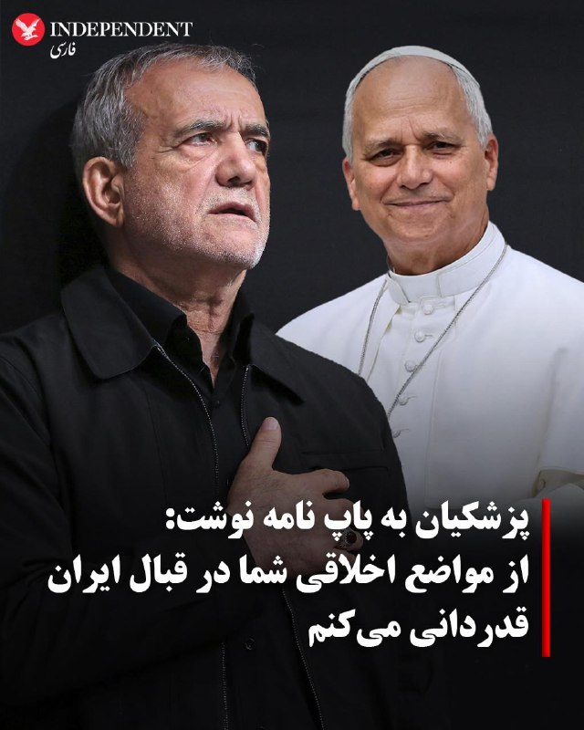

♦️مسعود پزشکیان، در پیامی به پاپ لئو چهاردهم از «مواضع اخلاقی و منطقی» او در قبال حملات اخیر به ایران قدردانی کرد.
پزشکیان در این نامه نوشت: «از موضع اخلاقی و منطقی شما در قبال تجاوزات نظامی اخیر به ایران قدردانی می‌کنم.»
او همچنین حملات آمریکا و اسرائیل را فراتر از رویارویی با ایران توصیف کرد و گفت این اقدامات «صرفا علیه ایران نیست، بلکه علیه حاکمیت قانون و ارزش‌های انسانی» انجام شده است.
رئیس‌جمهوری ایران تاکید کرد جمهوری اسلامی در چارچوب «دفاع مشروع» اهداف و منافع «متجاوزان» را هدف قرار داده است.
پزشکیان در ادامه با تاکید بر آنکه جمهوری اسلامی ایران همچنان به دیپلماسی و راه‌حل‌های مسالمت‌آمیز پایبند است نوشت: «از جامعه بین‌المللی انتظار می‌رود با اتخاذ رویکردی واقع‌بینانه و منصفانه، با مطالبات غیرقانونی و سیاست‌های ماجراجویانه و خطرناک آمریکا مقابله نماید.»
‌🇸🇦 Indypersian

🤖 @VahidOOnLine

## VahidOOnLine — post 240414

  

♦️شبکه سی‌ان‌ان به نقل از چند مقام امنیتی گزارش داد مقام‌های آمریکایی گمان می‌کنند هکرهای مرتبط با جمهوری اسلامی ایران پشت مجموعه‌ای از نفوذهای سایبری به سامانه‌هایی هستند که میزان سوخت مخازن جایگاه‌های بنزین را در چند ایالت آمریکا رصد می‌کنند.
بر اساس این گزارش، مهاجمان سامانه‌های پایش میزان سوخت مخازن موسوم به ATG را هدف قرار داده‌اند. هکرها در بعضی موارد توانسته‌اند داده‌های نمایش‌داده‌شده را دستکاری کنند، اما سطح واقعی سوخت در مخازن تغییری نکرده است.
به گفته مقام‌های آمریکایی، این نفوذها تاکنون خسارت فیزیکی ایجاد نکرده‌اند، اما کارشناسان هشدار داده‌اند که دسترسی به چنین سامانه‌هایی می‌تواند از نظر تئوری به پنهان ماندن نشت سوخت یا ایجاد اختلال در زیرساخت‌های حساس منجر شود.
به گزارش سی‌ان‌ان، یکی از دلایلی که ایران به‌عنوان مظنون اصلی مطرح شده، سابقه گروه‌های وابسته به تهران در هدف قرار دادن سامانه‌های مشابه است؛ هرچند منابع تاکید کرده‌اند کمبود ردپای دیجیتال می‌تواند شناسایی قطعی عاملان را دشوار کند. همچنین از زمان آغاز جنگ با ایران در اواخر زمستان، هکرهای مرتبط با تهران به ایجاد اختلال در تاسیسات نفت، گاز و آب آمریکا نیز متهم شده‌اند.
‌🇸🇦 Indypersian

🤖 @VahidOOnLine

## VahidOOnLine — post 240413

  <a href="telegram/content/VahidOOnLine_240413_1778913394.mp4" target="_blank">🎬 Download video</a>

♦️دلسی رودریگز، رئیس‌جمهور موقت ونزوئلا، در کاراکاس با سوزانا کوردیرو گوئرا، معاون بانک جهانی در امور آمریکای لاتین و کارائیب و هیئت همراه دیدار و گفتگو کرد، نشستی که در ادامه ازسرگیری رسمی روابط ونزوئلا با نهادهای مالی بین‌المللی برگزار شده است.
بر اساس بیانیه دولت ونزوئلا، این دیدار با محوریت همکاری‌های اقتصادی، توسعه سرمایه‌گذاری، بازسازی زیرساخت‌ها و بازگشت تدریجی کاراکاس به بازارهای مالی جهانی انجام شد. دولت ونزوئلا اعلام کرده است که با احیای کانال‌های همکاری چندجانبه، به‌دنبال حرکت به سمت اقتصادی متنوع، جذب سرمایه خارجی و بهبود وضعیت معیشتی شهروندان است.
روابط ونزوئلا با بانک جهانی و صندوق بین‌المللی پول از سال ۲۰۱۹ به‌دلیل اختلافات سیاسی و بحران مشروعیت دولت این کشور متوقف شده بود، اما در ماه فروردین امسال، دو طرف رسما از آغاز دوباره همکاری‌ها خبر دادند.
این نشست در حالی برگزار می‌شود که دولت ونزوئلا همزمان روند بازسازی ساختار بدهی‌های خارجی خود را آغاز کرده و مقام‌های اقتصادی این کشور از برنامه سفر هیئتی رسمی به واشنگتن برای مذاکره با صندوق بین‌المللی پول در هفته‌های آینده خبر داده‌اند.
‌🇸🇦 Indypersian

🤖 @VahidOOnLine

## VahidOOnLine — post 240412

♦️رویدادی در لندن با نام «بالد فس» (Bald Fest) با اهدای آبجوی رایگان به افراد طاس یا کسانی که حاضرند موهای خود را بتراشند، به تجلیل از افراد بی‌مو پرداخت.
در این جشن، افرادی که سر کاملا تراشیده دارند یا در محل حاضر می‌شوند موهای خود را بتراشند، می‌توانند یک نوشیدنی رایگان دریافت کنند. برگزارکنندگان می‌گویند هدف از این رویداد، ایجاد فضایی سرگرم‌کننده و مثبت برای تغییر نگاه به طاسی و بزرگداشت افراد کم‌مو یا بی‌مو است.
این رویداد با فضایی طنزآمیز و جشن‌گونه برگزار شد و توجه بسیاری را در شبکه‌های اجتماعی به خود جلب کرد.
‌🇸🇦 Indypersian

🤖 @VahidOOnLine

## VahidOOnLine — post 240411

  <a href="telegram/content/VahidOOnLine_240411_1778913395.mp4" target="_blank">🎬 Download video</a>

شبکه سی‌ان‌ان به نقل از چند منبع گزارش داده هکرهای مظنون به ارتباط با ایران موفق شده‌اند به سامانه‌های پایش مخازن سوخت در آمریکا نفوذ کنند و نمایشگر میزان سوخت را تغییر دهند.
بر اساس این گزارش، سامانه‌های «اندازه‌گیری خودکار مخازن» بدون رمز عبور و متصل به اینترنت بوده‌اند. منابع آگاه می‌گویند هکرها توانسته‌اند ارقام نمایش‌داده‌شده را دستکاری کنند، اما امکان تغییر واقعی میزان سوخت در مخازن را نداشته‌اند و هیچ خسارت فیزیکی گزارش نشده است.
سی‌ان‌ان همچنین گزارش داده این حملات تنها به سامانه‌های سوخت محدود نبوده و زیرساخت‌های نظامی و شبکه‌های آب آمریکا را نیز هدف قرار گرفته‌اند.
‌🏁 🇬🇧 ManotoTV

🤖 @VahidOOnLine

## VahidOOnLine — post 240410

  

ترامپ در تروث‌سوشال اعلام کرد ابو بلال المینوکی، نفر دوم داعش در جهان، در عملیاتی که از سوی نیروهای آمریکا و نیجریه انجام شد، کشته شده است.
او در پیامی نوشت: «امشب به دستور من، نیروهای شجاع آمریکایی و نیروهای مسلح نیجریه یک ماموریت بسیار دقیق و پیچیده را به‌طور بی‌نقص اجرا کردند تا فعال‌ترین تروریست جهان را از میدان نبرد حذف کنند. ابو بلال المینوکی، نفر دوم داعش در سطح جهانی، فکر می‌کرد می‌تواند در آفریقا پنهان شود، اما نمی‌دانست ما منابعی داریم که ما را از آنچه انجام می‌داد آگاه می‌کردند.»
ترامپ همچنین از دولت نیجریه برای همکاری در این عملیات قدردانی کرد.

‌🏁 🇬🇧 IranintlTV

🤖 @VahidOOnLine

## VahidOOnLine — post 240409

  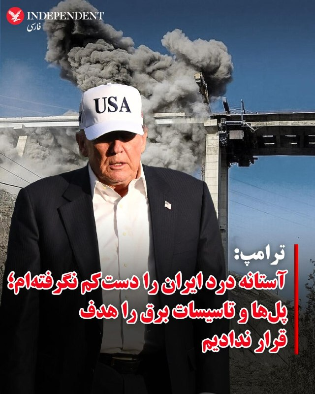

♦️دونالد ترامپ، رئیس‌جمهوری ایالات متحده، در مصاحبه اخیر با شبکه فاکس‌نیوز گفت «آستانه درد» و تاب‌آوری ایران را دست‌کم نگرفته است. ترامپ با اشاره به سیاست خویشتن‌داری واشنگتن تاکید کرد ایالات متحده عامدانه از هدف قرار دادن زیرساخت‌های حیاتی و غیرنظامی نظیر پل‌ها و تأسیسات تولید برق خودداری کرده است.
رئیس جمهوری آمریکا با یادآوری میزان خسارات وارد شده به ایران گفت: «ما به شکل باورنکردنی و بسیار سخت به آن‌ها ضربه زدیم. ببینید، ما پل‌ها و ظرفیت برق آن‌ها را رها کردیم؛ در حالی که می‌توانیم همه این‌ها را ظرف دو روز از بین ببریم. ظرف دو روز، همه چیز را.»
او در پاسخ به این سوال که آیا تاب‌آوری رژیم ایران در برابر آسیب‌ها را دست‌کم گرفته است، گفت: «من هیچ چیز را دست‌کم نگرفتم. ما به جز شیرهای خروجی نفت، به بقیه بخش‌ها ضربه زدیم.»
‌🇸🇦 Indypersian

🤖 @VahidOOnLine

## VahidOOnLine — post 240408

  

نیویورک‌تایمز به نقل از دو مقام خاورمیانه‌ای گزارش داد آمریکا و اسرائیل در حال تدارکات فشرده برای از سرگیری احتمالی حملات علیه جمهوری اسلامی در اوایل هفته آینده هستند و این گزینه‌ها شامل بمباران‌های تهاجمی‌تر علیه اهداف نظامی و زیرساختی و عملیات ویژه زمینی برای یافتن مواد هسته‌ای خواهد بود.
طبق این گزارش، نیروهای عملیات ویژه اعزام شده به منطقه می‌توانند در این ماموریت مورد استفاده قرار گیرند، اما چنین عملیاتی به هزاران نیروی پشتیبانی نیاز دارد.
این روزنامه افزود به گفته دستیاران ترامپ، او هنوز در مورد گام‌های بعدی خود تصمیمی نگرفته است.
بر اساس این گزارش، مقام‌های آمریکایی گفتند که حدود پنج هزار تفنگدار دریایی و حدود دو هزار چترباز از لشکر ۸۲ هوابرد ویژه ارتش ایالات متحده در منطقه منتظر دستورالعمل‌ هستند.
مقام‌های نظامی نیز گفتند که این نیروها می‌توانند برای دستیابی به مواد هسته‌ای ایران در سایت اتمی اصفهان، از جمله ایمن‌سازی محیط برای محافظت از اپراتورهای ویژه‌ای که وظیفه ورود به آنجا را دارند، مورد استفاده قرار گیرند.
‌🏁 🇬🇧 IranintlTV

🤖 @VahidOOnLine

---
📅 بروزرسانی: 1405/02/26 07:34
---

## VahidOOnLine — post 240407

  

♦️دونالد ترامپ، رئیس‌جمهوری آمریکا، شنبه ۲۶ اردیبهشت با انتشار پیامی در «تروث سوشال» اعلام کرد که نیروهای آمریکایی با همکاری ارتش نیجریه، در جریان یک عملیات پیچیده و دقیق، «ابوبلال المینوکی» مرد شماره دو و فعال‌ترین عضو ارشد داعش در جهان را از پای درآورده‌اند.
ترامپ در این پیام تاکید کرد که او تصور می‌کرد می‌تواند در آفریقا پنهان شود، اما منابع اطلاعاتی تمامی تحرکات او را زیر نظر داشتند. به گفته رئیس‌جمهوری آمریکا، با حذف این فرمانده ارشد، توانایی عملیاتی جهانی داعش به‌شدت کاهش یافته است و او دیگر نمی‌تواند مردم آفریقا یا منافع آمریکا را هدف قرار دهد. ترامپ همچنین از همکاری و مشارکت دولت نیجریه در اجرای موفقیت‌آمیز این عملیات قدردانی کرد.
‌🇸🇦 Indypersian

🤖 @VahidOOnLine

## VahidOOnLine — post 240406

  

♦️به گزارش فاکس‌نیوز، دولت لبنان در اقدامی بی‌سابقه، با ارسال شکایت‌نامه‌ای تند به سازمان ملل متحد، جمهوری اسلامی را به سوءاستفاده از مصونیت دیپلماتیک متهم کرده است.
بر اساس این نامه که اواخر فروردین تنظیم و به‌تازگی منتشر شده است، احمد عرفه، سفیر لبنان در سازمان ملل، با انتقاد شدید از اقدامات محمدرضا شیبانی، سفیر جمهوری اسلامی در بیروت، تهران را به اعزام نیروهای سپاه پاسداران به خاک لبنان تحت پوشش فعالیت‌های دیپلماتیک متهم کرد.
در این شکایت‌نامه تاکید شده است این اقدامات جمهوری اسلامی، دخالت آشکار در امور داخلی لبنان است و این کشور را به جنگی ناخواسته می‌کشاند.
افشای این نامه همزمان با دومین روز گفتگوهای دوجانبه اسرائیل و لبنان در واشینگتن با میانجی‌گری آمریکا صورت می‌گیرد؛ گفتگوهایی که هدف آن عادی‌سازی روابط و برچیدن حزب‌الله عنوان شده است.
سخنگوی وزارت خارجه آمریکا فضای این مذاکرات را «بسیار مثبت» و «فراتر از حد انتظار» توصیف کرد. همچنین وزارت خارجه آمریکا اعلام کرد آتش‌بس موقت میان اسرائیل و لبنان ۴۵ روز دیگر تمدید شده است.
‌🇸🇦 Indypersian

🤖 @VahidOOnLine

## VahidOOnLine — post 240405

  

فدراسیون بین‌المللی روزنامه‌نگاران اعلام کرد با گذشت حدود ۱۰ روز از بازداشت امیرحسین رضایی، روزنامه‌نگار حوزه اقتصاد در اراک، همچنان خبری از وضعیت او در دست نیست و بازداشت او ادامه دارد.
پیش‌تر گزارش شده بود نیروهای امنیتی صبح ۱۶ اردیبهشت با یورش به منزل پدری رضایی در اراک، او را بازداشت و به مکان نامعلومی منتقل کرده‌اند. رضایی دانشجوی علوم سیاسی دانشگاه تهران و روزنامه‌نگار پیشین «دنیای اقتصاد» است.
فدراسیون بین‌المللی روزنامه‌نگاران نوشت ادامه بازداشت و بی‌خبری از این روزنامه‌نگار در حالی است که محدودیت‌های اینترنتی در ایران ادامه دارد و فشار نهادهای امنیتی بر فعالان رسانه و اطلاع‌رسانی مستقل افزایش یافته است.

‌🏁 🇬🇧 IranintlTV

🤖 @VahidOOnLine

## VahidOOnLine — post 240404

  

♦️وزارت امور خارجه امارات متحده عربی شنبه ۲۶ اردیبهشت با انتشار بیانیه‌ای اعلام کرد تمام اقدامات این کشور در چارچوب تدابیر دفاعی برای حفاظت از حاکمیت، غیرنظامیان و زیرساخت‌های حیاتی انجام شده است.
این بیانیه پس از آن صادر شد که روزنامه وال‌استریت ژورنال در گزارشی نوشت امارات در اواسط فروردین عملیات نظامی علیه ایران انجام داده است؛ با این حال، وزارت خارجه امارات در بیانیه خود مستقیما به این حملات ادعایی اشاره‌ای نکرد.
امارات در این بیانیه با محکوم کردن شدید تهدیدها و حملات جمهوری اسلامی به این کشور و منطقه، اعلام کرد که شلیک نزدیک به ۳۰۰۰ موشک بالستیک، کروز و پهپاد به سمت امارات که منجر به تلفات غیرنظامی و آسیب به زیرساخت‌ها شده، نقض آشکار حاکمیت کشورها است. وزارت خارجه امارات تاکید کرد که این کشور حق حاکمیتی، قانونی، دیپلماتیک و نظامی خود را برای مقابله با هرگونه اقدام خصمانه محفوظ می‌داند و فشارها یا ادعاهای مغرضانه تاثیری بر مواضع ثابت آن نخواهد داشت.
‌🇸🇦 Indypersian

🤖 @VahidOOnLine

## VahidOOnLine — post 240403

  

فاکس‌نیوز گزارش داد دولت لبنان با ارسال نامه‌ای کم‌سابقه به سازمان ملل، جمهوری اسلامی را به سوءاستفاده از مصونیت دیپلماتیک، دخالت در امور داخلی لبنان و انتقال نیروهای سپاه پاسداران «در پوشش فعالیت دیپلماتیک» متهم کرده است.
به گزارش فاکس، این نامه که اواخر آوریل ارسال و به‌تازگی منتشر شده، هم‌زمان با مذاکرات اسرائیل و لبنان در واشینگتن درباره عادی‌سازی روابط و آینده حزب‌الله اهمیت بیشتری یافته است.
در این نامه، سفیر لبنان در سازمان ملل، ایران را به «اقدامات غیرقانونی در نقض آشکار تصمیمات دولت لبنان» متهم کرده و تأکید کرده این رفتار دخالت مستقیم در امور داخلی لبنان و نقض کنوانسیون ۱۹۶۱ وین درباره روابط دیپلماتیک است.

‌🏁 🇬🇧 IranintlTV

🤖 @VahidOOnLine

## VahidOOnLine — post 240402

  

مایک والتز، سفیر آمریکا در سازمان ملل، در گفت‌وگو با فاکس‌نیوز گفت چین پس از سفر دونالد ترامپ به پکن از جمهوری اسلامی فاصله گرفته است. او افزود پکن با اصل عدم دستیابی ایران به سلاح هسته‌ای و عدم نظامی‌سازی تنگه هرمز موافقت کرده است.
والتز تاکید کرد هیچ کشوری نمی‌تواند از خطوط کشتیرانی بین‌المللی مانند تنگه جبل‌الطارق، تنگه مالاکا یا تنگه هرمز به‌عنوان منبع درآمد خصوصی از طریق دریافت عوارض استفاده کند و این مسیرها باید برای تجارت جهانی باز بمانند.

‌🏁 🇬🇧 IranintlTV

🤖 @VahidOOnLine

## VahidOOnLine — post 240401

  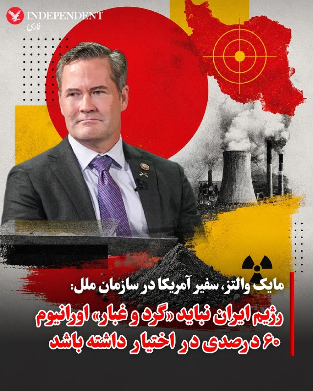

♦️مایک والتز، سفیر آمریکا در سازمان ملل در گفتگو با شبکه فاکس نیوزگفت: «باید به یاد داشته باشیم هیچ دلیلی وجود ندارد که رژیم ایران این گرد و غبار را که شامل اورانیوم با غنای بالای ۶۰ درصد است، در اختیار داشته باشد. هیچ کشوری در جهان وجود ندارد که تا این سطح غنی سازی کند و سلاح هسته‌ای نداشته باشد، چون هیچ دلیل دیگری برای این کار وجود ندارد.»
او افزود: «اگر اهداف شما صرفا صلح‌آمیز و غیرنظامی است، دلیلی ندارد آن را در عمق سایت‌های نظامی مستحکم دفن کنید و در سراسر کشور پراکنده سازید. این مواد برای ساخت ۱۰ یا ۱۱ سلاح هسته‌ای کافی است و رئیس‌جمهوری ترامپ به صراحت اعلام کرده که این بخش باید برچیده شود.»
والتز همچنین تاکید کرد: «ما در عملیات "چکش نیمه‌شب" در سال گذشته، غنی سازی آن‌ها را ویران کردیم، اما هنوز می‌بینیم که در تلاش برای بازسازی آن هستند.»
‌🇸🇦 Indypersian

🤖 @VahidOOnLine

## VahidOOnLine — post 240400

  

ترامپ در گفت‌وگو با فاکس‌نیوز در پاسخ به این پرسش که آیا توان و مقاومت حکومت ایران را دست‌کم گرفته، گفت: «هیچ‌چیز را دست‌کم نگرفتم. ما به‌شدت به آن‌ها ضربه زدیم.»
ترامپ تاکید کرد آمریکا عمدا بخشی از زیرساخت‌های ایران را هدف قرار نداده است و افزود: «پل‌هایشان را باقی گذاشتیم. زیرساخت برق‌شان را باقی گذاشتیم. می‌توانیم همه آن را در دو روز نابود کنیم؛ همه‌چیز.» او گفت به تاسیسات نفتی و برخی زیرساخت‌ها در خارک حمله نشده، زیرا آسیب به آن‌ها می‌توانست موجب از بین رفتن نفت شود.
او همچنین گفت مقام‌های ایرانی به او گفته‌اند محل نگهداری مواد هسته‌ای به‌شدت هدف قرار گرفته و «کوه گرانیتی» روی آن فرو ریخته است. ترامپ افزود: «آن‌ها گفتند فقط دو کشور می‌توانند به آن دسترسی پیدا کنند؛ ما و چین. گفتند خودشان توانایی دسترسی ندارند چون کاملاً نابود شده است.»

‌🏁 🇬🇧 IranintlTV

🤖 @VahidOOnLine

## VahidOOnLine — post 240399

  

ترامپ در گفت‌وگو با فاکس‌نیوز گفت: مقام‌های جمهوری اسلامی «هر بار توافق می‌کنند، روز بعد انگار می‌گویند چنین گفت‌وگویی نداشته‌ایم. این حدود پنج بار اتفاق افتاده است. مشکلی در آن‌ها وجود دارد. واقعا دیوانه‌اند. و به همین دلیل نمی‌توانند سلاح هسته‌ای داشته باشند.»
رییس‌جمهوری آمریکا درباره وضعیت مذاکرات با جمهوری اسلامی گفت افرادی که آمریکا با آن‌ها در حال گفت‌وگو است، به گفته او «منطقی» به نظر می‌رسند، اما توان یا آمادگی لازم برای تصمیم‌گیری ندارند.
ترامپ در پاسخ به این پرسش که آیا حکومت ایران در نهایت عقب‌نشینی خواهد کرد گفت: «بله، قطعا. هیچ شکی ندارم.»

‌🏁 🇬🇧 IranintlTV

🤖 @VahidOOnLine

## VahidOOnLine — post 240398

  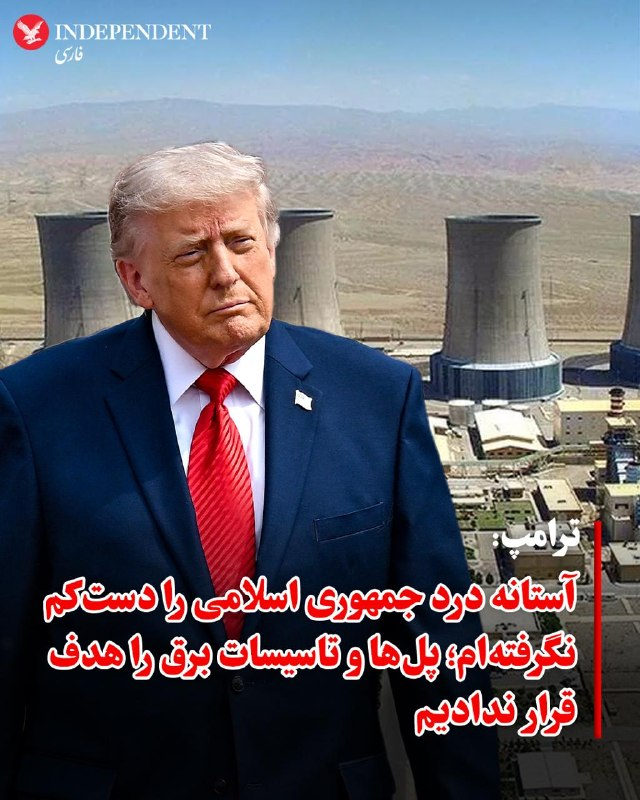

♦️دونالد ترامپ، رئیس‌جمهوری آمریکا در مصاحبه با شبکه فاکس‌نیوز درباره میزان خسارات وارد شده به رژیم ایران گفت: «ما به شکل باورنکردنی و بسیار سخت به آن‌ها ضربه زدیم. ببینید، ما پل‌ها و ظرفیت برق آن‌ها را رها کردیم؛ در حالی که می‌توانیم همه این‌ها را ظرف دو روز از بین ببریم. ظرف دو روز، همه چیز را.»
او در پاسخ به این سوال که آیا تاب‌آوری رژیم ایران در برابر آسیب‌ها را دست‌کم گرفته است، گفت: من هیچ چیز را دست‌کم نگرفتم. ما به جز شیرهای خروجی نفت، به بقیه بخش‌ها ضربه زدیم،
‌🇸🇦 Indypersian

🤖 @VahidOOnLine

## VahidOOnLine — post 240397

  

ترامپ در گفت‌وگو با فاکس‌نیوز با اشاره به افزایش هزینه‌های اقتصادی ناشی از تقابل با جمهوری اسلامی، از آمریکایی‌ها خواست این فشار کوتاه‌مدت را تحمل کنند و گفت جلوگیری از تهدید حکومت ایران اولویتی بالاتر از پیامدهای کوتاه‌مدت اقتصادی دارد.

او 'گفت: «متاسفم که این فشار را تحمل می‌کنید، اما باید جلوی این گروه بسیار دیوانه را بگیریم.»

رییس‌جمهوری آمریکا گفت شی جین‌پینگ، رییس‌جمهوری چین، برای کمک به حل بحران ایران و بازگشایی تنگه هرمز اعلام آمادگی کرده، اما تاکید کرد واشینگتن «به کمک نیاز ندارد.»

ترامپ گفت چین «۴۰ درصد نفت خود» را از منطقه تنگه هرمز دریافت می‌کند و افزود: «اگر او بخواهد کمک کند، عالی است. اما ما به کمک نیاز نداریم. مشکل کمک این است که وقتی کسی به شما کمک می‌کند، همیشه در مقابل چیزی می‌خواهد.»

رییس‌جمهوری آمریکا در بخش دیگری از این مصاحبه گفت حکومت ایران از نظر نظامی به‌شدت آسیب دیده و بار دیگر تاکید کرد: «آن‌ها دیگر نیروی دریایی ندارند. نیروی هوایی ندارند. همه‌چیز نابود شده است. نیروی هوایی‌شان از بین رفته است.»

‌🏁 🇬🇧 IranintlTV

🤖 @VahidOOnLine

## VahidOOnLine — post 240396

  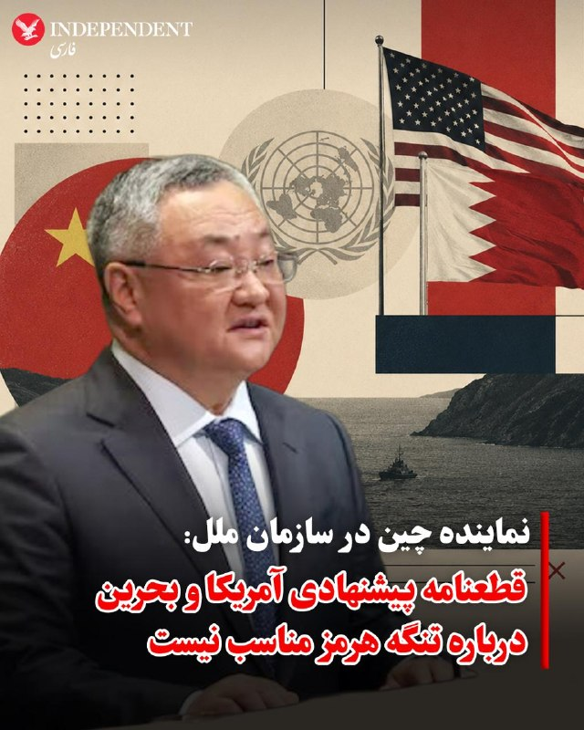

♦️فو کونگ، نماینده چین در سازمان ملل متحد، با انتقاد از پیش‌نویس قطعنامه آمریکا و بحرین درباره تنگه هرمز گفت که محتوا و زمان‌بندی این قطعنامه مناسب نیست و تصویب آن کمکی نخواهد کرد.
به گزارش رویترز، این قطعنامه از ایران می‌خواهد حملات و مین‌گذاری در تنگه هرمز را متوقف کند. دیپلمات‌ها می‌گویند این قطعنامه در صورت رای‌گیری با وتوی روسیه و چین مواجه می‌شود؛ این دو کشور ماه گذشته نیز قطعنامه مشابهی را وتو کرده بودند. فو کونگ تاکید کرد که باید هر دو طرف را به مذاکرات جدی برای حل مسئله ترغیب کرد.
این موضع‌گیری پس از پایان دیدار دو روزه دونالد ترامپ و شی جین‌پینگ در پکن اعلام شد. کاخ سفید اعلام کرد دو طرف بر باز ماندن این آبراه توافق دارند و وزارت خارجه چین نیز اعلام کرد این درگیری هیچ دلیلی برای ادامه ندارد.
‌🇸🇦 Indypersian

🤖 @VahidOOnLine

---
📅 بروزرسانی: 1405/02/26 03:40
---

## VahidOOnLine — post 240395

  

ترامپ پس از بازگشت از سفر چین در محوطه کاخ سفید به خبرنگاران گفت این سفر «یک موفقیت بزرگ» بوده است. او تاکید کرد «توافق‌های تجاری فوق‌العاده‌ای» حاصل شده و افزود اتفاقات مهمی رخ داده که به‌زودی اعلام خواهد شد. ترامپ این سفر را «یک لحظه تاریخی» توصیف کرد.
‌🏁 🇬🇧 IranintlTV

🤖 @VahidOOnLine

## VahidOOnLine — post 240394

  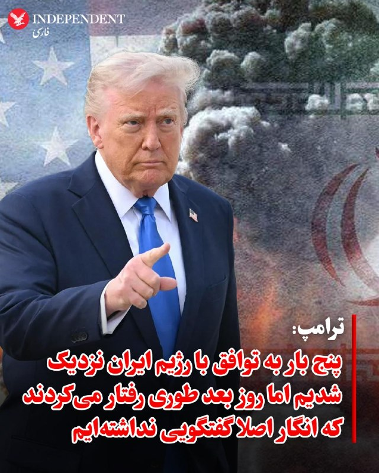

♦️دونالد ترامپ، رئیس‌جمهوری ایالات متحده در گفتگو با شبکه خبری فاکس نیوز گفت: «ما پنج بار به توافق با رژیم ایران نزدیک شدیم و هر بار در آستانه دستیابی به آن بودیم، اما روز بعد طوری رفتار می‌کردند که انگار اصلا گفتگویی نداشته‌ایم.»
او در این مصاحبه افزود: «آن‌ها به خوبی می‌دانند که ما از نظر نظامی چقدر قوی هستیم. سپس، به درخواست یک گروه بسیار خوب از پاکستان که بسیار به ایران نزدیک هستند، من آن گام نهایی را برنداشتم. آن‌ها گفتند آیا می‌توانید متوقفش کنید؟ ما می‌خواهیم توافق کنیم؛ و ما واقعا چارچوب یک توافق را داشتیم؛ بدون سلاح هسته‌ای. آن‌ها قرار بود همه چیزهایی را که می‌خواستیم، حتی غبار هسته‌ای را به ما تحویل دهند. اما هر بار که به توافق می‌رسیدیم، روز بعد مثل این بود که اصلا چنین گفتگویی نداشته‌ایم. این اتفاق حدود پنج بار تکرار شده است. مشکلی در آن‌ها وجود دارد؛ آن‌ها واقعا دیوانه‌اند.»
‌🇸🇦 Indypersian

🤖 @VahidOOnLine

## VahidOOnLine — post 240393

  

♦️ایلان ماسک، میلیاردر مشهور آمریکایی، مالک پلتفرم اکس و بنیان‌گذار تسلا و اسپیس‌ایکس، با انتشار عبارتی کوتاه در حساب کاربری خود در اکس نوشت: «اینستاگرام برنامه‌ای برای دختران است.»
در روزهای گذشته، برخی از مشهورترین مدیران ارشد آمریکایی، از جمله ایلان ماسک، دونالد ترامپ را در سفر رسمی و تاریخی‌اش به چین همراهی کرده‌اند.
‌🇸🇦 Indypersian

🤖 @VahidOOnLine

## VahidOOnLine — post 240392

  

سفیر چین در سازمان ملل از پیش‌نویس قطعنامه پیشنهادی آمریکا و بحرین درباره تنگه هرمز انتقاد کرد و گفت «هم محتوا و هم زمان آن نامناسب است» و کمکی به کاهش تنش‌ها با جمهوری اسلامی نخواهد کرد.
این پیش‌نویس از تهران می‌خواهد حملات و فعالیت‌های مین‌گذاری در تنگه هرمز را متوقف کند. چین و روسیه ماه گذشته نیز قطعنامه مشابهی را با این استدلال که جمهوری اسلامی را ناعادلانه هدف قرار می‌دهد، مسدود کرده بودند.

‌🏁 🇬🇧 IranintlTV

🤖 @VahidOOnLine

## VahidOOnLine — post 240391

  

سفیر چین در سازمان ملل از پیش‌نویس قطعنامه پیشنهادی آمریکا و بحرین درباره تنگه هرمز انتقاد کرد و گفت «هم محتوا و هم زمان آن نامناسب است» و کمکی به کاهش تنش‌ها با جمهوری اسلامی نخواهد کرد.
این پیش‌نویس از تهران می‌خواهد حملات و فعالیت‌های مین‌گذاری در تنگه هرمز را متوقف کند. چین و روسیه ماه گذشته نیز قطعنامه مشابهی را با این استدلال که جمهوری اسلامی را ناعادلانه هدف قرار می‌دهد، مسدود کرده بودند.

‌🏁 🇬🇧 IranintlTV

🤖 @VahidOOnLine

## VahidOOnLine — post 240390

  

سفیر چین در سازمان ملل از پیش‌نویس قطعنامه پیشنهادی آمریکا و بحرین درباره تنگه هرمز انتقاد کرد و گفت «هم محتوا و هم زمان آن نامناسب است» و کمکی به کاهش تنش‌ها با جمهوری اسلامی نخواهد کرد.
این پیش‌نویس از تهران می‌خواهد حملات و فعالیت‌های مین‌گذاری در تنگه هرمز را متوقف کند. چین و روسیه ماه گذشته نیز قطعنامه مشابهی را با این استدلال که جمهوری اسلامی را ناعادلانه هدف قرار می‌دهد، مسدود کرده بودند.

‌🏁 🇬🇧 IranintlTV

🤖 @VahidOOnLine

---
📅 بروزرسانی: 1405/02/26 02:44
---

## VahidOOnLine — post 240389

♦️دونالد ترامپ، رئیس‌جمهوری آمریکا، بامداد شنبه ۲۶ اردیبهشت پس از پایان سفر رسمی خود به چین وارد پایگاه مشترک اندروز در نزدیکی واشنگتن شد.
پکن در دو روز گذشته میزبان دیدار تاریخی دونالد ترامپ و شی جین‌پینگ، رئیس‌جمهوری چین، بود؛ سفری که با استقبال رسمی گسترده و گفتگو درباره روابط اقتصادی، تجاری و تنش‌های منطقه‌ای همراه بود.
‌🇸🇦 Indypersian

🤖 @VahidOOnLine

## VahidOOnLine — post 240388

♦️حساب رسمی کاخ سفید، روز جمعه ۲۵ اردیبهشت، با انتشار تصاویری از سفر دونالد ترامپ به چین اعلام کرد رئیس‌جمهوری آمریکا از «معبد آسمان» در پکن بازدید کرده است.
پکن در دو روز گذشته میزبان دیدار تاریخی دونالد ترامپ، رئیس‌جمهوری آمریکا، و شی جین‌پینگ، رئیس‌جمهوری چین، بود؛ دیداری که با استقبال رسمی گسترده و گفتگو درباره مسائل اقتصادی، تجاری و تنش‌های منطقه‌ای همراه بود.
‌🇸🇦 Indypersian

🤖 @VahidOOnLine

## VahidOOnLine — post 240387

  <a href="telegram/content/VahidOOnLine_240387_1778886883.mp4" target="_blank">🎬 Download video</a>

دادستان‌های آمریکا اعلام کردند یک شهروند عراقی به اتهام طراحی حمله تروریستی به یک کنیسه مشهور در نیویورک و حمایت از گروه‌های مورد حمایت جمهوری اسلامی بازداشت و متهم شده است.

محمد باقر سعد داوود الساعدی، ۳۲ ساله، روز جمعه در دادگاهی در منهتن حاضر شد و مقام‌های آمریکایی او را به «توطئه برای ارائه حمایت مادی به سازمان‌های تروریستی خارجی» از جمله سپاه پاسداران و گروه کتائب حزب‌الله عراق متهم کردند.

بر اساس اسناد دادگاه، الساعدی از فرماندهان کتائب حزب‌الله معرفی شده و متهم است از ماه مارس در طراحی، اجرا و تبلیغ حدود ۱۸ حمله علیه منافع آمریکا و اسرائیل در اروپا نقش داشته است.

دادستان‌ها می‌گویند او برای انجام حمله به یک کنیسه در نیویورک، با فردی که در واقع مامور مخفی اف‌بی‌آی بوده تماس گرفته و تصاویر، نقشه‌ها و اطلاعات مربوط به محل حمله را در اختیار او قرار داده است. به گفته مقام‌های آمریکایی، او همچنین تصاویری از مراکز یهودیان در لس‌آنجلس و اسکاتسدیل آریزونا ارسال کرده بود.

در یکی از مکالمات ضبط‌شده، الساعدی درباره هزینه «انجام عملیات بمب‌گذاری» در آمریکا پرس‌وجو کرده و گفته بود: «ما برایش یک معبد یهودیان یا یک مرکز یهودیان فراهم می‌کنیم.»

دادستان‌ها می‌گویند او با مامور مخفی بر سر پرداخت ۱۰ هزار دلار رمزارز برای اجرای حمله توافق کرده و سه هزار دلار به‌عنوان پیش‌پرداخت ارسال کرده بود. بر اساس این گزارش، الساعدی بعدتر در ترکیه بازداشت و به اف‌بی‌آی تحویل داده شد.

پلیس نیویورک اعلام کرد این پرونده «تهدیدهای جهانی ناشی از جمهوری اسلامی و گروه‌های نیابتی‌اش» را آشکار می‌کند. مقام‌های آمریکایی همچنین گفتند با همکاری نهادهای امنیتی، طرح حمله به کنیسه‌ای در منهتن خنثی شده است.

در اسناد دادگاه همچنین تصاویری از دیدار الساعدی با قاسم سلیمانی، فرمانده پیشین نیروی قدس سپاه پاسداران، منتشر شده است.
‌🏁 🇬🇧 ManotoTV

🤖 @VahidOOnLine

## VahidOOnLine — post 240386

  

♦️عباس عراقچی، وزیر امور خارجه جمهوری اسلامی، در واکنش به افزایش قیمت انرژی در آمریکا، با انتشار پیامی در اکس نوشت آمریکایی‌ها مجبور شده‌اند «هزینه‌های سرسام‌آور جنگ انتخابی علیه ایران» را تحمل کنند.
او در این پیام نوشت: «فعلا افزایش قیمت بنزین و حباب بازار سهام را کنار بگذارید. درد واقعی زمانی آغاز می‌شود که بدهی آمریکا و نرخ وام‌های مسکن شروع به افزایش کنند.»
عراقچی همچنین مدعی شد میزان ناتوانی در بازپرداخت وام خودرو در آمریکا به بالاترین سطح خود در بیش از ۳۰ سال گذشته رسیده و افزود: «تمام این‌ها قابل اجتناب بود.»
‌🇸🇦 Indypersian

🤖 @VahidOOnLine

## VahidOOnLine — post 240385

  

عباس عراقچی، وزیر خارجه جمهوری اسلامی، در واکنش به بالا رفتن قیمت انرژی در آمریکا، در ایکس نوشت: «در حال حاضر، افزایش قیمت بنزین و حباب بازار سهام را کنار بگذارید. درد واقعی زمانی آغاز می‌شود که بدهی آمریکا و نرخ وام‌های مسکن شروع به جهش کنند.»
او نوشت همین حالا هم میزان ناتوانی در بازپرداخت وام خودرو به بالاترین سطح خود در بیش از ۳۰ سال گذشته رسیده است، اما تمام این‌ها قابل اجتناب بود.

‌🏁 🇬🇧 IranintlTV

🤖 @VahidOOnLine

---
📅 بروزرسانی: 1405/02/26 01:43
---

## VahidOOnLine — post 240384

  

♦️نمایندگی دائم جمهوری اسلامی در سازمان ملل متحد روز جمعه ۲۵ اردیبهشت، در پیامی در شبکه اجتماعی اکس نوشت آمریکا تلاش دارد با استفاده از شمار کشورهای حامی پیش‌نویس قطعنامه پیشنهادی خود، تصویری از حمایت گسترده بین‌المللی برای اقداماتش ایجاد کند و زمینه را برای تشدید تنش‌ها در منطقه فراهم سازد.
این نمایندگی افزود: در صورت هرگونه تشدید تنش تازه از سوی آمریکا، کشورهای حامی این قطعنامه نیز در پیامدهای آن شریک خواهند بود و هیچ «توجیه سیاسی» یا «پوشش دیپلماتیک» نمی‌تواند مسئولیت کشورهایی را که در تسهیل و مشروعیت‌بخشی به اقدامات آمریکا نقش دارند، از میان ببرد.
‌🇸🇦 Indypersian

🤖 @VahidOOnLine

## VahidOOnLine — post 240383

  

مایک والتز، سفیر آمریکا در سازمان ملل ، به فاکس‌نیوز گفت: «باید به خاطر داشته باشیم که هیچ دلیلی وجود ندارد که جمهوری اسلامی این گرد و غبار را که شامل ۶۰ درصد اورانیوم با غنای بالا است، در اختیار داشته باشد.»
او گفت:« هیچ کشوری در جهان وجود ندارد که تا آن سطح غنی‌سازی کند و سپس سلاح هسته‌ای نداشته باشد زیرا هیچ دلیلی برای انجام این کار وجود ندارد.»

‌🏁 🇬🇧 IranintlTV

🤖 @VahidOOnLine

## VahidOOnLine — post 240382

  

♦️علی موسوی، پسر عبدالرحیم موسوی، رئیس پیشن ستاد کل نیروهای مسلح جمهوری اسلامی، گفت که جنازه پدرش که در نخستین روز حملات اسرائیل و آمریکا به بیت رهبر کشته شد نزدیک به ۳۰ روز در زیر آوار ماند و  یک ماه در جستجوی جنازه اش بودند. موسوی پس از کشته شدن محمد باقری در جنگ ۱۲ روزه، به‌عنوان رییس ستاد کل نیروهای مسلح منصوب شده بود.
‌🇸🇦 Indypersian

🤖 @VahidOOnLine

---
📅 بروزرسانی: 1405/02/26 00:33
---

## VahidOOnLine — post 240381

  <a href="telegram/content/VahidOOnLine_240381_1778879006.mp4" target="_blank">🎬 Download video</a>

یک شهروند در پیامی به ایران اینترنشنال از شرایط سخت معیشتی خود می‌گوید. او اشاره می‌کند که همسر و بچه‌اش را به خانه مادرخانمش فرستاده و خودش تنها در خانه «نان خشک» می‌خورد. او از کار اخراج شده است. صدای او با هوش مصنوعی بازخوانی شده است.
‌🏁 🇬🇧 IranintlTV

🤖 @VahidOOnLine

## VahidOOnLine — post 240380

  

♦️به گزارش نیویورک تایمز، روز جمعه ۲۵ اردیبهشت به نقل از دو مقام خاورمیانه‌ای نوشت ایالات متحده و اسرائیل در حال انجام تدارکات فشرده برای احتمال ازسرگیری حملات علیه جمهوری اسلامی، حتی از اوایل هفته آینده، هستند. این تحرکات، بزرگ‌ترین تدارکات جنگی دو کشور از زمان اجرایی شدن آتش‌بس در ۱۸ فروردین به شمار می‌رود. هم‌زمان، پیت هگست، وزیر دفاع آمریکا، در کنگره اعلام کرد که پنتاگون علاوه بر طرح افزایش تنش، برنامه‌ای نیز برای بازگرداندن بیش از ۵۰ هزار نیروی اعزامی به خاورمیانه به شرایط استقرار استاندارد دارد. این آمادگی‌ها در حالی صورت می‌گیرد که دونالد ترامپ با «غیرقابل قبول» خواندن آخرین پیشنهاد صلح تهران، هشدار داده است که ایران یا باید توافق کند یا با نابودی نظامی روبرو خواهد شد.
نیویورک تایمز به نقل از مقام‌های اطلاعاتی آمریکا نوشت جمهوری اسلامی دوباره به بخش عمده‌ای از پایگاه‌های موشکی، پرتابگرها و تاسیسات زیرزمینی خود دسترسی پیدا کرده و همچنین دسترسی عملیاتی به ۳۰ پایگاه از ۳۳ پایگاه موشکی خود در امتداد تنگه هرمز را بازیابی کرده است.
‌🇸🇦 Indypersian

🤖 @VahidOOnLine

## VahidOOnLine — post 240379

  <a href="telegram/content/VahidOOnLine_240379_1778879009.mp4" target="_blank">🎬 Download video</a>

‌
شیخ خالد بن محمد بن زاید، ولیعهد ابوظبی، اعلام کرد پروژه «خط لوله غرب به شرق» با هدف افزایش صادرات نفت از بندر فجیره و «پاسخ به تقاضای جهانی» با سرعت بیشتری اجرا خواهد شد.

بر اساس اعلام مقام‌های امارات، این پروژه ظرفیت صادرات نفت از مسیر فجیره را دو برابر می‌کند و قرار است تا سال ۲۰۲۷ به بهره‌برداری برسد.

پس از جنگ آمریکا و اسرائیل با جمهوری اسلامی و افزایش تنش‌ها در تنگه هرمز، کشورهای خلیج فارس به دنبال مسیرهای جایگزین برای صادرات نفت و گاز هستند. حدود یک‌پنجم نفت جهان پیش‌تر از تنگه هرمز عبور می‌کرد.
‌🏁 🇬🇧 ManotoTV

🤖 @VahidOOnLine

## VahidOOnLine — post 240378

  <a href="telegram/content/VahidOOnLine_240378_1778879009.mp4" target="_blank">🎬 Download video</a>

یکی از مخاطبان ایران‌اینترنشنال در پیامی می‌گوید وضعیت برگزاری امتحانات دانش‌آموزان پایه‌های هفتم تا دهم در کرمانشاه هنوز مشخص نیست و این بلاتکلیفی باعث نگرانی و فشار روانی شده است. او خواستار تعیین هرچه سریع‌تر وضعیت امتحان‌هاست.

این پیام با هوش مصنوعی خوانده شده است
‌🏁 🇬🇧 IranintlTV

🤖 @VahidOOnLine

---
📅 بروزرسانی: 1405/02/25 23:26
---

## VahidOOnLine — post 240377

  

رسانه‌های ایران از افزایش نجومی قیمت کولر آبی خبر دادند و افزودند در حال حاضر، قیمت کولرهای آبی از حدود ۲۰ میلیون تومان شروع می‌شود و برخی مدل‌های سلولزی و کم‌مصرف به بالای ۵۰ میلیون تومان رسیده‌اند.
بنا بر این گزارش، بسیاری از خریداران به سمت تعمیر کولرهای قدیمی و خرید مدل‌های دست‌دوم رفته‌اند.

این در حالی است که در سال ۱۴۰۱، ارزانترین کولر آبی در بازار یک میلیون و ۵۰۰ تومان و ارزانترین کولر گازی دیواری نیز ۹ میلیون تومان بوده است.
‌🏁 🇬🇧 IranintlTV

🤖 @VahidOOnLine

## VahidOOnLine — post 240376

🗣روایت شما از بحران اقتصادی و زندگی در آتش‌بس- جمعه ۲۵ اردیبهشت:

🔹روز ۲۰ اردیبهشت رفتم در ملایر دیسک صفحه ماشین بگیرم، قیمت گفت ۶ میلیون تومان، فردایش برای خرید قطعی مراجعه کردم؛ همان را گفت ۱۲ میلیون شده است. قیمت یک قلم جنس در یک روز دو برابر شد.

🔹یک کیلو قهوه گلد را که تا هفته قبل در تهران می‌خریدیم یک میلیون و ۷۰۰ هزار تومان، می‌خریدم امروز خریدم ۵ میلیون و ۳۰۰ هزار تومان!

🔹من یک نقاشم و تنها دلخوشی‌ام نقاشی بود. الان توان خرید بوم ندارم که هیچ، حتی مقوایی که هفته پیش خریدم ۲۵۰ هزار تومان هم این هفته شده ۳۲۰ هزار تومن! مدام باید با ترس خراب‌نکردن و هدر ندادن ابزار و مواد اولیه، نقاشی کنم.

🔹کشاورز هستم. سهمیه کود نسبت به پارسال تقریبا نصف شده و وقتی سهمیه جدید می‌آید کلا دو سه روز مهلت خرید دارد. اگر کسی توانایی خرید نداشته باشد، سهمش می‌سوزد. دولت هم سهم کود دولتی آن فرد را به صورت آزاد می‌فروشد.

🔹بنزین کارت آزاد ۵ هزار تومنی، از ساعت ۹ صبح به بعد دیگر موجود نیست.

🔹یک شانه تخم‌مرغ خریدم ۶۰۰ هزار تومان. دیگر حتی نمی‌شود یک وعده غذای ساده خورد.

🔹قبض برق که هر دوره برای ما ۱۲۰ هزار تومان صادر می‌شد این بار شده یک میلیون و ۲۰۰ هزار تومان، تازه همراه با تهدید قطع فوری!
‌🏁 🇬🇧 IranintlTV

🤖 @VahidOOnLine

## VahidOOnLine — post 240375

  

♦️ نواف سلام، نخست‌وزیر لبنان، روز جمعه ۲۵ اردیبهشت، با انتقاد از «ماجراجویی‌های بی‌پروا» در جهت منافع قدرت‌های خارجی، تصریح کرد که کشورش دیگر توان تحمل جنگ‌هایی را که در خدمت پروژه‌های بیگانگان است، ندارد. او همچنین خواستار حمایت کشورهای عربی و جامعه بین‌المللی از بیروت در مذاکرات با اسرائیل شد.

نواف سلام که در یک ضیافت شام سخن می‌گفت، ابراز امیدواری کرد که «تمام حمایت‌های عربی و بین‌المللی برای تقویت موضع لبنان در مذاکرات» بسیج شود. این سخنان مدت کوتاهی پس از پایان دور اخیر گفتگوها و تمدید ۴۵ روزه آتش‌بس فعلی ایراد شد.

نخست‌وزیر لبنان در سرزنشی تلویحی علیه حزب‌الله که در حمایت از جمهوری اسلامی وارد جنگ شد، تاکید کرد که کشورش از این‌گونه «ماجراجویی‌های نسنجیده» به ستوه آمده است. او خاطرنشان کرد که ارتش لبنان باید تنها نهاد مسلح در این کشور باشد و حاکمیت کامل نظامی را در اختیار بگیرد.
‌🇸🇦 Indypersian

🤖 @VahidOOnLine

## VahidOOnLine — post 240374

  

فرزند عبدالرحیم موسوی، رییس ستاد کل نیروهای مسلح جمهوری اسلامی، گفت که جنازه پدرش که در نخستین روز حملات اسرائیل و آمریکا به دفتر خامنه‌ای کشته شد، نزدیک به ۳۰ روز زیر آوار مانده بود.

موسوی پس از کشته شدن محمد باقری در جنگ ۱۲ روزه، به‌عنوان رییس ستاد کل نیروهای مسلح منصوب شد.

‌🏁 🇬🇧 IranintlTV

🤖 @VahidOOnLine

## VahidOOnLine — post 240373

  

به گزارش فرانس۲۴، مقام‌های آمریکایی محمد باقر سعد داوود الساعدی، شهروند عراقی را به اتهام طراحی دست‌کم ۱۸ حمله «تروریستی» در اروپا در واکنش به جنگ آمریکا علیه جمهوری اسلامی بازداشت و متهم کردند.

براساس این گزارش، او متهم است در حملاتی از جمله آتش‌زدن یک بانک در آمستردام و حمله با چاقو به چند مرد یهودی در لندن نقش داشته و ماه گذشته قصد حمله به یک کنیسه در نیویورک را داشته است. همچنین او تصاویر و نقشه‌هایی از مراکز یهودی در لس‌آنجلس و اسکاتسدیل آریزونا را در اختیار یک مامور مخفی قرار داده است.

بر اساس این گزارش، او همچنین به مشارکت در دو حمله اخیر در کانادا، شامل حمله به یک کنیسه و تیراندازی به کنسولگری آمریکا در تورنتو در ماه مارس، متهم شده است.
‌🏁 🇬🇧 IranintlTV

🤖 @VahidOOnLine

## VahidOOnLine — post 240372

  

♦️ وزارت دادگستری ایالات متحده روز جمعه ۲۵ اردیبهشت، اعلام کرد که یک شهروند عراقی به نام «محمد باقر سعد داود الساعدی» را به اتهام طراحی حملات تروریستی در خاک آمریکا، از جمله هدف قرار دادن یک نهاد یهودی در نیویورک، بازداشت و متهم کرده است.

بر اساس کیفرخواست صادر شده، الساعدی که از فرماندهان گروه «کتائب حزب‌الله» (گردان‌های حزب‌الله عراق) معرفی شده، متهم است که برای ارائه حمایت‌های لجستیکی و مادی به سازمان‌های تروریستی تحت حمایت جمهوری اسلامی، از جمله سپاه پاسداران و کتائب حزب‌الله، توطئه کرده است. دادستان‌ها می‌گویند که او در برنامه‌ریزی و اجرای حدود ۱۸ حمله تروریستی علیه منافع آمریکا و اسرائیل در اروپا از ماه مارس گذشته نقش داشته است.

الساعدی متهم است که تلاش کرده یک مامور مخفی را برای مشارکت در حمله به یک کنیسه برجسته در نیویورک جذب کند و نقشه‌ها و تصاویر هدف را نیز در اختیار او قرار داده است. گزارش‌ها حاکی از آن است که سرویس اطلاعاتی بریتانیا نیز پیش از این در حال تحقیق روی این گروه بوده و از برنامه‌های آن‌ها برای گسترش حملات به خاک ایالات متحده آگاهی داشته است.
‌🇸🇦 Indypersian

🤖 @VahidOOnLine

## VahidOOnLine — post 240371

  

جعفر قادری، نماینده شیراز در مجلس گفت: «امارات متحده عربی در جنگ نشان داده که به لانه‌ای برای اسرائیل تبدیل شده و در این راستا نیز هیچ کوتاهی نکرده است.»

او افزود: «این کشور در آینده جایی در مناسبات ما نخواهد داشت و نباید اجازه دهیم سرمایه‌گذاری‌های جدیدی در این کشور رقم بخورد.»

او ادامه داد: «امارات متحده عربی دارد مسیر اسرائیل را می‌رود و در دامن آن‌ها افتاده که این خطرناک است، البته در زمان خودش پاسخ خوش خدمتی‌هایش را به گونه‌ای خواهد گرفت که در اذهان باقی بماند.»
‌🏁 🇬🇧 IranintlTV

🤖 @VahidOOnLine

## VahidOOnLine — post 240370

  <a href="telegram/content/VahidOOnLine_240370_1778874975.mp4" target="_blank">🎬 Download video</a>

یکی از مخاطبان ایران‌اینترنشنال که از مشهد پیام داده می‌گوید برای کار روی پایان‌نامه خود ناچار به تهیه اینترنت پرسرعت شده که با احتساب مالیات حدود ۲ میلیون و ۱۷۰ هزار تومان هزینه داشته است. او می‌گوید برای چیزی که «حقمان است» هزینه سنگین پرداخت می‌کنند، اما دسترسی و کیفیت خدمات پاسخگوی نیاز او نیست. این پیام با هوش مصنوعی خوانده شده است.

بازخوانی این پیام و ساخت تصویر برای آن با هوش مصنوعی انجام گرفته است.
‌🏁 🇬🇧 IranintlTV

🤖 @VahidOOnLine

## VahidOOnLine — post 240369

  

گلرخ ایرایی، زندانی سیاسی، در پیامی از بند زنان زندان اوین به مناسبت اعطای جایزه «آزادی نوشتن» از سوی انجمن قلم آمریکا، نوشت: «می‌نویسیم حتی اگر آزادی‌مان به بند کشیده شود؛ حتا اگر مورد تهدید و تحدید قرار بگیریم و وادار به تبعید یا فدای جان شویم.»

ایرایی در این پیام نوشت، «اینجا بی‌پروا نوشتن از رنج مردمانی که ستم را به پیکار برمی‌خیزند، مجرمانه است و آنان که با قلم تباهی درد را به چشم جهانیان پدیدار می‌کنند، در سکوت فرسوده می‌شوند و مجرم‌اند و سزاوار محاکمه!»
او به فقر، نابرابری، سرکوب و «کشتار سیستماتیک» در ایران اشاره کرد و نوشت نوشتن از رنج مردم «تحت ستم»، با همه هزینه‌ها و محدودیت‌ها، «روزنه امیدی» برای ادامه مبارزه است.

این زندانی سیاسی همچنین نوشت «ارتجاع حاکم، آزادی اندیشه و جسارت بیان را برنمی‌تابد، آنگاه که قلم بر چوبه‌های دار افراشته حمله می‌برد و از فقر و نابرابری روایت می‌کند و بازتابی می‌شود از سفره‌های خالی و قیام گرسنگان را نوید می‌دهد.»

او در پایان تاکید کرد: «ما از خفگی رها خواهیم شد و می‌دانیم این جز در حرکتی مشترک میسر نخواهد بود.»
‌🏁 🇬🇧 IranintlTV

🤖 @VahidOOnLine

## VahidOOnLine — post 240368

  

♦️ تامی پیگات، سخنگوی وزارت امور خارجه آمریکا، روز جمعه ۲۵ اردیبهشت، اعلام کرد که در پی دو روز مذاکرات «بسیار سازنده» میان اسرائیل و لبنان با میانجی‌گری ایالات متحده، دو طرف بر سر تمدید ۴۵ روزه آتش‌بس به توافق رسیدند.

پیگات گفت که این وزارتخانه مذاکرات در «مسیر سیاسی» را در روزهای دوم و سوم ژوئن (۱۲ و ۱۳ خرداد) از سر خواهد گرفت و هم‌زمان، یک «مسیر امنیتی» نیز با حضور هیئت‌های نظامی اسرائیل و لبنان در تاریخ ۲۹ مه (هشتم خرداد) در پنتاگون آغاز خواهد شد.

او افزود: «امیدواریم این گفتگوها گامی به سوی صلح پایدار میان دو کشور، شناسایی کامل حاکمیت و تمامیت ارضی یکدیگر و برقراری امنیت واقعی در امتداد مرزهای مشترک باشد.»
‌🇸🇦 Indypersian

🤖 @VahidOOnLine

## VahidOOnLine — post 240367

  

آموزشکده توانا در گزارشی نوشت برخی وکلا با هماهنگی نهادهای امنیتی و قضات دادگاه‌های انقلاب، در پرونده‌های امنیتی به‌جای دفاع از متهمان، با درخواست عفو و «اقرار ضمنی» به اتهام‌ها، مسیر صدور و اجرای احکام سنگین از جمله اعدام را هموار می‌کنند.

بر اساس این گزارش، این وکلا با تجدیدنظرخواهی فوری، فرصت قانونی اعتراض را نیز از متهمان سلب می‌کنند.
این گزارش از «مهدی محرابی» به‌عنوان یکی از این وکلا نام برده و نوشته او در پرونده آتش‌سوزی پایگاه بسیج خیابان نامجو، مربوط به محمدامین بیگلری، امیرحسین حاتمی، علی فهیم و شاهین واحدپرست کلور، چهار معترض اعدام‌شده، نقش داشته است.

در این گزارش همچنین آمده خانواده برخی متهمان امنیتی تحت فشار قرار می‌گیرند تا به‌جای وکلای مستقل، از «وکلای مورد تایید» استفاده کنند؛ اقدامی که به نوشته توانا، در مواردی به صدور احکام اعدام یا حبس‌های طولانی‌مدت منجر شده است.
‌🏁 🇬🇧 IranintlTV

🤖 @VahidOOnLine

## VahidOOnLine — post 240366

  

♦️جان تراولتا شامگاه جمعه در جشنواره فیلم کن ۲۰۲۶ با دریافت نخل طلای افتخاری غافلگیر شد؛ مراسمی که هم‌زمان با نمایش نخستین فیلم بلند او در مقام کارگردان برگزار شد.
تیری فرمو، مدیر هنری جشنواره کن، درست پیش از آغاز نمایش فیلم «پراپلر؛ قطار شبانه یک‌طرفه» روی صحنه آمد و نخل طلای افتخاری را به تراولتا اهدا کرد. بازیگر آمریکایی که آشکارا تحت تاثیر قرار گرفته بود، هنگام دریافت جایزه دستش را روی سینه گذاشت و از حاضران تشکر کرد.
تراولتا روی فرش قرمز کن با دختر ۲۶ ساله‌اش الا بلو تراولتا ظاهر شد. این فیلم نخستین تجربه کارگردانی بلند جان تراولتا به شمار می‌رود. او علاوه بر کارگردانی، نویسندگی و تهیه‌کنندگی مشترک این پروژه را نیز بر عهده داشته است. داستان فیلم بر اساس کتاب کودکانه‌ای ساخته شده که خود تراولتا در سال ۱۹۹۷ منتشر کرده بود و درباره نوجوانی علاقه‌مند به هوانوردی است.
جشنواره کن پیش‌تر نیز چند بار مهمانانش را با اهدای ناگهانی نخل طلای افتخاری غافلگیر کرده بود. تام کروز در سال ۲۰۲۲ چنین جایزه‌ای دریافت کرد.
‌🇸🇦 Indypersian

🤖 @VahidOOnLine

## VahidOOnLine — post 240365

  <a href="telegram/content/VahidOOnLine_240365_1778874978.mp4" target="_blank">🎬 Download video</a>

‌
وزارت خارجه آمریکا اعلام کرد آتش‌بس میان اسرائیل و لبنان برای ۴۵ روز دیگر تمدید شده تا فرصت بیشتری برای ادامه مذاکرات فراهم شود.
‌🏁 🇬🇧 ManotoTV

🤖 @VahidOOnLine

## VahidOOnLine — post 240364

  <a href="telegram/content/VahidOOnLine_240364_1778874979.mp4" target="_blank">🎬 Download video</a>

‌
اسرائیل اعلام کرد در حمله‌ای هوایی، عزالدین الحداد، ارشدترین فرمانده گروه تروریستی حماس در نوار غزه را هدف قرار داده است.

هنوز گزارشی از وضعیت او منتشر نشده و حماس هم واکنشی نشان نداده است.

الحداد در فهرست افراد تحت تعقیب اسرائیل قرار دارد و از سوی اسرائیل به عنوان یکی از «طراحان» حمله تروریستی هفت اکتبر معرفی شده است.
‌🏁 🇬🇧 ManotoTV

🤖 @VahidOOnLine

## VahidOOnLine — post 240363

  

♦️ شبکه ۱۳ تلویزیون اسرائیل در گزارشی اختصاصی فاش کرد که علاوه بر بنیامین نتانیاهو، ارتشبد ایال زمیر، رئیس ستاد کل ارتش و شماری از افسران ارشد این کشور نیز در جریان درگیری‌های اخیر با ایران به امارات متحده عربی سفر کرده‌اند. این افشاگری در حالی صورت می‌گیرد که پیش‌تر گزارش‌هایی درباره دو سفر مخفیانه دیوید بارنئا، رئیس موساد، به ابوظبی با هدف هماهنگی عملیاتی موسوم به «غرش شیران» علیه تهران منتشر شده بود.

دفتر نخست‌وزیری اسرائیل با تایید سفر نتانیاهو که گفته می‌شود در هفته اول فروردین انجام شده، آن را یک «گشایش تاریخی» در روابط دو کشور توصیف کرد، در حالی که وزارت امور خارجه امارات با صدور بیانیه‌ای تند، وقوع هرگونه دیدار یا میزبانی از هیئت‌های نظامی اسرائیلی را به کلی تکذیب کرد و آن را بی‌اساس خواند. وبسایت خبری یدیعوت آحرانوت اسرائیل نیز به نقل از یک مقام اماراتی، نوشت که طرفین توافق کرده بودند این سفر «محرمانه» باقی بماند و تایید خبر از سوی دفتر نخست‌وزیر اسرائیل، نقش تعهد محسوب می‌شود.
‌🇸🇦 Indypersian

🤖 @VahidOOnLine

## VahidOOnLine — post 240362

  

وزارت خارجه آمریکا اعلام کرد آتش‌بس میان اسرائیل و لبنان برای ۴۵ روز دیگر تمدید خواهد شد تا زمینه برای پیشرفت بیشتر در مذاکرات فراهم شود.
این وزارتخانه همچنین اعلام کرد روند سیاسی مذاکرات در روزهای ۱۲ و ۱۳ خرداد از سر گرفته خواهد شد.
‌🏁 🇬🇧 IranintlTV

🤖 @VahidOOnLine

## VahidOOnLine — post 240361

  

شاهزاده رضا پهلوی در پیامی ویدیویی، گفت که بر اساس نظر مشورتی «کمیته تدوین مقررات عدالت انتقالی ایران»، همکاری آگاهانه و داوطلبانه با ساختارهای سرکوبگر جمهوری اسلامی، از جمله خبرچینی، مشارکت در ایست‌های بازرسی، همکاری در سرکوب معترضان، به‌کارگیری کودکان و نوجوانان در سرکوب و همچنین خرید و فروش اموال مصادره‌شده معترضان، می‌تواند مصداق «یاری‌رسانی به جنایت علیه بشریت» باشد و مسئولیت کیفری به همراه داشته باشد.

او گفت هیچ مقام، دستور یا بهانه‌ای مانع مسئولیت فردی نخواهد بود و افرادی که با دستگاه‌های سرکوب همکاری کنند، چه در داخل و چه خارج از ایران، در معرض پیگرد قرار خواهند گرفت. به گفته او، افرادی که در مصادره یا معامله اموال توقیف‌شده معترضان نقش داشته باشند نیز ممکن است ملزم به جبران خسارت شوند.

شاهزاده رضا پهلوی همچنین هشدار داد کسانی که امروز با نهادهای امنیتی و سرکوبگر جمهوری اسلامی همکاری می‌کنند، باید به آینده خود و خانواده‌شان فکر کنند، زیرا به گفته او، در آینده عاملان سرکوب در برابر قانون پاسخگو خواهند شد.
‌🏁 🇬🇧 IranintlTV

🤖 @VahidOOnLine

---
📅 بروزرسانی: 1405/02/25 21:39
---

## VahidOOnLine — post 240360

  

♦️گردنبند کریس مارتین در ویدئوی معرفی برنامه بین دونیمه بازی نهایی جام جهانی، بار دیگر توجه کاربران شبکه‌های اجتماعی را به زیورآلات این خواننده مشهور جلب کرد. خواننده گروه «کولدپلی» این بار گردنبندی با کلمه عشق درون یک دایره نقره ای به گردن داشت.
کریس مارتین پیش‌تر نیز در جریان اعتراضات پس از کشته‌شدن مهسا امینی از نشانه‌های نمادین برای ابراز همدلی با معترضان ایرانی استفاده کرده و گردنبندی با اشاره به ترانه «برای» اثر شروین حاجی‌پور به گردن انداخته بود.
بر اساس اعلام فیفا، کریس مارتین مدیریت هنری برنامه‌ای را به عهده خواهد داشت که در آن مدونا، شکیرا و گروه کره‌ای بی‌تی‌اس در ۱۹ ژوئیه در ورزشگاه نیویورک–نیوجرسی برای تماشاگران فوتبال خواهند خواند.
‌🇸🇦 Indypersian

🤖 @VahidOOnLine

## VahidOOnLine — post 240359

  <a href="telegram/content/VahidOOnLine_240359_1778868568.mp4" target="_blank">🎬 Download video</a>

یکی از مخاطبان ایران‌اینترنشنال می‌گوید به اختلال دوقطبی مبتلاست و افزایش قیمت و کمبود داروهای اعصاب و روان نگرانی جدی برای او ایجاد کرده است. او تاکید می‌کند این وضعیت روند درمانش را تحت تأثیر قرار داده است.

بازخوانی این پیام و ساخت تصویر برای آن با هوش مصنوعی انجام گرفته است.
‌🏁 🇬🇧 IranintlTV

🤖 @VahidOOnLine

## VahidOOnLine — post 240358

  

یک مقام ارشد اسرائیلی به کانال ۱۲ گفت تل‌آویو خود را برای احتمال ازسرگیری قریب‌الوقوع جنگ با جمهوری اسلامی آماده می‌کند.
او با اشاره به روند مذاکرات تهران و واشینگتن گفت: «آمریکایی‌ها به این نتیجه رسیده‌اند که مذاکرات به جایی نمی‌رسد.»

پیش‌تر یسرائیل کاتز، وزیر دفاع اسرائیل گفته بود ماموریت ارتش این کشور درباره ایران کامل نشده و برای این احتمال آماده است که شاید دوباره ناچار به اقدام شود.
‌🏁 🇬🇧 IranintlTV

🤖 @VahidOOnLine

## VahidOOnLine — post 240357

  <a href="telegram/content/VahidOOnLine_240357_1778868570.mp4" target="_blank">🎬 Download video</a>

اداره تحقیقات فدرال آمریکا، اف‌بی‌آی، اعلام کرد برای اطلاعاتی که به بازداشت و محکومیت مونیکا ویت، افسر و مأمور سابق ضدجاسوسی ارتش آمریکا متهم به جاسوسی برای جمهوری اسلامی، منجر شود ۲۰۰ هزار دلار جایزه تعیین کرده است.

دفتر اف‌بی‌آی در واشنگتن اعلام کرد مونیکا ویت با وجود صدور کیفرخواست در سال ۲۰۱۹ همچنان متواری است.

او به اتهام جاسوسی و انتقال اطلاعات مرتبط با دفاع ملی آمریکا به ایران تحت پیگرد قرار دارد.

ویت بین سال‌های ۱۹۹۷ تا ۲۰۰۸ در نیروی هوایی آمریکا و دفتر تحقیقات ویژه این نیرو فعالیت می‌کرد و سپس تا سال ۲۰۱۰ به‌عنوان پیمانکار با دولت آمریکا همکاری داشت.

اف‌بی‌آی اعلام کرد او در دوران فعالیت خود به اطلاعات فوق‌محرمانه، از جمله هویت واقعی مأموران مخفی جامعه اطلاعاتی آمریکا، دسترسی داشته است.

بر اساس این بیانیه، ویت در سال ۲۰۱۳ به ایران پناهنده شد و سپس اطلاعات حساسی را در اختیار جمهوری اسلامی قرار داد که برنامه‌های محرمانه آمریکا و امنیت کارکنان آمریکایی را به خطر انداخت.

سی‌ان‌ان پیش‌تر گزارش داده بود مقام‌های آمریکایی معتقدند جمهوری اسلامی او را جذب کرده و ویت پس از فرار به ایران، هویت یک مأمور اطلاعاتی آمریکا و جزئیات یک برنامه فوق‌محرمانه اطلاعاتی را افشا کرده است.

کیفرخواست این پرونده همچنین نام چهار شهروند ایرانی را در ارتباط با اتهام‌هایی از جمله توطئه، تلاش برای هک رایانه‌ای و سرقت هویت ذکر کرده است.
‌🏁 🇬🇧 ManotoTV

🤖 @VahidOOnLine

## VahidOOnLine — post 240356

  <a href="telegram/content/VahidOOnLine_240356_1778868571.mp4" target="_blank">🎬 Download video</a>

ما صدای فاطمه سپهری هستیم
‌🏁 🇬🇧 ManotoTV

🤖 @VahidOOnLine

## VahidOOnLine — post 240355

  

بنیامین نتانیاهو، نخست‌وزیر و یسرائیل کاتز، وزیر دفاع اسرائیل در بیانیه‌ای اعلام کردند ارتش این کشور، عزالدین حداد، فرمانده شاخه نظامی حماس، را در یک حمله هوایی هدف قرار داده است.
عزالدین حداد، از فرماندهان ارشد گردان‌های عزالدین قسام، شاخه نظامی حماس است.
‌🏁 🇬🇧 IranintlTV

🤖 @VahidOOnLine

## VahidOOnLine — post 240354

  <a href="telegram/content/VahidOOnLine_240354_1778868573.mp4" target="_blank">🎬 Download video</a>

♦️دونالد ترامپ رئیس جمهوری ایالات متحده پیش از ترک چین به محل اقامت رهبر حزب کمونیست رفت و از آنجا دیدن کرد

محل اقامت رهبر حزب کمونیست معمولاً در یک مجموعه تاریخی و دولتی با معماری رسمی و کلاسیک قرار دارد که در دوره‌های گذشته ساخته شده و در طول سال‌ها بازسازی و تقویت شده است؛ این ساختمان‌ها اغلب قدمتی چند ده‌ساله دارند و با ترکیبی از طراحی سنتی و امکانات مدرن، هم‌زمان کاربری اداری و امنیتی دارند و به‌عنوان یکی از مهم‌ترین مراکز تصمیم‌گیری سیاسی کشور شناخته می‌شود.
‌🇸🇦 Indypersian

🤖 @VahidOOnLine

## VahidOOnLine — post 240353

  

رضا سپهوند، عضو کمیسیون انرژی مجلس گفت: «روزانه ۳۰ میلیون لیتر کمبود بنزین داریم و چون در کوتاه‌مدت امکان افزایش تولید وجود ندارد، باید مدیریت مصرف سوخت را جدی گرفت.»

او ادامه داد: «تولید روزانه بنزین در ایران ۱۰۵ میلیون لیتر و مصرف ۱۳۵ میلیون لیتر است.»

این نماینده مجلس افزود: «بخشی از تولید بنزین به دلیل بمباران در جنگ کاهش یافته و همچنین واردات کمتر شده است.»
‌🏁 🇬🇧 IranintlTV

🤖 @VahidOOnLine

## VahidOOnLine — post 240352

  <a href="telegram/content/VahidOOnLine_240352_1778868574.mp4" target="_blank">🎬 Download video</a>

یک شهروند با ارسال ویدیویی خریدهای خود را نشان می‌دهد و با اشاره به افزایش قیمت می‌گوید که برای یک شیر و چند قلم کالای دیگر ۴۵۰ هزار تومان پرداخت کرده است.
‌🏁 🇬🇧 IranintlTV

🤖 @VahidOOnLine

## VahidOOnLine — post 240351

  

♦️ امارات متحده عربی روز جمعه ۲۵ اردیبهشت، با رد اتهام‌های مطرح شده از سوی تهران مبنی بر «مشارکت فعال» این کشور در جنگ، این اظهارات را «تلاشی برای توجیه حملات تروریستی ایران» دانست.

خلیفه بن شاهین المرر، وزیر مشاور در امور خارجه امارات، در بیانیه‌ای اعلام کرد که کشورش «تلاش‌های ایران برای توجیه حملات تروریستی هدفمند علیه امارات» و دیگر کشورها را به شدت رد می‌کند.

پیش از این در روز جمعه، عباس عراقچی، وزیر امور خارجه جمهوری اسلامی، بار دیگر با تکرار مواضع تهران علیه امارات، گفته بود که این کشور در طول جنگ «در کنار ایالات متحده و اسرائیل» ایستاده و «حریم هوایی، خاک، امکانات و خدمات لجستیکی خود را در اختیار نیروهای آمریکایی قرار داده است.»

تنش دیپلماتیک میان تهران و ابوظبی، در روزهای اخیر و با انتشار گزارش سفر محرمانه بنیامین نتانیاهو به امارات و نیز گزارش حمله مستقیم امارات به خاک ایران، شدت گرفته است. امارات سفر نتانیاهو به این کشور را تکذیب کرده است.
‌🇸🇦 Indypersian

🤖 @VahidOOnLine

## VahidOOnLine — post 240350

  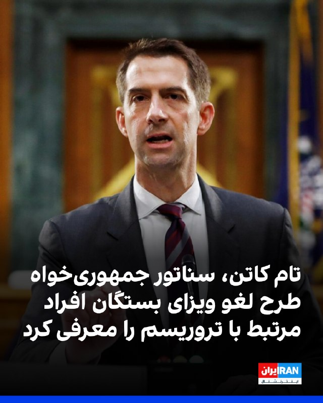

تام کاتن، سناتور جمهوری‌خواه، طرحی با عنوان «قانون عدم پناه امن برای خانواده تروریست‌ها» معرفی کرده است که هدف آن لغو ویزاهای فعلی و جلوگیری از صدور ویزای جدید برای اعضای نزدیک خانواده افراد مرتبط با تروریسم است.

این اقدام پس از آن مطرح شد که گزارش‌ها نشان داد دو تن از بستگان قاسم سلیمانی، فرمانده پیشین نیروی قدس سپاه، به‌صورت قانونی در ایالات متحده زندگی می‌کردند.

بر اساس اعلام وزارت امنیت داخلی آمریکا، حمیده سلیمانی افشار ۴۷ ساله و سارینا سادات حسینی ۲۵ ساله، که به‌ترتیب خواهرزاده و نوه‌خواهرزاده قاسم سلیمانی هستند، در ماه آوریل بازداشت شدند. این وزارتخانه اعلام کرد هر دو نفر در سال ۲۰۱۹ از سوی قضات مهاجرت آمریکا پناهندگی دریافت کرده بودند.

به گفته وزارت امنیت داخلی آمریکا، حمیده سلیمانی افشار با وجود دریافت گرین‌کارت از طریق پناهندگی، در درخواست تابعیت خود در ژوئیه ۲۰۲۵ اعلام کرده بود که دست‌کم چهار بار پس از دریافت اقامت دائم به ایران سفر کرده است.
‌🏁 🇬🇧 IranintlTV

🤖 @VahidOOnLine

## VahidOOnLine — post 240349

  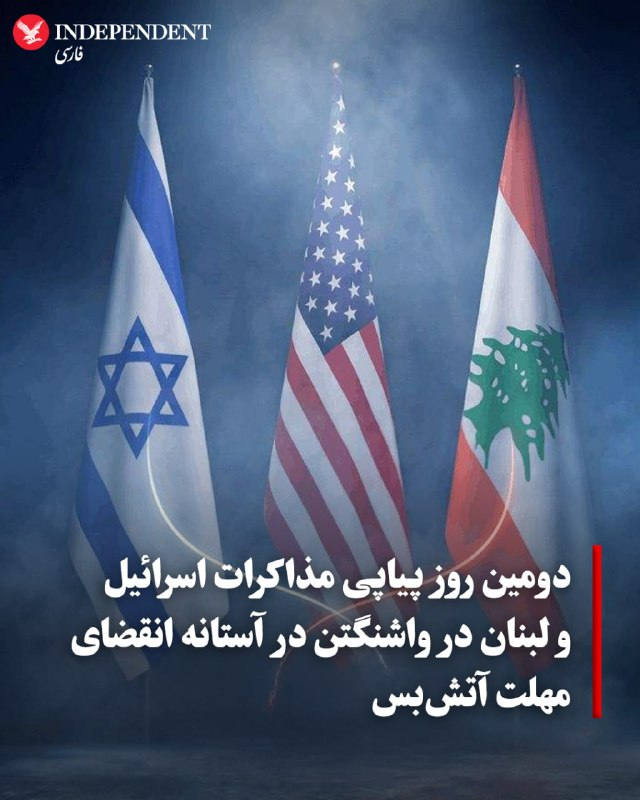

♦️ سی‌بی‌اس نیوز به نقل از یکی از مقامات وزارت امور خارجه آمریکا، گزارش داد که دور جدید مذاکرات میان اسرائیل و لبنان صبح روز جمعه ۲۵ اردیبهشت برای دومین روز متوالی از سر گرفته شد. این دور از گفتگوها بدون حضور مقام‌های ارشد و میان سفیران دو کشور و با حضور نمایندگانی از وزارت امور خارجه آمریکا انجام می‌شود.

این دور از گفتگوها که از روز پنجشنبه در واشنگتن آغاز شده، سومین مرحله از مذاکرات دو کشور است و تنها چند روز پیش از پایان مهلت آتش‌بس انجام می‌شود. آتش‌بس فعلی که از ۱۷ آوریل (۲۸ فروردین) آغاز شده بود، تا روز یکشنبه ادامه خواهد داشت.

یک مقام ارشد وزارت امور خارجه در گفتگو با شبکه سی‌بی‌اس، مذاکرات روز پنجشنبه را که از ساعت ۹ صبح تا ۵ بعدازظهر به طول انجامید، «سازنده» و «مثبت» ارزیابی کرد. این گفتگوها در حالی دنبال می‌شود که دو طرف برای دستیابی به توافقی پایدار پیش از انقضای مهلت آتش‌بس تحت فشار هستند.
‌🇸🇦 Indypersian

🤖 @VahidOOnLine

## VahidOOnLine — post 240348

  <a href="telegram/content/VahidOOnLine_240348_1778868577.mp4" target="_blank">🎬 Download video</a>

«صدای فاطمه سپهری و همه زندانیان سیاسی باشیم»
‌🏁 🇬🇧 ManotoTV

🤖 @VahidOOnLine

## VahidOOnLine — post 240347

  <a href="telegram/content/VahidOOnLine_240347_1778868578.mp4" target="_blank">🎬 Download video</a>

دونالد ترامپ در گفت‌وگو با برت بایر، خبرنگار و مجری فاکس‌نیوز از عملکرد آمریکا در جنگ با جمهوری اسلامی دفاع کرد و گفت واشینگتن با وجود توانایی نابودی کامل زیرساخت‌های ایران، خویشتنداری نشان داده است.

ترامپ در پاسخ به منتقدانی که می‌گویند او وضعیت جنگ را دست‌کم گرفته، گفت: «من هیچ چیزی را دست‌کم نگرفتم. ما ضربه‌ای فوق‌العاده سنگین به آن‌ها زدیم.»

رئیس‌جمهوری آمریکا افزود: «ما پل‌هایشان را باقی گذاشتیم. ظرفیت برقشان را باقی گذاشتیم. می‌توانیم همه آن را ظرف دو روز نابود کنیم. همه‌چیز.»

ترامپ همچنین گفت آمریکا جز بخش مربوط به شیرهای خروج نفت، جزیره خارگ را هدف قرار داده است.
‌🏁 🇬🇧 ManotoTV

🤖 @VahidOOnLine

## VahidOOnLine — post 240346

  <a href="telegram/content/VahidOOnLine_240346_1778868579.mp4" target="_blank">🎬 Download video</a>

«شما هم به کمپین حمایت از خانم سپهری بپیوندید»
‌🏁 🇬🇧 ManotoTV

🤖 @VahidOOnLine

---
📅 بروزرسانی: 1405/02/25 19:58
---

## VahidOOnLine — post 240345

  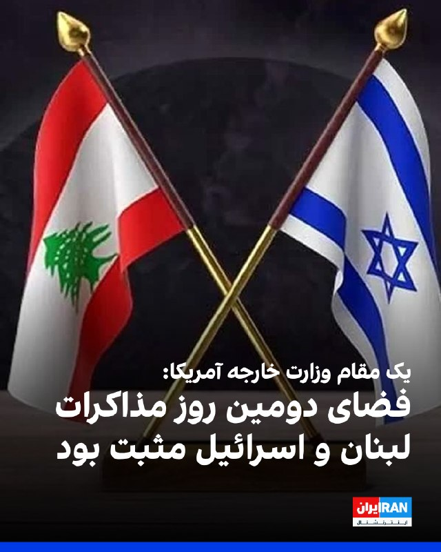

یک مقام وزارت خارجه آمریکا به الجزیره گفت فضای دومین روز مذاکرات میان لبنان و اسرائیل بسیار مثبت بوده و روند گفت‌وگوها فراتر از انتظارها پیش رفته است.

این دومین روز از سومین دور مذاکرات میان اسرائیل و لبنان با میانجی‌گری ایالات متحده بود.
‌🏁 🇬🇧 IranintlTV

🤖 @VahidOOnLine

## VahidOOnLine — post 240344

بیمارستان الغدیر تهران شامگاه ۱۸ و ۱۹ دی‌ماه ۱۴۰۴، شاهد گوشه‌ای از جنایتی بود که جمهوری اسلامی علیه معترضان مرتکب شد. ده‌ها پیکر بی‌جان و شمار زیادی از مجروحان به این بیمارستان منتقل شدند و به دلیل کمبود فضای سردخانه، تعدادی از کشته‌شدگان، پتوپیچ در حیاط پشت بیمارستان رها شدند. ایران‌اینترنشنال تاکنون هویت ۹ نفر از آن‌ها را شناسایی کرده که در این ویدیو چهار تن از آنها معرفی شده‌اند.
فرنوش فرجی، خبرنگار ایران‌اینترنشنال گزارش می‌دهد.
‌🏁 🇬🇧 IranintlTV

🤖 @VahidOOnLine

## VahidOOnLine — post 240343

  

♦️ کریس رایت، وزیر انرژی ایالات متحده، اعلام کرد که با افزایش ظرفیت خطوط لوله انتقال انرژی از طریق عربستان سعودی، امارات متحده عربی و دیگر کشورهای خاورمیانه، پیش‌بینی می‌کند اهمیت استراتژیک تنگه هرمز برای حمل‌ونقل جهانی نفت و گاز کاهش یابد.

رایت در گفتگو با شبکه سی‌ان‌بی‌سی اظهار داشت: «مسیرهای جایگزین دیگری برای خروج انرژی از منطقه خلیج فارس ایجاد خواهد شد. من فکر می‌کنم شاهد کاهش اهمیت تنگه هرمز خواهیم بود، اما این به معنای کاهش اهمیت تولید و عرضه انرژی این کشورها نیست.»

او همچنین افزود: «این کشورها متحدان بزرگ ایالات متحده و تامین‌کنندگان کلیدی انرژی در جهان هستند؛ ما خواهان بازگشت شکوفایی، صلح و رشد اقتصادی به این منطقه هستیم.»
‌🇸🇦 Indypersian

🤖 @VahidOOnLine

## VahidOOnLine — post 240342

♦️سرگئی لاوروف، وزیر امور خارجه روسیه، در جریان نشستی در دهلی‌نو از یک خبرنگار هندی خواست به‌دلیل برهم زدن نظم جلسه، سالن را ترک کند.
بر اساس گزارش‌ها، این خبرنگار به‌دلیل تماس‌های مکرر تلفنی، دو بار سخنان لاوروف را قطع کرده بود. در پی این اتفاق، وزیر خارجه روسیه به زبان انگلیسی از او خواست هرچه سریع‌تر محل کنفرانس را ترک کند.
‌🇸🇦 Indypersian

🤖 @VahidOOnLine

## VahidOOnLine — post 240341

  

♦️امیلی گودین، خبرنگار نیویورک‌پست که در سفر به چین دونالد ترامپ را همراهی کرده بود، دقایقی پیش از ترک پکن در شبکه اجتماعی ایکس اعلام کرد که از همه سرنشینان هواپیمای ریاست‌جمهوری خواسته شد قبل از سوار شدن تمام هدایایی که در پکن دریافت کرده‌اند، لوازم الکترونیکی که استفاده کرده‌اند و حتی سنجاق‌های تزئینی مربوط به این سفر را تحویل دهند.

تصویری که در شبکه‌های اجتماعی منتشر شده، نشان می‌دهد که این لوازم همه در کیسه سیاه‌رنگ بزرگی جمع‌آوری شده و احتمالا با هواپیمای دیگری از چین خارج خواهند شد.
‌🇸🇦 Indypersian

🤖 @VahidOOnLine

## VahidOOnLine — post 240340

  

محمد اسحاق دار، وزیر خارجه پاکستان، اعلام کرد که ۱۱ شهروند پاکستانی و ۲۰ شهروند ایرانی که در کشتی‌های توقیف‌شده از سوی آمریکا حضور داشتند، به کشورهایشان بازگردانده شده‌اند.
به گفته او قرار است همه این افراد امشب به اسلام آباد برسند و سپس بازگشت شهروندان ایران تسهیل خواهد شد.
‌🏁 🇬🇧 IranintlTV

🤖 @VahidOOnLine

## VahidOOnLine — post 240339

  <a href="telegram/content/VahidOOnLine_240339_1778862537.mp4" target="_blank">🎬 Download video</a>

یکی از مخاطبان ایران‌اینترنشنال با اشاره به وضعیت اقتصادی می‌گوید مردم ایران برای چه «منفعت ملی» این حجم از فشار اقتصادی و نگرانی را تحمل می‌کنند. این پیام با هوش مصنوعی خوانده شده است.
‌🏁 🇬🇧 IranintlTV

🤖 @VahidOOnLine

## VahidOOnLine — post 240338

  

محمدمهدی حسینی‌همدانی، امام جمعه کرج، ۲۵ اردیبهشت در نماز جمعه این شهر گفت: بر اساس توصیه قرآن باید تا پایان «فتنه»، جنگ را ادامه داد و تاکید کرد مجازات اسرائیل، محو کامل آن است.

او همچنین اطاعت از مجتبی خامنه‌ای را عامل پیروزی خواند و گفت باید عوامل نافرمانی را از میان برداشت.
‌🏁 🇬🇧 IranintlTV

🤖 @VahidOOnLine

## VahidOOnLine — post 240337

  <a href="telegram/content/VahidOOnLine_240337_1778862539.mp4" target="_blank">🎬 Download video</a>

‌
اسحاق دار، وزیر خارجه پاکستان، اعلام کرد ۲۰ شهروند ایرانی که در کشتی‌های توقیف‌شده آمریکا در آب‌های بین‌المللی حضور داشتند، از طریق پاکستان به تهران بازگردانده خواهند شد.

دار گفت این افراد همراه با ۱۱ شهروند پاکستانی، از سنگاپور به بانکوک منتقل شدند و سپس با پرواز راهی اسلام‌آباد شدند. به گفته او، شهروندان ایرانی پس از ورود به پاکستان، برای انتقال به تهران همراهی خواهند شد.

وزیر خارجه پاکستان از وزیر خارجه آمریکا برای «هماهنگی نزدیک» در این عملیات، و از وزیر خارجه جمهوری اسلامی بابت «اعتماد به پاکستان» در روند بازگرداندن شهروندان ایرانی قدردانی کرد.
‌🏁 🇬🇧 ManotoTV

🤖 @VahidOOnLine

## VahidOOnLine — post 240336

  

♦️عباس عراقچی، وزیر امور خارجه جمهوری اسلامی، در پایان نشست وزرای خارجه «بریکس» در دهلی‌نو اعلام کرد که صدور بیانیه پایانی این نشست به دلیل مخالفت یکی از اعضا که «روابط خاصی با اسرائیل دارد»، متوقف شده است. اگرچه عراقچی مستقیما نامی از امارات متحده عربی نبرد، اما تاکید کرد که این کشور به دلیل حمایت از اسرائیل و ایالات متحده در درگیری‌های اخیر، مانع تصویب بخش‌هایی از بیانیه شده است.

وزیر خارجه جمهوری اسلامی با «تاسف‌بار» خواندن این اقدام، ادعا کرد که ایران در طول جنگ جاری هیچ اختلافی با امارات نداشته و تنها پایگاه‌های نظامی آمریکا را هدف قرار داده است.

عراقچی در ادامه ابراز امیدواری کرد که مقامات ابوظبی تا نشست سران بریکس به این درک برسند که ایران همسایه‌ای دائمی است و دو کشور باید قرن‌ها در کنار هم زندگی کنند.

همزمان با این اظهارات، بلومبرگ در گزارشی جدید به نقل از منابع آگاه اعلام کرد که امارات در دوران جنگ تلاش کرده است که با جلب حمایت عربستان سعودی و قطر، حملات مشترکی علیه ایران انجام دهد؛ پیشنهادی که با مخالفت صریح ریاض و دوحه مواجه شده است.
‌🇸🇦 Indypersian

🤖 @VahidOOnLine

## VahidOOnLine — post 240335

  

رسانه‌های ایران اعلام کردند نمایشگاه کتاب تهران امسال به صورت «مجازی» برگزار خواهد شد.
بر اساس این خبر، نمایشگاه کتاب تهران از روز شنبه، ۲۶ اردیبهشت و به صورت آنلاین آغاز خواهد شد.
باوجود آتش‌بس میان جمهوری اسلامی و آمریکا، بسیاری از برنامه‌های عادی در ایران همچنان تعطیل بوده یا به‌صورت مجازی برگزار می‌شود.
‌🏁 🇬🇧 IranintlTV

🤖 @VahidOOnLine

## VahidOOnLine — post 240334

  

♦️اسحاق دار، وزیر امور خارجه پاکستان، در پیامی در شبکه اجتماعی ایکس از موفقیت این کشور در بازگرداندن ۱۱ دریانورد پاکستانی و ۲۰ دریانورد ایرانی خبر داد که پیش‌تر در جریان توقیف کشتی‌ها در آب‌های آزاد توسط ایالات متحده بازداشت شده بودند.

وزیر خارجه پاکستان با اعلام اینکه تمامی این افراد در سلامت کامل به سر می‌برند، تشریح کرد که این گروه از سنگاپور به بانکوک منتقل شده و از آنجا راهی اسلام‌آباد شده‌اند. به گفته او، اتباع ایرانی پس از توقفی کوتاه در پاکستان، برای بازگشت به کشورشان همراهی و تسهیلات لازم را دریافت خواهند کرد.

اسحاق دار در این پیام از دولت‌های سنگاپور و تایلند بابت همکاری در فرآیند انتقال و همچنین از مارکو روبیو، وزیر امور خارجه ایالات متحده، بابت هماهنگی‌های نزدیک جهت تسهیل بازگشت این افراد قدردانی کرد. او همچنین از عباس عراقچی، وزیر امور خارجه جمهوری اسلامی، بابت اعتماد به پاکستان در فرآیند بازگرداندن «برادران ایرانی» تشکر و تاکید کرد که رسیدگی به وضعیت اتباع در بند، اولویت نخست دولت پاکستان است.
‌🇸🇦 Indypersian

🤖 @VahidOOnLine

## VahidOOnLine — post 240333

  <a href="telegram/content/VahidOOnLine_240333_1778862542.mp4" target="_blank">🎬 Download video</a>

‌
وانگ یی، وزیر خارجه چین، گفت پکن معتقد است حل بحران تنگه هرمز در گرو دستیابی به «آتش‌بسی دائمی و جامع» میان آمریکا و جمهوری اسلامی است.

به گزارش خبرگزاری شینهوا، وانگ یی گفت رئیس‌جمهور چین در گفت‌وگو با دونالد ترامپ تأکید کرده که «زور نمی‌تواند مشکلات را حل کند و گفت‌وگو تنها مسیر درست است.»

وزیر خارجه چین افزود: «مذاکرات یک‌شبه به نتیجه نمی‌رسد، اما وقتی درِ گفت‌وگو باز شد، نباید دوباره بسته شود.»

او همچنین گفت چین برای پیشبرد مذاکرات صلح تلاش کرده و به ایفای نقش خود برای پایان سریع درگیری‌ها و بازگشت ثبات به خاورمیانه ادامه خواهد داد.
‌🏁 🇬🇧 ManotoTV

🤖 @VahidOOnLine

## VahidOOnLine — post 240332

  <a href="telegram/content/VahidOOnLine_240332_1778862542.mp4" target="_blank">🎬 Download video</a>

‌
کریس رایت، وزیر انرژی آمریکا، گفت به‌دلیل جنگ و تنش‌ها در خلیج فارس، چین احتمالاً خرید نفت از آمریکا را افزایش خواهد داد.

او در گفت‌وگو با سی‌ان‌بی‌سی گفت: «فکر می‌کنم چین به خرید مقادیر بیشتری از نفت آمریکا ادامه خواهد داد.»

رایت همچنین گفت جهان نیاز دارد تنگه هرمز دوباره به‌طور کامل باز شود و افزود: «تلاش ایران برای گروگان گرفتن جهان، موقتی است.»

وزیر انرژی آمریکا در پاسخ به این پرسش که بازگشت شرایط به وضعیت عادی چقدر زمان می‌برد، گفت: «بخش زیادی از آن به ایران بستگی دارد.»

او افزود: «به هر شکلی، برنامه هسته‌ای ایران پایان خواهد یافت و عبور آزادانه کشتی‌ها از تنگه هرمز برقرار خواهد شد. این می‌تواند در صورت توافق با ایران، نسبتاً سریع رخ دهد.»
‌🏁 🇬🇧 ManotoTV

🤖 @VahidOOnLine

## VahidOOnLine — post 240331

  <a href="telegram/content/VahidOOnLine_240331_1778862543.mp4" target="_blank">🎬 Download video</a>

عباس عراقچی، وزیر خارجه جمهوری اسلامی، با انتشار تصویری از دیدار با سابرامانیام جایشانکار، وزیر خارجه هند، در شبکه اِکس نوشت: «ایران همواره وظیفه تاریخی خود به‌عنوان حافظ امنیت در تنگه هرمز» را انجام خواهد داد.

عراقچی افزود در گفت‌وگویی «سازنده» با همتای هندی خود، درباره تحولات منطقه گفت‌وگو کرده و مدعی شد جمهوری اسلامی «شریکی قابل اعتماد برای همه کشورهای دوست» است و این کشورها می‌توانند به امنیت تجارت و کشتیرانی اعتماد کنند.
‌🏁 🇬🇧 ManotoTV

🤖 @VahidOOnLine

## VahidOOnLine — post 240330

  

الهه محمدی و الناز محمدی، دو روزنامه‌نگار ایرانی، از سوی بنیاد بین‌المللی زنان رسانه مستقر در آمریکا به عنوان دریافت‌کنندگان جایزه «شجاعت در روزنامه‌نگاری» در سال ۲۰۲۶ معرفی شدند.
این نهاد با اعلام اسامی برگزیدگان امسال تاکید کرد که این روزنامه‌نگاران با وجود فشارها، تهدیدها و محدودیت‌های گسترده، به فعالیت حرفه‌ای خود ادامه داده‌اند.

بنیاد بین‌المللی زنان رسانه هر سال این جایزه را به روزنامه‌نگارانی اهدا می‌کند که در شرایط پرخطر و محدودکننده، فعالیت رسانه‌ای خود را ادامه می‌دهند. امسال علاوه بر دو روزنامه‌نگار ایرانی، خبرنگارانی از آمریکا، میانمار و فیلیپین نیز در میان برگزیدگان قرار دارند.
‌🏁 🇬🇧 IranintlTV

🤖 @VahidOOnLine

---
📅 بروزرسانی: 1405/02/25 18:08
---

## VahidOOnLine — post 240329

♦️اصغر فرهادی، کارگردان سرشناس ایرانی، روز جمعه ۲۵ اردیبهشت در نشست خبری جشنواره کن با اشاره به تحولات اخیر در ایران، از کشته شدن غیرنظامیان در جریان جنگ و همچنین جان‌باختن معترضان در اعتراضات دی‌ماه ابراز تاسف کرد.
او این دو رویداد را «به یک اندازه دردناک» توصیف کرد و گفت مخالفت با کشته شدن گروهی از انسان‌ها به معنای پذیرش کشته شدن گروهی دیگر نیست. فرهادی تأکید کرد از دست رفتن جان انسان‌ها در هر شرایطی، چه در جنگ، چه در اعدام و چه در سرکوب اعتراضات، غیرقابل قبول است.
این کارگردان ایرانی با انتقاد از تداوم خشونت در جهان افزود که با وجود پیشرفت‌های بشری، همچنان هر روز خبرهایی از کشته شدن انسان‌های بی‌گناه منتشر می‌شود؛ موضوعی که به گفته او «دردناک و تاسف‌بار» است.
‌🇸🇦 Indypersian

🤖 @VahidOOnLine

## VahidOOnLine — post 240328

  

♦️عباس عراقچی، وزیر امور خارجه جمهوری اسلامی، روز جمعه ۲۵ اردیبهشت اعلام کرد که جمهوری اسلامی از هرگونه حمایتی، از جمله از سوی چین، برای کمک به حل درگیری‌ها در خاورمیانه استقبال می‌کند.

عراقچی در گفتگو با خبرنگاران در دهلی‌نو، پایتخت هند، جایی که برای شرکت در نشست کشورهای عضو گروه «بریکس» حضور داشت، گفت: «ما از هر کشوری که توانایی کمک داشته باشد، به‌ویژه چین، قدردانی می‌کنیم.»

او افزود: «ما روابط بسیار خوبی با چین داریم و شرکای استراتژیک یکدیگر هستیم. می‌دانیم که چینی‌ها حسن نیت دارند؛ بنابراین از هر اقدامی که آن‌ها بتوانند برای کمک به دیپلماسی انجام دهند، استقبال خواهیم کرد.»
‌🇸🇦 Indypersian

🤖 @VahidOOnLine

## VahidOOnLine — post 240327

  

امارات متحده عربی اعلام کرد که اظهارات جمهوری اسلامی و تلاش‌هایش برای توجیه حملات علیه امارات متحده عربی را نمی‌پذیرد و تاکید کرد فشارهای تهران تاثیری بر مواضع ابوظبی نخواهد داشت.

پیش‌تر عباس عراقچی، وزیر خارجه جمهوری اسلامی گفته بود: «اماراتی‌ها اجازه دادند از سرزمین‌شان برای شلیک توپخانه و تجهیزات علیه ما استفاده شود.»
‌🏁 🇬🇧 IranintlTV

🤖 @VahidOOnLine

## VahidOOnLine — post 240326

  <a href="telegram/content/VahidOOnLine_240326_1778855930.mp4" target="_blank">🎬 Download video</a>

سازمان اطلاعات مرکزی آمریکا با انتشار تصاویری از هاوانا، حضور جان رتکلیف، رئیس این سازمان، در پایتخت کوبا را تایید کرد.

بر اساس گزارش فوربس مکزیک، رتکلیف در جریان این سفر با مقام‌های ارشد دولت کوبا دیدار کرد. این رسانه نوشت گفت‌وگوها درباره همکاری‌های اطلاعاتی، امنیت منطقه‌ای و وضعیت اقتصادی کوبا انجام شده است.

به نوشته فوربس مکزیک، رئیس سیا برای گفت‌وگوهای مستقیم با مقام‌های وزارت کشور کوبا و مسئولان نهادهای اطلاعاتی این کشور به هاوانا رفت. این گزارش، دیدار رتکلیف با مقام‌های کوبایی را نشستی کم‌سابقه در سطح بالا میان دو کشور توصیف کرده است.

در این گزارش آمده است که در جریان این سفر، رتکلیف با رائول رودریگز کاسترو، نوه رائول کاسترو و مشاور امنیتی، و همچنین لازارو آلوارز کاساس، وزیر کشور کوبا، دیدار کرد.
‌🏁 🇬🇧 ManotoTV

🤖 @VahidOOnLine

## VahidOOnLine — post 240325

  <a href="telegram/content/VahidOOnLine_240325_1778855930.mp4" target="_blank">🎬 Download video</a>

«جمهوری اسلامی قصد کشتن فاطمه سپهری را دارد»
‌🏁 🇬🇧 ManotoTV

🤖 @VahidOOnLine

## VahidOOnLine — post 240324

  <a href="telegram/content/VahidOOnLine_240324_1778855932.mp4" target="_blank">🎬 Download video</a>

«صدای بانو سپهری باشیم»
‌🏁 🇬🇧 ManotoTV

🤖 @VahidOOnLine

## VahidOOnLine — post 240323

  <a href="telegram/content/VahidOOnLine_240323_1778855933.mp4" target="_blank">🎬 Download video</a>

دونالد ترامپ در پاسخ به پرسشی درباره حمله به یک مدرسه دخترانه در روز نخست جنگ گفت این موضوع «در دست بررسی» است.

خبرنگاری از ترامپ پرسید که سنتکام روز گذشته درباره حمله به مدرسه دخترانه در روز اول جنگ مورد پرسش قرار گرفته بود. ترامپ در پاسخ گفت: «این در دست بررسی است.» او افزود چند موضوع دیگر نیز در دست بررسی قرار دارد، اما تاکید کرد که این مورد هم جزو پرونده‌های در حال بررسی است.

در ادامه، خبرنگار پرسید آیا امکان دریافت اطلاعات بیشتر درباره این موضوع وجود دارد و اشاره کرد که این حمله با یک واحد موشکی آمریکایی مرتبط بوده است.

ترامپ در پاسخ وارد موضوع بی‌بی‌سی شد و این رسانه را به جعل گفته‌هایش متهم کرد. او گفت بی‌بی‌سی «حرف‌های بدی» در دهان او گذاشته و بعد ناچار شده بپذیرد که آن گفته‌ها درست نبوده است.
‌🏁 🇬🇧 ManotoTV

🤖 @VahidOOnLine

## VahidOOnLine — post 240322

  

محمدنبی موسوی‌فرد، امام جمعه اهواز گفت: «در حال حاضر جمهوری اسلامی شرایطی برای آمریکا ایجاد کرده که نه راه پس دارد و نه راه پیش؛ دشمن باید بداند جمهوری اسلامی کاری کرده است که هیچ راه‌حل نظامی نمی‌تواند از عزت و اقتدار دفاعی و نظامی ما بکاهد.»

او ادامه داد: «نیروهای مسلح و بسیج نیز مانند گذشته، آمادگی کامل و کوبنده‌ای برای برخورد قاطع با هرگونه تجاوز دشمن را دارند.»
‌🏁 🇬🇧 IranintlTV

🤖 @VahidOOnLine

## VahidOOnLine — post 240321

  <a href="telegram/content/VahidOOnLine_240321_1778855934.mp4" target="_blank">🎬 Download video</a>

یک شهروند در پیام ارسالی خود به ایران اینترنشنال با اشاره به افزایش شدید قیمت داروها گفت که هزینه گچ گرفتن پای شکسته‌اش ۹ میلیون تومان شده است. پیام این مخاطب با هوش مصنوعی خوانده شده است.
‌🏁 🇬🇧 IranintlTV

🤖 @VahidOOnLine

## VahidOOnLine — post 240320

  

رییس‌کل دادگستری خراسان جنوبی اعلام کرد یک وکیل دادگستری در بیرجند در جریان اختلاف خانوادگی جان باخته است.

او گفت این وکیل زن پس از آن‌که همسرش با خودرو او را زیر گرفت، جان خود را از دست داد و پرونده این حادثه برای رسیدگی ویژه در دستگاه قضایی در حال بررسی است.

به گفته این مقام قضایی، متهم خود را به قوه قضاییه معرفی کرده است.
‌🏁 🇬🇧 IranintlTV

🤖 @VahidOOnLine

## VahidOOnLine — post 240319

  

♦️اسماعیل بقایی، سخنگوی وزارت خارجه جمهوری اسلامی با انتشار پیامی کوتاه به زبان عربی در شبکه اجتماعی ایکس، به گزارش‌ها درباره اقدامات امارات متحده عربی در دوران جنگ واکنش نشان داد و نوشت: «کسی که پنهانی خیانت کند، آشکارا رسوا می‌شود.» این پیام در حساب رسمی وزارت خارجه جمهوری اسلامی نیز با توضیح «خیانت به همسایه پنهان نمی‌ماند» بازتاب یافت.

در روزهای گذشته، گزارشی از سفر محرمانه بنیامین نتانیاهو، نخست‌وزیر اسرائیل به امارات متحده مطرح شد. دفتر نخست‌وزیر اسرائیل این گزارش را تایید کرد و این سفر را آغاز «یک پیشرفت تاریخی» دانست. امارات متحده عربی، این گزارش را تکذیب کرد. همچنین گزارش‌هایی از انجام حملات مستقیم به خاک ایران از سوی امارات مطرح شده است. عباس عراقچی، وزیر امور خارجه جمهوری اسلامی که برای شرکت در نشست وزیران خارجه کشورهای عضو بریکس در هند حضور دارد، این گزارش‌ها را تایید کرد.
‌🇸🇦 Indypersian

🤖 @VahidOOnLine

## VahidOOnLine — post 240318

  <a href="telegram/content/VahidOOnLine_240318_1778855937.mp4" target="_blank">🎬 Download video</a>

♦️ویدیوهای منتشر شده در شبکه‌های اجتماعی که گفته می‌شود مربوط به یکی از جزایر ایران است، آلودگی نفتی در سواحل این منطقه را در روز جمعه ۲۵ اردیبهشت نشان می‌دهد. در این تصاویر، لکه‌های نفتی در آب و آلودگی گسترده در نوار ساحلی قابل مشاهده است.

رویترز با انتشار تصاویر ماهواره‌ای که بین ۶ تا ۸ می (۱۶ تا ۱۸ اردیبهشت) ثبت شده‌اند، از وقوع یک نشت نفت گسترده در نزدیکی جزیره خارگ، اصلی‌ترین پایانه صادرات نفت ایران، خبر می‌دهند. این لکه نفتی که در تصاویر ماهواره‌های کوپرنیک به‌صورت توده‌ای خاکستری و سفید دیده می‌شود، منطقه‌ای به وسعت تقریبی ۴۵ تا ۹۵ کیلومتر مربع را در غرب این جزیره پوشانده است.

این درحالی است سازمان حفاظت محیط زیست ایران روز دوشنبه ۲۱ اردیبهشت ماه اعلام کرد لکه بزرگ مشاهده شده در آب‌های خلیج فارس در نزدیکی جزیره خارگ ناشی از تخلیه آب آلوده توازن یک نفت‌کش آسیب دیده بوده است.
‌🇸🇦 Indypersian

🤖 @VahidOOnLine

## VahidOOnLine — post 240317

  

سنتکام اعلام کرد از زمان آغاز محاصره دریایی بنادر و سواحل جنوب ایران، ۷۵ کشتی تجاری مجبور به تغییر مسیر شده‌اند و چهار کشتی نیز در پی حمله نیروهای آمریکا از کار افتاده‌اند.

پیش از این، سنتکام با انتشار تصویری از گشت‌زنی یک جنگنده پنهان‌کار اف-۳۵-ای نیروی هوایی بر فراز آب‌های منطقه‌ای نزدیک تنگه هرمز خبر داد.
‌🏁 🇬🇧 IranintlTV

🤖 @VahidOOnLine

## VahidOOnLine — post 240316

  

مجتبی خامنه‌ای در پیامی منتسب به او به مناسبت روز پاسداشت زبان فارسی و بزرگداشت فردوسی، زبان فارسی را یکی از پایه‌های هویت ایرانیان توصیف کرد و گفت تقویت این زبان می‌تواند به گسترش «تمدن ایرانی‌اسلامی» کمک کند.
او همچنین با اشاره به شاهنامه، از آن به‌عنوان اثری برای حفظ هویت، استقلال و ایستادگی ایرانیان یاد کرد.
در بخشی از این پیام نوشته شده: «داستانهای اسطوره‌ای فردوسی، واقعیت زندگی و شخصیت قهرمانانه‌ آنان بوده و مفاهیم انسان‌ساز، سلحشورانه، و قرآنی شاهنامه، همه‌ اقوام و اقشار ایران را در حفظ هویت، اصالت و استقلال خود و مبارزه با ضحاک‌وشان متجاوز، همدل و همراه و همساز می کند.»
‌🏁 🇬🇧 IranintlTV

🤖 @VahidOOnLine

## VahidOOnLine — post 240315

  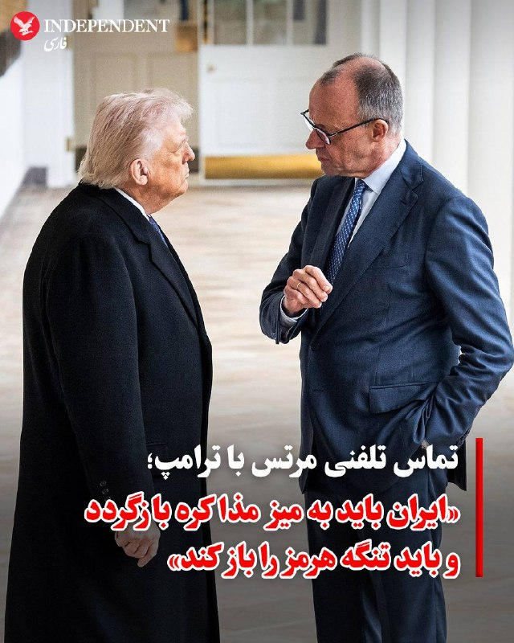

♦️ فریدریش مرتس، صدراعظم آلمان، روز جمعه ۲۵ اردیبهشت، از گفتگوی تلفنی «مثبت و سازنده» با دونالد ترامپ، رئیس‌جمهوری آمریکا، خبر داد. این تماس در حالی انجام شد که اخیرا اعلام خبر خروج ۵ هزار سرباز آمریکایی از خاک آلمان، روابط دو کشور را دچار تنش کرده بود؛ اما پیام اخیر مرتس نشان‌دهنده تلاش برای عبور از این اختلافات است.

مرتس در شبکه اجتماعی ایکس اعلام کرد که دو طرف بر سر اهداف کلیدی واشنگتن در قبال جمهوری اسلامی اتفاق نظر دارند. او تاکید کرد: «ما توافق داریم که ایران باید فورا به میز مذاکره بازگردد، تنگه هرمز را باز کند و تحت هیچ شرایطی نباید اجازه دستیابی به سلاح هسته‌ای به تهران داده شود.»

علاوه بر موضوع ایران، رهبران دو کشور درباره دستیابی به راهکاری صلح‌آمیز برای اوکراین و هماهنگی مواضع پیش از نشست آتی ناتو در آنکارا گفتگو کردند. آلمان که بزرگ‌ترین اقتصاد اروپا و حامی اصلی نظامی اوکراین محسوب می‌شود، در دوران مرتس تقویت توان دفاعی خود را برای کاهش وابستگی به ایالات متحده و مقابله با تهدیدات روسیه در اولویت قرار داده است.
‌🇸🇦 Indypersian

🤖 @VahidOOnLine

## VahidOOnLine — post 240314

🗣روایت شما از بحران اقتصادی و زندگی در آتش‌بس- جمعه ۲۵ اردیبهشت:

🔹برای پایان‌نامه مجبور شدم اینترنت پرو بخرم، با مالیاتش شد ۲ میلیون و ۱۷۰ هزار تومان. قبلش هم اشتراک چت‌جی‌پی‌تی و سامانه «شکن» را گرفته بودم ولی جوابگو نبود. چند میلیون باید برای چیزی هزینه کنی که حقته اما ازت گرفتنش.

🔹 از زمان شروع جنگ تا الان قطعی اینترنت کلی هزینه اضافی رو دستمون گذاشته. ۱۰ گیگ یک ماهه خریدم، ولی ظرف دو هفته تمام شد.

🔹 من اختلال دوقطبی دارم و باید دارو مصرف گنم اما داروهای اعصاب و روان به‌شدت گران و نایاب شده و این موضوع من را به‌شدت نگران کرده، چون تاثیر بدی در روند درمانم دارد.

🔹 مغازه‌ام در پاساژ ارغوان بود که ۱۵ اردیبهشت سوخت و هیچی ازش نموند. حکومت تلاشی برای خاموش کردن آتش نکرد. من و کسبه ارغوان از کجا می‌خواهیم الان کار کنیم، جنس بخریم و تو این وضعیت خرج خونه دربیاریم؟

🔹 من یک زن ۲۵ ساله هستم. سال‌ها امیدم این بود که یک روز مهاجرت می‌کنم و برای همان تلاش کردم. الان با این وضعیت که آیلتس دیگر در ایران برگزار نمی‌شود، اینترنت قطع شده و همه‌چیز ۱۰ برابر گران‌تر شده، حتی نمی‌دانم دیگر به چه آینده‌ای دل ببندم. تمام آرزوهایی که داشتم یکی‌یکی ازم گرفته شدند و الان فقط به این فکر می‌کنم که هفته بعد چطور پولم را نگه دارم که به آخر ماه برسد و چطور قسطی دستمال کاغذی و گوشت و روغن بخرم.

🔹 گناه ما چیست که نمی‌توانیم مثل بقیه آدم‌های این دنیا یک زندگی عادی داشته باشیم؟ برای خوشبختی‌های ساده باید فقط از تخیلاتمان استفاده کنیم. تمام دوستام کارشان با اینترنت بود و الان کارشان را از دست دادند و همه اطرافیانم فقط منتظرند ببینند «چی می‌شه». تا کی باید در این برزخ زندگی کنیم؟
‌🏁 🇬🇧 IranintlTV

🤖 @VahidOOnLine

## VahidOOnLine — post 240313

  

دونالد ترامپ گفت آمریکا ممکن است در مقطعی برای حذف آنچه «گرد و غبار هسته‌ای» نامید وارد ایران شود. ترامپ در مسیر بازگشت به آمریکا و در هواپیمای ریاست‌جمهوری، ایر فورس وان، به خبرنگاران گفت: «در زمان مناسب، یا وارد می‌شویم یا آن را به دست می‌آوریم. فکر می‌کنم احتمالا آن را به دست می‌آوریم، اما اگر به دست نیاوریم، وارد خواهیم شد.»

او افزود: «فکر می‌کنم آنها کاملا شکست خواهند خورد و ما هیچ خطری نخواهیم داشت. ما تجهیزات لازم برای خارج کردن آن را داریم، هیچ‌کس دیگر ندارد؛ شاید چین چنین تجهیزاتی داشته باشد.»

ترامپ پیش‌تر نیز در ماه مارس در کاخ سفید درباره ذخایر اورانیوم غنی‌شده جمهوری اسلامی هشدار مشابهی داده و گفته بود: «یا آن را از آنها پس می‌گیریم یا آن را برمی‌داریم.»
‌🏁 🇬🇧 IranintlTV

🤖 @VahidOOnLine

## VahidOOnLine — post 240312

  

احمد علم‌الهدی، امام جمعه مشهد گفت: «آمریکا اگر بخواهد جنگ را ادامه بدهد، قطعا شکست بیشتری عاید او می‌شود، چون امروز قدرت و توان ما با روز اول جنگ خیلی تفاوت دارد، اگرچه ما در روز اول جنگ کمی غافلگیر شدیم اما اکنون رزمندگان ما آماده‌تر شدند و مسلما شکست آمریکا از اول بیشتر خواهد بود و کمتر نیست.»

او افزود: «در این جنگ ثابت شد که پدافند آمریکایی اصلا کارآمد نیست و حتی نتوانست یکی از موشک‌های ما را رهگیری کند، موشک‌های ما نیز با موفقیت به محل مورد نظر اصابت می‌کرد.»

او ادامه داد: «رزمندگان ما توانستند یک ابرقدرت روی کره زمین را به زانو درآورند و از مقام ابرقدرتی ساقط کنند.»
‌🏁 🇬🇧 IranintlTV

🤖 @VahidOOnLine

## VahidOOnLine — post 240311

  <a href="telegram/content/VahidOOnLine_240311_1778855940.mp4" target="_blank">🎬 Download video</a>

♦️دونالد ترامپ، رئیس‌جمهوری ایالات متحده، روز جمعه ۲۵ اردیبهشت در مسیر بازگشت از چین در پاسخ به خبرنگاران، درباره آخرین پیشنهاد ایران در مذاکرات هسته‌ای گفت که آن را «از همان جمله اول» رد کرده است.
او با بیان اینکه محتوای ابتدایی این پیشنهاد «غیرقابل قبول» بوده، افزود: «حتی ادامه آن را هم نخواندم.» ترامپ تأکید کرد که صرف تعیین بازه زمانی مانند ۲۰ سال کافی نیست و آنچه اهمیت دارد، ارائه تضمین‌های واقعی و قابل اجرا از سوی ایران است.
رئیس‌جمهوری آمریکا همچنین تصریح کرد که، هرگونه توافق باید شامل انتقال کامل مواد و سوخت هسته‌ای از ایران باشد و افزود که توافقی مبتنی بر «حرف‌های توخالی» قابل پذیرش نخواهد بود.
‌🇸🇦 Indypersian

🤖 @VahidOOnLine

## VahidOOnLine — post 240310

  

♦️ مجتبی خامنه‌ای، سومین رهبر جمهوری اسلامی، در پیامی کتبی به مناسبت روز بزرگداشت فردوسی، با زبانی آمیخته به مفاهیم اسطوره‌ای و ایدئولوژیک، بر پیوند میان «هویت ایرانی» و «تمدن اسلامی» تاکید کرد. او در این پیام با اشاره به آنچه «دفاع مقدس سوم» نامید، مدعی شد که مردم ایران در جنگ اخیر نیز همچون درگیری‌های پیشین، واقعیتِ «داستان‌های قهرمانانه شاهنامه» را رقم زده‌اند.

مجتبی خامنه‌ای که از زمان هدف قرار گرفتن در حملات آمریکا و اسرائیل، دیده نشده و صدایی نیز از او شنیده نشده است، در بخشی از پیام خود، متجاوزان را «ضحاک‌وشان» نامید و حفظ استقلال کشور را در گرو مبارزه با آن‌ها دانست. او همچنین با حمله به «سبک زندگی آمریکایی»، خواستار مقابله با «تهاجم زبانی و فرهنگی» غرب شد و از اهالی هنر خواست تا با «بعثت فکری»، روایتِ به گفته او «خیزش ملت» را ماندگار کنند.

استفاده از نمادهای ملی‌گرایانه نظیر شاهنامه و فردوسی، بعد از اولین حمله مستقیم اسرائیل در سال ۱۴۰۴ در ادبیات رسمی رهبران جمهوری اسلامی رواج یافته است.
‌🇸🇦 Indypersian

🤖 @VahidOOnLine

---
📅 بروزرسانی: 1405/02/25 15:44
---

## VahidOOnLine — post 240300

  

رسیدگی به پرونده سه متهم حمله به پارکینگی در مجاورت دفتر ایران‌اینترنشنال در لندن آغاز شده است. بر اساس حکم دادگاه مقدماتی، متهمان قرار است بهمن‌ماه محاکمه شوند. جلسه محاکمه مقدماتی این سه نفر ساعت ۱۰ صبح (به وقت محلی) جمعه ۲۵ اردیبهشت در دادگاه کیفری مرکزی انگلستان، موسوم به اولد بیلی، به ریاست قاضی چیما گراب برگزار شد.

بر اساس حکم جلسه مقدماتی، متهمان ۲۵ ژانویه ۲۰۲۷ (پنجم بهمن ۱۴۰۵) در دادگاه کیفری مرکزی محاکمه خواهند شد.

این سه نفر که شهروند بریتانیا هستند، ماه گذشته در دادگاه مجیستریت وست‌مینستر حضور یافته بودند.

دو متهم بزرگسال این پرونده اویسین مک‌گینس ۲۱ ساله و ناتان دان ۱۹ ساله هستند. متهم سوم یک پسر ۱۵ ساله است که به‌دلیل ملاحظات قانونی نامش فاش نخواهد شد.

هر سه نفر با اتهام «آتش‌سوزی عمدی به قصد به خطر انداختن جان افراد» روبه‌رو هستند. مک‌گینس علاوه بر این، به «رانندگی خطرناک» حین تعقیب پلیس نیز متهم شده است.
‌🏁 🇬🇧 IranintlTV

🤖 @VahidOOnLine

## VahidOOnLine — post 240299

  

⭕️ترامپ: مخالفتی با تعلیق ۲۰ ساله غنی‌سازی اورانیوم ایران ندارم ولی باید تعهد واقعی باشد

♦️دونالد ترامپ رئیس جمهوری ایالات متحده روز جمعه ۲۵ اردیبهشت و در زمان بازگشت از چین در هواپیمای ایرفورس وان به خبرنگاران گفت که مشکلی با تعلیق غنی‌سازی اورانیوم ایران به‌مدت ۲۰ سال ندارد اما این تعهد باید واقعی باشد.

ترامپ پیشتر گفته بود ایران دیگر هرگز نباید غنی‌سازی اورانیوم داشته باشد.

براساس گزارش‌های غیر رسمی مقام‌های جمهوری اسلامی بارها تاکید کرده‌اند که حداکثر غنی‌سازی ۵ ساله را می‌پذیرند. این در حالی است که اخیرا چند عضو مجلس شورای اسلامی گفته‌اند که تهران به‌هیچ وجه بحث تعلیق را نمی‌پذیرد.
‌🇸🇦 Indypersian

🤖 @VahidOOnLine

## VahidOOnLine — post 240298

  

شبکه کان اسرائیل گزارش داد ایال زمیر، رییس ستاد کل ارتش اسرائیل، در جریان جنگ علیه جمهوری اسلامی، به امارات متحده عربی سفر کرد. بر اساس این گزارش، زمیر در این سفر با مقام‌های اماراتی، از جمله محمد بن زاید آل نهیان، رییس این کشور، دیدار و گفت‌وگو کرده است.
‌🏁 🇬🇧 IranintlTV

🤖 @VahidOOnLine

## VahidOOnLine — post 240297

  

♦️عباس عراقچی، وزیر امور خارجه جمهوری اسلامی ایران، اعلام کرد تهران «هیچ اعتمادی» به ایالات متحده ندارد و فقط در صورتی به مذاکره با واشنگتن علاقه‌مند است که آمریکا در رویکرد خود «جدی» باشد.
عراقچی روز جمعه در جمع خبرنگاران در دهلی‌نو گفت پیام‌های متناقض آمریکا باعث شده ایران نسبت به نیت واقعی واشنگتن در مذاکرات تردید داشته باشد.
او همچنین درباره روند میانجی‌گری پاکستان گفت این روند شکست نخورده اما با «دشواری» مواجه شده است.
عراقچی تاکید کرد ایران تلاش می‌کند آتش‌بس فعلی حفظ شود تا فرصتی برای دیپلماسی فراهم شود، اما همزمان برای بازگشت به درگیری نیز آمادگی دارد.
اظهارات وزیر خارجه ایران چند ساعت پس از آن مطرح شد که دونالد ترامپ اعلام کرد صبرش در قبال ایران رو به پایان است و گفت در گفتگو با شی جین‌پینگ درباره لزوم بازگشایی تنگه هرمز توافق کرده است.
‌🇸🇦 Indypersian

🤖 @VahidOOnLine

## VahidOOnLine — post 240296

  

♦️دونالد ترامپ، رئیس جمهوری آمریکا روز جمعه ۲۵ اردیبهشت و در زمان بازگشت از چین به آمریکا در هواپیمای ایرفورس وان به خبرنگاران گفت با وجود آنکه نیروهای مسلح ایران در جنگ نابود شده‌اند، ممکن است نیاز به «یک پاکسازی کوچک» وجود داشته باشد.

ترامپ ساعاتی پیش در گفتگویی با فاکس‌نیوز هم گفته بود که نیروهای مسلح جمهوری اسلامی در چهار هفته گذشته، تلاش کرده‌اند تا تعدادی از پرتابگرهای موشکی را از زیر خاک بیرون بکشند و جای بعضی تجهیزات را عوض کنند، با این حال «آمریکا قادر است در دو روز همه این‌ها را نابود کند.»
‌🇸🇦 Indypersian

🤖 @VahidOOnLine

## VahidOOnLine — post 240295

  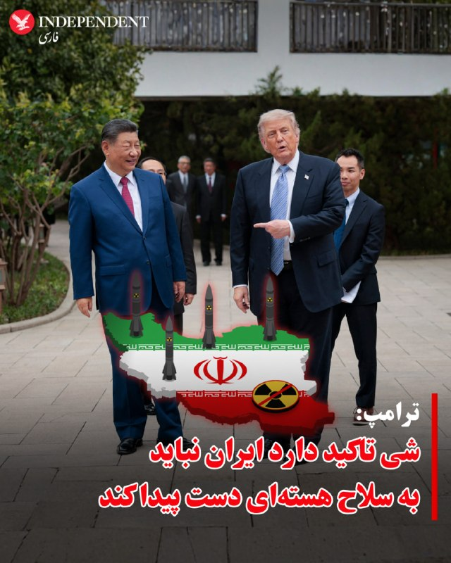

⭕️ترامپ: شی تاکید دارد ایران نباید به سلاح هسته‌ای دست پیدا کند

♦️دونالد ترامپ، رئیس‌جمهوری آمریکا، روز جمعه اعلام کرد شی جین‌پینگ، رئیس‌جمهوری چین، «قویا» معتقد است که ایران نباید به سلاح هسته‌ای دست پیدا کند.

ترامپ در مسیر بازگشت از پکن به واشنگتن، در گفتگو با خبرنگاران در هواپیمای ایرفورس وان گفت: «او [شی] قویا معتقد است که آن‌ها نباید سلاح هسته‌ای داشته باشند.»

رئیس‌جمهوری آمریکا همچنین افزود که همتای چینی‌اش خواهان بازگشایی تنگه هرمز است.
ترامپ گفت: «او می‌خواهد تنگه [هرمز] باز شود.»
چین پیش‌تر خواستار برقراری آتش‌بس پایدار در خاورمیانه و بازگشایی سریع مسیرهای کشتیرانی شده بود.

پکن در دو روز گذشته میزبان دیدار تاریخی دونالد ترامپ، رئیس جمهوری آمریکا و همتای چینی‌اش، شی جی‌پینگ بود.
‌🇸🇦 Indypersian

🤖 @VahidOOnLine

## VahidOOnLine — post 240294

  <a href="telegram/content/VahidOOnLine_240294_1778847259.mp4" target="_blank">🎬 Download video</a>

بر اساس گزارش‌های منتشرشده توسط ایران اینترنشنال، ماموران حکومتی مانع برگزاری مراسم زادروز بهار شاه‌مهری بر مزار او شدند.

طبق این گزارش، خانواده بهار در روز تولدش قصد داشتند بر سر مزار او مراسم یادبود برگزار کنند، اما اجازه حضور و تجمع در محل خاکسپاری به آن‌ها داده نشد. در نتیجه، خانواده ناچار شدند مراسم را در خانه و در اتاق شخصی او برگزار کنند.

بر اساس این گزارش، افرادی ناشناس همچنین عکس بهار را که کنار مزارش قرار داشت، شکسته‌اند.
‌🏁 🇬🇧 IranintlTV

🤖 @VahidOOnLine

## VahidOOnLine — post 240293

  <a href="telegram/content/VahidOOnLine_240293_1778847261.mp4" target="_blank">🎬 Download video</a>

⭕️نخست وزیر هند در امارات: باز نگه داشتن تنگه هرمز بالاترین اولویت ماست

♦️نارندرا مودی، نخست‌وزیر هند، روز جمعه در آغاز سفر پنج‌کشوری خود وارد امارات متحده عربی شد، سفری که تحت تاثیر نگرانی‌ها از پیامدهای جنگ ایران بر بازار انرژی و زنجیره‌های تامین جهانی قرار گرفته است.

مودی که در بدو ورود با اسکورت جنگنده‌های نظامی همراهی شد، از سوی محمد بن زاید آل نهیان، رئیس امارات، مورد استقبال رسمی قرار گرفت.

مودی در دیدار با رئیس دولت امارات، با اشاره به اهمیت این آبراه هرمز گفت: «آزاد، باز و ایمن نگه داشتن تنگه هرمز بالاترین اولویت ما است و در این زمینه پایبندی به قوانین بین‌المللی ضروری است.»

وزارت خارجه هند اعلام کرد امارات و هند به توافق‌های راهبردی در حوزه نفت و گاز دست یافته‌اند و ابوظبی متعهد شده پنج میلیارد دلار در هند سرمایه‌گذاری کند، هرچند جزئیات بیشتری ارائه نشده است.

این سفر بخشی از تلاش گسترده‌تر هند برای گسترش شراکت‌های اقتصادی و راهبردی و کاهش وابستگی‌ها در شرایط تحولات ژئوپلیتیک ارزیابی می‌شود. مودی پس از امارات به هلند، سوئد، نروژ و ایتالیا سفر خواهد کرد.
‌🇸🇦 Indypersian

🤖 @VahidOOnLine

## VahidOOnLine — post 240292

  <a href="telegram/content/VahidOOnLine_240292_1778847263.mp4" target="_blank">🎬 Download video</a>

♦️عباس عراقچی، وزیر امور خارجه جمهوری اسلامی ایران، روز جمعه ۲۵ اردیبهشت ماه، در نشست خبری در دهلی‌نو اعلام کرد تهران پس از اظهارات اخیر دونالد ترامپ مبنی بر رد پیشنهاد تهران، پیام‌هایی از طرف آمریکا دریافت کرده که نشان می‌دهد واشنگتن همچنان خواهان ادامه گفتگوها و تعامل است.
عراقچی با اشاره به گزارش‌ها درباره رد شدن پیشنهاد یا پاسخ ایران از سوی آمریکا گفت: «اینکه مطرح شده آمریکا پیشنهاد یا پاسخ ایران را رد کرده، مربوط به چند روز پیش است؛ زمانی که آقای ترامپ در پیامی اعلام کرد این پیشنهاد غیرقابل قبول است.»
او افزود: «اما پس از آن، ما مجددا پیام‌هایی از طرف آمریکایی‌ها دریافت کردیم که مایل به ادامه گفتگوها و تعامل هستند.»
رسانه‌های ایران روز جمعه به‌نقل از تهران‌تایمز، نشریه انگلیسی‌زبان سازمان تبلیغات اسلامی‌گزارش داده بودند که آمریکا پیشنهاد ۱۴ ماده‌ای جمهوری اسلامی را رد کرده است‌.
‌🇸🇦 Indypersian

🤖 @VahidOOnLine

## VahidOOnLine — post 240291

  

تهران‌تایمز گزارش داد دولت آمریکا به پیشنهاد مکتوب جمهوری اسلامی درباره پایان جنگ پاسخ داده و پیشنهاد ۱۴ ماده‌ای تهران را رد کرده است.

بر اساس این گزارش، آمریکا با رد پیشنهادهای جمهوری اسلامی، بار دیگر مواضع خود، به‌ویژه در ارتباط با پرونده هسته‌ای را تکرار کرده است.

این روزنامه گزارش داد جمهوری اسلامی پیشنهاد خود را بر پایه روندی دو مرحله‌ای ارائه کرده بود؛ مرحله نخست به پایان جنگ در همه جبهه‌ها منجر می‌شد و در صورت برآورده شدن شروط تهران، مرحله دوم مذاکرات درباره موضوع هسته‌ای آغاز می‌شد.
‌🏁 🇬🇧 IranintlTV

🤖 @VahidOOnLine

## VahidOOnLine — post 240290

  

♦️عباس عراقچی، وزیر امور خارجه جمهوری اسلامی ایران، روز جمعه اعلام کرد تهران از هرگونه کمک برای حل بحران خاورمیانه، به‌ویژه از سوی چین، استقبال می‌کند.
عراقچی در جمع خبرنگاران در دهلی‌نو گفت: «از هر کشوری که توانایی کمک داشته باشد، قدردانی می‌کنیم؛ به‌ویژه چین.»
وزیر امور خارجه ایران با اشاره به روابط تهران و پکن افزود: «ما روابط بسیار خوبی با چین داریم و شریک راهبردی یکدیگر هستیم.»
او همچنین گفت: «می‌دانیم که چینی‌ها نیت خوبی دارند، بنابراین هر اقدامی که از سوی آن‌ها برای کمک به دیپلماسی انجام شود، از سوی جمهوری اسلامی مورد استقبال قرار خواهد گرفت.»
اظهارات عراقچی در حالی مطرح می‌شود که چین پیش‌تر خواستار برقراری آتش‌بس پایدار در خاورمیانه و بازگشایی سریع مسیرهای کشتیرانی شده بود.
پکن در دو روز گذشته میزبان دیدار تاریخی دونالد ترامپ، رئیس جمهوری آمریکا و همتای چینی‌اش، شی جی‌پینگ بود.
‌🇸🇦 Indypersian

🤖 @VahidOOnLine

## VahidOOnLine — post 240289

  

بلومبرگ به نقل از منابع آگاه گزارش داد امارات متحده عربی پس از آغاز حملات جمهوری اسلامی به کشورهای حوزه خلیج فارس، تلاش کرد کشورهای همسایه از جمله عربستان سعودی و قطر را برای مشارکت در یک پاسخ نظامی هماهنگ به حملات تهران متقاعد کند، اما با رد این درخواست از سوی آنها روبه‌رو شد.

به گفته این منابع، محمد بن زاید، رییس امارات متحده عربی مجموعه‌ای از تماس‌ها را با رهبران منطقه از جمله محمد بن سلمان، ولیعهد عربستان سعودی، برقرار کرد.

این منابع افزودند محمد بن زاید بر این باور بود که پاسخ گروهی کشورهای منطقه به ایران می‌تواند بازدارندگی ایجاد کند.
‌🏁 🇬🇧 IranintlTV

🤖 @VahidOOnLine

## VahidOOnLine — post 240288

  <a href="telegram/content/VahidOOnLine_240288_1778847266.mp4" target="_blank">🎬 Download video</a>

⭕️حمله پهپادی اوکراین به ساختمانی در ریازان روسیه سه کشته برجا گذاشت

♦️ویدیویی که روز جمعه در شبکه اجتماعی تلگرام منتشر شد، ساختمان مسکونی در حال سوختن و ستون‌های غلیظ دود در آسمان شهر ریازان روسیه را پس از حمله پهپادی اوکراین نشان می‌دهد.

خبرگزاری رویترز ضمن تایید این ویدیو، به نقل از پاول مالکوف، فرماندار منطقه ریازان گزارش کرد این حمله روز جمعه ۲۵ اردیبهشت رخ داده است و در جریان آن علاوه بر کشته شدن سه نفر، چند برج مسکونی و یک محوطه صنعتی آسیب دیده‌اند.
‌🇸🇦 Indypersian

🤖 @VahidOOnLine

## VahidOOnLine — post 240287

  

عباس عراقچی، وزیر خارجه جمهوری اسلامی، در یک نشست خبری در حاشیه اجلاس بریکس گفت جمهوری اسلامی در تلاش است آتش‌بس، «اگرچه بسیار ناپایدار است»، حفظ شود و به دیپلماسی فرصت داده شود.

او افزود: «به آمریکایی‌ها اعتماد نداریم و فقط در صورتی به مذاکرات علاقه‌مندیم که طرف مقابل جدی باشد.»

وزیر خارجه جمهوری اسلامی، در ادامه اظهاراتش گفت مذاکرات کنونی با آمریکا «از نبود اعتماد رنج می‌برد».

او همچنین گفت همه کشتی‌ها می‌توانند از تنگه هرمز عبور کنند، «به‌جز آن‌هایی که با ما در جنگ هستند».
‌🏁 🇬🇧 IranintlTV

🤖 @VahidOOnLine

## VahidOOnLine — post 240286

  <a href="telegram/content/VahidOOnLine_240286_1778847268.mp4" target="_blank">🎬 Download video</a>

یکی از مخاطبان ایران‌اینترنشنال که از بندرعباس پیام فرستاده، می‌گوید قیمت کالاها به‌شدت افزایش یافته و صف‌های طولانی در جایگاه‌های سوخت، زندگی روزمره مردم را مختل کرده است. او می‌گوید این شرایط در شهری رخ می‌دهد که قطب تجارت، صنعت و نفت و گاز ایران به شمار می‌رود. این پیام با هوش مصنوعی خوانده شده است.
‌🏁 🇬🇧 IranintlTV

🤖 @VahidOOnLine

## VahidOOnLine — post 240285

  

♦️امیر حاتمی، فرمانده کل ارتش جمهوری اسلامی، روز جمعه ۲۵ اردیبهشت ماه گفت «قدرت ایمان» جنگنده اف-۵ ایران را به مواضع نیروهای آمریکایی در کویت رسانده و از «پیشرفته‌ترین سامانه‌های پدافندی زمین‌پایه و هوایی» آنها عبور کرده است.
پیشتر شبکه خبری ان‌بی‌سی نیوز گزارش کرده بود که در روزهای ابتدایی جنگ یک جنگنده اف‌ــ۵ ایرانی توانسته است از سامانه‌های پدافندی عبور کند و پایگاه کمپ بوهرینگ در کویت را هدف قرار دهد.
جنگنده‌های ۶۰ ساله اف-۵ ارتش ایران، در دوره محمدرضا شاه خریداری شدند.
حاتمی در ادامه گفت: «نیروهای مسلح با تمام قوا از تمامیت ارضی، استقلال کشور و نظام جمهوری اسلامی ایران پاسداری خواهند کرد.»
‌🇸🇦 Indypersian

🤖 @VahidOOnLine

## VahidOOnLine — post 240284

  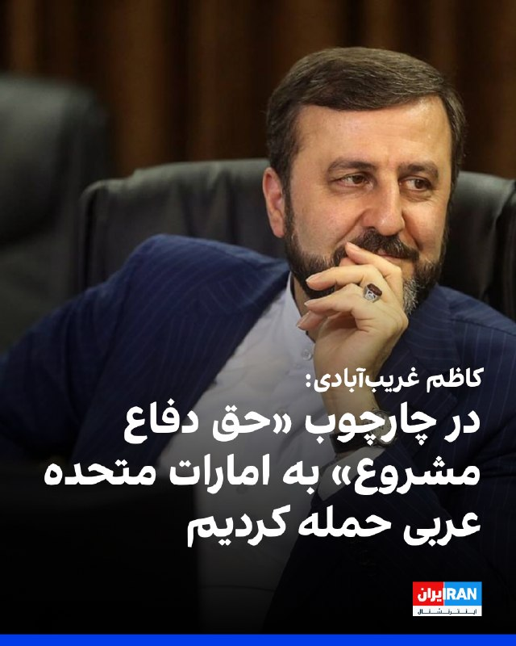

کاظم غریب‌آبادی، معاون وزیر خارجه جمهوری اسلامی، امارات متحده عربی را به همکاری با آمریکا و اسرائیل در حملات علیه جمهوری اسلامی متهم کرد و گفت تهران در چارچوب «حق دفاع مشروع» به پایگاه‌ها و تاسیسات مورد استفاده آمریکا در امارات حمله کرده است.
‌🏁 🇬🇧 IranintlTV

🤖 @VahidOOnLine

---
📅 بروزرسانی: 1405/02/25 13:40
---

## VahidOOnLine — post 240283

  

اصغر فرهادی در پاسخ به خبرنگار ایران‌اینترنشنال، کشته شدن معترضان «بی‌گناه» در جریان انقلاب ملی ایرانیان را محکوم کرد و گفت مخالفت با کشته شدن بی‌گناهان و غیرنظامیان در جنگ به معنی موافقت با کشته شدن معترضان نیست.

فرهادی در نشست خبری فیلم «داستان‌های موازی» در جشنواره کن گفت: «ماه‌های گذشته و اواخر دورانی که مشغول ساختن این فیلم بودم، دو اتفاق بسیار دردناک در کشورم رخ داد.»

این کارگردان ایرانی گفت: «هر دو بسیار دردناک است و هیچ‌گاه فراموش نخواهد شد. مخالفت با کشته شدن بی‌گناهان و غیرنظامیان به معنی موافقت با کشته شدن گروهی دیگر در خیابان‌ها نیست.»

فرهادی ادامه داد: «همدلی با کشته‌شدگان در خیابان‌ها نیز به معنی همدلی نکردن با کسانی که در جنگ کشته شدند نیست. به نظرم کشته شدن هر انسانی یک جنایت است؛ چه در جنگ، چه در اعدام و چه کشتن معترضان.»

او در پایان گفت بسیار دردناک است که در قرن حاضر با وجود این همه پیشرفت، همچنان شاهد کشته شدن انسان‌های بی‌گناه هستیم.
‌🏁 🇬🇧 IranintlTV

🤖 @VahidOOnLine

## VahidOOnLine — post 240282

  

اصغر فرهادی در پاسخ به خبرنگار ایران‌اینترنشنال، کشته شدن معترضان «بی‌گناه» در جریان انقلاب ملی ایرانیان را محکوم کرد و گفت مخالفت با کشته شدن بی‌گناهان و غیرنظامیان در جنگ به معنی موافقت با کشته شدن معترضان نیست.

فرهادی در نشست خبری فیلم «داستان‌های موازی» در جشنواره کن گفت: «ماه‌های گذشته و اواخر دورانی که مشغول ساختن این فیلم بودم، دو اتفاق بسیار دردناک در کشورم رخ داد.»

این کارگردان ایرانی گفت: «هر دو بسیار دردناک است و هیچ‌گاه فراموش نخواهد شد. مخالفت با کشته شدن بی‌گناهان و غیرنظامیان به معنی موافقت با کشته شدن گروهی دیگر در خیابان‌ها نیست.»

فرهادی ادامه داد: «همدلی با کشته‌شدگان در خیابان‌ها نیز به معنی همدلی نکردن با کسانی که در جنگ کشته شدند نیست. به نظرم کشته شدن هر انسانی یک جنایت است؛ چه در جنگ، چه در اعدام و چه کشتن معترضان.»

او در پایان گفت بسیار دردناک است که در قرن حاضر با وجود این همه پیشرفت، همچنان شاهد کشته شدن انسان‌های بی‌گناه هستیم.
‌🏁 🇬🇧 IranintlTV

🤖 @VahidOOnLine

## VahidOOnLine — post 240281

  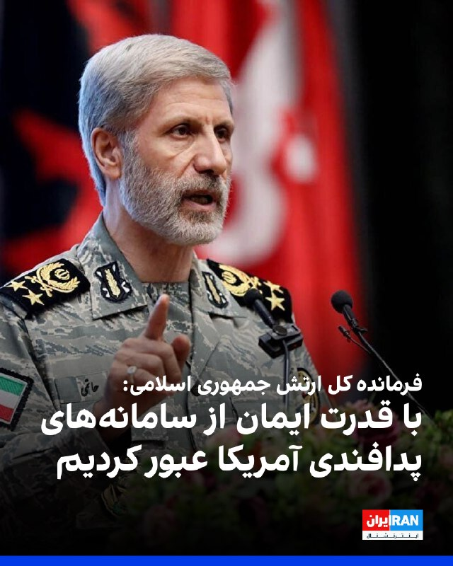

امیر حاتمی، فرمانده‌ کل ارتش جمهوری اسلامی، گفت: «این قدرت ایمان است که می‌تواند دشمن را چنان دچار آشفتگی کند که حتی به‌اشتباه، هواپیماهای خودی را هدف قرار دهد.»

او گفت آنچه موجب اطمینان ما به پیروزی و توانمندی می‌شود، ایمان و اعتقاد است؛ ما هر سال در دهه محرم، شاهد یک مانور عظیم ایمانی هستیم. قدرت اصلی ما نیز همین قدرت ایمانی است.

او افزود: «این قدرت ایمانی است که می‌تواند یک جنگنده اف-۵ را به فراز مواضع نیروهای آمریکایی در کویت برساند، در حالی‌ که آن‌ها از پیشرفته‌ترین سامانه‌های پدافندی زمین‌پایه و هوایی برخوردارند.»
‌🏁 🇬🇧 IranintlTV

🤖 @VahidOOnLine

## VahidOOnLine — post 240280

  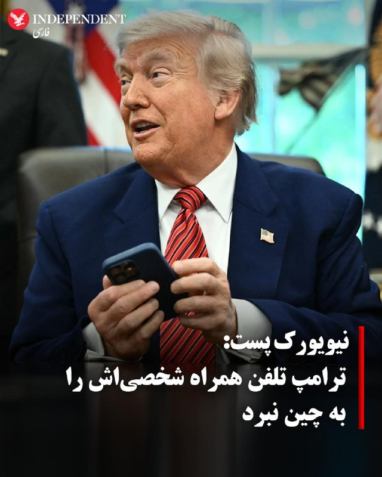

♦️روزنامه نیویورک پست، روز جمعه در گزارشی اعلام کرد، دونالد ترامپ در جریان سفر دو روزه‌اش به پکن، برخلاف عادت همیشگی‌، تلفن همراه شخصی‌اش را همراه نداشت.
بر اساس این گزارش، رئیس‌جمهوری آمریکا و اعضای هیئت همراه، به دلایل امنیتی و برای مقابله با تهدیدهای سایبری، از استفاده از دستگاه‌های شخصی منع شدند و به‌جای آن از گوشی‌ها و حساب‌های موقت موسوم به «دستگاه‌های پاک» استفاده کردند؛ ابزارهایی با قابلیت‌های محدود که برای کاهش خطر نفوذ و سرقت اطلاعات طراحی شده‌اند.
به گزارش نیویورک پست، تلفن‌ها و وسایل شخصی حاضران در این سفر دو روزه در هواپیمای ویژه ریاست‌جمهوری «ایر فورس وان» و درون «کیف‌های فارادی» نگهداری می‌شدند. این کیف‌ها تمامی سیگنال‌ها از جمله جی‌پی‌اس، وای‌فای، بلوتوث و آر‌اف‌آی‌دی (RFID) را مسدود می‌کنند.
هواپیمای ایرفورس وان صرف‌نظر از اینکه در کجا مستقر باشد، قلمرو ایالات متحده محسوب می‌شود. این هواپیما که عملا به‌عنوان یک مرکز پروازی نگهداری اطلاعات فوق‌محرمانه (SCIF) عمل می‌کند، از روش‌های دیگری نیز برای محافظت از داده‌ها و اطلاعات استفاده می‌کند.
‌🇸🇦 Indypersian

🤖 @VahidOOnLine

## VahidOOnLine — post 240279

روایت شما از زندگی در آتش‌بس- جمعه ۲۵ اردیبهشت ۱۴۰۵

🔹 وقتی مردم اینترنت ندارند، کسب‌وکارها با اینترنت پرو خدمات خود را به چه کسی نشان دهند؟
🔹 من یه دختر ۲۳ ساله‌ام. هیچ آینده‌ای ندارم. همه‌چی صد برابر شده. از خیلی از چیزام زدم که فقط زنده بمونم. خیلیا شرایط سخت‌تری نسبت به من دارن. تکلیف ما چی میشه؟ هنوزم امیدوارم ولی تا کی؟ وقتی از قحطی مردیم میخوان وارد عمل بشن؟
🔹 از کرمانشاه پیام می‌دم. ما بچه‌های پایه‌ی هفتم تا دهم هنوز مشخص نیست که امتحان‌هامون حضوریه یا غیرحضوری. واقعاً این موضوع رو اعصابمونه. امیدوارم هرچی سریع‌تر اوضاع‌مون مشخص بشه.
🔹 این‌قدر کمبود دارو هست که حتی دارو با نسخه هم به صورت کامل داده نمی‌شه، چه برسه به صورت آزاد. از هر قرص یک بسته میدن.
🔹 یکی ما رو توجیه کنه ما مردم ایران هزینه چه چیزی رو داریم پرداخت می‌کنیم؟ برای چی داریم این همه فشار اقتصادی و نگرانی و چک کردن ته‌مانده حساب بانکی و قیمت طلا و دلار و کالاها رو تحمل می‌کنیم؟ نقش ما توی به‌وجود آمدن این مناقشه چی بوده؟ نابود شدیم
‌🏁 🇬🇧 IranintlTV

🤖 @VahidOOnLine

## VahidOOnLine — post 240278

  

هند در پایان نشست سالانه وزیران خارجه بریکس در دهلی‌نو، به جای انتشار بیانیه مشترک، «بیانیه رییس نشست» را منتشر کرد و اعلام کرد میان برخی اعضا درباره وضعیت خاورمیانه اختلاف‌نظر وجود دارد.

بر اساس گزارش رویترز، جمهوری اسلامی و امارات متحده عربی در جنگ تهران با آمریکا و اسرائیل در دو سوی مقابل قرار دارند؛ جنگی که در جریان آن، جمهوری اسلامی بیش از هر کشور دیگر حوزه خلیج فارس، امارات متحده عربی را هدف قرار داده است.
‌🏁 🇬🇧 IranintlTV

🤖 @VahidOOnLine

## VahidOOnLine — post 240277

روایت شما از زندگی در آتش‌بس- جمعه ۲۵ اردیبهشت ۱۴۰۵

🔹 بندرعباس، تمامی کالاها به شدت گران شده و در جایگاه‌های سوخت صف‌های کیلومتری هست. متأسفانه زندگی روزمره مردم مختل شده، شهری که قطب تجارت و صنعت و نفت و گاز است.
🔹 ساکن یکی از شهرهای نزدیک مشهد هستم. ما به هیچ ابرقدرتی نیاز نداریم و منتظر فراخوان شاه هستیم. پاینده ایران.
🔹 دانش‌آموز پایه دهم انسانی هستم. خوشبختانه امسال امتحان‌ها نهایی نیست، اما خیلی نگران سال آینده هستم، چون امسال ما هیچی یاد نگرفتیم و شرایط یادگیری افتضاح بوده. تو مدرسه غیردولتی هم درس می‌خوانم.
🔹 از مشهد پیام می‌دهم. واقعاً ما از این بلاتکلیفی خسته شدیم، گرونی بیداد می‌کند، دخل و خرج‌مان با هم همخوانی ندارد، باید ده نفر کار کنیم که یک نفر بتواند بخورد.
🔹 نیم‌قرن است که کل دنیا، مخصوصاً اروپا، فقط گفتند فلان کار جمهوری اسلامی را محکوم می‌کنیم و فایده‌ای نداشت. هر روز جمهوری اسلامی پُرروتر هم شد. نمی‌شود از یک دیوانه زنجیری توقع داشت با حرف آرام بگیرد.
‌🏁 🇬🇧 IranintlTV

🤖 @VahidOOnLine

## VahidOOnLine — post 240276

  <a href="telegram/content/VahidOOnLine_240276_1778839817.mp4" target="_blank">🎬 Download video</a>

یک شهروند در پیامی به ایران اینترنشنال به سایر شهروندان توصیه می‌کند که اینترنت حکومتی «پرو» را نخرند و آن ‌را خیانت به مردم ایران دانست. پیام او با هوش مصنوعی خوانده شده است.
‌🏁 🇬🇧 IranintlTV

🤖 @VahidOOnLine

## VahidOOnLine — post 240275

  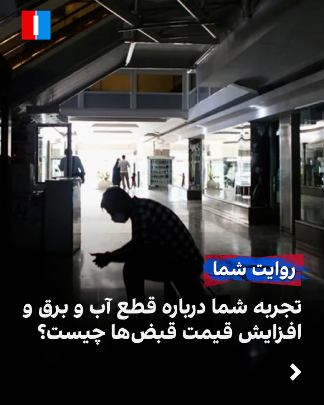

تجربیات شما از قطع برق و آب و افزایش قیمت قبض‌ها چیست؟ روی لینک زیر کلیک کنید و پیام‌های خود از طریق مدیا‌بات برای ما بفرستید. 
t.me
پیام‌های شما به صورت زیر‌نویس در تلویزیون و همچنین در بخش‌های مختلف‌ خبری منتشر خواهد شد.
‌🏁 🇬🇧 IranintlTV

🤖 @VahidOOnLine

## VahidOOnLine — post 240274

  <a href="telegram/content/VahidOOnLine_240274_1778839820.mp4" target="_blank">🎬 Download video</a>

نارندرا مودی، نخست‌وزیر هند، روز جمعه ۲۵ اردیبهشت در جریان سفر به ابوظبی، با انتشار پیامی در شبکه اجتماعی ایکس نوشت: «دوستی میان هند و امارات بسیار نیرومند است.»

مودی در این سفر با شیخ محمد بن زاید، رئیس امارات متحده عربی، دیدار کرد. محور گفتگوهای دو طرف، گسترش روابط دوجانبه، همکاری‌های انرژی، همکاری‌های دفاعی و تحولات منطقه‌ای اعلام شده است.

این سفر در شرایطی انجام می‌شود که تنش‌های منطقه‌ای و نگرانی‌ها درباره امنیت مسیرهای انرژی، اهمیت همکاری میان هند و امارات را افزایش داده است. امارات یکی از شرکای مهم هند در حوزه انرژی و تجارت به شمار می‌رود و ابوظبی و دهلی نو در سال‌های اخیر روابط اقتصادی و راهبردی خود را گسترش داده‌اند.
‌🏁 🇬🇧 ManotoTV

🤖 @VahidOOnLine

## VahidOOnLine — post 240273

  <a href="telegram/content/VahidOOnLine_240273_1778839821.mp4" target="_blank">🎬 Download video</a>

عباس عراقچی، وزیر خارجه جمهوری اسلامی، در گفتگو با رسانه دولتی هند گفت «هیچ راه‌حل نظامی‌ای وجود ندارد» و افزود ایالات متحده باید این واقعیت را درک کند.

او گفت آمریکا «دست‌کم دو بار» جمهوری اسلامی را آزموده و اکنون به این نتیجه رسیده است که «راه‌حل نظامی وجود ندارد».

عراقچی مهم‌ترین مشکل در روند کنونی را «پیام‌های متناقض» از سوی مقام‌های آمریکایی دانست و گفت این پیام‌ها از طریق اظهارنظرها، مصاحبه‌ها و مواضع مختلف دریافت می‌شود.
‌🏁 🇬🇧 ManotoTV

🤖 @VahidOOnLine

## VahidOOnLine — post 240272

  <a href="telegram/content/VahidOOnLine_240272_1778839822.mp4" target="_blank">🎬 Download video</a>

رسانه دولتی اسرائیل گزارش داد ایال زامیر، رئیس ستاد ارتش اسرائیل، در جریان جنگ با ایران به امارات متحده عربی سفر کرده است.
بر اساس این گزارش، او همراه با چند مقام نظامی اسرائیل با مقام‌های اماراتی، از جمله محمد بن زاید، رئیس امارات، دیدار کرده است. ارتش اسرائیل تاکنون واکنشی به این گزارش نشان نداده است.
این گزارش پس از آن منتشر می‌شود که بنیامین نتانیاهو نیز گفته بود در زمان جنگ به امارات سفر کرده؛ ادعایی که از سوی امارات رد شد. همچنین گزارش‌هایی درباره سفر رؤسای سازمان‌های اطلاعاتی و امنیتی اسرائیل به امارات در زمان جنگ منتشر شده است.
در همین حال، مقام‌های آمریکایی تأیید کرده‌اند اسرائیل یک سامانه پدافند موشکی را به همراه نیروهای نظامی برای راه‌اندازی آن به امارات منتقل کرده است.
‌🏁 🇬🇧 ManotoTV

🤖 @VahidOOnLine

## VahidOOnLine — post 240271

  

⭕️عراقچی: پیام‌های ضد و نقیض واشنگتن مانع اصلی در مسیر دیپلماسی است

♦️عباس عراقچی، وزیر امور خارجه ایران، روز جمعه ۲۵ اردیبهشت ماه، در پایان نشست وزرای خارجه بریکس در هند، در گفتگو با رسانه‌های این کشور گفت هیچ راهکار نظامی برای بحران خاورمیانه وجود ندارد و ایالات متحده باید بداند که از مسیر نظامی به اهداف خود نخواهد رسید.

عراقچی با اشاره به آمادگی تهران برای تعامل دیپلماتیک، «پیام‌های ضد و نقیض واشنگتن» را مانع اصلی این مسیر توصیف کرد: «ما تعامل را آغاز کرده‌ایم، اما موانع زیادی در این مسیر وجود دارد؛ که مهم‌ترین آن‌ها، پیام‌های ضد و نقیضی است که از سوی آمریکایی‌ها در گفتگوها و مصاحبه‌هایشان دریافت می‌کنیم.»

 وزیرامور خارجه جمهوری اسلامی همچنین گفت ایران شروع‌کننده جنگ نبوده و تنها در حال «دفاع مشروع« از خود است. او بار دیگر تاکید کرد تنگه هرمز برای «کشورهای دوست» بسته نیست و تنها برای «دشمنان» محدود شده است. عراقچی گفت: « کشتی‌های متعلق به سایر کشورها فقط باید عبور خود را با نیروهای نظامی ما هماهنگ کنند تا از هرگونه مانع احتمالی جلوگیری شده و عبوری ایمن داشته باشند. در روزهای گذشته نیز کشتی‌های زیادی با کمک نیروهای دریایی ما از تنگه عبور کرده‌اند و این روند ادامه خواهد داشت.»

عباس عراقچی در پایان، تنها راه تضمین قطعی امنیت دریانوردی برای همه طرف‌ها را پایان دادن به جنگ عنوان کرد.
‌🇸🇦 Indypersian

🤖 @VahidOOnLine

## VahidOOnLine — post 240270

  

هندوراس به‌طور رسمی سپاه پاسداران انقلاب اسلامی و حماس را در فهرست گروه‌های تروریستی قرار داد. وزارت خارجه هندوراس در بیانیه‌ای اعلام کرد این تصمیم در راستای موضع ثابت هندوراس در محکومیت تروریسم و تامین مالی آن «در تمامی اشکال و مظاهر» اتخاذ شده و نشان‌دهنده تعهد این کشور به همکاری‌های بین‌المللی برای پیشگیری و مقابله با تهدیدات تروریستی است.

گیدئون سعار، وزیر خارجه اسرائیل، با انتشار پیامی در ایکس، از دولت هندوراس بابت اقدام علیه سپاه و حماس تمجید کرد.

در این پیام آمده است: «این اقدام گام مهم دیگری برای تقویت جبهه جهانی مبارزه با تروریسم است؛ تروریسمی که امنیت سراسر جهان، از جمله آمریکای لاتین، را تهدید می‌کند.»
‌🏁 🇬🇧 IranintlTV

🤖 @VahidOOnLine

## VahidOOnLine — post 240269

  

عباس عراقچی، وزیر خارجه جمهوری اسلامی، در مصاحبه با صداوسیما در حاشیه اجلاس بریکس در هند گفت: «جنگ به نقطه عطفی در منطقه تبدیل شده و جایگاه ایران را ارتقا داده است.»

به گفته او، جمهوری اسلامی در جریان درگیری‌های اخیر، «اهداف آمریکایی» را در خاک امارات متحده عربی هدف قرار داد.
‌🏁 🇬🇧 IranintlTV

🤖 @VahidOOnLine

## VahidOOnLine — post 240268

  

♦️ولادیمیر پوتین، رئیس‌جمهوری روسیه، قرار است هفته آینده و فقط چند روز پس از نشست تاریخی شی جین‌پینگ و دونالد ترامپ در پکن، به چین سفر کند.
بر اساس گزارش روزنامه «ساوت چاینا مورنینگ پست»، این سفر «یک روزه» احتمالا روز ۲۰ مه (۳۰ اردیبهشت) انجام خواهد شد.
کرملین پیش‌تر اعلام کرده بود که سفر پوتین به چین «در آینده‌ای بسیار نزدیک» انجام خواهد شد و مقدمات آن نهایی شده است.
زمان‌بندی این سفر در شرایطی مورد توجه قرار گرفته که پکن همزمان در حال مدیریت روابط خود با واشنگتن و مسکو است. دیدار اخیر شی و ترامپ بر موضوعاتی از جمله جنگ ایران، تجارت و مسائل ژئوپلیتیک متمرکز بود و سفر قریب‌الوقوع پوتین می‌تواند نشانه‌ای از ادامه هماهنگی نزدیک میان روسیه و چین تلقی شود.
‌🇸🇦 Indypersian

🤖 @VahidOOnLine

## VahidOOnLine — post 240267

  

نت‌بلاکس خبر داد که قطعی اینترنت در ایران از هزار و ۸۲۴ ساعت گذشته و وارد هفتادوهفتمین روز شده است.
نت‌بلاکس نوشت: در پی تداوم قطع اینترنت در ایران، بخش زیادی از مردم از ارتباطات آنلاین و تعامل با جهان خارج محروم شده‌اند و نگرانی‌ها درباره پیامدهای روانی افزایش یافته است.
‌🏁 🇬🇧 IranintlTV

🤖 @VahidOOnLine

## VahidOOnLine — post 240266

⭕️لاوروف در نشست بریکس: ایران عامل انسداد تنگه هرمز نیست، می‌خواهند بین تهران و همسایگانش تفرقه ایجاد کنند

♦️سرگئی لاوروف، وزیر امور خارجه روسیه، روز جمعه ۲۵ اردیبهشت  با انتقاد از رویکرد «غرب» در خلیج فارس، گفت: «ریشه اصلی تنش‌های منطقه تجاوز بی‌دلیل آمریکا و اسرائیل علیه ایران» است.

سرگئی لاوروف که برای شرکت در نشست وزاری امور خارجه کشورهای عضو بریکس در دهلی نو حضور دارد گفت: «تا پیش از آغاز جنگ در اسفند ماه گذشته، امنیت دریانوردی در تنگه هرمز به صورت ۱۰۰ درصدی تضمین شده بود و ایران هرگز عامل ایجاد مشکل در این آبراه نبوده است.»

براساس گزارش‌های غیررسمی، روسیه در جریان جنگ و پیش از آتش‌بس به جمهوری اسلامی کمک‌های اطلاعاتی ارائه می‌داده است. روابط نظامی و امنیتی تهران و مسکو از زمان جنگ اوکراین دوچندان شده است.

 لاروف بار دیگر گفت یکی از اهداف آمریکا و اسرائیل در جنگ با جمهوری اسلامی «ایجاد تفرقه میان ایران و همسایگان عربش» است و با اشاره به تلاش‌های دیپلماتیک جاری، از نقش پاکستان در تسهیل گفتگو میان ایران و آمریکا و همچنین پتانسیل هند به عنوان میانجی برای بهبود روابط ایران و کشورهای عربی به دلیل اعتبار و نفوذ دیپلماتیک دهلی‌نو حمایت کرد.
‌🇸🇦 Indypersian

🤖 @VahidOOnLine

## VahidOOnLine — post 240265

  <a href="telegram/content/VahidOOnLine_240265_1778839827.mp4" target="_blank">🎬 Download video</a>

یکی از مخاطبان ایران‌اینترنشنال که دانش‌آموز پایه دهم انسانی است می‌گوید با وجود نهایی نبودن امتحان‌های امسال، نگران سال آینده است، چون به گفته او کیفیت آموزش و شرایط یادگیری در سال جاری «افتضاح» بوده و دانش‌آموزان عملا چیزی یاد نگرفته‌اند. او می‌گوید در مدرسه غیردولتی تحصیل می‌کند.
این پیام با هوش مصنوعی خوانده شده است.
‌🏁 🇬🇧 IranintlTV

🤖 @VahidOOnLine

## VahidOOnLine — post 240264

  <a href="telegram/content/VahidOOnLine_240264_1778839829.mp4" target="_blank">🎬 Download video</a>

دفتر رسانه‌ای دولت ابوظبی روز جمعه ۲۵ اردیبهشت اعلام کرد امارات متحده عربی ساخت یک خط لوله نفتی تازه را برای افزایش صادرات از مسیر فجیره تسریع می‌کند.

این پروژه قرار است تا سال ۲۰۲۷ ظرفیت صادرات نفت امارات از فجیره را دو برابر کند و توان این کشور برای دور زدن تنگه هرمز را افزایش دهد.

فجیره در ساحل دریای عمان قرار دارد و نفتکش‌ها از این مسیر می‌توانند بدون عبور از تنگه هرمز بارگیری کنند.
‌🏁 🇬🇧 ManotoTV

🤖 @VahidOOnLine

<!-- MSG END -->

<!-- NAV START -->

<a href="https://github.com/saeidSE/aio-downloader/blob/main/telegram/content/archive_1.md" style="display:inline-block; padding:6px 12px; margin:0 4px; background-color:#2ea44f; color:white; text-decoration:none; border-radius:4px; font-weight:bold;">صفحه بعد</a>

<!-- NAV END -->
